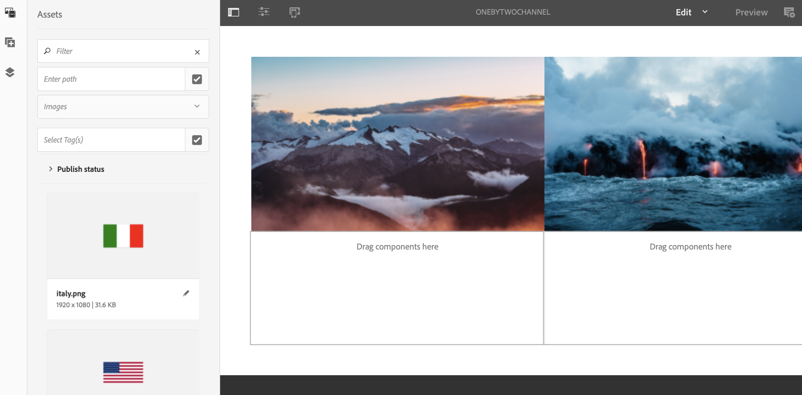

# Bucle de toma de varias zonas a una sola zona{#single-zoneto-multizone}

## Descripción de caso de uso {#use-case-description}

En esta sección se describe un ejemplo de caso de uso que hace hincapié en cómo configurar un canal de diseño de varias zonas que se alterne con un canal de diseño de una sola zona. Cada canal tiene una secuencia de recursos de imagen y vídeo.

### Condiciones previas {#preconditions}

Antes de comenzar este caso de uso, asegúrese de comprender cómo:

* **[Crear y administrar canales](/help/screens/managing-channels.md)**
* **[Crear y administrar ubicaciones](/help/screens/managing-locations.md)**
* **[Crear y administrar programaciones](/help/screens/managing-schedules.md)**
* **[Registro de dispositivos](/help/screens/device-registration.md)**

### Actores principales {#primary-actors}

Autores de contenido

## Configuración del proyecto {#setting-up-the-project}

Siga los pasos a continuación para configurar un proyecto:

1. Cree un proyecto de AEM Screens denominado **TakoverLoop**, como se muestra a continuación.

   >[!NOTE]
   >
   >Para obtener más información sobre la creación y administración de proyectos en AEM Screens, consulte [Creación de un proyecto](/help/screens/creating-a-screens-project.md).

   

1. **Creación de un canal de pantalla dividido**

   1. Seleccione la carpeta **Canales** y haga clic en **Crear** en la barra de acciones para abrir el asistente y crear un canal.
   1. Seleccione Canal **de pantalla dividido de barras** izquierda-izquierda en el asistente y cree el canal titulado **MultiZoneLayout**.

      

   1. Select the **MultiZoneLayout** channel and click **Edit** from the action bar to open the editor. Arrastre y suelte los recursos en cada una de las zonas. El siguiente ejemplo muestra un vídeo, una imagen y una pancarta de texto en el canal, como se muestra a continuación.
      

1. **Creación de un canal 2X2 con cuatro imágenes**

   1. Seleccione la carpeta **Canales** y haga clic en **Crear** en la barra de acciones para abrir el asistente y crear un canal.

   1. Seleccione **2X2 Dividir plantilla de canal** de pantalla en el asistente y cree el canal con el título **Dos canalesDosDos**.

      
   1. Seleccione el canal y haga clic en **Editar** en la barra de acciones para abrir el editor y arrastrar y soltar cuatro imágenes (cuatro zonas diferentes) en ese canal, como se muestra a continuación.
      

1. **Creación de un canal de pantalla dividido 1X2 con dos imágenes**

   1. Seleccione la carpeta **Canales** y haga clic en **Crear** en la barra de acciones para abrir el asistente y crear un canal.

   1. Seleccione **1X2 Dividir plantilla de canal** de pantalla en el asistente y cree el canal con el título **OnebyTwoChannel**.

      
   1. Seleccione el canal y haga clic en **Editar** en la barra de acciones para abrir el editor y arrastrar y soltar dos imágenes (dos zonas diferentes) en ese canal, como se muestra a continuación.
      

1. **Creación de un canal con un vídeo de pantalla completa**

   1. Seleccione la carpeta **Canales** y haga clic en **Crear** en la barra de acciones para abrir el asistente y crear un canal.

   1. Seleccione la plantilla Canal **de secuencia** en el asistente y cree el canal titulado **FullScreensVideo**.

      
   1. Seleccione el canal y haga clic en **Editar** en la barra de acciones para abrir el editor, arrastrar y soltar el componente de vídeo en ese canal y, a continuación, agregar el vídeo deseado, como se muestra a continuación.
      