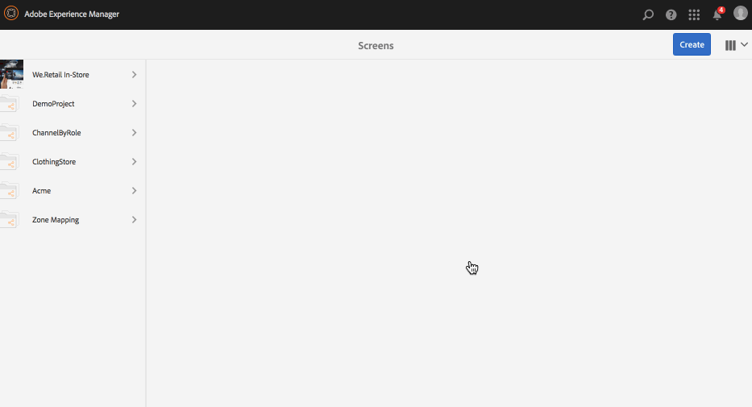
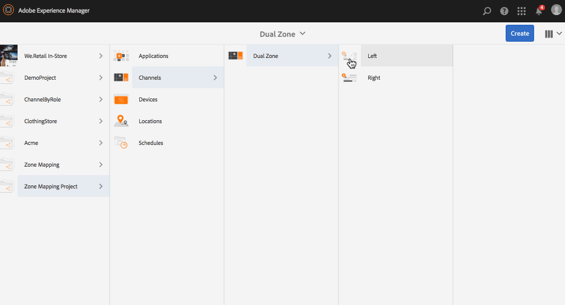
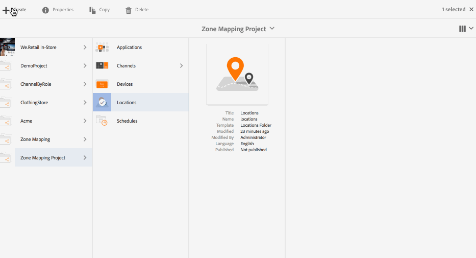

# Mostrar el editor de presentaciones{#display-layout-editor}

***Asignación de zonas:*** le permite crear diferentes zonas y usar una gran variedad de recursos, como vídeos, imágenes y texto, que se pueden combinar de forma contextual en una sola pantalla. Puede insertar imágenes, vídeos y texto, así como permitir que todo esto se combine para crear una experiencia digital intuitiva e interactiva. De acuerdo con los requisitos del proyecto, a veces es necesario tener varias zonas en una pantalla.

Por ejemplo, una secuencia de producto con una fuente de redes sociales que se ejecuta en dos zonas diferentes en una sola pantalla.

## Información general {#overview}

Al crear una visualización para el canal, puede elegir diferentes opciones de plantilla para ver o administrar el contenido del canal.

Las plantillas siguientes están disponibles al crear las zonas de visualización:

* 2x1
* 2x2
* 3x1
* 4x1
* 5x1

El uso de cualquiera de estas plantillas le permite crear una experiencia de señalización digital intuitiva e interactiva, donde se puede aprovechar una variedad de contenido en una sola pantalla.

>[!NOTE]
>
>To learn in-depth about creating channels and displays, see [Managing Channels](managing-channels.md) and [Managing Displays](managing-displays.md) respectively in Authoring Screens.

## Descripción de caso de uso {#use-case-description}

Este caso de uso le permite crear un proyecto de AEM Screens con un canal que pueda aprovechar el contenido y mostrarlo en las pantallas de varias zonas.

>[!NOTE]
>
>Las zonas no escalan el contenido; esto debe hacerse antes de insertar contenido en los canales.

### Pasos para crear un proyecto {#steps-for-creating-a-project}

Siga los pasos a continuación para crear un proyecto de AEM Screens que muestre cómo lograr la asignación de zonas para el proyecto de AEM Screens:

1. ***Crear un nuevo proyecto de Screens*** 

   1. Seleccione el vínculo de Adobe Experience Manager (parte superior izquierda) y luego seleccione Screens. Alternatively, you can go directly to: [http://localhost:4502/screens.html/content/screens](http://localhost:4502/screens.html/content/screens).
   1. Click **Create** to create a new Screens project.
   1. Select **Screens** from the **Create Screens Project** wizard and click **Next**.
   1. Enter the title as **Demo Mapping Project** and click **Create**.
   

1. ***Crear una nueva carpeta de canales***

   1. Vaya a** Proyecto de asignación de zonas**.
   1. Haga clic en **Crear** en la barra de acciones. Se abrirá un asistente.
   1. Choose the **Channels Folder **and click **Next**.
   1. Enter the Title as **Dual Zone **and click **Create**.
   

1. ***Crear un nuevo canal***

   1. Navigate to the **Zone Mapping Project** you created and select the Channels folder (**Dual Zone**).
   1. Haga clic en **Crear** en la barra de acciones. Se abrirá un asistente.
   1. Choose the **Sequence Channel **and click **Next**.
   1. Enter the **Title** as **Left** and click **Create**.
   Del mismo modo, cree otro canal de secuencia como **Derecho** en el **Proyecto de asignación de zonas**.

   

1. ***Añadir contenido a los canales***

   1. Navigate to the **Zone Mapping Project** you created and select the **Channel** you created.
   1. Click **Edit** from the action bar.
   1. The editor for the **Left** opens. Haga clic en el icono que alterna el panel lateral del lado izquierdo de la barra de acciones para abrir los recursos y componentes.
   1. Arrastre los componentes que quiera añadir y colóquelos en el canal.
   Del mismo modo, añada el contenido al canal **derecho** también.

   

   >[!NOTE]
   >
   >Puede rellenar el contenido en los canales con recursos diferentes (imágenes, vídeos), de acuerdo con los requisitos del proyecto.

1. ***Crear una nueva ubicación***

   1. Navigate to the** Zone Mapping Project** and select the **Locations** folder.
   1. Click **Create** next to the plus icon in the action bar. Se abrirá un asistente.
   1. Select **Location** from the wizard and click **Next**.
   1. Enter the **Title** for your location (enter the title as **San Jose**) and click **Create**.
   

1. ***Creación de una nueva pantalla para San José***

   1. Navigate to the location where you want to create your display (**Demo Mapping Project** --> **Locations** --> **San Jose**) and select **San Jose**.
   1. Haga clic en **Crear** en la barra de acciones. Select **Display** from the **Create** wizard and click **Next**.
   1. Enter **Title** for your display location (enter the title as **Dual Zone**).
   1. Under the **Display** tab, choose the details of the Layout. Choose the Resolution as **Full HD**.
   1. Choose the **Number of Devices Horizontally** as **2**. Choose the **Number of Devices Vertically** as **1**.
   1. Haga clic en **Crear**.
   

1. ***Asignación de un canal***

   1. Navigate to the display from **Zone Mapping Project** --> **Locations** --> **San Jose** --> **Dual Zone Display**.
   1. Select **Dual Zone Display **and tap/click **Assign Channel** from the action bar, Or,
   1. Click **Dashboard** and select **+Assign Channel** at the top right from **ASSIGNED CHANNELS &amp; SCHEDULES** panel, as shown in the figure below. **Asignación de canal **se abre el cuadro de diálogo.
   1. Enter the **Channel Role** as **Zone**.
   1. Seleccione Canal de referencia por ruta. Select the channel folder path (**Zone Mapping Project **--> **Channels** --> **Dual Zone** ) in the Channel.
   1. Select the **Priority** for this channel as **1**. Choose the **Supported Events** as **Initial Load** and **Idle Screen**.
   1. Haga clic en **Guardar**.
   

1. ***Registrar y asignar el dispositivo*** 

   1. Abra una nueva ventana del navegador. Vaya al reproductor de pantallas con el navegador web o inicie la aplicación AEM Screens. Cuando abra el dispositivo, verá el estado de este como no registrado.
   1. From the AEM dashboard, navigate to **Zone Mapping Project** --> **Devices**.
   1. Haga clic en** Administrador de dispositivos** desde la barra de acciones.
   1. Click **Device Registration** and you will see the pending devices.
   1. Select the device you want to register and click **Register Device**.
   1. Tendrá que validar el código con la verificación de código del explorador web o el reproductor AEM Screens. Click **Validate** to navigate to **Device Registration** screen.
   1. Enter **Title** as **Zone Device** and click **Register** and the device will be registered.
   1. Click **Assign Display** to move on to the next step where you assign the device to a display.
   1. Click **Assign Device** fand select the display path for your channel () as */content/screens/Test_Project/Locations/TestLocation/TestDisplay*. Click **Assign**.
   1. Click **Finish** to complete the process, and now the device is assigned.
   

1. ***Crear visualización de multizonas***

   1. Navigate and select the display from **Zone Mapping Project** --> **Locations** --> **San Jose **--> **Dual Zone **display and click **Dashboard** from the action bar.
   1. Seleccione el icono de la izquierda **Configuración del dispositivo** del reproductor en el panel **DISPOSITIVOS** y haga clic en **Propiedades**.
   1. Desplácese a la ficha **Configuración de dispositivos** y complete los campos **Asignación** y **Plantilla**. Enter *{&quot;a1&quot;:&quot;${display.channel}/left&quot;, &quot;a2&quot;: &quot;${display.channel}/right&quot;}* in the **Mapping** field and template as *grid-2x1*.
   1. Click **Save &amp; Close** and reload the player.
   >[!NOTE]
   >
   >***Información acerca de la asignación y la plantilla en la configuración del dispositivo:***
   >
   >* los identificadores &quot;a1&quot; y &quot;a2&quot; corresponden a las zonas definidas en la plantilla, es decir, &quot;screens-zone-a1&quot; y &quot;screens-zone-a2&quot;.
   >* ${display.channel}/left&quot; apunta al canal que se ha de integrar en la zona, donde &quot;display.channel&quot; apunta a la ruta de acceso del canal de la visualización. Esta opción integra con eficacia los elementos secundarios &quot;izquierdos&quot; y &quot;derechos&quot; del canal.

   

#### Visualización de contenido en el reproductor de AEM Screens {#viewing-content-in-aem-screens-player}

Cargue el reproductor de AEM Screens o utilice el navegador web.

Verá el contenido de ambos canales (izquierdo y derecho) que se muestra en el reproductor Screens. El contenido se muestra como una zona de visualización de 2x1.

### Inferencia {#inference}

La Asignación de zonas que usa una de las plantillas disponibles mientras se crea un canal en AEM Screens, le permite reducir el lado de cliente. Puede crear distintas zonas en la pantalla y llenarlas con vídeos, imágenes y otros recursos disponibles.
