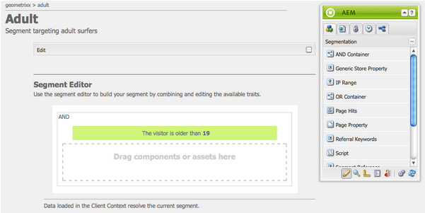

# Configuración de la segmentación{#configuring-segmentation}

>[!NOTE]
>
>Este documento cubre la configuración de la segmentación como se utiliza con Client Context. Para configurar segmentos con ContextHub mediante la IU táctil, consulte [Configuración de la segmentación con ContextHub](/help/sites-administering/segmentation.md).

La segmentación es una consideración clave al crear una campaña. Consulte el glosario [de](/help/sites-authoring/segmentation-overview.md) segmentación para obtener información sobre el funcionamiento de la segmentación y los términos clave.

En función de la información que ya haya recopilado sobre los visitantes del sitio y los objetivos que desee alcanzar, deberá definir los segmentos y estrategias necesarios para el contenido objetivo.

Estos segmentos se utilizan para proporcionar un visitante con contenido dirigido específicamente. Este contenido se mantiene en la sección de [Campañas](/help/sites-authoring/personalization.md) del sitio web. Las páginas de teaser definidas aquí se pueden incluir como párrafos de teaser en cualquier página y definir para qué segmento de visitante se aplica el contenido especializado.

AEM le permite crear y actualizar fácilmente segmentos, teasers y campañas. También le permite verificar los resultados de sus definiciones.

El Editor **** de segmentos le permite definir fácilmente un segmento:

Puede **editar** cada segmento para especificar un factor de **título**, **descripción** y **ampliación** . Con la barra de tareas puede agregar contenedores **Y** y **O** para definir la lógica **de** segmento y, a continuación, agregar las características de **segmento requeridas** para definir los criterios de selección.

## Factor de ampliación {#boost-factor}

Cada segmento tiene un parámetro **Boost** que se utiliza como factor de ponderación; un número mayor indica que el segmento se seleccionará en lugar de un segmento con un número menor.

* Minimum value: `0`
* Maximum value: `1000000`

## Lógica del segmento {#segment-logic}

Los siguientes contenedores lógicos están disponibles de forma predeterminada y le permiten construir la lógica de la selección de segmentos. Se pueden arrastrar de la barra de tareas al editor:

<table> 
 <tbody> 
  <tr> 
   <td> Contenedor Y  </td> 
   <td> Operador booleano AND.  </td> 
  </tr> 
  <tr> 
   <td> Contenedor O  </td> 
   <td> Operador booleano OR.</td> 
  </tr> 
 </tbody> 
</table>

## Características del segmento {#segment-traits}

Las siguientes características de segmento están disponibles de forma predeterminada; se pueden arrastrar desde la barra de tareas al editor:

<table> 
 <tbody> 
  <tr> 
   <td> Rango de IP  </td> 
   <td>Define un rango de direcciones IP que el visitante puede tener.  </td> 
  </tr> 
  <tr> 
   <td> Visitas de la página  </td> 
   <td>Frecuencia con la que se solicitó la página.   </td> 
  </tr> 
  <tr> 
   <td> Propiedad de página  </td> 
   <td>Cualquier propiedad de la página visitada.  </td> 
  </tr> 
  <tr> 
   <td> Palabras clave de referencia  </td> 
   <td>Palabras clave para coincidir con la información del sitio web de referencia.   </td> 
  </tr> 
  <tr> 
   <td> Script</td> 
   <td>expresión de Javascript que se va a evaluar.  </td> 
  </tr> 
  <tr> 
   <td> Referencia del segmento   </td> 
   <td>Referencia a otra definición de segmento.  </td> 
  </tr> 
  <tr> 
   <td> Nube de etiquetas  </td> 
   <td>Etiquetas que deben coincidir con las de las páginas visitadas.  </td> 
  </tr> 
  <tr> 
   <td> Edad del usuario  </td> 
   <td>Tomado del perfil del usuario.  </td> 
  </tr> 
  <tr> 
   <td> Propiedad de usuario  </td> 
   <td>Cualquier otra información disponible en el perfil del usuario. </td> 
  </tr> 
 </tbody> 
</table>

Puede combinar estas características con los operadores booleanos O y Y (consulte [Creación de un nuevo segmento](#creating-a-new-segment)) para definir el escenario exacto para seleccionar este segmento.

Cuando toda la instrucción se evalúa como true, este segmento se ha resuelto. En el evento de que se apliquen varios segmentos, también se utiliza el factor de **[ampliación](/help/sites-administering/campaign-segmentation.md#boost-factor)**.

>[!CAUTION]
>
>El editor de segmentos no comprueba la existencia de referencias circulares. Por ejemplo, el segmento A hace referencia a otro segmento B, que a su vez hace referencia al segmento A. Debe asegurarse de que los segmentos no contengan referencias circulares.

>[!NOTE]
>
>Las propiedades con el sufijo **_i18n** se definen mediante un script que forma parte de la clientlib de la interfaz de usuario de la personalización. Todos los clientes relacionados con la interfaz de usuario se cargan en el autor solo porque la interfaz de usuario no es necesaria durante la publicación.
>
>Por lo tanto, al crear un segmento con estas propiedades, normalmente es necesario confiar en **browserFamily** por ejemplo en lugar de **browserFamily_i18n**.

## Creating a New Segment {#creating-a-new-segment}

Para definir el nuevo segmento:

1. En el carril, elija **Herramientas > Operaciones > Configuración**.
1. Haga clic en la página **Segmentación** en el panel izquierdo y navegue a la ubicación requerida.
1. Cree una [nueva página](/help/sites-authoring/managing-pages.md) con la plantilla **Segmento** .
1. Abra la nueva página para ver el editor de segmentos:

   

1. Utilice la barra de tareas o el menú contextual (normalmente, haga clic con el botón secundario del ratón y, a continuación, seleccione **Nuevo...** para abrir la ventana Insertar nuevo componente) para buscar la característica del segmento que necesita. A continuación, arrástrelo al Editor **de segmentos** para que aparezca en el contenedor **AND** predeterminado.
1. Haga clic con el botón Doble en la nueva característica para editar los parámetros específicos; por ejemplo, la posición del ratón:

   

1. Click **OK** to save your definition:
1. Puede **editar** la definición del segmento para darle un factor de **título**, **descripción** e **[ampliación](/help/sites-administering/campaign-segmentation.md#boost-factor)**:

   

1. Añada más características si es necesario. Puede formular expresiones booleanas utilizando los componentes **Y Contenedor** y **O Contenedor** que se encuentran en Lógica **** de segmentos. Con el editor de segmentos puede eliminar características o contenedores que ya no necesite o arrastrarlos a nuevas posiciones dentro de la instrucción.

## Uso de Contenedores Y y O {#using-and-and-or-containers}

Puede construir segmentos complejos en AEM. Esto ayuda a tener en cuenta algunos puntos básicos:

* El nivel superior de la definición es siempre el contenedor AND que se crea inicialmente; esto no se puede cambiar, pero no afecta al resto de la definición del segmento.
* Asegúrese de que la anidación del contenedor tenga sentido. Los contenedores se pueden ver como corchetes de la expresión booleana.

El ejemplo siguiente se utiliza para seleccionar visitantes que:

Hombre y entre 16 y 65 años

O

Mujeres y entre 16 y 62 años

Como el operador principal es OR, debe tener un inicio con un Contenedor **O**. Dentro de esto tiene 2 instrucciones AND, para cada una de ellas se necesita un Contenedor **AND**, en el cual se pueden agregar las características individuales.

## Prueba de la aplicación de un segmento {#testing-the-application-of-a-segment}

Una vez definido el segmento, los posibles resultados se pueden probar con la ayuda de **[Client Context](/help/sites-administering/client-context.md)**:

1. Seleccione el segmento que se va a probar.
1. Pulse **[Ctrl-Alt-C](/help/sites-authoring/keyboard-shortcuts.md)**para abrir**[ Client Context](/help/sites-administering/client-context.md)**, que muestra los datos recopilados. Para realizar pruebas, puede **editar** determinados valores o **cargar** otro perfil para ver el impacto allí.

1. Según las características definidas, los datos disponibles para la página actual pueden o no coincidir con la definición del segmento. El estado de la coincidencia se muestra debajo de la definición.

Por ejemplo: una definición de segmento simple puede basarse en la edad y el sexo del usuario. La carga de un perfil específico muestra que el segmento se ha resuelto correctamente:

O no:

>[!NOTE]
>
>Todas las características se resuelven inmediatamente, aunque la mayoría solo cambia al volver a cargar la página. Los cambios en la posición del ratón son visibles inmediatamente, por lo que resultan útiles para realizar pruebas.

Estas pruebas también se pueden realizar en páginas de contenido y en combinación con componentes de **teaser** .

Si pasa el ratón por encima de un párrafo de teaser, se mostrarán los segmentos aplicados, tanto si se resuelven actualmente como por qué se ha seleccionado la instancia de teaser actual:

## Uso del segmento {#using-your-segment}

Los segmentos se utilizan actualmente en [Campañas](/help/sites-authoring/personalization.md). Se utilizan para dirigir el contenido real que ven audiencias de destinatario específicas. Consulte [Explicación de los segmentos](/help/sites-authoring/segmentation-overview.md) para obtener más información.
