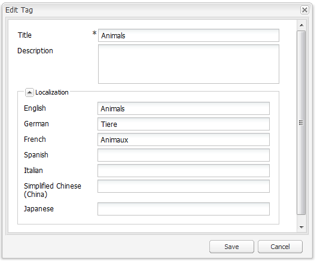

# Consola de etiquetado de la IU clásica{#classic-ui-tagging-console}

>[!CAUTION]
>
>AEM 6.4 ha llegado al final de la compatibilidad ampliada y esta documentación ya no se actualiza. Para obtener más información, consulte nuestra [períodos de asistencia técnica](https://helpx.adobe.com/es/support/programs/eol-matrix.html). Buscar las versiones compatibles [here](https://experienceleague.adobe.com/docs/).

Esta sección es para la consola de etiquetado de la IU clásica.

La consola de etiquetado de la IU táctil está optimizada para [here](/help/sites-administering/tags.md#tagging-console).

Para acceder a la consola de etiquetado de la IU clásica :

* en author
* iniciar sesión con privilegios administrativos
* vaya a la consola

   por ejemplo, [http://localhost:4502/tagging](http://localhost:4502/tagging)

## Creación de etiquetas y espacios de nombres {#creating-tags-and-namespaces}

1. Según el nivel desde el que comience, puede crear una etiqueta o un área de nombres mediante **Nuevo**:

   Si selecciona **Etiquetas** puede crear un área de nombres:

   

   Si selecciona un área de nombres (por ejemplo **Demostración**) puede crear una etiqueta dentro de ese espacio de nombres:

   

1. En ambos casos, introduzca

   * **Título**
(
*Requerido*) Título para mostrar de la etiqueta. Aunque se puede introducir cualquier carácter,

      se recomienda no utilizar estos caracteres especiales :

      * `colon (:)` - delimitador de área de nombres
      * `forward slash (/)` - delimitador de subetiqueta

      Estos caracteres no se muestran si se introducen.

   * **Nombre**

      (*Requerido*) El nombre de nodo de la etiqueta .

   * **Descripción**

      (*Opcional*) Una descripción para la etiqueta.

   * select **Crear**

## Edición de etiquetas {#editing-tags}

1. En el panel derecho, seleccione la etiqueta que desee editar.
1. Haga clic en **Editar**.
1. Puede modificar el **Título** y **Descripción**.
1. Haga clic en **Guardar** para cerrar el cuadro de diálogo.

## Eliminación de etiquetas {#deleting-tags}

1. En el panel derecho, seleccione la etiqueta que desee eliminar.
1. Haga clic en **Eliminar**.
1. Haga clic en **Sí** para cerrar el cuadro de diálogo.

   La etiqueta ya no debería aparecer en la lista.

## Activación y desactivación de etiquetas {#activating-and-deactivating-tags}

1. En el panel derecho, seleccione el área de nombres o la etiqueta que desee activar (publicar) o desactivar (cancelar la publicación).
1. Haga clic en **Activar** o **Desactivar** según sea necesario.

## Lista: mostrar dónde se hace referencia a las etiquetas {#list-showing-where-tags-are-referenced}

**Lista** abre una nueva ventana que muestra las rutas de todas las páginas utilizando la etiqueta resaltada:

## Desplazamiento de etiquetas {#moving-tags}

Para ayudar a los administradores y desarrolladores de etiquetas a limpiar la taxonomía o cambiar el nombre de un ID de etiqueta, es posible mover una etiqueta a una nueva ubicación :

1. Abra el **Etiquetado** consola.
1. Seleccione la etiqueta y haga clic en **Mover...** en la barra de herramientas superior (o en el menú contextual).
1. En el **Mover etiqueta** , defina:

   * **a**, el nodo de destino.
   * **Cambiar nombre a**, el nuevo nombre de nodo.

1. Haga clic en **Mover**.

La variable **Mover etiqueta** El cuadro de diálogo tiene el siguiente aspecto:

>[!NOTE]
>
>Los autores no deben mover etiquetas ni cambiar el nombre de un ID de etiqueta. Si es necesario, los autores solo deben [cambiar los títulos de las etiquetas](#editing-tags).

## Combinación de etiquetas {#merging-tags}

Se pueden combinar etiquetas cuando una taxonomía tiene duplicados. Cuando la etiqueta A se combina con la etiqueta B, todas las páginas etiquetadas con la etiqueta A se etiquetarán con la etiqueta B y la etiqueta A ya no estará disponible para los autores.

Para combinar una etiqueta en otra:

1. Abra el **Etiquetado** consola.
1. Seleccione la etiqueta y haga clic en **Combinar...** en la barra de herramientas superior (o en el menú contextual).
1. En el **Combinar etiqueta** , defina:

   * **into**, el nodo de destino.

1. Haga clic en **Combinar**.

La variable **Combinar etiqueta** El cuadro de diálogo tiene el siguiente aspecto:

## Recuento del uso de etiquetas {#counting-usage-of-tags}

Para ver cuántas veces se está utilizando una etiqueta:

1. Abra el **Etiquetado** consola.
1. Haga clic en **Uso de recuento** en la barra de herramientas superior: la columna Count muestra el resultado.

## Administración de etiquetas en diferentes idiomas {#managing-tags-in-different-languages}

La opción `title`La propiedad de una etiqueta puede traducirse a varios idiomas. Etiqueta `titles` se puede mostrar según el idioma del usuario o el idioma de la página.

### Definición de títulos de etiquetas en varios idiomas {#defining-tag-titles-in-multiple-languages}

El siguiente procedimiento muestra cómo traducir la variable `title`de la etiqueta **Animales** inglés, alemán y francés:

1. Vaya a la **Etiquetado** consola.
1. Editar la etiqueta **Animales** below **Etiquetas** > **Fotografía de archivo**.
1. Añada las traducciones a los siguientes idiomas:

   * **Inglés**: Animales
   * **Alemán**: Tiere
   * **Francés**: Animaux

1. Guarde los cambios.

El cuadro de diálogo tiene el siguiente aspecto:

La consola Etiquetado utiliza la configuración de idioma del usuario, por lo que para la etiqueta Animal se muestra &quot;Animaux&quot; para un usuario que establece el idioma en francés en las propiedades de usuario.

Para añadir un nuevo idioma al cuadro de diálogo, consulte la sección [Adición de un nuevo idioma al cuadro de diálogo Editar etiqueta](/help/sites-developing/building.md#adding-a-new-language-to-the-edit-tag-dialog) en el **Etiquetado para desarrolladores** para obtener más información.

### Visualización de títulos de etiquetas en propiedades de página en un idioma especificado {#displaying-tag-titles-in-page-properties-in-a-specified-language}

De forma predeterminada, la etiqueta `titles`en las propiedades de página se muestran en el idioma de la página. El cuadro de diálogo etiqueta de las propiedades de página tiene un campo de idioma que permite la visualización de la etiqueta `titles`en un idioma diferente. El siguiente procedimiento describe cómo mostrar la etiqueta `titles`en francés:

1. Consulte la sección anterior para agregar la traducción al francés al **Animales** below **Etiquetas** > **Fotografía de archivo**.
1. Abra las propiedades de página del **Productos** en la rama inglesa del **Geometrixx** sitio.
1. Abra el **Etiquetas/Palabras clave** (seleccionando el menú desplegable a la derecha del área de visualización Etiquetas/palabras clave) y seleccione la **Francés** del menú desplegable en la esquina inferior derecha.
1. Desplácese con las flechas izquierda-derecha hasta que pueda seleccionar la variable **Fotografía de archivo** ficha

   Seleccione el **Animales** (**Animaux**) y seleccione fuera del cuadro de diálogo para cerrarlo y agregar la etiqueta a las propiedades de página.

   

De forma predeterminada, el cuadro de diálogo Propiedades de página muestra la etiqueta `titles`según el idioma de la página.

En general, el idioma de la etiqueta se toma del idioma de la página si este está disponible. Cuando la variable [widget de etiquetas](/help/sites-developing/building.md#tagging-on-the-client-side) se utiliza en otros casos (por ejemplo, en formularios o en cuadros de diálogo), el idioma de la etiqueta depende del contexto.

>[!NOTE]
>
>La nube de etiquetas y las palabras clave meta del componente de página estándar utilizan la etiqueta localizada `titles`en función del idioma de la página, si está disponible.
