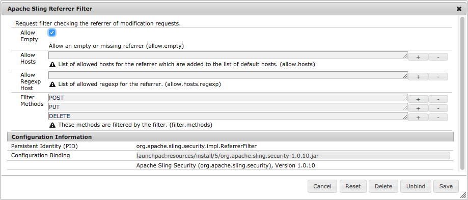

# Configuración para aplicaciones AEM{#configuring-for-aem-apps}

>[!CAUTION]
>
>AEM 6.4 ha llegado al final de la compatibilidad ampliada y esta documentación ya no se actualiza. Para obtener más información, consulte nuestra [períodos de asistencia técnica](https://helpx.adobe.com/es/support/programs/eol-matrix.html). Buscar las versiones compatibles [here](https://experienceleague.adobe.com/docs/).

Adobe Experience Manager Apps proporciona la capacidad de actualizar el contenido de su aplicación por aire (OTA). El contenido actualizado se almacena en la instancia de publicación. Para permitir que la aplicación del dispositivo se conecte a la instancia de publicación y compruebe si hay actualizaciones, la instancia de publicación debe configurarse para permitir un encabezado de referente vacío.

## Configuración del encabezado de referente vacío {#configuring-empty-referrer-header}

Para configurar el servicio de filtro de referente:

* Abra la consola Apache Felix (**Configuraciones**) en:
* https://&lt;server>:&lt;port_number>/system/console/configMgr
* Inicie sesión como administrador.
* En el **Configuraciones** seleccione: *Filtro de referente de Apache Sling*
* Marque el campo Permitir vacío para permitir encabezados de referente vacíos o que faltan.
* Haga clic en **Guardar** para guardar los cambios.

Consulte la [Configuración de OSGI](/help/sites-deploying/osgi-configuration-settings.md) y [Lista de comprobación de seguridad: problemas con la falsificación de solicitudes entre sitios](/help/sites-administering/security-checklist.md#protect-against-cross-site-request-forgery) para obtener más información.
