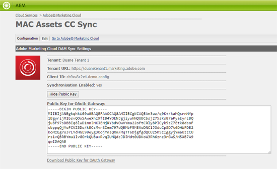

# Configurar la integración de AEM Assets con Experience Cloud y Creative Cloud {#configure-aem-assets-integration-with-experience-cloud-and-creative-cloud}

Si es cliente de Adobe Experience Cloud, puede sincronizar los recursos dentro de Adobe Experience Manager (AEM) Assets con Adobe Creative Cloud y viceversa. También puede sincronizar los recursos con Experience Cloud y viceversa. Puede configurar esta sincronización mediante E/S de Adobe.

El flujo de trabajo para configurar esta integración es:

1. Cree una autenticación en E/S de Adobe mediante una puerta de enlace pública y obtenga un ID de aplicación.
1. Cree un perfil en la instancia de AEM Assets mediante el ID de la aplicación.
1. Utilice esta configuración para sincronizar los recursos de AEM Assets con Creative Cloud.

En segundo plano, el servidor de AEM autentica el perfil con la puerta de enlace y, a continuación, sincroniza los datos entre AEM Assets y Experience Cloud.

>[!NOTE]
>
>La función de uso compartido de carpetas de AEM a Adobe Creative Cloud está en desuso. Obtenga más información y encuentre un mejor método en las optimizaciones [de integración de](../assets/aem-cc-integration-best-practices.md)AEM y Creative Cloud. La configuración de la replicación de AEM a Marketing Cloud y el intercambio de recursos entre AEM Assets y Marketing Cloud no está en desuso.

Flujo de datos cuando AEM Assets y Creative Cloud están integrados

>[!NOTE]
>
>El uso compartido de recursos entre Adobe Experience Cloud y Adobe Creative Cloud requiere privilegios de administrador en la instancia de AEM.

>[!CAUTION]
>
>Adobe Marketing Cloud se ha rebautizado como Adobe Experience Cloud. Los procedimientos que siguen mencionan el Marketing Cloud para reflejar la interfaz actual.

## Creación de una aplicación {#create-an-application}

1. Acceda a la interfaz de puerta de enlace de Adobe Developer iniciando sesión en [https://legacy-oauth.cloud.adobe.io](https://legacy-oauth.cloud.adobe.io/).

   >[!NOTE]
   >
   >Se requieren privilegios de administrador para crear un ID de aplicación.

1. En el panel izquierdo, vaya a Herramientas **[!UICONTROL de]** desarrollador > **[!UICONTROL Aplicaciones]** para vista de una lista de aplicaciones.
1. Haga clic en **[!UICONTROL Añadir]**  para crear una aplicación.
1. En la lista Credenciales **[!UICONTROL de]** cliente, seleccione Cuenta **[!UICONTROL de servicio (JWT Assertion)]**, que es un servicio de comunicación de servidor a servidor para la autenticación de servidor.

   

1. Especifique un nombre para la aplicación y una descripción opcional.
1. En la lista **[!UICONTROL Organización]** , seleccione la organización para la que desea sincronizar los recursos.
1. En la lista **[!UICONTROL Ámbito]** , seleccione **[!UICONTROL dam-read]**, **[!UICONTROL dam-sync]**, **[!UICONTROL dam-write]** y **[!UICONTROL cc-share]**.
1. Haga clic en **[!UICONTROL Crear]**. Un mensaje notifica que se ha creado la aplicación.

   

1. Copie el **[!UICONTROL ID de aplicación]** que se genera para la nueva aplicación.

   >[!CAUTION]
   >
   >Asegúrese de que no copia el **[!UICONTROL Secreto de aplicación]** de forma involuntaria en lugar del **[!UICONTROL ID de aplicación]**.

## Añadir una nueva configuración en Marketing Cloud {#add-a-new-configuration-to-marketing-cloud}

1. Haga clic en el logotipo AEM en la interfaz de usuario de la instancia de AEM Assets local y vaya a **[!UICONTROL Herramientas]** > **[!UICONTROL Cloud Services]** > Cloud Services **** preexistentes.

1. Busque el servicio de **[!UICONTROL Adobe Marketing Cloud]** . Si no hay configuraciones, haga clic en **[!UICONTROL Configurar ahora]**. Si existen configuraciones, haga clic en **[!UICONTROL Mostrar configuraciones]** y haga clic en **[!UICONTROL [+]]** para agregar una nueva configuración.

   >[!NOTE]
   >
   >Utilice una cuenta de Adobe ID con privilegios de administrador para la organización.

1. En el cuadro de diálogo **[!UICONTROL Crear configuración]** , especifique un título y un nombre para la nueva configuración y haga clic en **[!UICONTROL Crear]**.

   

1. En el campo URL del **[!UICONTROL inquilino]** , especifique la URL de AEM Assets.

   >[!CAUTION]
   >
   >Debido al cambio de marca, si ha introducido la dirección URL del inquilino como **https://&lt;identificación_inquilino>.marketing.adobe.com** , debe cambiarla a **https://&lt;identificación_inquilino>.experiencia.adobe.com.** Para ello, siga los pasos a continuación:
   1. Vaya a **Herramientas > Cloud Services > Servicios de nube heredados**.
   1. En Adobe Marketing Cloud, haga clic en **Mostrar configuraciones**.
   1. Seleccione la configuración que se creó al configurar la sincronización AEM-MAC-CC.
   1. Edite la configuración de cloudservice y reemplace **marketing.adobe.com** en el campo URL del inquilino por **experiencecloud.adobe.com**.
   1. Guarde la configuración.
   1. Pruebe los agentes de replicación mac-sync.

1. En el campo ID **[!UICONTROL de]** cliente, pegue el ID de aplicación que ha copiado al final del procedimiento [Crear una aplicación](/help/sites-administering/configure-assets-cc-integration.md#create-an-application).

   

1. En **[!UICONTROL Sincronización]** , seleccione **[!UICONTROL Habilitado]** para habilitar la sincronización y haga clic en **[!UICONTROL Aceptar]**.

   >[!NOTE]
   Si selecciona **deshabilitado**, la sincronización funcionará en una sola dirección.

1. En la página de configuración, haga clic en **[!UICONTROL Mostrar clave]** pública para mostrar la clave pública generada para la instancia. Como alternativa, haga clic en **[!UICONTROL Descargar clave pública para OAuth Gateway]** para descargar el archivo que contiene la clave pública. A continuación, abra el archivo para mostrar la clave pública.

## Habilitar sincronización {#enable-synchronization}

1. Muestre la clave pública utilizando uno de los siguientes métodos mencionados en el último paso del procedimiento para [Añadir una nueva configuración en Marketing Cloud](/help/sites-administering/configure-assets-cc-integration.md#add-a-new-configuration-to-marketing-cloud). Click **[!UICONTROL Display Public Key]**.

   

1. Copie la clave pública y péguela en el campo Clave **** pública de la interfaz de configuración de la aplicación creada en [Crear una aplicación](/help/sites-administering/configure-assets-cc-integration.md#create-an-application).

   

1. Click **[!UICONTROL Update]**. Sincronice los recursos con la instancia de AEM Assets ahora.

## Probar la sincronización {#test-the-synchronization}

1. Haga clic en el logotipo AEM en la interfaz de usuario de la instancia de AEM Assets local y vaya a **[!UICONTROL Herramientas]**> **[!UICONTROL Implementación]**> **[!UICONTROL Replicación]** para localizar los perfiles de replicación creados para la sincronización.
1. En la página **[!UICONTROL Replicación]** , haga clic en **[!UICONTROL Agentes en el autor]**.
1. En la lista de perfiles, haga clic en el perfil de replicación predeterminado para que su organización lo abra.
1. En el cuadro de diálogo, haga clic en **[!UICONTROL Probar conexión]**.

   

1. Cuando se complete el reposo de replicación, compruebe si hay un mensaje de éxito al final de los resultados de la prueba.

## Añadir usuarios a Marketing Cloud {#add-users-to-marketing-cloud}

1. Inicie sesión en Marketing Cloud con las credenciales del administrador.
1. En los rieles, vaya a **[!UICONTROL Administración]** y, a continuación, toque o haga clic en **[!UICONTROL Iniciar Panel]** empresarial.
1. En el carril, haga clic en **[!UICONTROL Usuarios]** para abrir la página Administración **[!UICONTROL de usuarios]** .
1. En la barra de herramientas, toque o haga clic en **Añadir** .
1. Añada uno o varios usuarios que desee que puedan compartir recursos con Creative Cloud.

   >[!NOTE]
   Solo los usuarios que agregue a Marketing Cloud pueden compartir recursos de AEM Assets con Creative Cloud.

## Intercambio de recursos entre AEM Assets y Marketing Cloud {#exchange-assets-between-aem-assets-and-marketing-cloud}

1. Inicie sesión en AEM Assets.
1. En la consola Recursos, cree una carpeta y cargue algunos recursos en ella. Por ejemplo, cree una carpeta **mc-demo** y cargue un recurso en ella.
1. Seleccione la carpeta y haga clic en **Compartir** .
1. En el menú, seleccione **[!UICONTROL Adobe Marketing Cloud]** y haga clic en **[!UICONTROL Compartir]**. Un mensaje notifica que la carpeta se comparte con Marketing Cloud.

   

   >[!NOTE]
   Compartir una carpeta de recursos del tipo `sling:OrderedFolder`, no se admite en el contexto de uso compartido en Adobe Marketing Cloud. Si desea compartir una carpeta, al crearla en AEM Assets, no seleccione la opción **[!UICONTROL Pedido]** .

1. Actualice la interfaz de usuario de AEM Assets. La carpeta que ha creado en la consola Recursos de la instancia de AEM Assets local se copia en la interfaz de usuario de Marketing Cloud. El recurso que se carga en la carpeta de AEM Assets aparece en la copia de la carpeta en Marketing Cloud después de que el servidor de AEM lo haya procesado.
1. También puede cargar un recurso en la copia replicada de la carpeta en Marketing Cloud. Una vez procesado, el recurso aparece en la carpeta compartida de AEM Assets.

## Intercambio de recursos entre AEM Assets y Creative Cloud {#exchange-assets-between-aem-assets-and-creative-cloud}

AEM Assets permite compartir carpetas que contienen recursos con usuarios de Adobe Creative Cloud.

1. En la consola Recursos, seleccione la carpeta que desee compartir con Creative Cloud.
1. En la barra de herramientas, haga clic en **[!UICONTROL Compartir]** .
1. En la lista, seleccione la opción **[!UICONTROL Adobe Creative Cloud]** .

   >[!NOTE]
   Las opciones están disponibles para los usuarios con permisos de lectura en la raíz. Los usuarios deben tener el permiso necesario para acceder a la información del agente de replicación de Marketing Cloud.

1. En la página **[!UICONTROL Creative Cloud compartido]** , agregue el usuario para compartir la carpeta y elija una función para el usuario. Haga clic en **[!UICONTROL Guardar]** y en **[!UICONTROL Aceptar]**.

1. Inicie sesión en el Creative Cloud con las credenciales del usuario con el que ha compartido la carpeta. La carpeta compartida está disponible en Creative Cloud.

La sincronización de AEM Assets-Marketing Cloud está diseñada de tal forma que la instancia de ordenador del usuario desde la que se carga el recurso conserva el derecho de modificar el recurso. Sólo estos cambios se propagan a la otra instancia.

Por ejemplo, si un recurso se carga desde una instancia de AEM Assets (local), los cambios realizados en el recurso desde esta instancia se propagan a la instancia de Marketing Cloud. Sin embargo, los cambios realizados desde la instancia de Marketing Cloud al mismo recurso no se propagan a la instancia de AEM y viceversa para el recurso cargado desde Marketing Cloud.

>[!MORELIKETHIS]
* [Prácticas recomendadas de integración de AEM y Creative Cloud](../assets/aem-cc-integration-best-practices.md)
* [Prácticas recomendadas de uso compartido de carpetas de AEM a Creative Cloud](../assets/aem-cc-folder-sharing-best-practices.md)

