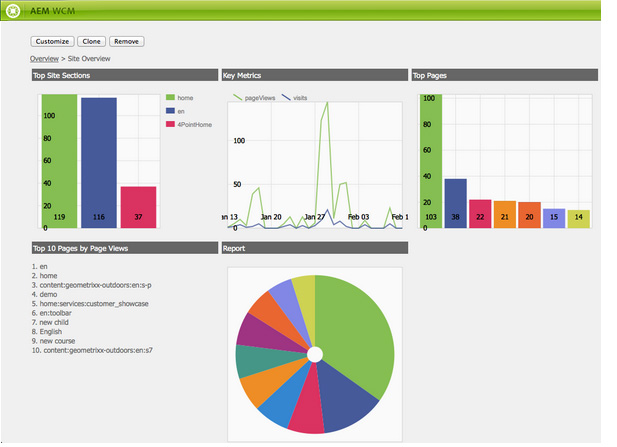

# Tableros{#dashboards}

>[!CAUTION]
>
>AEM 6.4 ha llegado al final de la compatibilidad ampliada y esta documentación ya no se actualiza. Para obtener más información, consulte nuestra [períodos de asistencia técnica](https://helpx.adobe.com/es/support/programs/eol-matrix.html). Buscar las versiones compatibles [here](https://experienceleague.adobe.com/docs/).

Al utilizar AEM puede administrar un montón de contenido de distintos tipos (p. ej. páginas, recursos). AEM tableros proporcionan una manera fácil de usar y personalizable de definir páginas que muestren datos consolidados.

>[!NOTE]
>
>AEM tableros se crean por usuario, por lo que un usuario solo puede acceder a su propio tablero.
>
>
>Sin embargo, [Plantillas de tablero](#creating-a-dashboard-template) se puede utilizar para compartir una configuración común y el diseño del panel.



## Administración de tableros {#administering-dashboards}

### Creación De Un Tablero {#creating-a-dashboard}

Para crear un tablero nuevo, siga estos pasos:

1. En el **Herramientas** , haga clic en **Consola de configuración**.

1. En el árbol, haga doble clic en **Panel**.

1. Haga clic en **Nuevo tablero**.

1. Escriba la **Título** (p. ej. Mi tablero) y la variable **Nombre**.

1. Haga clic en **Crear**.

### Clonación De Un Tablero {#cloning-a-dashboard}

Es posible que desee tener varios tableros para ver rápidamente información sobre el contenido desde distintas vistas. Para ayudarle a crear un tablero nuevo, AEM proporciona una función de clonación que puede utilizar para duplicar un tablero existente. Para clonar un tablero, siga este procedimiento:

1. En el **Herramientas** , haga clic en **Consola de configuración**.

1. En el árbol, haga clic en **Panel**.
1. Haga clic en el tablero que desee clonar.

1. Haga clic en **Clonar**.

1. Escriba la **Nombre** del nuevo tablero.

### Eliminación De Un Tablero {#removing-a-dashboard}

1. En el **Herramientas** , haga clic en **Consola de configuración**.

1. En el árbol, haga clic en **Panel**.
1. Haga clic en el tablero que desee eliminar.

1. Haga clic en **Quitar**.

1. Haga clic en **Sí** para confirmar.

## Componentes del panel {#dashboard-components}

### Información general {#overview}

Los componentes del panel no son más que normales [AEM componentes](/help/sites-developing/developing-components-samples.md). En esta sección se describen los componentes de informes enviados con AEM.

### Componentes de informes de Web Analytics {#web-analytics-reporting-components}

AEM se envía con un conjunto de componentes que procesan varias métricas de su [SiteCatalyst](/help/sites-administering/adobeanalytics.md) datos. Estos componentes se muestran en la barra de tareas, en la sección **Panel** para obtener más información.

Cada componente de informe proporciona al menos tres fichas:

* **Básico**: contiene la configuración principal.

* **Informe:** contiene la configuración específica de cada informe.
* **Estilo**: contiene una configuración de estilo como el tamaño y el margen del gráfico.

Los componentes de informes se inicializan con una configuración predeterminada que le ayuda a configurar el tablero rápidamente.

#### Configuración básica {#basic-configuration}

La variable **Básico** proporciona acceso a las siguientes entradas de configuración:

**Título** El título que se muestra en el tablero.

**Tipo de solicitud** Cómo se solicitan los datos.

**Configuración de SiteCatalyst (opcional)** La configuración que desea utilizar para conectarse a SiteCatalyst. Si no se proporciona, se asume que la configuración se configura en la página Tablero (a través de las propiedades de página).

**ID del grupo de informes (opcional)** Grupo de informes de SiteCatalyst que desea utilizar para generar el gráfico.

#### Configuración del informe {#report-configuration}

Para mostrar las estadísticas de la web, debe definir el intervalo de fechas de los datos que desea recopilar. La variable **Informe** proporciona dos campos para definir ese intervalo.

>[!NOTE]
>
>Si se configura un intervalo de fechas grande, se puede reducir la capacidad de respuesta del tablero.

**Fecha desde** Fecha absoluta o relativa a partir de la cual se recuperan los datos.

**Fecha hasta** Fecha absoluta o relativa a la que se recuperan los datos.

Cada componente también define configuraciones específicas.

#### Informe de tiempo extra {#overtime-report}


**Granularidad de la fecha** Unidad de tiempo del eje X (por ejemplo, día, hora).

**Métricas** Lista de eventos que desea mostrar.

**Elementos** Lista de elementos que desglosa los datos de métricas en el gráfico.

#### Informe de lista clasificada {#ranked-list-report}


**Elementos** Elemento que desglosa los datos de métricas en el gráfico.

**Métricas** El evento que desea mostrar.

**No. de elementos principales** Número de elementos que muestra el informe.

#### Informe clasificado {#ranked-report}


**Métricas** El evento que desea mostrar.

**Elementos** Elemento que desglosa los datos de métricas en el gráfico.

#### Informe de sección de sitio principal {#top-site-section-report}

Este componente muestra un gráfico con la sección más visitada de un sitio web según la configuración siguiente.


**No. de elementos principales** Número de sección que se muestra en el informe.

#### Informe de tendencias {#trended-report}


**Granularidad de la fecha** Unidad de tiempo del eje X (por ejemplo, día, hora).

**Métricas** El evento que desea mostrar.

**Elementos** Elemento que desglosa los datos de métricas en el gráfico.

## Ampliación del panel {#extending-dashboard}

### Información general {#overview-1}

Los tableros son páginas normales ( `cq:Page`), por lo tanto, cualquier componente se puede utilizar para ensamblar paneles.

Hay un grupo de componentes predeterminado `Dashboard` que contienen componentes de informes de analytics que están habilitados en la plantilla de forma predeterminada.

### Creación De Una Plantilla De Tablero {#creating-a-dashboard-template}

Una plantilla define el contenido predeterminado de un tablero nuevo. Puede utilizar varias plantillas para crear distintos tipos de tableros.

Las plantillas de tablero se crean como otras plantillas de página, excepto que se almacenan en `/libs/cq/dashboards/templates/`. Consulte la [Creación de una plantilla de Contentpage](/help/sites-developing/website.md#creating-the-contentpage-template) para obtener más información.

>[!NOTE]
>
>Las plantillas de tablero se comparten entre los usuarios.

### Desarrollo de un componente de panel {#developing-a-dashboard-component}

El desarrollo de un componente Tablero consiste en la creación de un componente AEM normal. En esta sección se describe un ejemplo de un componente que muestra los 10 colaboradores principales.


Los componentes de autor principales se almacenan en el repositorio en `/apps/geometrixx-outdoors/components/reporting` y está compuesto por :

1. a `jsp` archivo que lee datos de jcr y define la variable `html` marcador de posición.

1. una biblioteca del lado del cliente que contiene una `js` que obtiene y ordena los datos y, a continuación, rellena el `html` marcador de posición.


El siguiente archivo JavaScript se define en la variable `geout.reporting.topauthors` [Biblioteca de clientes](/help/sites-developing/clientlibs.md) como elemento secundario del componente en sí.

La variable [QueryBuilder](/help/sites-developing/querybuilder-api.md) se utiliza para consultar el repositorio para leer `cq:AuditEvent` nodos. El resultado de la consulta es un objeto JSON del que se extraen las contribuciones de autor.

#### top_authors.js {#top-authors-js}

```
$.ajax({
  url: "/bin/querybuilder.json",
  cache: false,
  data: {
       "orderby": "cq:time",
       "orderby.sort": "desc",
       "p.hits": "full",
       "p.limit": 100,
       "path": "/var/audit/com.day.cq.wcm.core.page/",
       "type": "cq:AuditEvent"
   },
  dataType: "json"     
}).done(function( res ) {
    var authors = {};
    // from JSON to Object
    for(var r in res.hits) {
        var userId = res.hits[r].userId;
        if(userId == undefined) {
            continue;
        }
        var auth = authors[userId] || {userId : userId};
        auth.contrib = (auth.contrib || 0) +1;
        
        authors[userId] = auth;
    }
    
    // order by contribution
    var orderedByContrib = [];
    for(var a in authors) {
        orderedByContrib.push(authors[a]);
    }
    orderedByContrib.sort(function(a,b){return b.contrib - a.contrib});
    
    // produce the list
    for (var i=0, tot=orderedByContrib.length; i < tot; i++) {
        var current = orderedByContrib[i];
        $("<div> #" + (i + 1) +" "+ current.userId + " (" + current.contrib +" contrib.)</div>").appendTo("#authors-list");

    }
});  
```

La variable `JSP` incluye ambas `global.jsp` y `clientlib`.

#### top_authors.jsp {#top-authors-jsp}

```java
<%@page session="false" contentType="text/html; charset=utf-8" %><%
%><%
%><%@include file="/libs/foundation/global.jsp" %><%
%>
<ui:includeClientLib categories="geout.reporting.topauthors" />
<%
String reportletTitle = properties.get("title", "Top Authors");
%>
<html>
     <h3><%=xssAPI.encodeForHTML(reportletTitle) %></h3>
     <div id="authors-list"></div>
</html>
```
