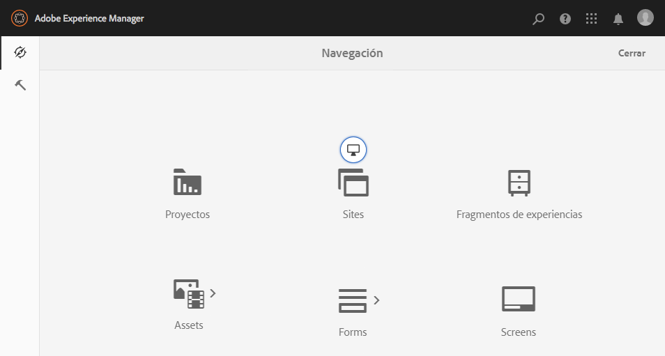

# Admin Console{#admin-consoles}

De forma predeterminada, se ha deshabilitado la capacidad de cambiar a la IU clásica a través de las consolas de administración. Por lo tanto, ya no se muestran los iconos emergentes que se vieron al pasar el ratón sobre determinados iconos de la consola, lo que permite acceder a la IU clásica.

Cada consola que tenga una versión de IU clásica en `/libs/cq/core/content/nav` puede volver a activarse individualmente para que la opción de IU **** clásica aparezca una vez más sobre el icono de la consola cuando se pase el ratón por encima.

En este ejemplo, estamos volviendo a habilitar la IU clásica para la consola Sitios.

1. Con CRXDE Lite, busque el nodo correspondiente a la consola de administración para la que desea volver a habilitar la IU clásica. Se encuentran en:

   `/libs/cq/core/content/nav`

   Por ejemplo

   [ `http://localhost:4502/crx/de/index.jsp#/libs/cq/core/content/nav`](http://localhost:4502/crx/de/index.jsp#/libs/cq/core/content/nav)

1. Seleccione el nodo correspondiente a la consola para la que desea volver a habilitar la IU clásica. Para nuestro ejemplo, reactivaremos la IU clásica para la consola Sitios.

   `/libs/cq/core/content/nav/sites`

1. Crear una superposición con la opción Nodo **de** superposición; por ejemplo:

   * **Ruta**: `/apps/cq/core/content/nav/sites`
   * **Ubicación de la superposición**: `/apps/`
   * **Coincidir tipos** de nodos: activo (seleccione la casilla de verificación)

1. Añada la siguiente propiedad booleana al nodo superpuesto:

   `enableDesktopOnly = {Boolean}true`

1. La opción de IU **** clásica está disponible de nuevo como opción emergente en la consola de administración.

   

Repita estos pasos para cada consola para la que desee volver a habilitar el acceso a la versión de la IU clásica.
