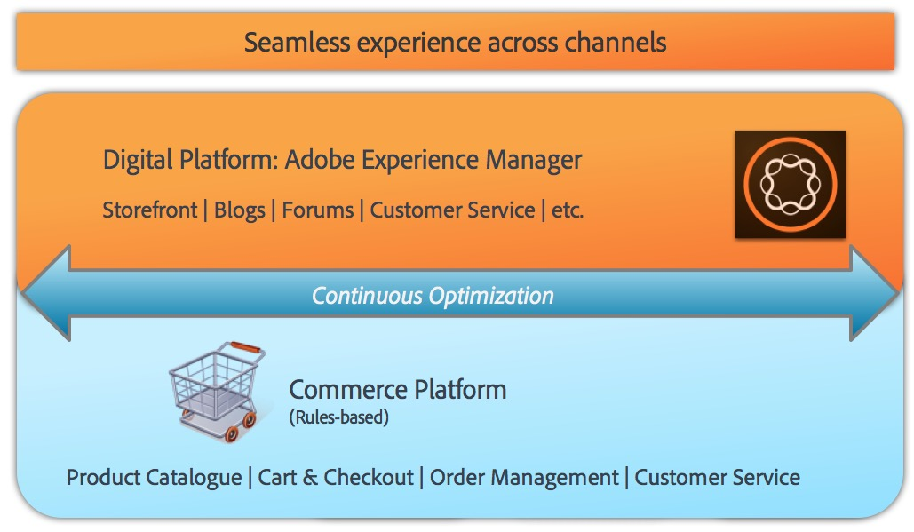

# Comercio AEM - Preparación para RGPD{#aem-commerce-gdpr-readiness}

>[!IMPORTANT]
>
>El RGPD se utiliza como ejemplo en las secciones que figuran a continuación, pero los detalles abarcados son aplicables a todas las normas de protección de datos y privacidad; como el RGPD, la CCPA, etc.

El Reglamento general de protección de datos de la Unión Europea sobre derechos de privacidad de datos entrará en vigor en mayo de 2018. Para obtener más información, consulte la página del [RGPD en el Centro](https://www.adobe.com/privacy/general-data-protection-regulation.html)de Privacidad del Adobe.

>[!NOTE]
>
>Consulte [AEM Preparación para el RGPD](/help/managing/data-protection-and-privacy.md) para obtener más detalles.

En nuestras integraciones de comercio integradas, AEM es la capa de experiencia, que consume servicios y envía datos a la plataforma de comercio de clientes que se ejecuta en modo sin cabeza.

Para algunas plataformas comerciales, almacenamos información de perfil ( `/home/users`) y tokens de comercio (para iniciar sesión en la plataforma comercial) en AEM. Para estos casos de uso, lea [Tratamiento de las solicitudes del RGPD para la Plataforma](/help/sites-administering/handling-gdpr-requests-for-aem-platform.md)AEM.

## Gestión de solicitudes de RGPD para el comercio AEM {#handling-gdpr-requests-for-aem-commerce}

Para la integración de Commerce Cloud de Salesforce, AEM Commerce no almacena ninguna información relevante del RGPD. Debe reenviar la solicitud a [Salesforce Cloud](https://documentation.demandware.com/).

Para las integraciones de hybris e IBM WebSphere, hay algunos datos en AEM. Debe utilizar las instrucciones [del RGPD de la](/help/sites-administering/handling-gdpr-requests-for-aem-platform.md) AEM Plataforma y considerar estas preguntas:

1. **¿Dónde se almacenan o utilizan los datos?** La información de perfil del usuario en caché, como nombre, identificador de usuario de comercio, token, contraseña, datos de dirección, etc., se muestra desde AEM.
1. **¿Con quién comparto los datos del RGPD cubiertos?** No se almacena ninguna actualización de los datos pertinentes del RGPD en AEM comercio (excepto la información pertinente sobre perfiles, como se ha mencionado anteriormente), sino que se redirige a la plataforma comercial.
1. **¿Cómo eliminar mis datos** de usuario? Elimine el perfil del usuario en AEM e invoque la eliminación del usuario en la plataforma comercial.

>[!NOTE]
>
>Eche un vistazo a la [wiki](https://wiki.hybris.com/) de híbris o a la documentación [de comercio de la](https://www-01.ibm.com/support/docview.wss?uid=swg27036450) esfera web si es necesario.

