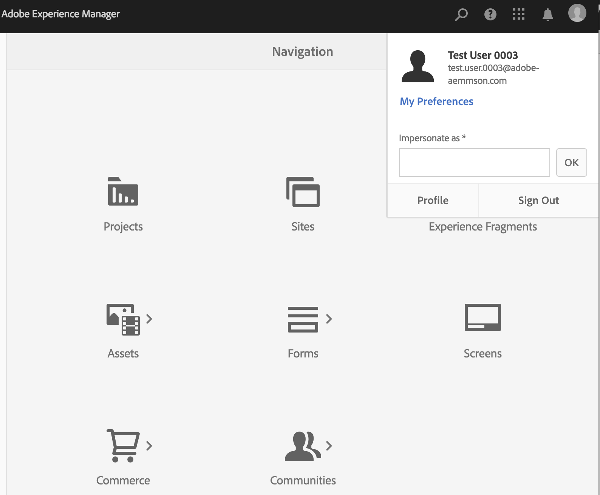
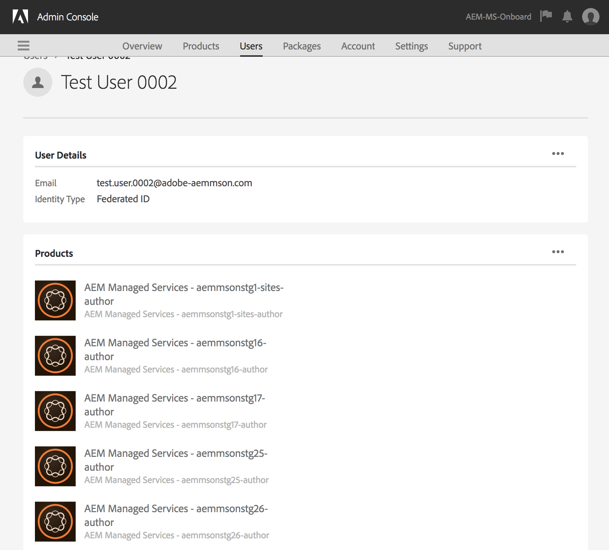

# Compatibilidad de Admin Console y autenticación de IMS de Adobe para AEM Managed Services {#adobe-ims-authentication-and-admin-console-support-for-aem-managed-services}

>[!NOTE]
>
>Tenga en cuenta que esta función solo está disponible para los clientes de los servicios gestionados de Adobe.

## Introducción {#introduction}

AEM 6.4.3.0 incorpora compatibilidad con Admin Console para instancias de AEM y autenticación basada en Adobe IMS (Identity Management System) para clientes de **AEM Managed Services** .

AEM integración con el Admin Console permitirá a AEM clientes de Managed Services administrar todos los usuarios Experience Cloud en una sola consola. Los usuarios y grupos se pueden asignar a perfiles de producto asociados con instancias de AEM, lo que les permite iniciar sesión en una instancia específica.

## Puntos clave destacados {#key-highlights}

* AEM compatibilidad con la autenticación IMS solo está disponible para autores, administradores o desarrolladores de AEM, no para usuarios finales externos del sitio del cliente como visitantes del sitio
* El Admin Console representará a AEM clientes de Managed Services como organizaciones de IMS y sus instancias como Contextos de productos. Los administradores del sistema de clientes y de productos podrán administrar el acceso a las instancias
* AEM Managed Services sincronizará las topologías de los clientes con el Admin Console. Habrá una instancia de AEM contexto de producto de Managed Services por instancia en el Admin Console.
* Los Perfiles del producto en Admin Console determinarán las instancias a las que puede acceder un usuario
* Se admite la autenticación federada utilizando los propios proveedores de identidad compatibles con SAML 2 de los clientes
* Solo se admitirán Enterprise ID o Federated ID (para el inicio de sesión único del cliente), no ID de Adobe personales.
* La administración de usuarios (en Adobe Admin Console) seguirá siendo propiedad de los administradores del cliente.

## Arquitectura {#architecture}

La autenticación IMS funciona mediante el protocolo OAuth entre AEM y el extremo IMS de Adobe. Una vez que se añade un usuario a IMS y tiene una identidad de Adobe, puede iniciar sesión en las instancias de AEM Managed Services con las credenciales de IMS.

El flujo de inicio de sesión del usuario se muestra a continuación; el usuario será redirigido a IMS y, opcionalmente, a IDP del cliente para la validación de SSO y luego redirigido a AEM.

## How To Set Up {#how-to-set-up}

### Incorporación de organizaciones a Admin Console {#onboarding-organizations-to-admin-console}

La incorporación del cliente al Admin Console es un requisito previo para utilizar IMS de Adobe para la autenticación AEM.

Como primer paso, los clientes deben tener una organización aprovisionada en Adobe IMS. Los clientes de Adobe Enterprise están representados como organizaciones de IMS en [Adobe Admin Console](https://helpx.adobe.com/es/enterprise/using/admin-console.html).

AEM los clientes de Managed Services ya deben tener una organización aprovisionada y, como parte del aprovisionamiento de IMS, las instancias de cliente estarán disponibles en el Admin Console para administrar las autorizaciones de usuario y el acceso.

El paso a IMS para la autenticación de usuarios será un esfuerzo conjunto entre AMS y clientes, y cada uno tendrá sus flujos de trabajo para completar.

Una vez que un cliente existe como organización de IMS y AMS se ha realizado con el aprovisionamiento del cliente para IMS, éste es el resumen de los flujos de trabajo de configuración requeridos:

1. El administrador del sistema designado recibe una invitación para iniciar sesión en el Admin Console
1. El administrador del sistema solicita el dominio para confirmar la propiedad del dominio (en este ejemplo acme.com)
1. El administrador del sistema configura los directorios de usuario
1. El administrador del sistema configura el proveedor de identidad (IDP) en la configuración del Admin Console para SSO.
1. El administrador de AEM administra los grupos locales, los permisos y los privilegios como de costumbre. Consulte Sincronización de usuarios y grupos

>[!NOTE]
>
>Para obtener más información sobre los conceptos básicos de Identity Management de Adobe, incluida la configuración de IDP, consulte el artículo [esta página.](https://helpx.adobe.com/es/enterprise/using/set-up-identity.html)
>
>Para obtener más información sobre la Administración de empresas y el Admin Console, consulte el artículo [esta página](https://helpx.adobe.com/es/enterprise/managing/user-guide.html).

### Incorporación de usuarios al Admin Console {#onboarding-users-to-the-admin-console}

Existen tres formas de integrar a los usuarios en función del tamaño del cliente y de sus preferencias:

1. Crear manualmente usuarios y grupos en Admin Console
1. Carga de un archivo CSV con usuarios
1. Sincronizar usuarios y grupos desde el Active Directory empresarial del cliente.

#### Adición manual a través de la interfaz de usuario de Admin Console {#manual-addition-through-admin-console-ui}

Los usuarios y grupos se pueden crear manualmente en la interfaz de usuario de Admin Console. Este método se puede utilizar si no tienen un gran número de usuarios que administrar. Por ejemplo, un número de menos de 50 usuarios AEM.

Los usuarios también se pueden crear manualmente si el cliente ya está utilizando este método para administrar otros productos de Adobe como Analytics, Destinatario o aplicaciones de Creative Cloud.

#### File Upload in the Admin Console UI {#file-upload-in-the-admin-console-ui}

Para facilitar la gestión de la creación de usuarios, se puede cargar un archivo CSV para agregar usuarios de forma masiva:

#### Herramienta de sincronización de usuarios {#user-sync-tool}

La Herramienta de sincronización de usuarios (UST en resumen) permite a los clientes empresariales crear o administrar usuarios de Adobe mediante Active Directory u otros servicios de directorio OpenLDAP probados. Los usuarios de destinatario son administradores de identidad de TI (Enterprise Directory y Administradores de sistema) que podrán instalar y configurar la herramienta. La herramienta de código abierto es personalizable para que los clientes puedan hacer que un desarrollador la modifique para adaptarla a sus propios requisitos particulares.

Cuando se ejecuta la sincronización de usuarios, obtiene una lista de usuarios de Active Directory de la organización (o de cualquier otra fuente de datos compatible) y la compara con la lista de usuarios dentro del Admin Console. A continuación, llama a la API de administración de usuarios de Adobe para sincronizar Admin Console con el directorio de la organización. El flujo de cambios es totalmente unidireccional; las ediciones realizadas en el Admin Console no se insertan en el directorio.

La herramienta permite al administrador del sistema asignar grupos de usuarios en el directorio del cliente con la configuración del producto y los grupos de usuarios en el Admin Console. La nueva versión del sistema operativo también permite la creación dinámica de grupos de usuarios en el Admin Console.

Para configurar la sincronización de usuarios, la organización debe crear un conjunto de credenciales de la misma manera que usaría la [API de administración de usuarios](https://www.adobe.io/apis/cloudplatform/usermanagement/docs/setup.html).

La sincronización de usuarios se distribuye a través del repositorio de Adobe Github en esta ubicación:

[https://github.com/adobe-apiplatform/user-sync.py/releases/latest](https://github.com/adobe-apiplatform/user-sync.py/releases/latest)

Tenga en cuenta que la versión de prelanzamiento 2.4RC1 está disponible con compatibilidad para la creación de grupos dinámicos y se puede encontrar aquí: [https://github.com/adobe-apiplatform/user-sync.py/releases/tag/v2.4rc1](https://github.com/adobe-apiplatform/user-sync.py/releases/tag/v2.4rc1)

Las principales características de esta versión son la capacidad de asignar dinámicamente nuevos grupos LDAP para la pertenencia de usuarios a Admin Console, así como la creación dinámica de grupos de usuarios.

Puede encontrar más información sobre las nuevas funciones del grupo aquí:

[https://github.com/adobe-apiplatform/user-sync.py/blob/v2/docs/en/user-manual/advanced_configuration](https://github.com/adobe-apiplatform/user-sync.py/blob/v2/docs/en/user-manual/advanced_configuration.md#additional-group-options)

>[!NOTE]
>
>Para obtener más información acerca de la Herramienta de sincronización de usuarios, consulte la página [de](https://adobe-apiplatform.github.io/user-sync.py/es/)documentación.
>
>
>The User Sync Tool needs to register as an Adobe I/O client UMAPI using the procedure described [here](https://adobe-apiplatform.github.io/umapi-documentation/en/UM_Authentication.html).
>
>The Adobe I/O Console Documentation can be found [here](https://www.adobe.io/apis/cloudplatform/console.html).
>
>
>The User Management API that is used by the User Sync Tool is covered at this [location](https://www.adobe.io/apis/cloudplatform/umapi-new.html).

>[!NOTE]
>
>El equipo de servicios administrados de Adobe gestionará la configuración de IMS AEM. Sin embargo, el administrador del cliente puede modificarlo según sus requisitos (por ejemplo, la pertenencia a grupos automática o la asignación de grupos). El cliente de IMS también será registrado por su equipo de Managed Services.

## Usos {#how-to-use}

### Administración de productos y acceso de usuarios en Admin Console {#managing-products-and-user-access-in-admin-console}

Cuando el administrador de productos del cliente inicia sesión en el Admin Console, verá varias instancias del contexto de producto de Managed Services AEM como se muestra a continuación:

In this example, the org *AEM-MS-Onboard* has 32 instances spanning different topologies and environments like Stage, Prod, etc.

Los detalles de la instancia se pueden comprobar para identificar la instancia:

En cada instancia de contexto de producto, habrá un Perfil de producto asociado. Este perfil de producto se utiliza para asignar acceso a usuarios y grupos.

Los usuarios y grupos agregados bajo este perfil de producto pueden iniciar sesión en esa instancia en , como se muestra en el ejemplo siguiente:

### Inicio de sesión en AEM {#logging-into-aem}

#### Inicio de sesión de administrador local {#local-admin-login}

AEM seguir admitiendo inicios de sesión locales para los usuarios administradores, ya que la pantalla de inicio de sesión tiene una opción para iniciar sesión localmente:

#### Inicio de sesión basado en IMS {#ims-based-login}

Para otros usuarios, el inicio de sesión basado en IMS se puede utilizar una vez que IMS esté configurado en la instancia. The user will first click on the **Sign in with Adobe** button as shown below:

A continuación, se les redirigirá a la pantalla de inicio de sesión de IMS e introducirá sus credenciales:

Si se configura un IDP federado durante la configuración inicial de Admin Console, se redirige al usuario al IDP del cliente para SSO.

El IDP es Okta en el siguiente ejemplo:

Una vez finalizada la autenticación, se redirige al usuario a AEM para iniciar sesión:

### Migración de usuarios existentes {#migrating-existing-users}

Para las instancias de AEM existentes que utilizan otro método de autenticación y que se están migrando a IMS, debe haber un paso de migración.

Los usuarios existentes en el repositorio de AEM (originados localmente, a través de LDAP o SAML) se pueden migrar para que apunten a IMS como IDP mediante la Utilidad de migración de usuarios.

Esta utilidad la ejecutará el equipo de AMS como parte del aprovisionamiento de IMS.

### Administración de permisos y ACL en AEM {#managing-permissions-and-acls-in-aem}

Los controles de acceso y permisos se seguirán administrando en AEM, esto se puede lograr mediante la separación de los grupos de usuarios procedentes de IMS (por ejemplo, AEM-GRP-008 en el ejemplo siguiente) y los grupos locales donde se definen los permisos y el control de acceso. Los grupos de usuarios sincronizados con IMS se pueden asignar a grupos locales y heredar los permisos.

En el ejemplo siguiente, se añaden grupos sincronizados al grupo local *Dam_Users* como ejemplo.

Aquí también se ha asignado un usuario a algunos grupos del Admin Console. (Tenga en cuenta que los usuarios y grupos pueden sincronizarse desde LDAP mediante la herramienta de sincronización de usuarios o crearse localmente, consulte la sección Usuarios **incorporados al Admin Console** anterior).

&amp;ast;Tenga en cuenta que los grupos de usuarios solo se sincronizan cuando inician sesión en la instancia, para los clientes que tienen un gran número de usuarios y grupos, AMS puede ejecutar una utilidad de sincronización de grupos para recuperar previamente grupos para la administración de controles de acceso y permisos que se ha descrito anteriormente.

El usuario forma parte de los siguientes grupos en IMS:

Cuando el usuario inicia sesión, se sincronizan las suscripciones al grupo, como se muestra a continuación:

En AEM, los grupos de usuarios sincronizados con IMS se pueden agregar como miembros a grupos locales existentes, por ejemplo, usuarios de DAM.

Como se muestra a continuación, el grupo *AEM-GRP_008* hereda los permisos y privilegios de los usuarios de DAM. Esta es una forma eficaz de administrar permisos para grupos sincronizados y se utiliza comúnmente también en métodos de autenticación basados en LDAP.

