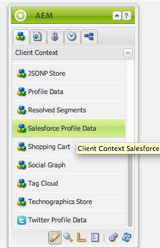

# Integración con Salesforce{#integrating-with-salesforce}

La integración de Salesforce con AEM ofrece capacidades de administración de posibles clientes y aprovecha las capacidades existentes que Salesforce ofrece de forma inmediata. Puede configurar AEM para anunciar leads en Salesforce y crear componentes que accedan a los datos directamente desde Salesforce.

La integración bidireccional y extensible entre AEM y Salesforce permite:

* Organizaciones para utilizar y actualizar completamente los datos para mejorar la experiencia del cliente.
* Compromiso de marketing a actividades de ventas.
* Organizaciones para transmitir y recibir automáticamente datos de un almacén de datos de Salesforce.

En este documento se describe lo siguiente:

* cómo configurar Cloud Services de Salesforce (configure AEM para integrarlos con Salesforce).
* cómo utilizar la información de posibles clientes y contactos de Salesforce en Client Context y para la personalización.
* cómo utilizar el modelo de flujo de trabajo de Salesforce para anunciar AEM usuarios como posibles clientes para Salesforce.
* cómo crear un componente que muestre datos de Salesforce.

## Configuración de AEM para integrarlos con Salesforce {#configuring-aem-to-integrate-with-salesforce}

Para configurar la integración de AEM con Salesforce, primero debe configurar una aplicación de acceso remoto en Salesforce. A continuación, configure el servicio de nube de Salesforce para que apunte a esta aplicación de acceso remoto.

>[!NOTE]
>
>Puede crear una cuenta de desarrollador gratuita en Salesforce.

Para configurar AEM para la integración con Salesforce:

1. En AEM, vaya a **Cloud Services**. En Servicios de terceros, haga clic en **Configurar ahora** en **Salesforce**.

   

1. Cree una nueva configuración, por ejemplo, **desarrollador**.

   >[!NOTE]
   >
   >La nueva configuración redirige a una nueva página: **http://localhost:4502/etc/cloudservices/salesforce/developer.html**. Es exactamente el mismo valor que debe especificar en la URL de llamada de retorno al crear la aplicación de acceso remoto en Salesforce. Estos valores deben coincidir.

1. Inicie sesión en su cuenta de Salesforce (o, si no la tiene, cree una en [https://developer.force.com](https://developer.force.com)).
1. En Salesforce, vaya a **Crear** > **Aplicaciones** para acceder a las Aplicaciones **** conectadas (en versiones anteriores de Salesforce, el flujo de trabajo era **Implementar** > Acceso **** remoto).
1. Haga clic en **Nuevo** para conectar AEM con Salesforce.

   

1. Introduzca el nombre **de la aplicación** conectada, el nombre **de la** API y el correo electrónico **de** contacto. Seleccione la casilla de verificación **Activar configuración** de OAuth, introduzca la URL **de** llamada de retorno y agregue un ámbito de OAuth (por ejemplo, acceso completo). La dirección URL de llamada de retorno tiene un aspecto similar al siguiente: `http://localhost:4502/etc/cloudservices/salesforce/developer.html`

   Cambie el nombre del servidor/número de puerto y el nombre de la página para que coincidan con la configuración.

   

1. Haga clic en **Guardar** para guardar la configuración de Salesforce. Salesforce crea una **clave del cliente** y un **secreto de cliente** que necesita para AEM configuración.

   

   >[!NOTE]
   >
   >Es posible que tenga que esperar varios minutos (hasta 15 minutos) para que la aplicación de acceso remoto de Salesforce se active.

1. En AEM, vaya a **Cloud Services** y vaya a la configuración de Salesforce que creó anteriormente (por ejemplo, **desarrollador**). Haga clic en **Editar** e introduzca la clave de cliente y la clave de cliente en salesforce.com.

   

   | URL de inicio de sesión | Este es el extremo de autorización de Salesforce. Su valor es precargado y sirve a la mayoría de los casos. |
   |---|---|
   | Clave del cliente | Escriba el valor obtenido de la página Registro de la aplicación de acceso remoto en salesforce.com |
   | Secreto del cliente | Escriba el valor obtenido de la página Registro de la aplicación de acceso remoto en salesforce.com |

1. Haga clic en **Conectar a Salesforce** para conectarse. Salesforce solicita que permita que la configuración se conecte a Salesforce.

   

   En AEM, se abre un cuadro de diálogo de confirmación que indica que se ha conectado correctamente.

1. Vaya a la página raíz del sitio web y haga clic en Propiedades **de la página**. A continuación, seleccione **Cloud Services** , agregue **Salesforce** y seleccione la configuración correcta (por ejemplo, **desarrollador**).

   

   Ahora puede utilizar el modelo de flujo de trabajo para anunciar leads en Salesforce y crear componentes que accedan a los datos desde Salesforce.

## Exportación de usuarios de AEM como posibles clientes de Salesforce {#exporting-aem-users-as-salesforce-leads}

Si desea exportar un usuario AEM como posible cliente de Salesforce, debe configurar el flujo de trabajo para anunciar leads en Salesforce.

Para exportar usuarios de AEM como posibles clientes de Salesforce:

1. Navegue hasta el flujo de trabajo de Salesforce en `http://localhost:4502/workflow` la página Flujo de trabajo haciendo clic con el botón secundario en el **archivo Salesforce.com Exportar** y haciendo clic en **Inicio**.

   

1. Seleccione el usuario AEM que desea crear como posible cliente como **carga útil** para este flujo de trabajo (inicio -> usuarios). Asegúrese de seleccionar el nodo de perfil del usuario, ya que contiene información como **givenName**, **familyName**, etc., que se asignan a los campos **FirstName** y **LastName** del posible cliente de Salesforce.

   

   >[!NOTE]
   >
   >Antes de iniciar este flujo de trabajo, hay ciertos campos obligatorios que debe tener un nodo de posible cliente en AEM antes de publicarse en Salesforce. Estos son **givenName**, **familyName**, **** company y **email**. Para ver una lista completa de la asignación entre AEM usuario y el posible cliente de Salesforce, consulte Configuración de [asignación entre AEM usuario y el posible cliente de Slaesforce.](#mapping-configuration-between-aem-user-and-salesforce-lead)

1. Haga clic en **Aceptar**. La información del usuario se exporta a salesforce.com. Puede verificarlo en salesforce.com.

   >[!NOTE]
   >
   >Los registros de errores le mostrarán si se ha importado un lead. Consulte el registro de errores para obtener más información.

### Configuración del flujo de trabajo de exportación de Salesforce.com {#configuring-the-salesforce-com-export-workflow}

Es posible que deba configurar el flujo de trabajo de exportación de Salesforce.com para que coincida con la configuración correcta de Salesforce.com o para realizar otros cambios.

Para configurar el flujo de trabajo de exportación de Salesforce.com:

1. Ir a `http://localhost:4502/cf#/etc/workflow/models/salesforce-com-export.html.`

   

1. Abra el paso Exportar de Salesforce.com, seleccione la ficha **Argumentos** , seleccione la configuración correcta y haga clic en **Aceptar**. Además, si desea que el flujo de trabajo vuelva a crear un posible cliente que se eliminó en Salesforce, active la casilla de verificación.

   

1. Click **Save** to save your changes.

   

### Asignación de la configuración entre AEM usuario y el posible cliente de Salesforce {#mapping-configuration-between-aem-user-and-salesforce-lead}

Para vista o edición de la configuración de asignación actual entre un usuario AEM y un posible cliente de Salesforce, abra el Administrador de configuración: `https://<hostname>:<port>/system/console/configMgr` y busque la configuración **de Asignación de posibles clientes de** Salesforce.

1. Para abrir el Administrador de configuración, haga clic en Consola **** web o vaya directamente a `https://<hostname>:<port>/system/console/configMgr.`
1. Busque la configuración **de Asignación de posibles clientes de** Salesforce.

   

1. Cambie las asignaciones, según sea necesario. La asignación predeterminada sigue el patrón** aemUserAttribute=sfLeadAttribute**. Click **Save** to save your changes.

## Configuración del almacén de contexto de cliente de Salesforce {#configuring-salesforce-client-context-store}

El almacén de contexto de cliente de Salesforce muestra información adicional sobre el usuario que ha iniciado sesión en ese momento que la que ya está disponible en AEM. Recopila esta información adicional de Salesforce en función de la conexión del usuario con Salesforce.

Para ello, debe configurar lo siguiente:

1. Vincule un usuario AEM con un ID de Salesforce mediante el componente Salesforce Connect.
1. Añada los datos de Perfil de Salesforce en la página de contexto del cliente para configurar las propiedades que desea ver.
1. (Opcional) Cree un segmento que utilice los datos del almacén de contexto del cliente de Salesforce.

### Vinculación de un usuario AEM con un ID de Salesforce {#linking-an-aem-user-with-a-salesforce-id}

Debe asignar un usuario AEM con un ID de Salesforce para cargarlo en el contexto de cliente. En un escenario real, vincularía los datos de usuarios conocidos con la validación. Para fines demostrativos, en este procedimiento se utiliza el componente **Salesforce Connect** .

1. Vaya a un sitio web en AEM, inicie sesión y arrastre y suelte el componente **Salesforce Connect** desde la barra de tareas.

   >[!NOTE]
   >
   >Si el componente **Salesforce Connect** no está disponible, vaya a la vista de **diseño** y selecciónelo para que esté disponible en la vista **Editar** .

   

   Cuando arrastra el componente a la página, muestra **Vínculo a Salesforce=Desactivado**.

   

   >[!NOTE]
   >
   >Este componente se utiliza únicamente con fines de demostración. En el caso de escenarios reales, habría otro proceso para vincular/relacionar a los usuarios con posibles clientes.

1. Después de arrastrar el componente en la página, ábralo para configurarlo. Seleccione la configuración, el tipo de contacto y el posible cliente o contacto de Salesforce y haga clic en **Aceptar**.

   

   AEM vincula al usuario con el contacto o posible cliente de Salesforce.

   

### Añadir datos de Salesforce en el contexto de cliente {#adding-salesforce-data-to-client-context}

Puede cargar datos de usuario de Salesforce en Client Context para utilizarlos en la personalización:

1. Abra el contexto de cliente que desee ampliar navegando por él, por ejemplo: `http://localhost:4502/etc/clientcontext/default/content.html.`

   

1. Arrastre el componente **Salesforce Perfil Data** al contexto de cliente.

   

1. Haga clic con el botón Doble en el componente para abrirlo. Seleccione **Añadir elemento** y seleccione una propiedad en la lista desplegable. Añada tantas propiedades como desee y seleccione **Aceptar**.

   

1. Ahora, verá las propiedades específicas de Salesforce de Salesforce en el contexto de cliente.

   

### Creación de un segmento con datos del almacén de contexto de cliente de Salesforce {#building-a-segment-using-data-from-salesforce-client-context-store}

Puede crear un segmento que utilice datos del almacén de contexto del cliente de Salesforce. Para ello:

1. Vaya a la segmentación en AEM, ya sea en **Herramientas** > **Segmentación** o en [http://localhost:4502/miscadmin#/etc/segmentation](http://localhost:4502/miscadmin#/etc/segmentation).
1. Cree o actualice un segmento para incluir datos de Salesforce. For more information, see [Segmentation](/help/sites-administering/campaign-segmentation.md).

## Búsqueda de posibles clientes {#searching-leads}

AEM incluye un componente de búsqueda de muestra que busca leads en Salesforce según los criterios especificados. Este componente muestra cómo utilizar la API de REST de Salesforce para buscar objetos de Salesforce. Debe vincular una página con una configuración de Salesforce para activar una llamada a salesforce.com.

>[!NOTE]
>
>Este es un componente de muestra que muestra cómo utilizar la API de REST de Salesforce para consulta de objetos de Salesforce. Utilícelo como ejemplo para crear componentes más complejos según sus necesidades.

Para utilizar este componente:

1. Vaya a la página en la que desee utilizar esta configuración. Abra las propiedades de la página y seleccione **Cloud Services.** Haga clic en **Añadir servicios** , seleccione **Salesforce** y la configuración adecuada y haga clic en **Aceptar**.

   

1. Arrastre el componente de búsqueda de Salesforce a la página (siempre que se haya activado). Para activarlo, vaya al modo Diseño y agréguelo al área adecuada).

   

1. Abra el componente Buscar, especifique los parámetros de búsqueda y haga clic en **Aceptar.**

   

1. AEM muestra los leads especificados en el componente de búsqueda que coinciden con los criterios especificados.

   

