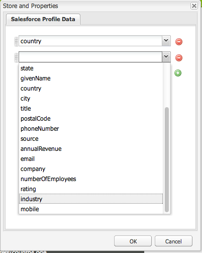
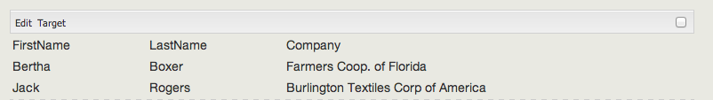

# Integración con Salesforce{#integrating-with-salesforce}

>[!CAUTION]
>
>AEM 6.4 ha llegado al final de la compatibilidad ampliada y esta documentación ya no se actualiza. Para obtener más información, consulte nuestra [períodos de asistencia técnica](https://helpx.adobe.com/es/support/programs/eol-matrix.html). Buscar las versiones compatibles [here](https://experienceleague.adobe.com/docs/).

La integración de Salesforce con AEM proporciona capacidades de administración de posibles clientes y aprovecha las capacidades existentes que Salesforce proporciona de forma predeterminada. Puede configurar AEM para anunciar posibles clientes en Salesforce y crear componentes que accedan a los datos directamente desde Salesforce.

La integración bidireccional y extensible entre AEM y Salesforce permite:

* Organizaciones para utilizar y actualizar los datos completamente para mejorar la experiencia del cliente.
* Participación de actividades de marketing a actividades de ventas.
* Organizaciones para transmitir y recibir automáticamente datos de un almacén de datos de Salesforce.

Este documento describe lo siguiente:

* cómo configurar los Cloud Services de Salesforce (configure AEM para integrarlos con Salesforce).
* cómo usar la información de posible cliente/contacto de Salesforce en Client Context y para personalización.
* cómo utilizar el modelo de flujo de trabajo de Salesforce para anunciar AEM usuarios como posibles clientes para salesforce.
* cómo crear un componente que muestre datos de Salesforce.

## Configuración de AEM para integrar con Salesforce {#configuring-aem-to-integrate-with-salesforce}

Para configurar AEM para integrarlos con Salesforce, primero debe configurar una aplicación de acceso remoto en Salesforce. A continuación, configure el servicio de nube de salesforce para que apunte a esta aplicación de acceso remoto.

>[!NOTE]
>
>Puede crear una cuenta de desarrollador gratuita en Salesforce.

Para configurar AEM para integrar con Salesforce:

1. En AEM, vaya a **Cloud Services**. En Servicios de terceros, haga clic en **Configurar ahora** en **Salesforce**.

   

1. Cree una nueva configuración, por ejemplo, **desarrollador**.

   >[!NOTE]
   >
   >La nueva configuración redirige a una nueva página: **http://localhost:4502/etc/cloudservices/salesforce/developer.html**. Este es exactamente el mismo valor que debe especificar en la URL de devolución de llamada al crear la aplicación de acceso remoto en Salesforce. Estos valores deben coincidir.

1. Inicie sesión en su cuenta de Salesforce (o si no tiene una, cree una en [https://developer.force.com](https://developer.force.com).)
1. En Salesforce, vaya a **Crear** > **Aplicaciones** para llegar a **Aplicaciones conectadas** (en versiones anteriores de salesforce, el flujo de trabajo era **Implementación** > **Acceso remoto**).
1. Haga clic en **Nuevo** para conectar AEM con Salesforce.

   

1. Introduzca la variable **Nombre de la aplicación conectada**, **Nombre de API** y **Correo electrónico del contacto**. Seleccione el **Habilitar la configuración de OAuth** y escriba la **URL de devolución de llamada** y añada un ámbito OAuth (por ejemplo, acceso completo). La URL de rellamada tiene un aspecto similar al siguiente: `http://localhost:4502/etc/cloudservices/salesforce/developer.html`

   Cambie el nombre del servidor/número de puerto y el nombre de página para que coincidan con la configuración.

   

1. Haga clic en **Guardar** para guardar la configuración de salesforce. Salesforce crea un **clave del cliente** y **secreto de cliente**, que necesita para AEM configuración.

   

   >[!NOTE]
   >
   >Es posible que tenga que esperar varios minutos (hasta 15 minutos) para que la aplicación de acceso remoto de Salesforce se active.

1. En AEM, vaya a **Cloud Services** y vaya a la configuración de salesforce que creó anteriormente (por ejemplo, **desarrollador**). Haga clic en **Editar** e introduzca la clave de cliente y el secreto de cliente de salesforce.com.

   

   | URL de inicio de sesión | Este es el extremo de autorización de Salesforce. Su valor es precargado y sirve para la mayoría de los casos. |
   |---|---|
   | Clave del cliente | Introduzca el valor obtenido de la página Registro de Aplicación de Acceso Remoto en salesforce.com |
   | Secreto del cliente | Introduzca el valor obtenido de la página Registro de Aplicación de Acceso Remoto en salesforce.com |

1. Haga clic en **Conectarse a Salesforce** para conectarse. Salesforce solicita que la configuración se conecte a salesforce.

   

   En AEM, se abre un cuadro de diálogo de confirmación que le indica que se ha conectado correctamente.

1. Vaya a la página raíz del sitio web y haga clic en **Propiedades de página**. A continuación, seleccione **Cloud Services** y agregue **Salesforce** y seleccione la configuración correcta (por ejemplo, **desarrollador**).

   

   Ahora puede utilizar el modelo de flujo de trabajo para anunciar posibles clientes en Salesforce y crear componentes que accedan a los datos de Salesforce.

## Exportación de AEM usuarios como posibles clientes de Salesforce {#exporting-aem-users-as-salesforce-leads}

Si desea exportar un usuario AEM como posible cliente de salesforce, debe configurar el flujo de trabajo para que publique posibles clientes en salesforce.

Para exportar AEM usuarios como posible cliente de Salesforce:

1. Vaya al flujo de trabajo de Salesforce en `http://localhost:4502/workflow` haciendo clic con el botón derecho en el flujo de trabajo **Exportación de Salesforce.com** y haga clic en **Inicio**.

   

1. Seleccione el AEM usuario que desea crear como posible cliente como el **Carga útil** para este flujo de trabajo (inicio -> usuarios). Asegúrese de seleccionar el nodo de perfil del usuario, ya que contiene información como **givenName**, **familyName**, etc., que están asignados a los posibles clientes de Salesforce **Nombre** y **Apellido** campos.

   

   >[!NOTE]
   >
   >Antes de iniciar este flujo de trabajo, hay ciertos campos obligatorios que un nodo de AEM debe tener antes de publicarse en Salesforce. Estos son **givenName**, **familyName**, **empresa** y **email**. Para ver una lista completa de asignación entre AEM usuario y el posible cliente de Salesforce, consulte [Configuración de asignación entre AEM usuario y el posible cliente de Slaesforce.](#mapping-configuration-between-aem-user-and-salesforce-lead)

1. Haga clic en **Aceptar**. La información del usuario se exporta a salesforce.com. Puede verificarlo en salesforce.com.

   >[!NOTE]
   >
   >Los registros de errores le mostrarán si se ha importado un posible cliente. Consulte el registro de errores para obtener más información.

### Configuración del flujo de trabajo de exportación de Salesforce.com {#configuring-the-salesforce-com-export-workflow}

Es posible que deba configurar el flujo de trabajo de exportación de Salesforce.com para que coincida con la configuración correcta de Salesforce.com o para realizar otros cambios.

Para configurar el flujo de trabajo de exportación de Salesforce.com:

1. Navegue hasta `http://localhost:4502/cf#/etc/workflow/models/salesforce-com-export.html.`

   

1. Abra el paso Exportar de Salesforce.com y seleccione la opción **Argumentos** , seleccione la configuración correcta y haga clic en **OK**. Además, si desea que el flujo de trabajo vuelva a crear un posible cliente eliminado en Salesforce, active la casilla de verificación.

   

1. Haga clic en **Guardar** para guardar los cambios.

   

### Asignación de la configuración entre AEM usuario y el posible cliente de Salesforce {#mapping-configuration-between-aem-user-and-salesforce-lead}

Para ver o editar la configuración de asignación actual entre un usuario AEM y un posible cliente de Salesforce, abra el Administrador de configuración: `https://<hostname>:<port>/system/console/configMgr` y busque **Configuración de asignación de posibles clientes de Salesforce**.

1. Abra el Administrador de configuración haciendo clic en **Consola web** o vaya directamente a `https://<hostname>:<port>/system/console/configMgr.`
1. Buscar **Configuración de asignación de posibles clientes de Salesforce**.

   

1. Cambie las asignaciones según sea necesario. La asignación predeterminada sigue el patrón** aemUserAttribute=sfLeadAttribute**. Haga clic en **Guardar** para guardar los cambios.

## Configuración del almacén de contexto del cliente de Salesforce {#configuring-salesforce-client-context-store}

El almacén de contexto de cliente de salesforce muestra información adicional sobre el usuario que ha iniciado sesión actualmente que está disponible en AEM. Obtiene esta información adicional de Salesforce según la conexión del usuario con Salesforce.

Para ello, debe configurar lo siguiente:

1. Vincule un usuario AEM con un ID de Salesforce a través del componente Connect de Salesforce.
1. Agregue los datos de perfil de Salesforce a la página de contexto del cliente para configurar las propiedades que desea ver.
1. (Opcional) Genere un segmento que utilice los datos del almacén de contexto del cliente de Salesforce.

### Vinculación de un usuario de AEM con un ID de Salesforce {#linking-an-aem-user-with-a-salesforce-id}

Debe asignar un usuario AEM con un ID de Salesforce para cargarlo en ClientContext. En un escenario real, vincularía basándose en los datos conocidos del usuario con la validación. Para fines de demostración, en este procedimiento se usa la variable **Salesforce Connect** componente.

1. Vaya a un sitio web en AEM, inicie sesión y arrastre y suelte el **Salesforce Connect** de la barra de tareas.

   >[!NOTE]
   >
   >Si la variable **Salesforce Connect** no está disponible, vaya a **Diseño** visualícelo y selecciónelo para que esté disponible en **Editar** vista.

   

   Cuando arrastra el componente a la página, se muestra **Vínculo a Salesforce=Off**.

   

   >[!NOTE]
   >
   >Este componente es solo para fines de demostración. Para escenarios reales, habría otro proceso para vincular/relacionar usuarios con posibles clientes.

1. Después de arrastrar el componente en la página, ábralo para configurarlo. Seleccione la configuración, el tipo de contacto y el posible cliente o contacto de Salesforce y haga clic en **OK**.

   

   AEM vincula al usuario con el contacto o posible cliente de Salesforce.

   

### Adición de datos de Salesforce al contexto de cliente {#adding-salesforce-data-to-client-context}

Puede cargar datos de usuario de Salesforce en Client Context para utilizarlos en la personalización:

1. Abra el contexto de cliente que desee ampliar navegando allí, por ejemplo, `http://localhost:4502/etc/clientcontext/default/content.html.`

   

1. Arrastre el **Datos de perfil de Salesforce** a ClientContext.

   

1. Haga doble clic en el componente para abrirlo. Select **Agregar elemento** y seleccione una propiedad en la lista desplegable. Añada tantas propiedades como desee y seleccione **OK**.

   

1. Ahora, verá las propiedades específicas de Salesforce de Salesforce en el contexto del cliente.

   

### Creación de un segmento utilizando datos del almacén de contexto del cliente de Salesforce {#building-a-segment-using-data-from-salesforce-client-context-store}

Puede crear un segmento que utilice datos del almacén de contexto del cliente de Salesforce. Para ello, haga lo siguiente:

1. Vaya a la segmentación en AEM, ya sea accediendo a **Herramientas** > **Segmentación** o yendo a [http://localhost:4502/miscadmin#/etc/segmentation](http://localhost:4502/miscadmin#/etc/segmentation).
1. Cree o actualice un segmento para incluir datos de Salesforce. Para obtener más información, consulte [Segmentación](/help/sites-administering/campaign-segmentation.md).

## Búsqueda de posibles clientes {#searching-leads}

AEM se envía con un componente de búsqueda de muestra que busca posibles clientes en Salesforce según los criterios dados. Este componente muestra cómo utilizar la API de REST de Salesforce para buscar objetos de salesforce. Debe vincular una página con una configuración de Salesforce para activar una llamada a salesforce.com.

>[!NOTE]
>
>Este es un componente de ejemplo que muestra cómo utilizar la API de REST de Salesforce para consultar los objetos de Salesforce. Utilícelo como ejemplo para crear componentes más complejos según sus necesidades.

Para utilizar este componente:

1. Desplácese a la página donde desee utilizar esta configuración. Abra las propiedades de página y seleccione **Cloud Services.** Haga clic en **Agregar servicios** y seleccione **Salesforce** y la configuración adecuada y haga clic en **OK**.

   

1. Arrastre el componente de búsqueda de Salesforce a la página (siempre que se haya activado). Para activarlo, vaya al modo Diseño y añádalo al área adecuada).

   

1. Abra el componente Buscar , especifique los parámetros de búsqueda y haga clic en **OK.**

   

1. AEM muestra los posibles clientes especificados en el componente de búsqueda que coinciden con los criterios especificados.

   
