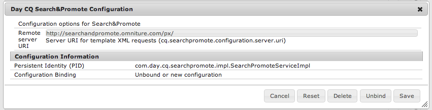

# Integración con Adobe Search&amp;Promote{#integrating-with-adobe-search-promote}

Para llamar al servicio de Search&amp;Promote de Adobe desde su sitio web, realice las siguientes tareas:

1. Especifique la dirección URL de la nube.
1. Configure la conexión con el servicio de Search&amp;Promote.
1. Añada componentes de Search&amp;Promote a [!UICONTROL Barra de tareas].
1. Utilice los componentes para crear el contenido. (Consulte [Añadir características de Search&amp;Promote en una página Web](/help/sites-authoring/search-and-promote.md)).
1. Añada letreros en las páginas. Las imágenes de pancarta son sensibles a los datos de Search&amp;Promote.
1. Genere un mapa del sitio para que el servicio de Search&amp;Promote lo consuma.

>[!NOTE]
>
>Si utiliza Search&amp;Promote con una configuración proxy personalizada, debe configurar ambas configuraciones proxy del cliente HTTP, ya que algunas funcionalidades de AEM utilizan las API 3.x y otras las API 4.x:
>
>* 3.x está configurado con [http://localhost:4502/system/console/configMgr/com.day.commons.httpclient](http://localhost:4502/system/console/configMgr/com.day.commons.httpclient)
>* 4.x está configurado con [http://localhost:4502/system/console/configMgr/org.apache.http.proxyconfigurator](http://localhost:4502/system/console/configMgr/org.apache.http.proxyconfigurator)

>

## Cambio de la dirección URL del servicio de Search&amp;Promote {#changing-the-search-promote-service-url}

La dirección URL predeterminada configurada para el servicio de Search&amp;Promote es `https://searchandpromote.omniture.com/px/`. Para utilizar un servicio diferente, utilice la consola OSGi para especificar una dirección URL diferente.

**Para cambiar la dirección URL** del servicio de Search&amp;Promote:

1. Abra la consola [!UICONTROL OSGi] y toque la ficha **[!UICONTROL Configuración]**. ([http://localhost:4502/system/console/configMgr.](http://localhost:4502/system/console/configMgr))

1. Haga clic en el elemento **[!UICONTROL Configuración de Search&amp;Promote de CQ por día]**.
1. En el campo de texto **[!UICONTROL URI del servidor remoto]**, introduzca la dirección URL y, a continuación, toque **[!UICONTROL Guardar]**.

## Configuración de la conexión a Search&amp;Promote {#configuring-the-connection-to-search-promote}

Configure una o más conexiones a Search&amp;Promote para que las páginas web puedan interactuar con el servicio. Para conectarse, necesita la identificación del miembro y el número de cuenta de su cuenta de Search&amp;Promote.

**Para configurar la conexión a Search&amp;Promote**:

1. En el icono **[!UICONTROL Herramientas]** > **[!UICONTROL Implementación]**, seleccione **[!UICONTROL Cloud Services]**.

   Esto te lleva al Panel de Cloud Services. Si se encuentra en un equipo local, la dirección URL del panel tendrá este aspecto:

   [http://localhost:4502/libs/cq/core/content/tools/cloudservices.html](http://localhost:4502/libs/cq/core/content/tools/cloudservices.html)

1. En la página [!UICONTROL Cloud Services], toque el vínculo **[!UICONTROL Search&amp;Promote de Adobe]** o el icono **[!UICONTROL Search&amp;Promote]**.

1. Si es la primera vez que configura el Search&amp;Promote de Adobe, toque **[!UICONTROL Configurar ahora]** para abrir el panel [!UICONTROL Crear configuración].

   Si desea obtener más información sobre Search&amp;Promote, haga clic en **[!UICONTROL Más información]** en su lugar.

   

1. Escriba un **[!UICONTROL Título]** reconocible para los autores de la página, escriba un **[!UICONTROL Nombre]** único y luego toque **[!UICONTROL Crear]**.

   Además, la configuración recién creada aparece debajo del **[!UICONTROL Configuraciones disponibles]** en el elemento de lista de Search&amp;Promote de Adobe **[!UICONTROL Cloud Services]**.

   

1. En el cuadro de diálogo [!UICONTROL Editar componente], agregue lo siguiente a los campos:

   * **[!UICONTROL ID de miembro]**
   * **[!UICONTROL Número de cuenta]**

   >[!NOTE]
   >
   >Para obtener esta información usted mismo, inicie sesión en lo siguiente:
   >
   >[https://searchandpromote.omniture.com/center/](https://searchandpromote.omniture.com/center/)
   >
   >con sus credenciales válidas de Search&amp;Promote (correo electrónico/contraseña).
   >
   >Observe la dirección URL en la barra de direcciones del explorador. Debería tener un aspecto similar al siguiente:
   >
   >
   >
   >[https://searchandpromote.omniture.com/px/home/?sp_id=XXXXXXXX-spYYYYYYYY](https://searchandpromote.omniture.com/px/home/?sp_id=XXXXXXXX-spYYYYYYYY)
   >
   >Donde **XXXXXX** corresponde a su **[!UICONTROL identificación de miembro]** y **[!UICONTROL spAAAA]** corresponde a su número de cuenta.

1. Toque **[!UICONTROL Conectar a Search&amp;Promote]**.

   Cuando aparezca el mensaje de éxito de la conexión, toque **[!UICONTROL Aceptar]**.

   (Después de la conexión, el texto del botón cambia a **[!UICONTROL Volver a conectar con Search&amp;Promote]**).

1. Toque **[!UICONTROL Aceptar]**. Aparece la página Configuración de Search&amp;Promote para la configuración que acaba de crear.

## Configuración del centro de datos {#configuring-the-data-center}

Si su cuenta de Search&amp;Promote está en Asia o Europa, debe cambiar el centro de datos predeterminado para que apunte al correcto (el centro de datos predeterminado es para cuentas norteamericanas).

**Para configurar el centro** de datos:

1. Vaya a la consola Web en `http://localhost:4502/system/console/configMgr/com.day.cq.searchpromote.impl.SearchPromoteServiceImpl`

   

1. Según la ubicación del servidor, cambie el URI a uno de los siguientes:

   * Norteamérica: [https://center.atomz.com/px/](https://center.atomz.com/px/)
   * EMEA: [https://center.lon5.atomz.com/px/](https://center.lon5.atomz.com/px/)
   * APAC: [https://center.sin2.atomz.com/px/](https://center.sin2.atomz.com/px/)

1. Toque **[!UICONTROL Guardar]**.

## Añadir componentes de Search&amp;Promote en la barra de tareas {#adding-search-promote-components-to-sidekick}

En el modo [!UICONTROL Diseño], edite un componente **[!UICONTROL par]** para permitir los componentes de Search&amp;Promote en [!UICONTROL Barra de tareas]. (Consulte la documentación de [Componentes](/help/sites-developing/components.md) para obtener más información).

Para obtener información sobre el uso de los componentes, consulte [Añadir características de Search&amp;Promote en una página Web](/help/sites-authoring/search-and-promote.md).

## Especificación del servicio de Search&amp;Promote que utilizan las páginas {#specifying-the-search-promote-service-that-your-pages-use}

Configure las páginas web para que utilicen un servicio de Search&amp;Promote específico. Los componentes de Search&amp;Promote utilizan automáticamente el servicio de la página de host.

Al configurar las propiedades de Search&amp;Promote de una página, todas las páginas secundarias heredan la configuración. Si es necesario, puede configurar las páginas secundarias para anular la configuración heredada.

>[!NOTE]
>
>La conexión de servicio ya debe estar configurada. Consulte [Configuración de la conexión a Search&amp;Promote](#configuring-the-connection-to-search-promote).

1. Abra el cuadro de diálogo **[!UICONTROL Propiedades de la página]**. Por ejemplo, en la página **[!UICONTROL Sitios web]**, haga clic con el botón secundario en la página y haga clic en **[!UICONTROL Propiedades]**.

1. Haga clic en la ficha **[!UICONTROL Cloud Services]**.

1. Para desactivar la herencia de las configuraciones de servicios en la nube desde una página principal, haga clic en el icono de cerrojo situado junto a la ruta de herencia.

   

1. Haga clic en **[!UICONTROL Añadir servicio]**, seleccione **[!UICONTROL Search&amp;Promote de Adobe]** y haga clic en **[!UICONTROL Aceptar]**.

1. Seleccione la configuración de conexión de su cuenta de Search&amp;Promote y haga clic en **[!UICONTROL Aceptar]**.

## Alimentación de productos {#product-feed}

La integración de Search&amp;Promote le permite hacer lo siguiente:

* Utilice la API [!UICONTROL eCommerce], independientemente de la estructura de repositorio subyacente y la plataforma de comercio.
* Aproveche la función [!UICONTROL Index Connector] de Search&amp;Promote para proporcionar una fuente de productos en formato XML.
* Aproveche la función [!UICONTROL Control remoto] de Search&amp;Promote para realizar solicitudes programadas o bajo demanda de la fuente de productos.
* Generación de fuentes para distintas cuentas de Search&amp;Promote, configuradas como configuraciones de servicios en la nube.

Para obtener más información, consulte [Alimentación de productos](/help/sites-administering/product-feed.md).
