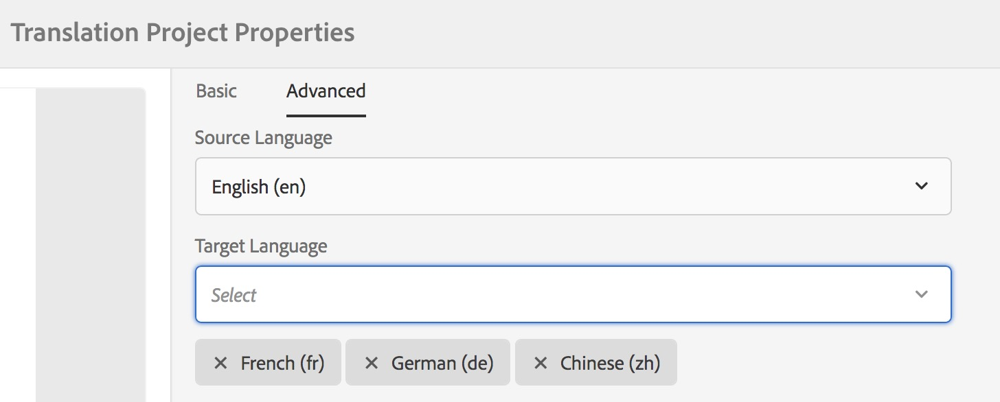

# Mejoras en la traducción{#translation-enhancements}

Esta página presenta mejoras y mejoras incrementales en las capacidades de administración de traducción de AEM.

## Automatización del proyecto de traducción {#translation-project-automation}

Se han agregado opciones para mejorar la productividad trabajando con proyectos de traducción, como promover y eliminar automáticamente lanzamientos de traducción y programar la ejecución recurrente de un proyecto de traducción.

1. En el proyecto de traducción, toque o haga clic en los puntos suspensivos en la parte inferior del mosaico Resumen **de** traducción.

   

1. Cambie a la ficha **Avanzado** . En la parte inferior, puede seleccionar Promocionar **automáticamente inicios** de traducción.

   

1. De forma opcional, puede seleccionar si, después de recibir contenido traducido, los inicios de traducción deben promocionarse y eliminarse automáticamente.

   

1. Para seleccionar la ejecución recurrente de un proyecto de traducción, seleccione la frecuencia con el menú desplegable en **Repetir traducción**. La ejecución de proyectos recurrentes creará y ejecutará automáticamente trabajos de traducción en los intervalos especificados.

   

## Proyectos de traducción multilingües {#multilingual-translation-projects}

Es posible configurar varios idiomas de destino en un proyecto de traducción, para reducir el número total de proyectos de traducción creados.

1. En el proyecto de traducción, toque o haga clic en los puntos de la parte inferior del mosaico Resumen **de** traducción.

   

1. Cambie a la ficha **Avanzado** . Puede agregar varios idiomas en Idioma **de** destino.

   

1. Como alternativa, si está iniciando la traducción mediante el carril de referencias en Sitios, agregue sus idiomas y seleccione **Crear proyecto** de traducción en varios idiomas.

   

1. Los trabajos de traducción se crearán en el proyecto para cada idioma de destino. Pueden iniciarse una por una dentro del proyecto o de una vez ejecutando el proyecto de forma global en Administración de proyectos.

   

## Actualizaciones de memoria de traducción {#translation-memory-updates}

Las ediciones manuales del contenido traducido se pueden sincronizar con el sistema de administración de traducciones (TMS) para capacitar su memoria de traducción.

1. Desde la consola Sitios, después de actualizar el contenido de texto en una página traducida, seleccione **Actualizar memoria** de traducción.

   

1. Una vista de lista muestra una comparación paralela del origen y la traducción para cada componente de texto que se editó. Seleccione qué actualizaciones de traducción deben sincronizarse con la memoria de traducción y seleccione **Actualizar memoria**.

   

   >[!NOTE]
   >
   >AEM devolverá las cadenas seleccionadas al sistema de administración de traducciones.

## Copias de idioma en varios niveles {#language-copies-on-multiple-levels}

Las raíces de idioma ahora pueden agruparse bajo nodos, por ejemplo por región, mientras se siguen reconociendo como raíces de las copias de idioma.

>[!CAUTION]
>
>Solo se permite un nivel. Por ejemplo, lo siguiente no permitirá que la página &quot;es&quot; se resuelva en una copia de idioma:
>
>* `/content/we-retail/language-masters/en`
>* `/content/we-retail/language-masters/americas/central-america/es`
>
>
Esta copia de idioma no se detectará porque está a 2 niveles (América/Centroamérica) lejos del `es` `en` nodo.

>[!NOTE]
>
>Las raíces de idioma pueden tener cualquier nombre de página, en lugar de sólo el código ISO del idioma. AEM siempre comprobará primero la ruta y el nombre, pero si el nombre de la página no identifica un idioma, AEM comprobará la identificación del idioma en la propiedad cq:language de la página.

## Informes de estado de traducción {#translation-status-reporting}

Ahora se puede seleccionar una propiedad en la vista de lista Sitios que muestra si una página se ha traducido, se está traduciendo o no se ha traducido. Para mostrarlo:

1. En Sitios, cambie a Vista **de lista.**

   

1. Toque o haga clic en **Ver configuración**.

   

1. Marque la casilla **Traducida** en **Traducción** y toque o haga clic en **Actualizar**.

   

Ahora puede ver una columna **Traducida** que muestra el estado de traducción de las páginas.

