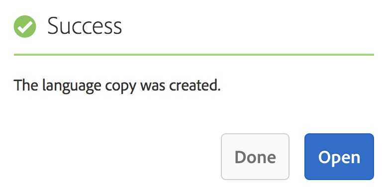

# Asistente para copia de idioma{#language-copy-wizard}

El asistente de copia de idioma es una experiencia guiada para crear e instrumentar la estructura de contenido multilingüe. Ahora es mucho más sencillo y rápido crear una copia de idioma.

>[!NOTE]
>
>El usuario debe ser miembro del grupo de administradores de proyectos para crear la copia de idioma de un sitio.

Para acceder a este asistente:

1. En Sitios, seleccione una página y toque o haga clic en Crear.

   

1. Seleccione Copiar idioma y se abrirá el asistente.

   

1. El paso **Seleccionar origen** del asistente le permite agregar o quitar páginas. También tiene la opción de incluir o excluir las subpáginas.

   

1. El botón **Siguiente** le lleva al paso **Configurar** del asistente. Aquí puede agregar o eliminar idiomas y seleccionar el método de traducción.

   

   >[!NOTE]
   >
   >De forma predeterminada, solo hay una configuración de traducción. Para poder seleccionar otros ajustes, primero debe configurar las configuraciones de la nube. Consulte [Configuración del marco](/help/sites-administering/tc-tic.md)de integración de traducción.

1. El botón **Siguiente** le lleva al paso **Traducir** del asistente. Aquí puede elegir entre crear la estructura únicamente, crear un nuevo proyecto de traducción o agregar a un proyecto de traducción existente.

   >[!NOTE]
   >
   >Si seleccionó varios idiomas en el paso anterior, se crearán varios proyectos de traducción.

   

1. El botón **Crear** finaliza el asistente.

   

