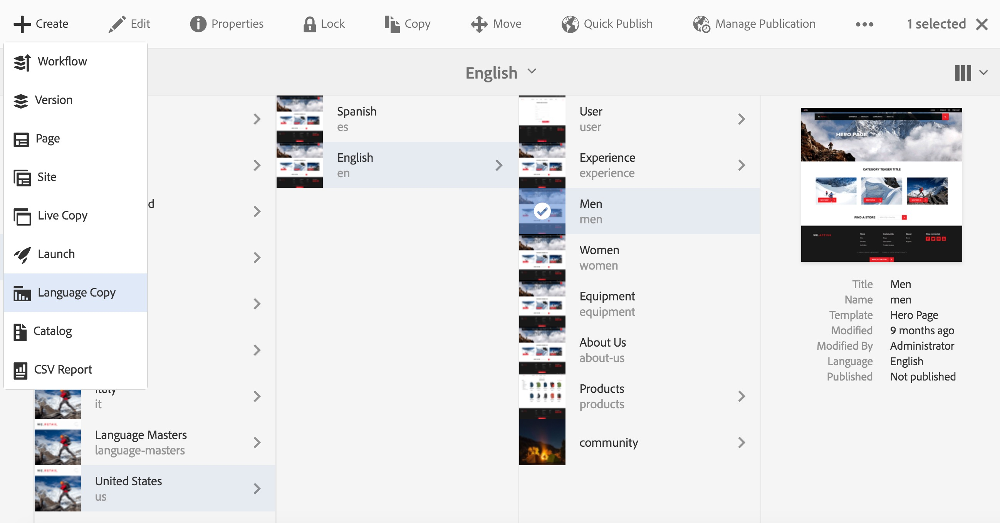

# Asistente para copia de idioma{#language-copy-wizard}

>[!CAUTION]
>
>AEM 6.4 ha llegado al final de la compatibilidad ampliada y esta documentación ya no se actualiza. Para obtener más información, consulte nuestra [períodos de asistencia técnica](https://helpx.adobe.com/es/support/programs/eol-matrix.html). Buscar las versiones compatibles [here](https://experienceleague.adobe.com/docs/).

El asistente de copia de idioma es una experiencia guiada para crear e instrumentar la estructura de contenido multilingüe. Ahora es mucho más sencillo y rápido crear una copia de idioma.

>[!NOTE]
>
>El usuario debe ser miembro del grupo de administradores de proyectos para crear la copia de idioma de un sitio.

Para acceder a este asistente:

1. En Sitios, seleccione una página y pulse o haga clic en Crear.

   

1. Seleccione Copia de idioma y se abrirá el asistente.

   

1. La variable **Seleccionar origen** paso del asistente le permite agregar o quitar páginas. También tiene la opción de incluir o excluir las subpáginas.

   

1. La variable **Siguiente** le lleva a la función **Configurar** del asistente. Aquí puede añadir o eliminar idiomas y seleccionar el método de traducción.

   

   >[!NOTE]
   >
   >De forma predeterminada, solo hay una configuración de traducción. Para poder seleccionar otra configuración, primero debe configurar las configuraciones de nube. Consulte [Configuración del marco de trabajo de integración de traducción](/help/sites-administering/tc-tic.md)

1. La variable **Siguiente** le lleva a la función **Traducir** del asistente. Aquí puede elegir entre crear solo la estructura, crear un nuevo proyecto de traducción o agregar a un proyecto de traducción existente.

   >[!NOTE]
   >
   >Si ha seleccionado varios idiomas en el paso anterior, se crearán varios proyectos de traducción.

   

1. El botón **Crear** finaliza el asistente.

   
