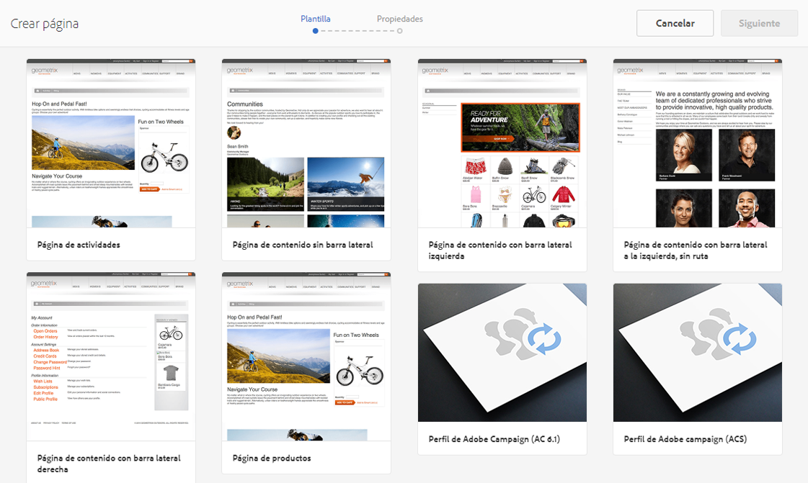
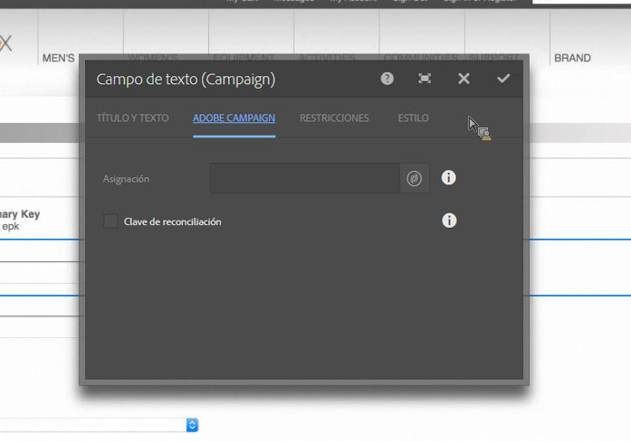

# Creación de Adobe Campaign Forms en AEM {#creating-adobe-campaign-forms-in-aem}

>[!CAUTION]
>
>AEM 6.4 ha llegado al final de la compatibilidad ampliada y esta documentación ya no se actualiza. Para obtener más información, consulte nuestra [períodos de asistencia técnica](https://helpx.adobe.com/es/support/programs/eol-matrix.html). Buscar las versiones compatibles [here](https://experienceleague.adobe.com/docs/).

AEM permite crear y utilizar formularios que interactúan con Adobe Campaign en el sitio web. Se pueden insertar campos específicos en los formularios y asignarlos a la base de datos de Adobe Campaign.

Puede administrar nuevas suscripciones de contacto, bajas de suscripción y datos de perfil de usuario, todo mientras integra sus datos en la base de datos de Adobe Campaign.

Para utilizar Adobe Campaign forms en AEM, debe seguir estos pasos, descritos en este documento:

1. Haga que una plantilla esté disponible.
1. Cree un formulario.
1. Edite el contenido del formulario.

Hay tres tipos de formularios disponibles de forma predeterminada, específicos de Adobe Campaign:

* Guardar un perfil
* Suscripción a un servicio
* Cancelar suscripción a un servicio

Estos formularios definen un parámetro de URL que acepta la clave principal cifrada de un perfil de Adobe Campaign. En función de este parámetro de URL, el formulario actualiza los datos del perfil de Adobe Campaign asociado.

Aunque cree estos formularios de forma independiente, en un caso de uso típico, genere un vínculo personalizado a una página de formulario dentro del contenido del boletín, de modo que los destinatarios puedan abrir el vínculo y realizar ajustes en sus datos de perfil (ya sea cancelar la suscripción, suscribirse o actualizar su perfil).

El formulario se actualiza automáticamente en función del usuario. Consulte [Edición del contenido del formulario](#editing-form-content) para obtener más información.

## Disponibilidad de una plantilla {#making-a-template-available}

Antes de poder crear formularios específicos de Adobe Campaign, debe estar disponible en la aplicación AEM.

Para ello, consulte la [Documentación de plantillas](/help/sites-developing/templates.md#template-availability).

## Creación de un formulario {#creating-a-form}

En primer lugar, compruebe la conexión entre las instancias de autor y publicación y que Adobe Campaign funciona. Consulte [Integración con Adobe Campaign Standard](/help/sites-administering/campaignstandard.md) o [Integración con Adobe Campaign Classic](/help/sites-administering/campaignonpremise.md).

>[!NOTE]
>
>Asegúrese de que la variable **acMapping** en la **jcr:content** el nodo está configurado en **mapRecipient** o **perfil** al usar Adobe Campaign Classic o Adobe Campaign Standard, respectivamente

1. En AEM, en Sitios, vaya a donde desee crear una nueva página.
1. Cree una página y seleccione **Perfil de Adobe Campaign Classic** o **Perfil de Adobe Campaign Standard** y haga clic en **Siguiente**.

   

   >[!NOTE]
   >
   >Si la plantilla deseada no está disponible, consulte [Disponibilidad de plantillas](/help/sites-developing/templates.md#template-availability).

1. En el **Nombre** , añada el nombre de la página. Debe ser un nombre JCR válido.
1. En el **Título** , introduzca un título y haga clic en **Crear**.
1. Abra la página y seleccione **Abrir propiedades** y en los Cloud Services añada la configuración de Adobe Campaign y seleccione la marca de verificación para guardar los cambios.

   

1. En la página , en la **Inicio del formulario** , seleccione el tipo de formulario que es - **Suscribirse, cancelar suscripción,** o **Guardar perfil**. Solo se puede tener un tipo por formulario. Ahora puede [editar el contenido del formulario](#editing-form-content).

## Edición del contenido del formulario {#editing-form-content}

Forms dedicado a Adobe Campaign tiene componentes específicos. Estos componentes tienen una opción para permitirle vincular cada campo del formulario a un campo de la base de datos de Adobe Campaign.

>[!NOTE]
>
>Si la plantilla deseada no está disponible, consulte [Disponibilidad de una plantilla](/help/sites-authoring/adobe-campaign.md).

Esta sección solo detalla los vínculos específicos a Adobe Campaign. Para obtener más información sobre cómo utilizar los formularios en Adobe Experience Manager, consulte [Componentes de Editmode](/help/sites-authoring/default-components-foundation.md).

1. Select **Abrir propiedades** y en los Cloud Services añada la configuración de Adobe Campaign y seleccione la marca de verificación para guardar los cambios.

   

1. En la página , en la **Inicio del formulario** , haga clic en el icono Configuración .

   

1. Haga clic en el **Avanzadas** y seleccione el tipo de formulario que es - **Suscribirse, cancelar suscripción,** o **Guardar perfil** y haga clic en **OK.** Solo se puede tener un tipo por formulario.

   * **Adobe Campaign: Guardar perfil**: permite crear o actualizar un destinatario en Adobe Campaign (valor predeterminado).
   * **Adobe Campaign: Suscripción a servicios**: permite administrar las suscripciones de un destinatario en Adobe Campaign.
   * **Adobe Campaign: Cancelar suscripción a los servicios**: permite cancelar las suscripciones de un destinatario en Adobe Campaign.

1. Debe tener un **Clave principal cifrada** en cada formulario. Este componente define qué parámetro de URL se utilizará para aceptar la clave principal cifrada de un perfil de Adobe Campaign. En Componentes, seleccione Adobe Campaign para que solo esos componentes estén visibles.
1. Arrastre el componente **Clave principal cifrada** al formulario (en cualquier lugar) y toque o haga clic en el **Configuración** icono. En el **Adobe Campaign** , especifique el nombre del parámetro de URL. Toque o haga clic en la marca de verificación para guardar los cambios.

   Los vínculos generados a este formulario deben utilizar este parámetro de URL y asignarle la clave principal cifrada de un perfil de Adobe Campaign. La clave principal cifrada debe estar correctamente codificada en la dirección URL (porcentaje).

   

1. Agregue componentes al formulario según sea necesario, como un campo de texto, un campo de fecha, un campo de casilla de verificación, un campo de opción, etc. Consulte [Componentes de formulario de Adobe Campaign](/help/sites-authoring/adobe-campaign-components.md) para obtener más información sobre cada componente.
1. Haga clic en el icono Configuración para abrir el componente. Por ejemplo, en **Campo de texto (Campaign)** , cambie el título y el texto.

   Haga clic en **Adobe Campaign** para asignar el campo de formulario a una variable de metadatos de Adobe Campaign. Al enviar el formulario, el campo asignado se actualiza en Adobe Campaign. Solo los campos con tipos coincidentes están disponibles en el selector de variables (por ejemplo, las variables de cadena para los campos de texto).

   

   >[!NOTE]
   >
   >Puede añadir o eliminar los campos que se muestran en la tabla de destinatarios siguiendo las instrucciones que se indican a continuación: [https://blogs.adobe.com/experiencedelivers/experience-management/aem-campaign-integration/](https://blogs.adobe.com/experiencedelivers/experience-management/aem-campaign-integration/)

1. Haga clic en **Publicar página**. La página se activa en el sitio. Puede verlo en la instancia de publicación de AEM. También puede [probar un formulario](#testing-a-form).

   >[!CAUTION]
   >
   >Debe proporcionar permisos de lectura al usuario anónimo del servicio de nube para utilizar formularios en la publicación. Sin embargo, tenga en cuenta los posibles problemas de seguridad al proporcionar permisos de lectura al usuario anónimo y asegúrese de mitigarlos, por ejemplo, configurando el despachante.

## Prueba de un formulario {#testing-a-form}

Después de crear un formulario y editar su contenido, es posible que desee probar manualmente que el formulario funciona como se espera.

>[!NOTE]
>
>Debe tener un **Clave principal cifrada** en cada formulario. En Componentes, seleccione Adobe Campaign para que solo esos componentes estén visibles.
>
>Aunque en este procedimiento introduce el número de EPK manualmente, en la práctica, los usuarios recibirán un vínculo a esta página (ya sea para cancelar la suscripción, suscribirse o actualizar su perfil) dentro de un boletín informativo. En función del usuario, la EPK se actualiza automáticamente.
>
>Para crear ese vínculo, utilice la variable **Identificador del recurso principal**(Adobe Campaign Standard) o **Identificador cifrado** (Adobe Campaign Classic) (por ejemplo, en un **Texto y personalización (Campaign)** ), que se vincula a la EPK en Adobe Campaign.

Para ello, debe obtener manualmente la EPK de un perfil de Adobe Campaign y añadirlo a la URL:

1. Para obtener la clave principal cifrada (EPK) de un perfil de Adobe Campaign:

   * En Adobe Campaign Standard: Vaya a **Perfiles y audiencias** > **Perfiles**, que enumera los perfiles existentes. Asegúrese de que la tabla muestra la variable **Identificador de recurso principal** campo en una columna (esto puede configurarse tocando o haciendo clic en **Configurar lista**). Copie el identificador del recurso principal del perfil deseado.
   * En Adobe Campaign Classic, vaya a **Perfiles y objetivos** >  **Destinatarios**, que enumera los perfiles existentes. Asegúrese de que la tabla muestra la variable **Identificador cifrado** en una columna (esto se puede configurar haciendo clic con el botón derecho en una entrada y seleccionando **Configurar lista...**). Copie el identificador cifrado del perfil deseado.

1. En AEM, abra la página del formulario en la instancia de publicación y añada la EPK del paso 1 como parámetro de URL: utilice el mismo nombre que definió anteriormente en el componente EPK al crear el formulario (por ejemplo: `?epk=...`)
1. El formulario ahora se puede utilizar para modificar los datos y las suscripciones asociados al perfil de Adobe Campaign vinculado. Después de modificar algunos campos y enviar el formulario, puede comprobar dentro de Adobe Campaign que se han actualizado los datos adecuados.

Los datos de la base de datos de Adobe Campaign se actualizan una vez que se valida un formulario.
