# Herramientas y entorno de creación{#authoring-the-environment-and-tools}

El entorno de creación AEM ofrece varios mecanismos para organizar y editar el contenido. Se puede acceder a las herramientas desde varios editores de páginas y distintas consolas.

## Administración del sitio {#managing-your-site}

La consola **Sitios** le permite desplazarse por su sitio web y administrarlo mediante la barra de encabezado, la barra de herramientas, los iconos de acción (aplicables al recurso seleccionado), las rutas de exploración y, si se seleccionan, los carriles secundarios (por ejemplo, referencias y línea de tiempo).

Por ejemplo, la vista de tarjeta: 

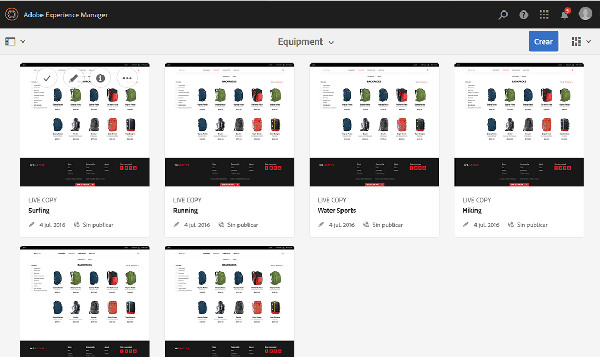

## Editar el contenido de una página {#editing-page-content}

Puede editar una página con el editor. Por ejemplo:

`http://localhost:4502/editor.html/content/we-retail/us/en/equipment.html`

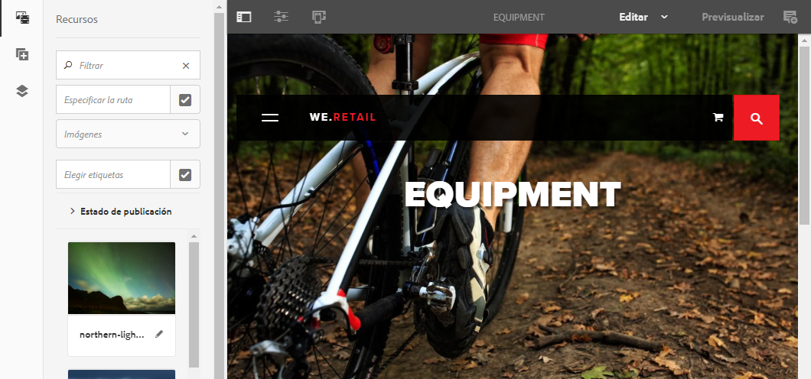

>[!NOTE]
>
>La primera vez que abra una página para editarla, aparecerá una serie de diapositivas donde se verán las funciones.
>
>Si lo desea, puede omitir la visita y repetirla cuando le convenga seleccionando una opción del menú **Información de página**.

## Acceso a la Ayuda {#accessing-help}

Al editar una página, se puede acceder a la **Ayuda** desde los siguientes puntos:

* El selector [**Información de página **](/help/sites-authoring/editing-page-properties.md#page-properties)mostrará las diapositivas introductorias (tal y como se muestran la primera vez que se accede al editor).
* El cuadro de diálogo [Configuración](/help/sites-authoring/editing-content.md#edit-configure-copy-cut-delete-paste) de componentes específicos (utilizando el icono ? de la barra de herramientas del cuadro de diálogo); se mostrará ayuda contextual.

Encontrará [más recursos relacionados con la ayuda en las consolas](/help/sites-authoring/basic-handling.md#accessing-help).

## Navegador de componentes   {#components-browser}

El navegador de componentes muestra todos los componentes que se pueden utilizar en la página actual. Se pueden arrastrar a la ubicación apropiada y editarse para añadir contenido.

El navegador de componentes es una pestaña del panel lateral (junto con el [explorador de recursos](/help/sites-authoring/author-environment-tools.md#assets-browser) y el [árbol de contenido](/help/sites-authoring/author-environment-tools.md#content-tree)). Para abrir (o cerrar) el panel lateral, utilice el icono de la parte superior izquierda de la barra de herramientas:

Cuando abra el panel lateral, se deslizará para abrirse de izquierda a derecha (seleccione la pestaña **Componentes** si es necesario). Cuando se abra, podrá navegar por todos los componentes disponibles para su página.

El aspecto y el control dependerán del tipo de dispositivo que esté utilizando:

>[!NOTE]
>
>Se detectará un dispositivo móvil si la anchura es inferior a 1024 píxeles. Esto puede ser también una ventana de escritorio pequeña.

* **Dispositivo móvil (por ejemplo, un iPad)**

   El navegador de componentes cubre completamente la página que se está editando.

   Para agregar componentes a la página, mantenga pulsado el componente requerido y muévalo hacia la derecha (el navegador de componentes se cerrará para volver a mostrar la página), donde puede colocar el componente.

   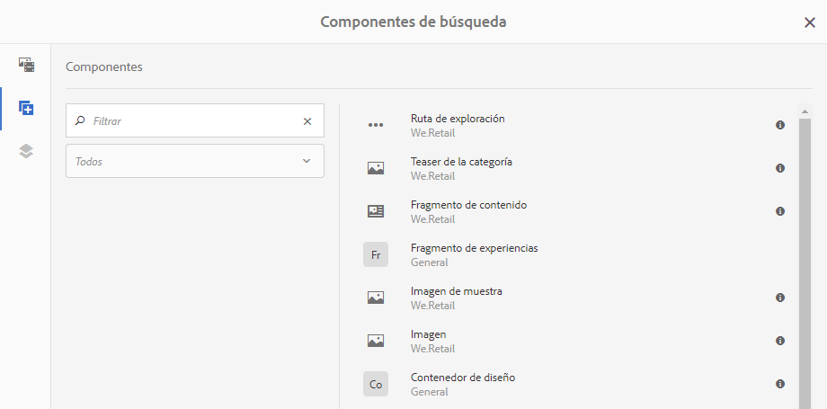

* **Dispositivo de escritorio**

   El navegador de componentes se abre en el lado izquierdo de la ventana.

   Para añadir un componente a la página, haga clic en el componente requerido y arrástrelo a la ubicación que desee.

   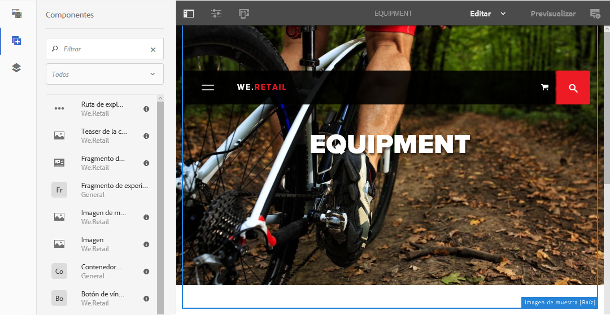

   Los componentes se representan mediante los siguientes elementos:

   * Nombre del componente
   * Grupo de componentes (en gris)
   * Icono o abreviatura

      * Los iconos de componentes estándar son monocromo.
      * Las abreviaturas siempre están formadas por los dos primeros caracteres del nombre del componente.

   Desde la barra de herramientas superior del explorador de componentes, puede realizar las siguientes acciones:

   * Filtrar componentes por su nombre.
   * Restringir la visualización a un grupo específico mediante la selección desplegable.

   Para obtener una descripción más detallada del componente, puede hacer clic o pulsar el icono de información situado junto al componente en el navegador de componentes (si está disponible).

   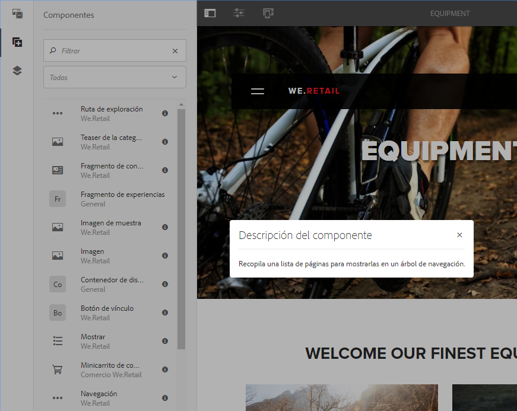

   Para obtener más información sobre los componentes disponibles, consulte la [Consola de componentes](/help/sites-authoring/default-components-console.md).

## Navegador de recursos {#assets-browser}

El navegador de recursos muestra todos los recursos que se pueden utilizar directamente en la página actual.

El navegador de recursos es una ficha del panel lateral que está situada junto al [explorador de componentes](/help/sites-authoring/author-environment-tools.md#components-browser) y al [árbol de contenido](/help/sites-authoring/author-environment-tools.md#content-tree). Para abrir o cerrar el panel lateral, utilice el icono de la parte superior izquierda de la barra de herramientas:

Cuando abra el panel lateral, se deslizará para abrirse de izquierda a derecha. Seleccione la pestaña **Recursos** si es necesario.

Cuando el navegador de recursos esté abierto, podrá explorar todos los recursos disponibles para la página. Si es necesario, puede utilizarse el desplazamiento indefinido para ampliar la lista.

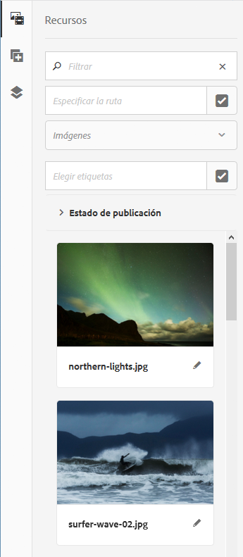

Para añadir un recurso a la página, selecciónelo y arrástrelo a la ubicación deseada, que puede ser:

* Un componente existente del tipo adecuado.

   * Por ejemplo, puede arrastrar un recurso de tipo imagen hacia un componente de imagen.

* Un [marcador de posición](/help/sites-authoring/editing-content.md#component-placeholder) en el sistema de párrafos para crear un componente nuevo del tipo correspondiente.

   * Por ejemplo, puede arrastrar un recurso de tipo imagen al sistema de párrafos para crear un componente Imagen.

>[!NOTE]
>
>Esta opción está disponible para determinados recursos y tipos de componente. Consulte [Inserción de un componente con el navegador de recursos](/help/sites-authoring/editing-content.md#inserting-a-component-using-the-assets-browser) para obtener más información detallada.

Desde la barra de herramientas superior del navegador de recursos puede filtrar los recursos por:

* Nombre
* Ruta
* Tipo de recurso, por ejemplo imágenes, manuscritos, documentos, vídeos, páginas, párrafos y productos
* Características del recurso, como Orientación (vertical, horizontal, cuadrada) y Estilo (color, monocromo, escala de grises)

   * Disponible solo para determinados tipos de recursos

El aspecto y el control dependerán del tipo de dispositivo que esté utilizando:

>[!NOTE]
>
>Se detectará un dispositivo móvil cuando la anchura sea menor a 1024 píxeles; es decir, también cuando la ventana de escritorio sea pequeña.

* **Dispositivo móvil, como un iPad**

   El navegador de recursos cubre totalmente la página que se esté editando.

   Para añadir un recurso a la página mantenga pulsado el recurso requerido y muévalo a la derecha; el navegador de recursos se cerrará para volver a mostrar la página, donde puede agregar el recurso al componente deseado.

   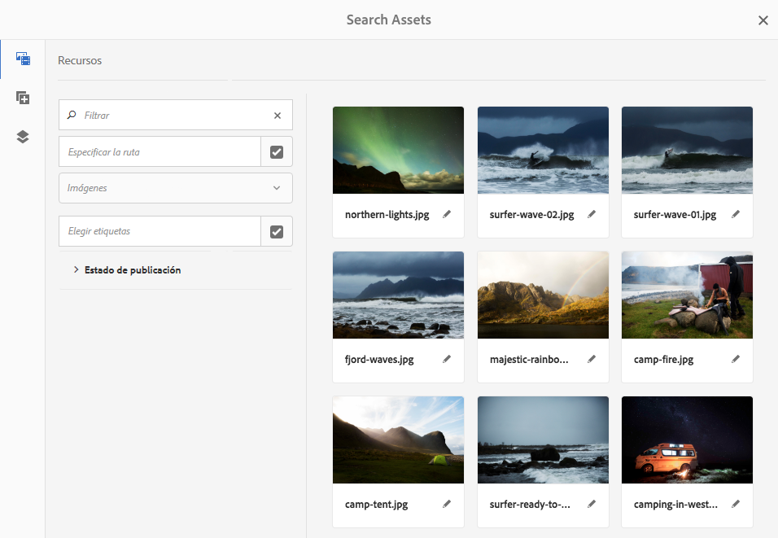

* **Dispositivo de escritorio**

   El navegador de recursos se abre en la parte izquierda de la ventana.

   Para añadir un recurso a la página, haga clic en el recurso en cuestión y arrástrelo al componente o a la ubicación correspondiente.

   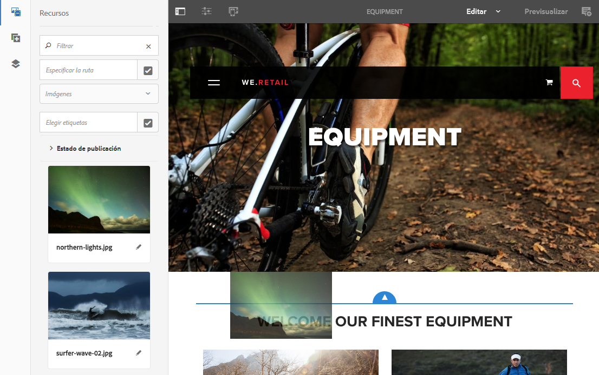

Si necesita realizar rápidamente un cambio en un recurso, puede iniciar el [editor de recursos](/help/assets/managing-assets-touch-ui.md) directamente desde el explorador de recursos haciendo clic en el icono de edición que se muestra al lado del nombre del recurso.

## Árbol de contenido {#content-tree}

El **árbol de contenido** proporciona información general de todos los componentes de la página formando una jerarquía para que pueda ver a simple vista cómo está compuesta la página.

El árbol de contenido es una pestaña del panel lateral (junto con el explorador de recursos y componentes). Para abrir (o cerrar) el panel lateral, utilice el icono de la parte superior izquierda de la barra de herramientas:

Cuando abra el panel lateral, se deslizará para abrirse (de izquierda a derecha). Seleccione la pestaña **Árbol de contenido** si es necesario. Cuando la abra, podrá ver una representación en forma de árbol de la página o la plantilla, para que resulte más fácil de entender cómo está estructurado jerárquicamente su contenido. Además, en una página compleja, hace que sea más fácil saltar de un componente de página a otro.

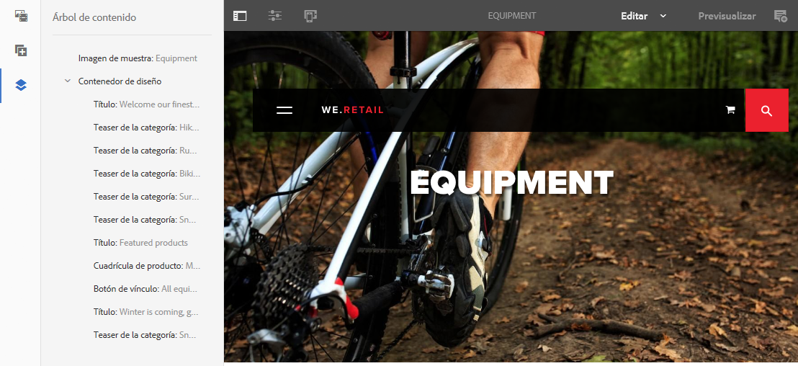

Una página puede fácilmente estar compuesta por muchos componentes del mismo tipo, por lo que el árbol de componentes muestra un texto descriptivo (en gris) después del nombre del tipo de componente (en negro). El texto descriptivo viene de las propiedades comunes del componente, como el título o el texto.

Los tipos de componente se mostrarán en el idioma del usuario, mientras que el texto con la descripción del componente se muestra en el idioma de la página.

Al hacer clic en el elemento situado junto a un componente, se contraerá o desplegará dicho nivel.

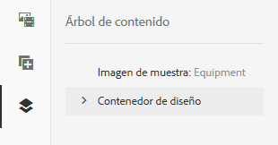

Si hace clic en el componente, se resaltará el componente del editor de páginas.

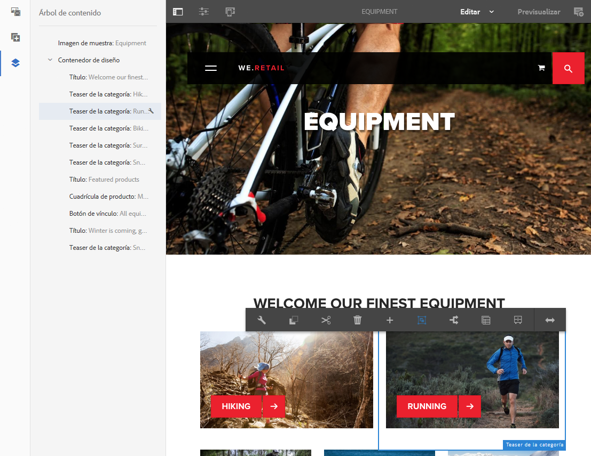

Si el componente en el que se hace clic en el árbol es editable, aparecerá un icono de una llave inglesa a la derecha del nombre. Al hacer clic en este icono, se iniciará directamente el cuadro de diálogo Editar del componente.

>[!NOTE]
>
>Si edita una página en un dispositivo móvil, el árbol de contenido no está disponible (si el valor de la anchura del explorador es inferior a 1024 píxeles).

## Fragmentos: navegador de contenido asociado {#fragments-associated-content-browser}

Si la página contiene fragmentos de contenido, también podrá acceder al [navegador de contenido asociado](/help/sites-authoring/content-fragments.md#using-associated-content). 

## Referencias {#references}

**Referencias** muestra las conexiones a la página seleccionada:

* Planes
* Lanzamientos
* Live Copies
* Copias de idioma
* Uso del componente de referencia
* Referencias a páginas de producto (desde la consola Comercio - Productos)

Abra la consola en cuestión, desplácese hasta el recurso y abra **Referencias** con el procedimiento siguiente:

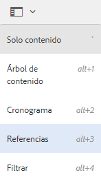

[Seleccione el recurso necesario](/help/sites-authoring/basic-handling.md#viewing-and-selecting-resources) para mostrar una lista de tipos de datos relevantes para ese recurso:

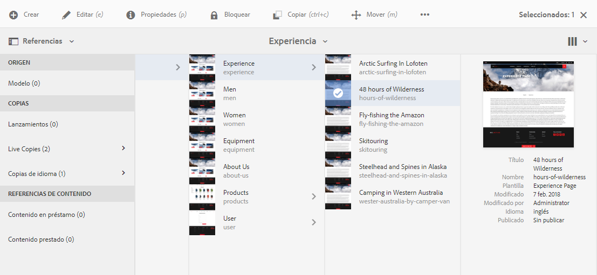

Seleccione el tipo de referencia apropiado para obtener más información. En determinadas situaciones, hay disponibles acciones adicionales al seleccionar una referencia específica, como:

* Instancias del componente de referencia (p. ej. navegar a la página de referencia o referenciada)
* [Referencias a páginas de producto](/help/sites-administering/generic.md#showing-product-references) (disponibles desde la consola Comercio - Productos)
* [Lanzamientos](/help/sites-authoring/launches.md)
* Live Copies muestra las rutas de todas las Live Copies que se basan en el recurso seleccionado.
* [Modelo](/help/sites-administering/msm-best-practices.md)
* [Copias de idioma](/help/sites-administering/tc-manage.md#creating-translation-projects-using-the-references-panel)

Por ejemplo, puede corregir una referencia interrumpida en un componente de referencia:

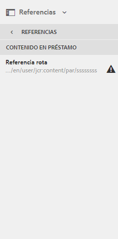

## Eventos: línea de tiempo {#events-timeline}

Para obtener los recursos adecuados (p. ej. páginas de la consola **Sitios** o recursos de la consola **Recursos**) se puede utilizar la [cronología para mostrar la actividad reciente de cualquier elemento seleccionado](/help/sites-authoring/basic-handling.md#timeline).

Abra la consola en cuestión, desplácese hasta el recurso y abra **Cronología** con el procedimiento siguiente:

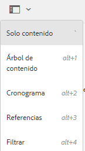

[Seleccione el recurso en cuestión](/help/sites-authoring/basic-handling.md#viewing-and-selecting-resources) mediante **Mostrar todo** o **Actividades** para enumerar las acciones recientes en los recursos seleccionados:

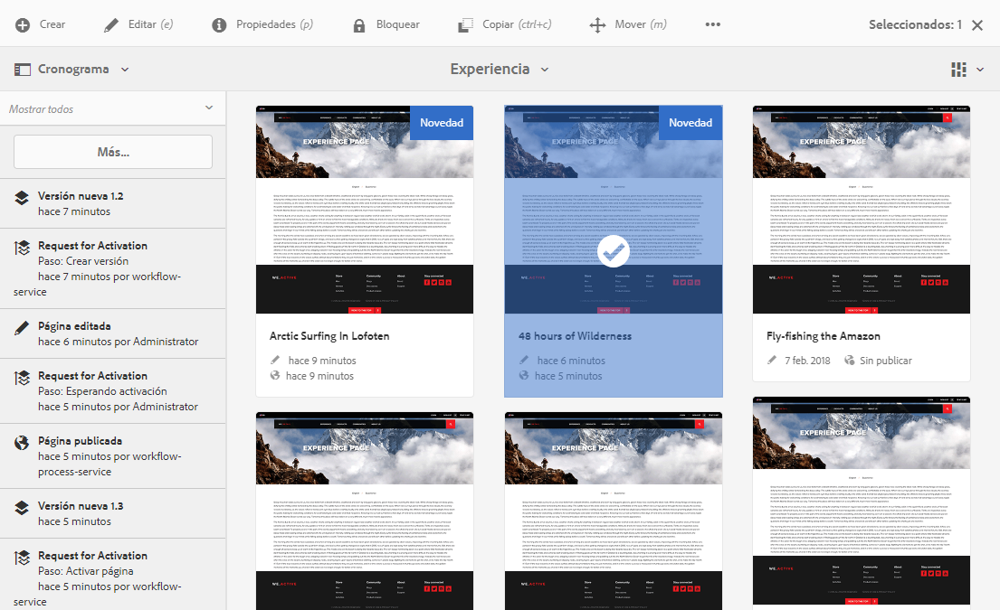

## Información de la página {#page-information}

La Información de página (icono de ecualizador) abre un menú que también muestra detalles de la última edición y la última publicación. En función de las características de la página (y del sitio), habrá más o menos opciones disponibles:

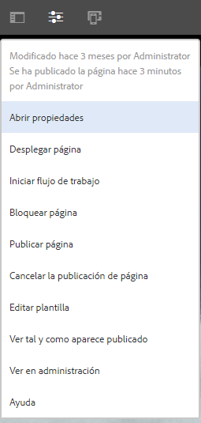

* [Abrir propiedades](/help/sites-authoring/editing-page-properties.md)
* [Desplegar página](/help/sites-administering/msm.md#msm-from-the-ui)
* [Iniciar flujo de trabajo](/help/sites-authoring/workflows-applying.md#starting-a-workflow-from-the-page-editor)
* [Bloquear página](/help/sites-authoring/editing-content.md#locking-a-page)
* [Publicar página](/help/sites-authoring/publishing-pages.md#publishing-pages)
* [Cancelar la publicación de página](/help/sites-authoring/publishing-pages.md#unpublishing-pages)
* [Ver tal y como aparece publicado](/help/sites-authoring/editing-content.md#view-as-published)
* [Ver en administración](/help/sites-authoring/basic-handling.md#viewing-and-selecting-resources)
* [Ayuda](/help/sites-authoring/basic-handling.md#accessing-help)

Por ejemplo, cuando corresponda, **Información de página** también dispone de las opciones siguientes:

* [Promocionar lanzamiento](/help/sites-authoring/launches-promoting.md) si la página es nueva.
* [Editar plantilla](/help/sites-authoring/templates.md) si la página está basada en una plantilla [editable](/help/sites-authoring/templates.md#editable-and-static-templates)

* [Abrir en la IU](/help/sites-authoring/select-ui.md#switching-to-classic-ui-when-editing-a-page) clásica si un administrador ha [habilitado estas opciones](/help/sites-administering/enable-classic-ui-editor.md)

Además, **Información de página** puede proporcionar acceso a análisis y recomendaciones cuando es necesario.

## Modos de página   {#page-modes}

Al editar una página, existen modos que permiten acciones diferentes:

* [Editar](/help/sites-authoring/editing-content.md): el modo que se debe emplear al editar el contenido de la página.
* [Diseño](/help/sites-authoring/responsive-layout.md): permite crear y editar su diseño interactivo en función del dispositivo (si la página está basada en un contenedor de diseños).

* [Andamiaje](/help/sites-authoring/scaffolding.md): le ayuda a crear un conjunto grande de páginas que comparten la misma estructura, pero tienen contenido diferente.
* [Desarrollador](/help/sites-developing/developer-mode.md): le permite llevar a cabo distintas acciones (se necesitan privilegios), como inspeccionar los detalles técnicos de una página y sus componentes.

* [Diseño](/help/sites-authoring/default-components-designmode.md): le permite activar o desactivar componentes con el fin de utilizarlos en una página y configurar el diseño del componente (si la página está basada en una [plantilla estática](/help/sites-authoring/templates.md#editable-and-static-templates)).

* [Segmentación:](/help/sites-authoring/content-targeting-touch.md) aumente la relevancia del contenido mediante la segmentación y efectuando mediciones en todos los canales.
* [Mapa de actividad](/help/sites-authoring/pa-using.md): muestra los datos de Analytics para la página.

* [Deformación de tiempo](/help/sites-authoring/working-with-page-versions.md#timewarp): le permite ver el estado de las páginas en un punto específico en el tiempo.
* [Estado de Live Copy](/help/sites-authoring/editing-content.md#live-copy-status): le permite echar un vistazo al estado de la Live Copy y ver los componentes que se han heredado o no.
* [Vista previa](/help/sites-authoring/editing-content.md#previewing-pages): se utiliza para ver la página tal como se mostrará en el entorno de publicación; o para navegar mediante vínculos en el contenido. 

* [Anotar:](/help/sites-authoring/annotations.md) se utiliza para añadir o ver anotaciones en la página.

Puede acceder a estas opciones a través de los iconos de la esquina superior derecha; el icono cambiará para reflejar el modo que esté utilizando:

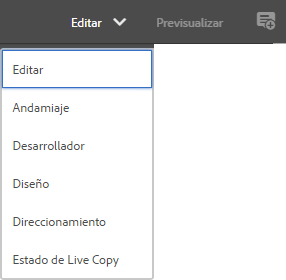

>[!NOTE]
>
>* En función de las características de la página, es posible que algunos modos no estén disponibles.
>* El acceso a algunos modos requiere los permisos/privilegios correspondientes.
>* El modo de desarrollador no está disponible en dispositivos móviles debido a limitaciones de espacio.
>* Existe un [atajo de teclado](/help/sites-authoring/page-authoring-keyboard-shortcuts.md) (`Ctrl-Shift-M`) para alternar entre **Vista previa** y el modo seleccionado actualmente (p. ej. **Editar**, **Diseño**, etc.).

>

## Selección de la ruta {#path-selection}

A menudo, durante la creación, es necesario seleccionar otro recurso, como cuando se define un vínculo a otra página o recurso o bien cuando se selecciona una imagen. Para poder seleccionar una ruta con facilidad, los [campos de rutas](/help/sites-authoring/author-environment-tools.md#path-fields) ofrecen la opción de completado automático y el [navegador de rutas](/help/sites-authoring/author-environment-tools.md#path-browser) permite una selección más sólida.

### Campos de rutas   {#path-fields}

El ejemplo que se utiliza aquí a modo de ilustración se corresponde con el componente de imagen. Para obtener más información sobre el uso y edición de componentes, consulte [Componentes para la creación de páginas](/help/sites-authoring/default-components.md).

Los campos de rutas disponen de las funciones de completado automático y de predicción de texto para que la localización de recursos resulte más sencilla. Simplemente, empiece a escribir en el campo de rutas, y AEM le ofrecerá rutas coincidentes a medida que vaya escribiendo.

Al hacer clic en el botón **Abrir cuadro de diálogo de selección**, en el campo de rutas de acceso se abrirá el cuadro de diálogo del [navegador de rutas de acceso](/help/sites-authoring/author-environment-tools.md#path-browser), en el que dispondrá de opciones de selección más detalladas.

### Navegador de rutas {#path-browser}

El navegador de rutas está organizado como la [vista de columna](/help/sites-authoring/basic-handling.md#column-view) de la consola Sitios, lo que permite efectuar una selección más detallada de los recursos.

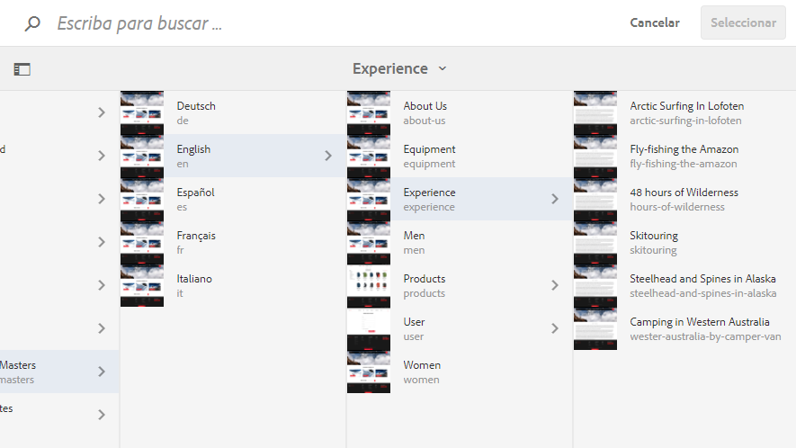

Una vez que se selecciona un recurso, el botón **Seleccionar** de la esquina superior derecha del cuadro de diálogo se activa. Toque o haga clic para confirmar la selección o en **Cancelar** para anular la operación.

Si el contexto permite la selección de varios recursos, al seleccionar un recurso también se activa el botón Seleccionar, pero también se agrega un recuento del número de recursos seleccionados a la esquina superior derecha de la ventana. Haga clic en la X junto al número para anular toda la selección.

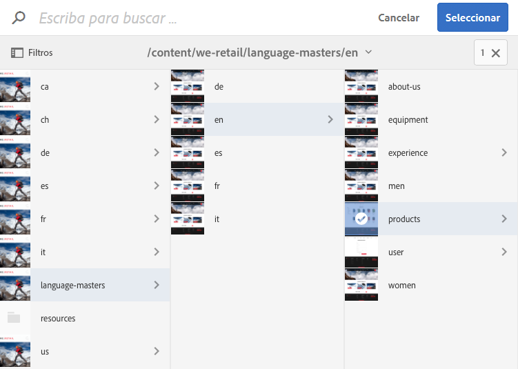

Las rutas de exploración se pueden usar para saltar rápidamente dentro de la jerarquía del recurso.

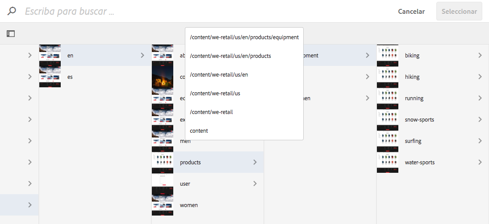

El campo de búsqueda situado en la parte superior del cuadro de diálogo se puede usar en cualquier momento.

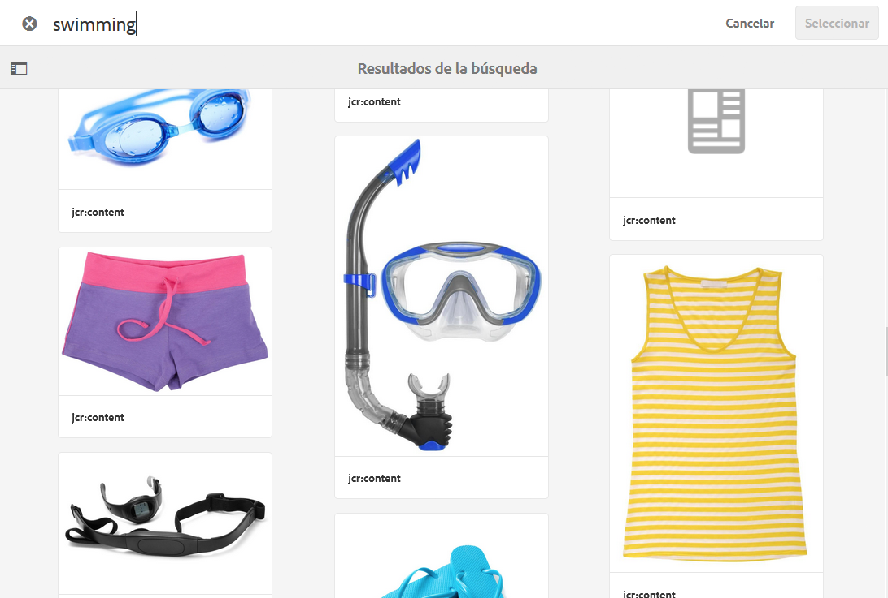

Haga clic en la X que aparece en el campo de búsqueda para borrar la búsqueda.

Para limitar la búsqueda, puede mostrar las opciones de filtro y filtrar los resultados en función de una ruta determinada.

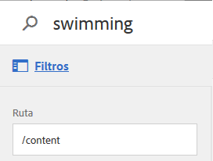

## Métodos abreviados del teclado {#keyboard-shortcuts}

Hay varios [métodos abreviados del teclado](/help/sites-authoring/page-authoring-keyboard-shortcuts.md) disponibles.
