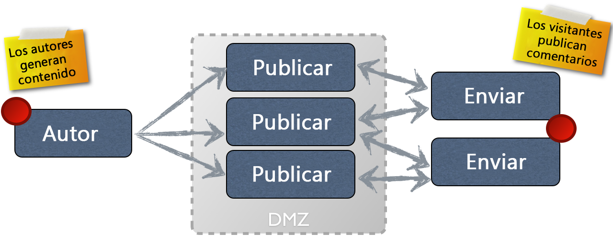

# Concepto de creación y publicación{#authoring}

>[!CAUTION]
>
>AEM 6.4 ha llegado al final de la compatibilidad ampliada y esta documentación ya no se actualiza. Para obtener más información, consulte nuestra [períodos de asistencia técnica](https://helpx.adobe.com/es/support/programs/eol-matrix.html). Buscar las versiones compatibles [here](https://experienceleague.adobe.com/docs/).

AEM proporciona dos entornos:

* Autor
* Publicación

Interactúan para permitirle que el contenido esté disponible en su sitio web, de modo que los visitantes puedan leerlo.

El entorno de creación ofrece mecanismos para crear, actualizar y revisar este contenido antes de publicarlo:

* Un autor crea y revisa el contenido (que puede ser de varios tipos; por ejemplo: páginas, recursos, publicaciones, etc.)
* que, en algún momento, se publicará en su sitio web.

En el entorno de creación, la funcionalidad de AEM está disponible a través de dos IU. Desde el entorno de publicación se diseña todo el aspecto y funcionamiento de la interfaz de usuario.

## Entorno de creación {#author-environment}

El creador trabaja en lo que se conoce como **[entorno de creación](/help/sites-authoring/home.md)**. Esto proporciona una interfaz fácil de usar (interfaz gráfica de usuario (GUI o IU)) para crear el contenido. Normalmente se encuentra detrás del cortafuegos de una empresa que proporciona protección completa y requiere que el autor inicie sesión con una cuenta a la que se le hayan asignado los derechos de acceso correspondientes.

>[!NOTE]
>
>Su cuenta necesita los derechos de acceso adecuados para crear, editar o publicar contenido.

Según la configuración de su instancia y sus derechos de acceso personales, puede realizar muchas tareas en el contenido, incluidas (entre otras):

* generar contenido nuevo o editar contenido existente en una página
* usar plantillas predefinidas para crear páginas de contenido nuevo
* crear, editar y administrar sus recursos y colecciones
* crear, editar y administrar sus publicaciones
* desarrollar sus campañas y los recursos relacionados
* desarrollar y administrar sitios de la comunidad
* mover, copiar o eliminar recursos, páginas de contenido, etc.
* publicar (o cancelar la publicación de) páginas, recursos, etc.

Asimismo, hay tareas administrativas que le ayudan a administrar su contenido:

* flujos de trabajo que controlan la administración de cambios; por ejemplo. aplicación de una revisión antes de la publicación
* proyectos que coordinan tareas individuales

>[!NOTE]
>
>AEM también [administrado](/help/sites-administering/home.md) (para una mayoría de tareas) del entorno de creación.

## Entorno de publicación {#publish-environment}

Cuando esté listo, el contenido del sitio AEM se publica en el **entorno de publicación**. Aquí las páginas del sitio web se ponen a disposición de la audiencia objetivo de acuerdo con la apariencia de la interfaz diseñada.

Normalmente, el entorno de publicación se encuentra dentro de la zona desmilitarizada; en otras palabras, disponible para Internet, pero ya no bajo la protección completa de la red interna.

Cuando el sitio AEM es un [sitio de la comunidad](/help/communities/overview.md)o incluye [Componentes de Communities](/help/communities/author-communities.md), los visitantes del sitio con sesión iniciada (los miembros) pueden interactuar con las funciones de Communities. Por ejemplo, pueden publicar en un foro, publicar un comentario o seguir a otros miembros. Se puede conceder a los miembros permiso para realizar actividades normalmente limitadas al entorno de creación, como crear nuevas páginas (grupos de la comunidad), artículos de blog y moderar publicaciones de otros miembros.

>[!NOTE]
>
>Lamentablemente, a veces la terminología utilizada se superpone. Esto puede suceder con:
>
>* **Publicar o cancelar la publicación**
   >  Estos son los términos principales de las acciones que harán que el contenido esté disponible o no para los visitantes en su entorno de publicación.
>
>* **Activar o desactivar**
   >  Estos términos son sinónimos de publicar y cancelar la publicación. Son más comunes en la IU clásica.
>
>* **Replicar o replicación**
   >  Son los términos técnicos utilizados para indicar el movimiento de datos (p. ej., contenido de la página, archivos, código, comentarios del usuario) de un entorno a otro; es decir, al publicar o replicar a la inversa los comentarios del usuario.
>

## Dispatcher {#dispatcher}

A fin de optimizar el rendimiento para los usuarios que visiten su sitio web, **[Dispatcher](https://helpx.adobe.com/experience-manager/dispatcher/user-guide.html) implementa almacenamiento en caché y equilibrio de carga.**
