# Trabajo con Adobe Campaign Classic y Adobe Campaign Standard{#working-with-adobe-campaign-classic-and-adobe-campaign-standard}

>[!CAUTION]
>
>AEM 6.4 ha llegado al final de la compatibilidad ampliada y esta documentación ya no se actualiza. Para obtener más información, consulte nuestra [períodos de asistencia técnica](https://helpx.adobe.com/es/support/programs/eol-matrix.html). Buscar las versiones compatibles [here](https://experienceleague.adobe.com/docs/).

Puede crear contenido de correo electrónico en AEM y procesarlo en los correos electrónicos de Adobe Campaign. Para ello, debe:

1. Cree una newsletter nueva en AEM a partir de una plantilla específica de Adobe Campaign.
1. Select [un servicio de Adobe Campaign](#selecting-the-adobe-campaign-cloud-service-and-template) antes de editar el contenido para acceder a todas las funciones.
1. Edite el contenido.
1. Valide el contenido.

A continuación, el contenido se puede sincronizar con un envío en Adobe Campaign. Las instrucciones detalladas se describen en este documento.

Consulte también [Creación de Adobe Campaign Forms en AEM](/help/sites-authoring/adobe-campaign-forms.md).

>[!NOTE]
>
>Antes de poder utilizar esta funcionalidad, debe configurar AEM para que se integre con [Adobe Campaign](/help/sites-administering/campaignonpremise.md) o [Adobe Campaign Standard](/help/sites-administering/campaignstandard.md).

## Envío de contenido de correo electrónico a través de Adobe Campaign {#sending-email-content-via-adobe-campaign}

Después de configurar AEM y Adobe Campaign, puede crear contenido de envío de correo electrónico directamente en AEM y luego procesarlo en Adobe Campaign.

Al crear contenido de Adobe Campaign en AEM, debe vincular a un servicio de Adobe Campaign antes de editar el contenido para acceder a todas las funciones.

Hay dos casos posibles:

* El contenido se puede sincronizar con un envío de Adobe Campaign. Esto le permite utilizar AEM contenido en una entrega.
* (Solo Adobe Campaign Classic) El contenido se puede enviar directamente a Adobe Campaign, que genera automáticamente un nuevo envío de correo electrónico. Este modo tiene limitaciones.

Las instrucciones detalladas se describen en este documento.

### Creación de nuevo contenido de correo electrónico {#creating-new-email-content}

>[!NOTE]
>
>Al añadir plantillas de correo electrónico, asegúrese de agregarlas en **/content/igns** para que estén disponibles.

#### Creación de nuevo contenido de correo electrónico {#creating-new-email-content-1}

1. En AEM seleccione **Sitios** then **Campañas** y luego busque dónde se administran las campañas de correo electrónico. En el ejemplo siguiente, la ruta es **Sitios** > **Campañas** > **Geometrixx Outdoors** > **Campañas de correo electrónico**.

   >[!NOTE]
   >
   >[Los ejemplos de correo electrónico solo están disponibles en Geometrixx](/help/sites-developing/we-retail.md). Descargue el contenido de muestra de Package Share.

   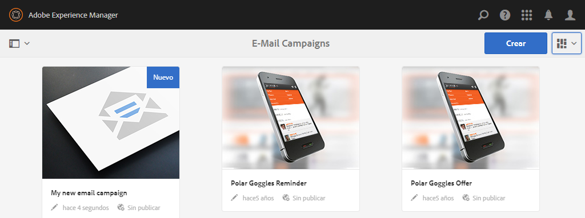

1. Select **Crear** then **Crear página**.
1. Seleccione una de las plantillas disponibles específicas a la que se está conectando Adobe Campaign y, a continuación, haga clic en **Siguiente**. Hay tres plantillas disponibles de forma predeterminada:

   * **Correo electrónico de Adobe Campaign Classic**: permite añadir contenido a una plantilla predefinida (dos columnas) antes de enviarlo a Adobe Campaign Classic para su envío.
   * **Correo electrónico de Adobe Campaign Standard**: permite añadir contenido a una plantilla predefinida (dos columnas) antes de enviarlo a Adobe Campaign Standard para su envío.

1. Complete la variable **Título** y, opcionalmente, la variable **Descripción** y haga clic en **Crear**. El título se utiliza como asunto del boletín o del correo electrónico, a menos que lo sobrescriba durante la edición del correo electrónico.

### Selección del servicio en la nube y la plantilla de Adobe Campaign {#selecting-the-adobe-campaign-cloud-service-and-template}

Para integrarse con Adobe Campaign, debe añadir un servicio de nube de Adobe Campaign a la página. Al hacerlo, tendrá acceso a la personalización y a otra información de Adobe Campaign.

Además, es posible que también necesite seleccionar la plantilla de Adobe Campaign y cambiar el asunto, así como añadir contenido de texto sin formato para los usuarios que no verán el correo electrónico en el HTML.

Puede seleccionar el servicio en la nube desde el **Sitios** o desde dentro del correo electrónico o la newsletter después de haberla creado.

Selección del servicio de nube desde el **Sitios** es el método recomendado. La selección del servicio de nube en el correo electrónico o la newsletter requiere una solución alternativa.

En el **Sitios** página:

1. En AEM seleccione la página de correo electrónico y haga clic en **Ver propiedades**.

   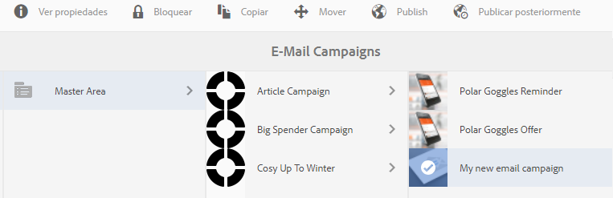

1. Select **Editar** y luego la variable **Servicios de nube** , desplácese hacia abajo hasta la parte inferior, haga clic en el signo + para añadir una configuración y, a continuación, seleccione **Adobe Campaign**.

   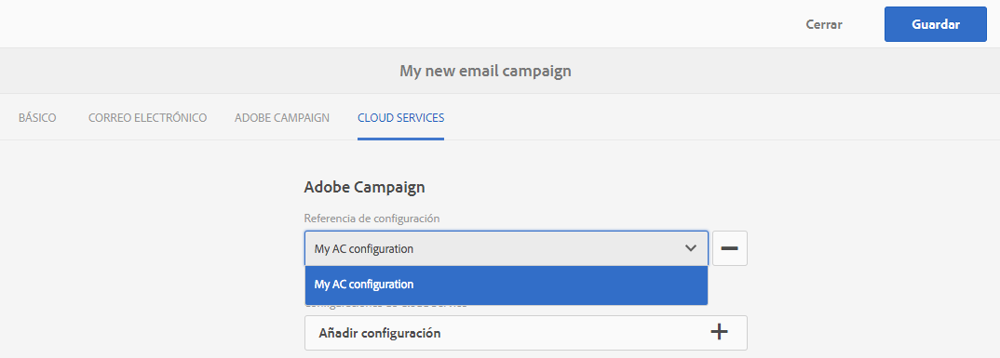

1. Seleccione la configuración que coincida con su instancia de Adobe Campaign en la lista desplegable y, a continuación, haga clic en para confirmar la acción. **Guardar**.
1. Puede ver la plantilla que el correo electrónico le ha aplicado haciendo clic en la pestaña** Adobe Campaign**. Si desea seleccionar otra plantilla, puede acceder a ella desde el correo electrónico mientras edita.

   Si desea aplicar una plantilla de envío de correo electrónico específica (de Adobe Campaign), que no sea la plantilla de correo predeterminada, en **Propiedades**, seleccione **Adobe Campaign** pestaña . Introduzca el nombre interno de la plantilla de envío de correo electrónico en la instancia de Adobe Campaign relacionada.

   La plantilla que seleccione determina qué campos de personalización están disponibles en Adobe Campaign.

   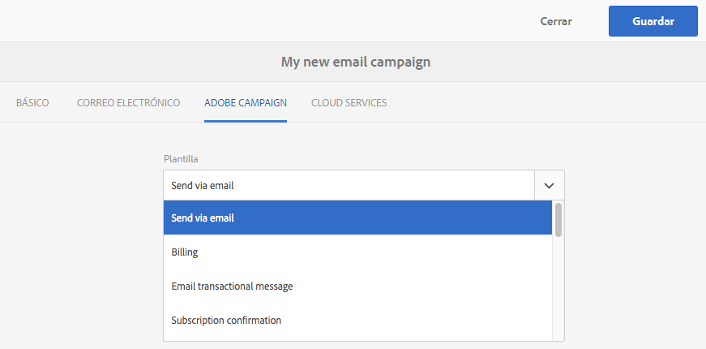

En la creación, es posible que no pueda seleccionar la configuración del servicio en la nube de Adobe Campaign desde la newsletter o el correo electrónico **Propiedades de página** debido a un problema de diseño. Puede utilizar la solución alternativa descrita aquí:

1. En AEM seleccione la página de correo electrónico y haga clic en **Editar**. Haga clic en **Abrir propiedades**.

   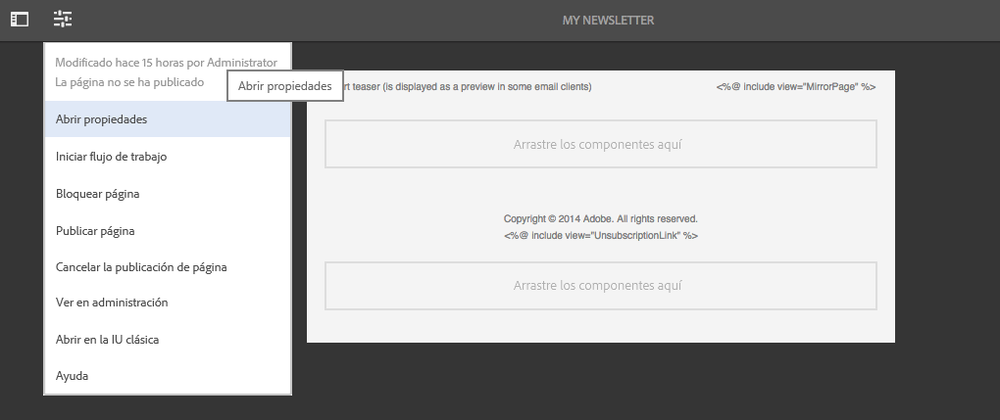

1. Select **Servicios de nube** y haga clic en **+** para agregar una configuración. Seleccione cualquier configuración visible (no importa cuál). Toque o haga clic en **+** firme para agregar otra configuración y, a continuación, seleccione **Adobe Campaign**.

   >[!NOTE]
   >
   >Como alternativa, puede seleccionar los servicios de nube seleccionando **Ver propiedades** en el **Sitios** pestaña .

1. Seleccione la configuración que coincida con su instancia de Adobe Campaign en la lista desplegable, elimine la primera configuración que creó que no fuera para Adobe Campaign y, a continuación, haga clic en la marca de verificación para confirmar.
1. Continúe con el paso 4 del procedimiento anterior para seleccionar plantillas y añadir texto sin formato.

### Edición del contenido de correo electrónico {#editing-email-content}

Para editar el contenido del correo electrónico:

1. Abra el correo electrónico y, de forma predeterminada, entrará en el modo de edición.

   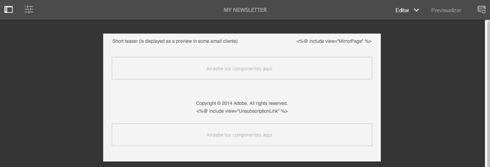

1. Si desea cambiar el asunto del correo electrónico o añadir texto sin formato para los usuarios que no verán el correo electrónico en el HTML, seleccione **Correo electrónico** y añada un asunto y texto. Seleccione el icono de página para generar automáticamente una versión de texto sin formato desde el HTML. Haga clic en la marca de verificación cuando termine.

   Puede personalizar la newsletter utilizando los campos de personalización de Adobe Campaign. Para añadir un campo de personalización, abra el selector de campo de personalización haciendo clic en el botón que muestra el logotipo de Adobe Campaign. A continuación, puede elegir entre todos los campos disponibles para esta newsletter.

   >[!NOTE]
   >
   >Si los campos de personalización de las propiedades desde el editor están atenuados, vuelva a examinar la configuración.

   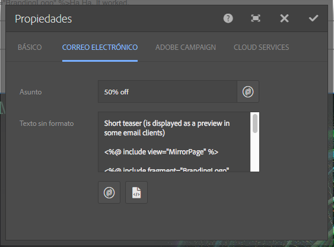

1. Abra el panel de componentes en la parte izquierda de la pantalla y seleccione **Newsletter de Adobe Campaign** en el menú desplegable para buscar esos componentes.

   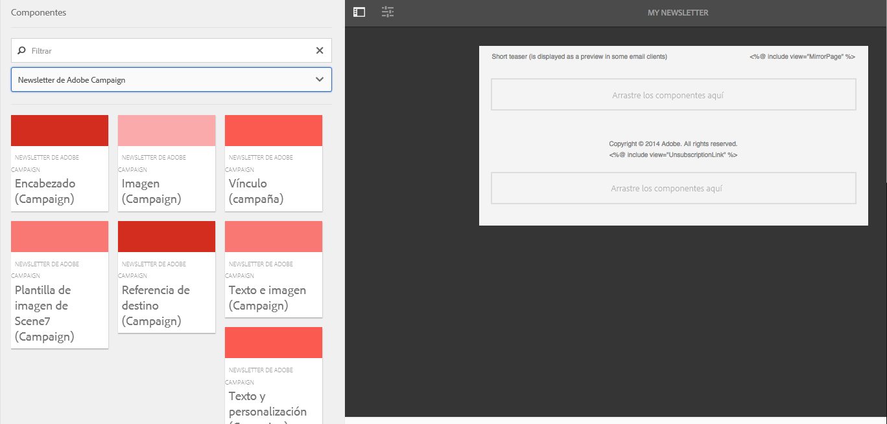

1. Arrastre los componentes directamente a la página y edítelos en consecuencia. Por ejemplo, puede arrastrar un **Texto y personalización (Campaign)** y añadir texto personalizado.

   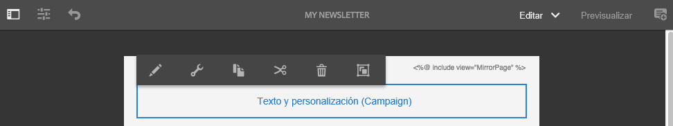

   Consulte [Componentes de Adobe Campaign](/help/sites-authoring/adobe-campaign-components.md) para obtener una descripción detallada de cada componente.

   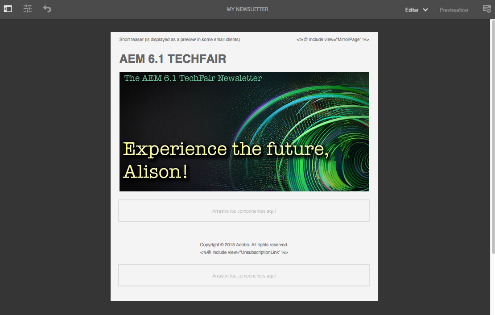

### Inserción de personalización {#inserting-personalization}

Al editar el contenido, puede insertar:

* Campos de contexto de Adobe Campaign. Son campos que puede insertar en el texto y que se adaptarán según los datos del destinatario (por ejemplo, nombre, apellido o cualquier dato de la dimensión de destino).
* Bloques personalizados de Adobe Campaign. Son bloques de contenido predefinido que no están relacionados con los datos del destinatario, como un logotipo de marca o un vínculo a una página espejo.

Consulte [Componentes de Adobe Campaign](/help/sites-authoring/adobe-campaign-components.md) para obtener una descripción completa de los componentes de Campaign.

>[!NOTE]
>
>* Solo los campos de Adobe Campaign **Perfiles** se tienen en cuenta las dimensiones de segmentación.
>* Al ver las propiedades desde **Sitios**, no tiene acceso a los campos de contexto de Adobe Campaign. Puede acceder a ellas directamente desde el correo electrónico mientras edita.
>

Para insertar personalización:

1. Insertar un nuevo **Newsletter** > **Texto y personalización (Campaign)** arrastrándolo a la página.

   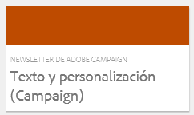

1. Abra el componente haciendo clic en el icono Lápiz . Se abre el editor in situ.

   

   >[!NOTE]
   >
   >**Para Adobe Campaign Standard:**
   >
   >* Los campos de contexto disponibles corresponden a la variable **Perfiles** dimensión de segmentación en Adobe Campaign.
   >* Consulte [Vinculación de una página AEM a un correo electrónico de Adobe Campaign](#linking-an-aem-page-to-an-adobe-campaign-email-adobe-campaign-standard).

   >
   >**Para Adobe Campaign Classic:**
   >
   >* Los campos de contexto disponibles se recuperan dinámicamente de Adobe Campaign **nms:seedMember** esquema. Los datos de extensión de Target se recuperan dinámicamente del flujo de trabajo que contiene la entrega sincronizada con el contenido. (Consulte la [Sincronización del contenido creado en AEM con un envío de Adobe Campaign](#synchronizing-content-created-in-aem-with-a-delivery-from-adobe-campaign-classic) ).
   >
   >* Para añadir u ocultar elementos de personalización, consulte [Administración de campos y bloques personalizados](/help/sites-administering/campaignonpremise.md#managing-personalization-fields-and-blocks).
   >* **Importante**: Todos los campos de la tabla de origen también deben estar en la tabla de destinatario (o en la tabla de contacto correspondiente).

1. Inserte texto escribiendo. Para insertar campos de contexto o bloques personalizados, haga clic en los componentes de Adobe Campaign y selecciónelos. Cuando termine, seleccione la marca de verificación.

   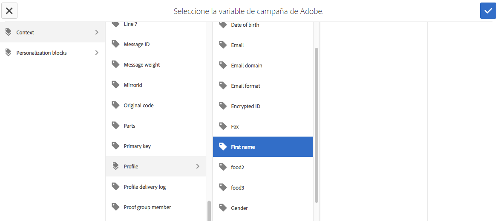

   Después de insertar campos de contexto o bloques de personalización, puede obtener una vista previa del boletín y probar los campos. Consulte [Vista previa de un boletín](#previewing-a-newsletter).

### Vista previa de una newsletter {#previewing-a-newsletter}

Puede obtener una vista previa del aspecto que tendrá el boletín y la personalización.

1. Con la newsletter abierta, haga clic en **Vista previa** en la esquina superior derecha de AEM. AEM muestra el aspecto del boletín cuando los usuarios lo reciben.

   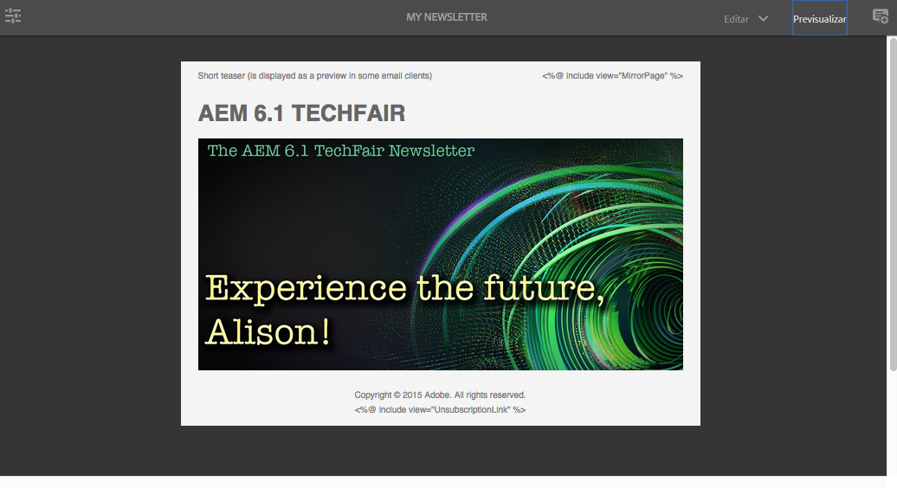

   >[!NOTE]
   >
   >Si utiliza Adobe Campaign Standard y la plantilla de ejemplo, dos bloques de personalización que muestran el contenido inicial: **&quot;&lt;%@ include view=&quot;MirrorPage&quot; %>&quot;** y **&quot;&lt;%@ include view=&quot;UnsubscriptionLink&quot; %>&quot;** : genera errores al importar el contenido durante la entrega. Puede ajustarlos seleccionando los bloques correspondientes mediante el selector de bloques personalizado.

1. Para obtener una vista previa de la personalización, abra ContextHub tocando o haciendo clic en el icono correspondiente de la barra de herramientas. Las etiquetas de campo de personalización ahora se sustituyen por los datos semilla del perfil seleccionado. Consulte cómo se adaptan las variables al cambiar de perfiles en ContextHub.

   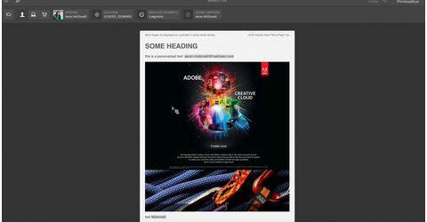

1. Puede ver los datos de origen procedentes de Adobe Campaign asociados al perfil seleccionado actualmente. Para ello, toque o haga clic en el módulo Adobe Campaign en la barra de ContextHub. Se abre un cuadro de diálogo que muestra todos los datos semilla del perfil actual. De nuevo, los datos se adaptan al cambiar de perfil.

   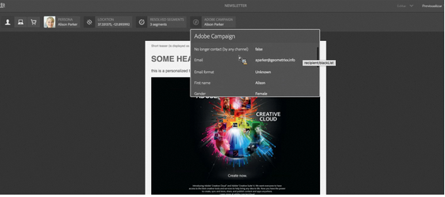

### Aprobación de contenido en AEM {#approving-content-in-aem}

Una vez finalizado el contenido, puede iniciar el proceso de aprobación. Vaya a la **Flujo de trabajo** del cuadro de herramientas y seleccione la **Aprobar para Adobe Campaign** flujo de trabajo.

Este flujo de trabajo integrado tiene dos pasos: revisión, luego aprobación, o revisión y luego rechazo. Sin embargo, este flujo de trabajo se puede ampliar y adaptar a un proceso más complejo.

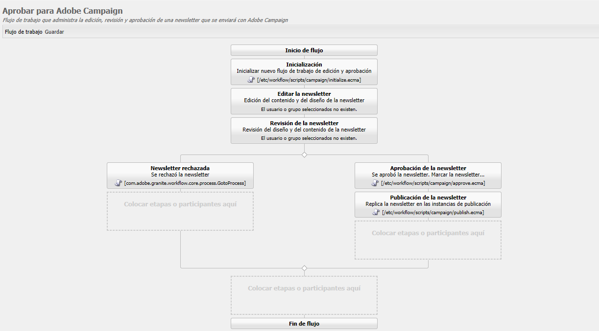

Para aprobar contenido para Adobe Campaign, aplique el flujo de trabajo seleccionando **Flujo de trabajo** y seleccionar **Aprobar para Adobe Campaign** y haga clic en **Iniciar flujo de trabajo**. Siga los pasos y apruebe el contenido. También puede rechazar el contenido seleccionando **Rechazar** en lugar de **Aprobar** en el último paso del flujo de trabajo.

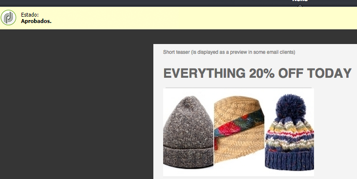

Una vez aprobado el contenido, aparece como aprobado en Adobe Campaign. A continuación, se puede enviar el correo electrónico.

En Adobe Campaign Standard:

En Adobe Campaign Classic:

>[!NOTE]
El contenido no aprobado se puede sincronizar con un envío en Adobe Campaign, pero el envío no se puede ejecutar. Solo se puede enviar contenido aprobado a través de envíos de Campaign.

## Vinculación de AEM con Adobe Campaign Standard y Adobe Campaign Classic {#linking-aem-with-adobe-campaign-standard-and-adobe-campaign-classic}

La forma en que vincule o sincronice AEM con Adobe Campaign depende de si utiliza Adobe Campaign Standard basado en suscripciones o Adobe Campaign Classic basado en la instalación local.

Consulte las secciones siguientes para obtener instrucciones basadas en su solución Adobe Campaign:

* [Vinculación de una página AEM a un correo electrónico de Adobe Campaign (Adobe Campaign Standard)](#linking-an-aem-page-to-an-adobe-campaign-email-adobe-campaign-standard)
* [Sincronización del contenido creado en AEM con una entrega de Adobe Campaign Classic](#synchronizing-content-created-in-aem-with-a-delivery-from-adobe-campaign-classic)

### Vinculación de una página AEM a un correo electrónico de Adobe Campaign (Adobe Campaign Standard) {#linking-an-aem-page-to-an-adobe-campaign-email-adobe-campaign-standard}

Adobe Campaign Standard le permite recuperar y vincular contenido creado en AEM con:

* Un correo electrónico.
* Una plantilla de correo electrónico.

Al hacerlo, puede enviar el contenido. Verá si una newsletter está vinculada a un único envío por el código que aparece en la página.

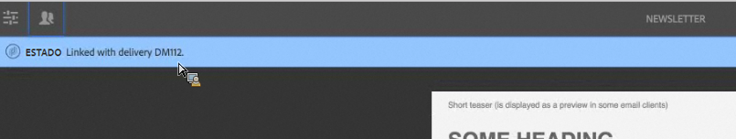

>[!NOTE]
Si una newsletter está vinculada a varios envíos, se muestra el número de envíos vinculados (pero no cada ID).

Para vincular una página creada en AEM con un correo electrónico de Adobe Campaign:

1. Cree un nuevo correo electrónico basado en una plantilla de correo electrónico específica de AEM. Consulte [Creación de correos electrónicos en Adobe Campaign Standard](https://helpx.adobe.com/campaign/standard/channels/using/creating-an-email.html) para obtener más información.

   

1. Abra el **Contenido** del panel de envío.

   

1. Select **Vinculación con contenido de Adobe Experience Manager** en la barra de herramientas para acceder a la lista de contenido disponible en AEM.

   >[!NOTE]
   Si la variable **Vinculación con un Adobe Experience Manager** no aparece en la barra de acciones, compruebe que la opción **Modo de edición de contenido** está configurado correctamente en **Adobe Experience Manager** en las propiedades de correo electrónico.

   

1. Seleccione el contenido que desee utilizar en el correo electrónico.

   Esta lista especifica:

   * Etiqueta del contenido de AEM.
   * El estado de aprobación del contenido en AEM. Si el contenido no está aprobado, puede sincronizarlo, pero tendrá que aprobarse antes de realizar el envío. Sin embargo, puede ejecutar determinadas operaciones, como enviar una prueba o la prueba de vista previa.
   * La fecha de la última modificación del contenido.
   * Cualquier contenido que ya esté vinculado a una entrega.

   >[!NOTE]
   De forma predeterminada, el contenido que ya está sincronizado con un envío está oculto. Sin embargo, puede mostrarlo y utilizarlo. Por ejemplo, si desea utilizar contenido como plantilla para varios envíos.

   Cuando el correo electrónico está vinculado a un contenido AEM, el contenido no se puede editar en Adobe Campaign.

1. Especifique los demás parámetros del correo electrónico de su panel (audiencias, programación de ejecución).
1. Ejecute el envío de correo electrónico. Durante el análisis de envío, se recupera la versión más actualizada del contenido de AEM.

   >[!NOTE]
   Si el contenido se actualiza en AEM mientras está vinculado a un correo electrónico, se actualiza automáticamente en Adobe Campaign durante el análisis. La sincronización también se puede ejecutar manualmente mediante **Actualizar el contenido de Adobe Experience Manager** de la barra de acciones de contenido.
   Puede cancelar el vínculo entre un correo electrónico y AEM contenido utilizando **Eliminar el vínculo con el contenido de Adobe Experience Manager** de la barra de acciones de contenido. Este botón solo está disponible si el contenido ya está vinculado al envío. Para vincular un contenido diferente a un envío, debe eliminar el vínculo de contenido actual antes de poder establecer un vínculo nuevo.
   Cuando se elimina el vínculo, el contenido local se mantiene y se puede editar en Adobe Campaign. Si vuelve a vincular el contenido después de haberlo modificado, se perderán todos los cambios.

### Sincronización del contenido creado en AEM con un envío de Adobe Campaign Classic {#synchronizing-content-created-in-aem-with-a-delivery-from-adobe-campaign-classic}

Adobe Campaign le permite recuperar y sincronizar el contenido creado en AEM con:

* Una entrega de campaña
* Una actividad de envío en un flujo de trabajo de campaña
* Un envío recurrente
* Un envío continuo
* Envío de un centro de mensajes
* Una plantilla de envíos

En AEM, si una newsletter está vinculada a un solo envío, el código de envío se muestra en la página.

>[!NOTE]
Si la newsletter está vinculada a varios envíos, se muestra el número de envíos vinculados (pero no cada ID).

>[!NOTE]
El paso Flujo de trabajo **Publicar en Adobe Campaign** está en desuso en AEM 6.1. Este paso era parte de la integración de AEM 6.0 con Adobe Campaign y ya no es necesario.

Para sincronizar el contenido creado en AEM con un envío de Adobe Campaign:

1. Cree una entrega o añada una actividad de entrega a un flujo de trabajo de campaña seleccionando la **Envío de correo electrónico con contenido AEM (mailAEMContent)** plantilla de envío.

   

1. Select **Sincronizar** en la barra de herramientas para acceder a la lista de contenido disponible en AEM.

   >[!NOTE]
   Si la variable **Sincronizar** no aparece en la barra de herramientas de la entrega, compruebe que la opción **Modo de edición de contenido** el campo está configurado correctamente en **AEM** seleccionando **Propiedades** > **Avanzadas**.

   

1. Seleccione el contenido que desea sincronizar con su envío.

   Esta lista especifica:

   * Etiqueta del contenido de AEM.
   * El estado de aprobación del contenido en AEM. Si el contenido no está aprobado, puede sincronizarlo, pero tendrá que aprobarse antes de realizar el envío. Sin embargo, puede ejecutar ciertas operaciones, como enviar una MTD o la prueba de vista previa.
   * La fecha de la última modificación del contenido.
   * Cualquier contenido que ya esté vinculado a una entrega.

   >[!NOTE]
   De forma predeterminada, el contenido que ya está sincronizado con un envío está oculto. Sin embargo, puede mostrarlo y utilizarlo. Por ejemplo, si desea utilizar contenido como plantilla para varios envíos.

   

1. Especifique los demás parámetros de la entrega (objetivo, etc.)
1. Si es necesario, inicie el proceso de aprobación de envíos en Adobe Campaign. Es necesario aprobar el contenido en AEM, además de las aprobaciones configuradas en Adobe Campaign (presupuesto, objetivo, etc.). La aprobación del contenido en Adobe Campaign solo es posible si el contenido ya está aprobado en AEM.
1. Ejecute el envío. Durante el análisis de envío, se recupera la versión más actualizada del contenido de AEM.

   >[!NOTE]
   * Una vez sincronizados el envío y el contenido, el contenido del envío en Adobe Campaign se convierte en de solo lectura. El asunto del correo electrónico y su contenido ya no se pueden modificar.
   * Si el contenido se actualiza en AEM mientras está vinculado a una entrega en Adobe Campaign, se actualiza automáticamente en la entrega durante el análisis de la entrega. La sincronización también se puede ejecutar manualmente mediante el **Actualizar contenido ahora** botón.
   * Puede cancelar la sincronización entre un envío y AEM contenido utilizando la variable **Desincronizar** botón. Esto solo está disponible si el contenido ya está sincronizado con la entrega. Para sincronizar un contenido diferente con un envío, debe cancelar la sincronización de contenido actual antes de poder establecer un vínculo nuevo.
   * Si se anula la sincronización, el contenido local se mantiene y se puede editar en Adobe Campaign. Si vuelve a sincronizar el contenido después de haberlo modificado, perderá todos los cambios.
   * En el caso de los envíos recurrentes y continuos, la sincronización con AEM contenido se detiene cada vez que se ejecuta el envío.

