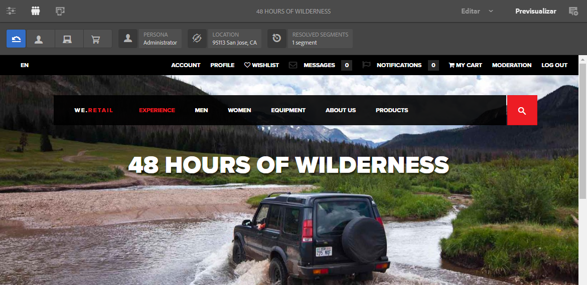
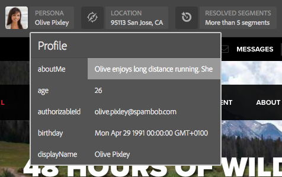

# Obtención de vista previa de páginas mediante los datos de ContextHub{#previewing-pages-using-contexthub-data}

>[!CAUTION]
>
>AEM 6.4 ha llegado al final de la compatibilidad ampliada y esta documentación ya no se actualiza. Para obtener más información, consulte nuestra [períodos de asistencia técnica](https://helpx.adobe.com/es/support/programs/eol-matrix.html). Buscar las versiones compatibles [here](https://experienceleague.adobe.com/docs/).

La variable [ContextHub](/help/sites-developing/contexthub.md) La barra de herramientas muestra datos de los almacenes de ContextHub y le permite cambiar datos de los almacenes. La barra de herramientas de ContextHub es útil para previsualizar contenido determinado por datos en un almacén de ContextHub.

La barra de herramientas consta de una serie de modos de IU que contienen uno o varios módulos de IU.

* Los modos de IU son iconos que aparecen en la parte izquierda de la barra de herramientas. Al tocar o hacer clic en un icono, la barra de herramientas muestra los módulos de IU que contiene.
* Los módulos de IU muestran los datos de uno o más almacenes de ContextHub. Algunos módulos de IU también permiten manipular los datos de almacenamiento.

ContextHub instala varios modos de IU y módulos de IU. Es posible que el administrador tenga [ContextHub configurado](/help/sites-administering/contexthub-config.md) para mostrar diferentes.

## Mostrar la barra de herramientas de ContextHub {#revealing-the-contexthub-toolbar}

La barra de herramientas de ContextHub está disponible en el modo de vista previa. La barra de herramientas solo está disponible en instancias de autor y únicamente si el administrador la ha activado.

1. Con la página abierta para edición, en la barra de herramientas, toque o haga clic en Vista previa.

   

1. Para mostrar la barra de herramientas, toque o haga clic en el icono de ContextHub.

   

## Funciones del módulo de la interfaz de usuario {#ui-module-features}

Cada módulo de interfaz de usuario proporciona un conjunto diferente de funciones, pero los siguientes tipos de funciones son comunes. Como los módulos de IU son ampliables, el desarrollador puede implementar otras funciones según sea necesario.

### Contenido de la barra de herramientas {#toolbar-content}

Los módulos de IU pueden mostrar datos de uno o más almacenes de ContextHub en la barra de herramientas. Los módulos de IU utilizan un icono y un título para identificarse.

### Contenido emergente {#popup-content}

Algunos módulos de IU muestran una superposición emergente al tocar o hacer clic en ellos. Normalmente, la ventana emergente contiene información adicional, aparte de lo que aparece en la barra de herramientas.

### Forms emergente {#popup-forms}

La superposición emergente de un módulo puede incluir elementos de formulario que le permitan cambiar los datos en el almacén de ContextHub. Si el contenido de la página está determinado por los datos del almacén, puede utilizar el formulario y observar los cambios en el contenido de la página.

### Modo de pantalla completa {#fullscreen-mode}

Las superposiciones emergentes pueden incluir un icono que toque o haga clic para expandir el contenido emergente y cubrir toda la ventana o pantalla del explorador.

