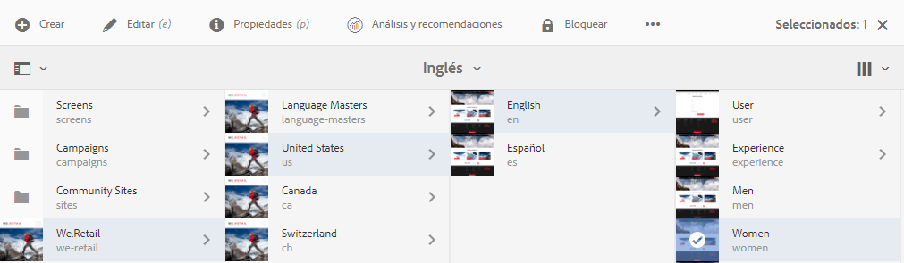
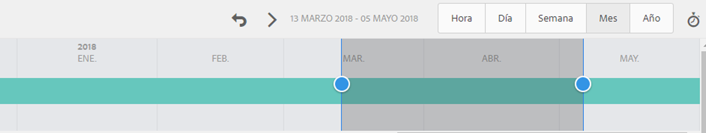
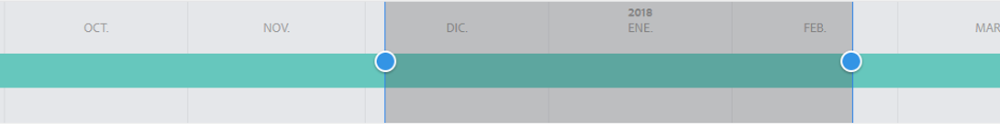
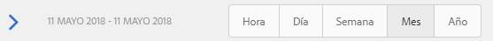

# Análisis del rendimiento de la página{#analyzing-page-performance}

>[!CAUTION]
>
>AEM 6.4 ha llegado al final de la compatibilidad ampliada y esta documentación ya no se actualiza. Para obtener más información, consulte nuestra [períodos de asistencia técnica](https://helpx.adobe.com/es/support/programs/eol-matrix.html). Buscar las versiones compatibles [here](https://experienceleague.adobe.com/docs/).

Abra el [Perspectiva de contenido](/help/sites-authoring/content-insights.md) para analizar el rendimiento de la página que está creando. Configure el período de informe para centrar el análisis.

## Apertura de Analytics y Recommendations para una página {#opening-analytics-and-recommendations-for-a-page}

Utilice el siguiente procedimiento para ver Analytics y Recommendations para una página:

1. Desplácese a la página que desee analizar.
1. En la barra de herramientas, toque o haga clic en **Analytics y Recommendations**.

   >[!NOTE]
   >
   >Analytics y Recommendations para una página solo aparecen si ha configurado AEM para [integrar con Adobe Analytics](/help/sites-administering/adobeanalytics-connect.md).

   

## Cambio del período de informe {#changing-the-reporting-period}

Cambie los siguientes aspectos relacionados con el tiempo de los informes de análisis:

* Período de tiempo sobre el que se debe informar.
* La granularidad de los datos.

Las herramientas para cambiar los aspectos relacionados con el tiempo de los informes aparecen en la parte superior de la página Perspectiva de contenido . 

### Cambio del período de informe {#changing-the-reporting-period-1}

Cambie el período de informe de la página Perspectiva de contenido para centrar el análisis de la actividad de la página en un período de tiempo específico. Al cambiar el período de informe, los informes se actualizan automáticamente. El área sombreada del periodo de tiempo representa el período de informe. Las fechas del periodo de tiempo aumentan de izquierda a derecha.

Para cambiar el período de informe de una página de Perspectiva de contenido:

1. Si el marco de tiempo no aparece en la parte superior de la página, toque o haga clic en el icono Alternar intervalo de tiempo .

   

1. Para cambiar la fecha de inicio del período de informe, arrastre el círculo que aparece en el lado izquierdo del área sombreada a la fecha de inicio deseada.

   Si no puede ver el lado izquierdo del área sombreada, utilice la barra de desplazamiento para verlo.

1. Para cambiar la fecha de finalización del período de informe, arrastre el círculo que aparece a la derecha del área sombreada a la fecha de finalización deseada.

### Cambio de la granularidad del período de informe {#changing-the-granularity-of-the-reporting-period}

Cambiar la cantidad de tiempo que cada punto de datos abarca en un informe. Por ejemplo, cuando se selecciona la granularidad Semana , cada punto de datos del informe Vistas representa el número de vistas de una semana.

La granularidad afecta a los informes que trazan los datos con respecto al tiempo, como los informes Vistas y Promedio de minutos de participación de la página . La granularidad también afecta a la escala del periodo de tiempo.

1. Si el control de granularidad no aparece, toque o haga clic en el icono Alternar granularidad .

   

1. Toque o haga clic en la granularidad deseada. Una vez seleccionado, el informe se actualiza automáticamente para reflejar la granularidad.

## Asignación de tareas para SEO Recommendations {#assigning-tasks-for-seo-recommendations}

Utilice el informe SEO Recommendations para crear tareas que mejoren la visibilidad de la página para los motores de búsqueda. Para cada recomendación del informe que no tenga una marca de verificación, puede crear una tarea que asigne a un usuario para realizar el trabajo requerido.

El estado de la recomendación de SEO indica cuándo se crea la tarea pero aún no se ha completado.

Cuando se crea, la tarea aparece en la lista Tareas del usuario. Para obtener información sobre las tareas, consulte [Uso de tareas](/help/sites-authoring/task-content.md).

Utilice el siguiente procedimiento para crear una tarea para una recomendación de SEO.

1. Toque o haga clic en el icono de información de la recomendación de SEO.

   

1. Haga clic en el icono de triángulo rodeado que aparece junto al icono de información.

   

1. Rellene los campos de formulario que aparecen y, a continuación, pulse Crear:

   * Proyecto: Seleccione el proyecto en el que desea crear la tarea.
   * Nombre: El nombre que identifica la tarea. El nombre predeterminado es el título de la recomendación de SEO.
   * Asignar a: Seleccione el usuario al que desea asignar la tarea. Empiece a escribir el nombre del usuario para filtrar la lista.
   * Descripción: Descripción de la actividad necesaria para completar la tarea. La descripción predeterminada es la información que acompaña a la recomendación de SEO.
   * Prioridad de tareas: La prioridad de la tarea.
   * Fecha de vencimiento: La fecha en la que se debe completar la tarea.

1. Pulse o haga clic en Listo para cerrar el mensaje Tarea creada .

>[!NOTE]
>
>La tarea que se crea también incluye la ruta a la página a la que se aplica la recomendación de SEO.
