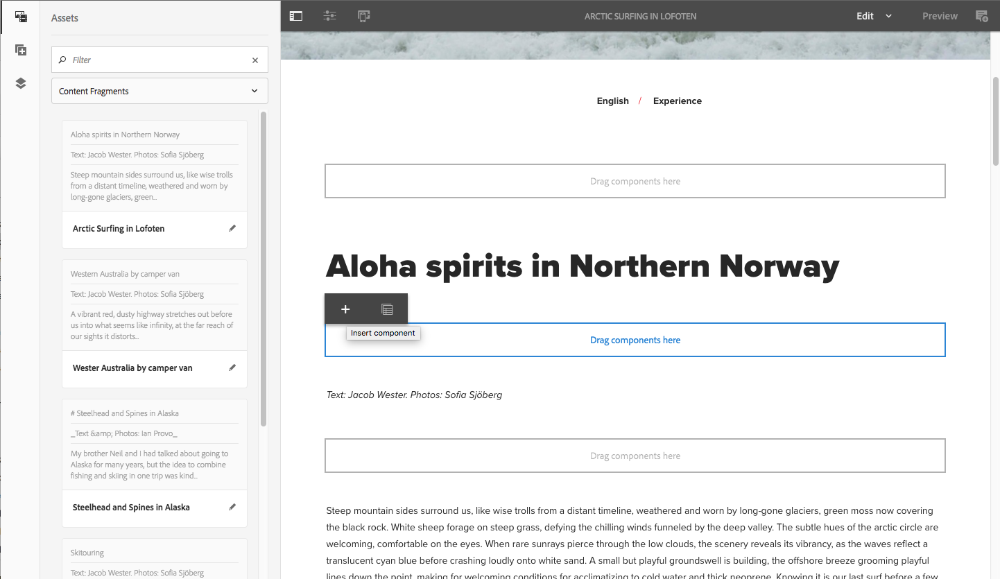

# Creación de páginas con fragmentos de contenido{#page-authoring-with-content-fragments}

>[!CAUTION]
>
>AEM 6.4 ha llegado al final de la compatibilidad ampliada y esta documentación ya no se actualiza. Para obtener más información, consulte nuestra [períodos de asistencia técnica](https://helpx.adobe.com/es/support/programs/eol-matrix.html). Buscar las versiones compatibles [here](https://experienceleague.adobe.com/docs/).

>[!CAUTION]
>
>Algunas funciones de fragmento de contenido requieren la aplicación de [AEM 6.4 Service Pack 2 (6.4.2.0) o posterior](/help/release-notes/sp-release-notes.md).

Los fragmentos de contenido de Adobe Experience Manager (AEM) se [crean y administran como recursos independientes de la página](/help/assets/content-fragments.md).

Permiten crear contenido neutro con respecto al canal, así como variaciones (posiblemente específicas del canal). Después se pueden usar estos fragmentos, y sus variaciones, al crear páginas de contenido.

Junto con el exportador JSON actualizado, los fragmentos de contenido estructurados también se pueden utilizar para distribuir contenidos de AEM mediante servicios de contenido a canales en lugar de páginas de AEM.

>[!NOTE]
>
>Los **fragmentos de contenido** y los **[fragmentos de experiencias](/help/sites-authoring/experience-fragments.md)** son funciones distintas de AEM:
>
>* **Fragmentos de contenido** son contenido editorial, principalmente texto e imágenes relacionadas. Son contenido puro, sin diseño ni diseño.
>* Los **fragmentos de experiencias** son contenidos plenamente diseñados; un fragmento de una página web. 
>
>Los fragmentos de experiencias pueden incluir contenido en forma de fragmentos, pero no lo contrario.

>[!CAUTION]
>
>Esta página se debe leer junto con [Trabajo con fragmentos de contenido](/help/assets/content-fragments.md) (y las páginas relacionadas), ya que introduce terminología y conceptos básicos, además de tratar la creación y gestión de fragmentos.

Los fragmentos de contenido permiten:

* **Estrategia de campañas y marketing**

   * Revise el contenido a través de fragmentos de contenido administrados centralmente.

* **Creative Pro**

   * Seguimiento de recursos creativos mediante colecciones asociadas con fragmentos de contenido.

* **Copiar escritores**

   * Escriba en el editor de fragmentos de contenido de AEM.
   * Pueden crear variaciones de contenido.
   * Puede asociar contenido relevante con el fragmento de contenido.
   * Puede utilizar el control de versiones/flujo de trabajo.
   * Pueden compartir fragmentos de contenido.
   * Puede administrar traducciones de forma centralizada.

* **Productores y gestores de Recorridos**

   * Seleccione fragmentos y variaciones predefinidos con la creación en AEM.
   * Pueden confiar en fragmentos y contenido asociado siempre estando actualizado a medida que creadores y redactores realizan sus actualizaciones en recursos y fragmentos administrados centralmente.
   * Pueden depender del contenido multimedia asociado seleccionado para su relevancia.
   * Puede crear variaciones de contenido ad-hoc sobre la marcha, asegurándose de que dichas variaciones permanezcan administradas de forma centralizada en el fragmento.

## Adición de un fragmento de contenido a la página       {#adding-a-content-fragment-to-your-page}

1. Abra la página para editarla. 

1. Añada el componente **[!UICONTROL Fragmento de contenido]**, bien desde el navegador **[!UICONTROL Componentes]** o con **[!UICONTROL Insertar nuevo componente]**. 

1. Puede:

   * Abra el navegador **[!UICONTROL Recursos]** y filtre por **[!UICONTROL Fragmentos de contenido]** (el valor predeterminado es Imágenes). A continuación, arrastre el fragmento requerido a la instancia del componente.
   * Seleccione el componente de fragmento de contenido y, a continuación, **[!UICONTROL Configurar]** en la barra de herramientas. En el cuadro de diálogo, puede abrir el cuadro de diálogo de selección para buscar y seleccionar el **[!UICONTROL fragmento de contenido]** requerido.

   >[!NOTE]
   >
   >Otra posibilidad es arrastrar un fragmento de contenido específico directamente a la página. Esto creará automáticamente el componente asociado (fragmento de contenido). 

1. En un primer momento se muestra el contenido del elemento **[!UICONTROL Principal]** y **[!UICONTROL Maestro]** (variación). Puede [seleccionar otros elementos y variaciones](#selecting-the-element-or-variation) si lo desea.

   

   >[!NOTE]
   >
   >Para obtener más información sobre las funciones de edición adicionales, consulte también:
   >
   >* [Diseño adaptable](/help/sites-authoring/responsive-layout.md)
   >* [Edición del contenido de una página](/help/sites-authoring/editing-content.md)

## Selección del elemento o la variación {#selecting-the-element-or-variation}

Abra el **[!UICONTROL Configuración]** para configurar el fragmento que se utilizará en la página actual. El cuadro de diálogo puede depender del componente utilizado.

En el cuadro de diálogo de configuración adecuado, puede seleccionar los parámetros disponibles, incluidos:

* **[!UICONTROL Fragmento de contenido]**

   Especifique el fragmento que se va a utilizar.

* **[!UICONTROL Modo de visualización]**:

   * **[!UICONTROL Elemento de texto único]**
   * **[!UICONTROL Elemento múltiple]**

* **[!UICONTROL Elemento]**

   * El valor predeterminado **[!UICONTROL Principal]** siempre estará disponible.
   * Una selección estará disponible si el fragmento se creó con una plantilla adecuada.

   >[!NOTE]
   >
   >Los elementos disponibles dependen de la plantilla utilizada.

* **[!UICONTROL Variación]**

   * **[!UICONTROL Principal]** siempre aparecerá como la opción predeterminada.
   * Habrá una selección disponible si se crearon variaciones para el fragmento.

* **[!UICONTROL Párrafos]**: especifique el rango de párrafos que desea incluir:

   * **[!UICONTROL Todos]**
   * **[!UICONTROL Rango]**: por ejemplo, `1`, `3-5` o `9-*`

      * **[!UICONTROL Gestionar encabezados como sus propios párrafos]**

* **[!UICONTROL Gestionar encabezados como sus propios párrafos]**

## Conexión rápida con el editor de fragmentos  {#quick-connection-to-fragment-editor}

Puede abrir el origen del fragmento para editarlo (el recurso) mediante el icono **[!UICONTROL Editar]** de la barra de herramientas de componentes. Esto le permitirá [editar y gestionar el fragmento de contenido](/help/assets/content-fragments.md). 

>[!CAUTION]
>
>Como siempre, editar el origen del fragmento afectará a todas las páginas que hacen referencia a dicho fragmento de contenido.

## Añadir contenido intermedio       {#adding-in-between-content}

Cuando se agrega un fragmento de contenido específico a la página, aparece una variable **[!UICONTROL Arrastre los componentes aquí]** marcador de posición entre cada párrafo de HTML (y en la parte superior/inferior) del fragmento.

Esto le permite añadir contenido adicional [intermedio (es decir, entre contenido)](/help/assets/content-fragments.md#in-between-content-when-page-authoring-with-content-fragments) el contenido del fragmento (en cualquiera de los puntos disponibles), sin tener que cambiar el fragmento raíz.

Para el contenido intermedio puede:

* Añadir componentes desde el [Navegador de componentes](/help/sites-authoring/author-environment-tools.md#components-browser).
* Agregue recursos desde [Navegador de recursos](/help/sites-authoring/author-environment-tools.md#assets-browser).
* Utilizar [contenido asociado](#using-associated-content) como fuente para el contenido intermedio.

>[!CAUTION]
>
>El contenido intermedio es contenido de página. No se almacena en el fragmento de contenido.

>[!NOTE]
>
>También puede [insertar recursos visuales (imágenes) en el propio fragmento](/help/assets/content-fragments-variations.md#inserting-assets-into-your-fragment).
>
>Los recursos visuales insertados en el propio fragmento se adjuntan al párrafo anterior del fragmento. Esto significa que no puede colocar contenido intermedio entre un recurso visual y el párrafo precedente.

>[!CAUTION]
>
>Una vez añadido contenido intermedio a un fragmento de contenido en la página, al cambiar la estructura del fragmento de contenido subyacente (es decir, en el editor de fragmentos de contenido) se pueden generar resultados erróneos o inesperados.
>
>Cuando esto sucede, el contenido intermedio se mantiene tal cual:
>
>* Los componentes intermedios tienen una posición absoluta dentro de la secuencia de componentes en el flujo del fragmento. Esta posición no cambia, incluso cuando cambia el contenido de los párrafos del fragmento.\
   >  Por este motivo, es posible que parezca que la posición relativa ha cambiado, ya que los párrafos intermedios no tienen relación contextual con los párrafos (del fragmento) junto a los que se sitúan.
>* Sin embargo, en caso de que exista conflicto entre las dos estructuras de párrafo, el contenido intermedio no se muestra (aunque siga presente internamente).
>

## Uso de contenido asociado       {#using-associated-content}

Si tiene [contenido asociado](/help/assets/content-fragments-assoc-content.md) con el [fragmento de contenido](/help/assets/content-fragments.md), estos recursos estarán disponibles en el panel lateral (después de colocar el fragmento en la página de contenido). El contenido asociado es en realidad una fuente especial de contenido para [contenido intermedio](#adding-in-between-content).

>[!NOTE]
>
>Hay varios métodos para agregar [recursos visuales (p. ej., imágenes)](/help/assets/content-fragments.md#fragments-with-visual-assets) al fragmento o página.

>[!NOTE]
>
>Si tiene varios fragmentos de contenido en la página, la variable **[!UICONTROL Contenido asociado]** muestra los recursos adecuados para todos los fragmentos.

Una vez que haya añadido un fragmento con contenido asociado a la página, agregue una nueva pestaña (**[!UICONTROL Contenido asociado]**) se abre en el panel lateral.

Desde aquí podrá arrastrar los recursos a la ubicación requerida (en un componente existente o a la posición que le interese donde se creará el componente correspondiente):

## Recursos insertados en el fragmento {#assets-inserted-into-the-fragment}

If [los recursos (p. ej. imágenes) se han insertado en el propio fragmento](/help/assets/content-fragments-variations.md#inserting-assets-into-your-fragment), las opciones para editar estos recursos en el editor de páginas son limitadas.

Por ejemplo, para una imagen puede

* Recortar, rotar o voltear la imagen.
* Añada un título o texto alternativo.
* Especifique un tamaño.
* También puede configurar el diseño.

Otros cambios, como mover, copiar o eliminar, deben realizarse en el editor de fragmentos.

## Publicación {#publishing}

Los fragmentos deben publicarse para poder usarse en las páginas web publicadas:

* Los fragmentos se pueden publicar después de [crear el fragmento en la consola Recursos](/help/assets/content-fragments-managing.md#publishing-and-referencing-a-fragment).
* Si se usa un *fragmento sin publicar* en una página que se está publicando, también se puede publicar en ese momento el fragmento.
