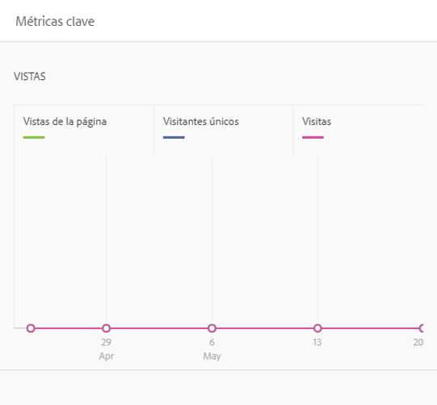
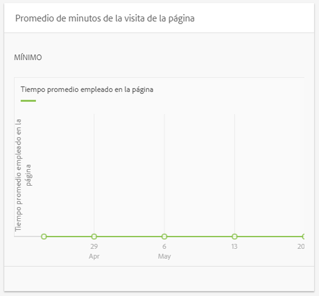
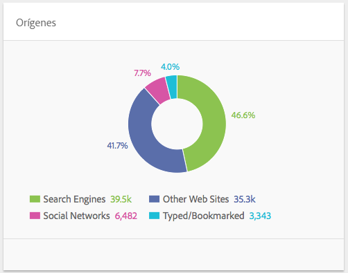
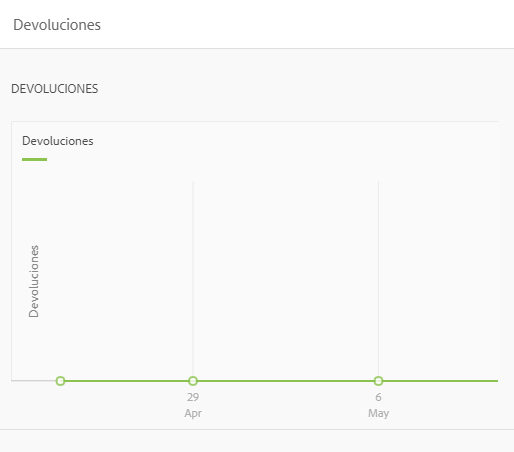
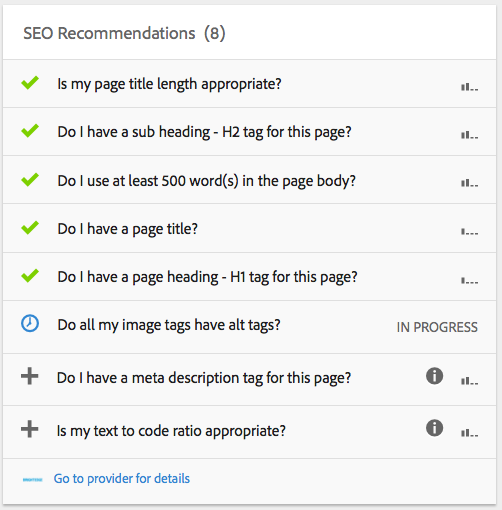

# Perspectiva de contenido{#content-insight}

>[!CAUTION]
>
>AEM 6.4 ha llegado al final de la compatibilidad ampliada y esta documentación ya no se actualiza. Para obtener más información, consulte nuestra [períodos de asistencia técnica](https://helpx.adobe.com/es/support/programs/eol-matrix.html). Buscar las versiones compatibles [here](https://experienceleague.adobe.com/docs/).

La perspectiva de contenido proporciona información sobre el rendimiento de la página mediante análisis web y recomendaciones de SEO. Use la perspectiva de contenido para tomar decisiones sobre cómo modificar páginas o para saber cómo han cambiado los cambios anteriores el rendimiento. Por cada página que cree, puede abrir Perspectiva de contenido para analizar la página.

El diseño de la página Perspectiva de contenido cambia para adaptarse a las dimensiones de pantalla y la orientación del dispositivo que está utilizando.

## Datos de informe

La página Perspectiva de contenido incluye informes que utilizan datos de Adobe SiteCatalyst, Adobe Target, Adobe Social y BrightEdge:

* SiteCatalyst: Hay disponibles informes para las siguientes métricas:

   * Vistas de página
   * Tiempo promedio empleado en la página
   * Orígenes

* Target: Informes sobre la actividad de la campaña para la que la página incluye ofertas.
* BrightEdge: Informes sobre las funciones de la página que mejoran la visibilidad de la página para los motores de búsqueda y recomiendan las funciones que deben implementarse.

Consulte [Apertura de Analytics y Recommendations para una página](/help/sites-authoring/ci-analyze.md#opening-analytics-and-recommendations-for-a-page).

## Período de informe

Los informes muestran los datos durante un período de tiempo que usted controla. Al ajustar el período de informe, los informes se actualizan automáticamente con los datos correspondientes a ese período. Las indicaciones visuales indican la hora en que cambiaron las versiones de la página, de modo que se pueda comparar el rendimiento de cada versión.

También puede especificar la granularidad de los datos de los informes, por ejemplo, puede ver datos diarios, semanales, mensuales o anuales.

Consulte [Cambio del período de informe](/help/sites-authoring/ci-analyze.md#changing-the-reporting-period).

>[!NOTE]
>
>Los informes de Perspectivas de contenido requieren que el administrador haya integrado AEM con SiteCatalyst, Target y BrightEdge. Consulte [Integración con SightCatalyst](/help/sites-administering/adobeanalytics.md), [Integración con Adobe Target](/help/sites-administering/target.md)y [Integración con BrightEdge](/help/sites-administering/brightedge.md).

## El informe Vistas {#the-views-report}

El informe Vistas incluye las siguientes funciones para evaluar el tráfico de la página:

* Número total de vistas de una página durante el período de informe.
* Un gráfico del número de vistas a lo largo del período de informe:

   * Vistas totales.
   * Visitantes únicos.

## El informe Promedio de participación de la página {#the-page-average-engaged-report}

El informe Promedio de participación de la página incluye las siguientes funciones para evaluar la efectividad de la página:

* El tiempo promedio que la página permanece abierta durante todo el período de informe.
* Gráfico de la longitud promedio de una vista de página durante el período de informe.

## El informe de fuentes {#the-sources-report}

El informe Orígenes indica cómo navegan los usuarios a la página, por ejemplo, desde los resultados del motor de búsqueda o utilizando la dirección URL conocida.

## El informe Devoluciones {#the-bounces-report}

El informe Devoluciones incluye un gráfico que muestra el número de devoluciones que se han producido en una página durante el período de informe seleccionado.

## El informe Actividad de la campaña {#the-campaign-activity-report}

Para cada campaña para la que la página esté activa, aparece un informe con el nombre *Nombre de campaña* Actividad. El informe muestra las impresiones y conversiones de la página para cada segmento para el que se proporciona una oferta.

## El informe de SEO Recommendations {#the-seo-recommendations-report}

El informe Recommendations de SEO contiene los resultados del análisis de BrightEdge para la página. El informe es una lista de comprobación de características de la página que indica qué características incluye la página y cuáles no para maximizar la capacidad de búsqueda mediante motores de búsqueda.

El informe permite crear tareas para que se mejoren las posibilidades de encontrar páginas. Recommendations indica que se han creado tareas para implementar la recomendación. Consulte [Asignación de tareas para SEO Recommendations](/help/sites-authoring/ci-analyze.md#assigning-tasks-for-seo-recommendations).

