# Creación de contenido orientado mediante el modo de Orientación{#authoring-targeted-content-using-targeting-mode}

>[!CAUTION]
>
>AEM 6.4 ha llegado al final de la compatibilidad ampliada y esta documentación ya no se actualiza. Para obtener más información, consulte nuestra [períodos de asistencia técnica](https://helpx.adobe.com/es/support/programs/eol-matrix.html). Buscar las versiones compatibles [here](https://experienceleague.adobe.com/docs/).

Contenido orientado por el autor mediante el modo de segmentación de AEM. El modo de Orientación y el componente Target proporcionan herramientas para crear contenido para las experiencias:

* Reconozca fácilmente el contenido de destino que se encuentra en la página. Una línea de puntos forma un borde alrededor de todo el contenido de destino.
* Seleccione una marca y una actividad para ver las experiencias.
* Agregue experiencias a una actividad o elimine experiencias.
* Realice pruebas A/B y convierta a los ganadores (solo Adobe Target).
* Añada ofertas a una experiencia creando ofertas o utilizando ofertas de una biblioteca.
* Configure los objetivos y supervise el rendimiento.
* Simule la experiencia del usuario.
* Para obtener más personalización, configure el componente Target .

Puede utilizar AEM o Adobe Target como motor de orientación (para utilizar Adobe Target, debe tener una cuenta de Adobe Target válida). Si utiliza Adobe Target, primero debe configurar la integración. Consulte [instrucciones para la integración con Adobe Target](/help/sites-administering/target.md).

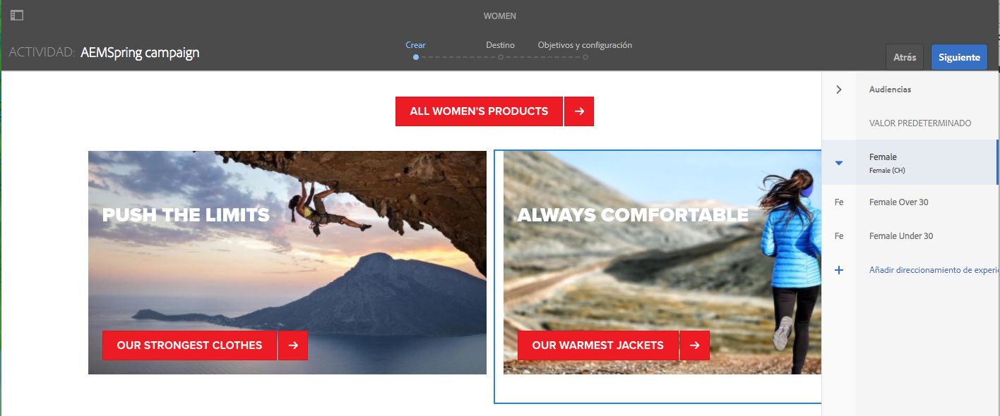

Las actividades y experiencias que ve en el modo de Target reflejan la variable [Consola Actividades](/help/sites-authoring/activitylib.md):

* Los cambios que realice en las actividades y experiencias mediante el modo Segmentación se reflejan en la consola Actividades .
* Los cambios realizados en la consola Actividades se reflejan en el modo Segmentación .

>[!NOTE]
>
>Al crear una campaña en Adobe Target, se asigna una propiedad denominada `thirdPartyId` a cada campaña. Al eliminar la campaña en Adobe Target, thirdPartyId no se elimina. No puede volver a utilizar `thirdPartyId` para las campañas de distintos tipos (AB, XT) y no se puede quitar manualmente. Para evitar este problema, asigne a cada campaña un nombre único; por tanto, los nombres de campaña no se pueden reutilizar en tipos de campaña diferentes.
>
>Si utiliza el mismo nombre en el mismo tipo de campaña, sobrescribirá la campaña existente.
>
>Si al sincronizar se muestra el mensaje de error “Se ha producido un error en la solicitud. `thirdPartyId` ya existe”, cambie el nombre de la campaña y vuelva a sincronizar.

>[!NOTE]
>
>Al segmentar, la combinación de marca y actividad se mantiene en el nivel de usuario y no en el de canal.

## Cambio al modo de Orientación {#switching-to-targeting-mode}

Cambie al modo Target para acceder a las herramientas de creación de contenido de destino.

Para cambiar al modo Target:

1. Abra la página para la que desee crear contenido de destino.
1. En la barra de herramientas situada en la parte superior de la página, toque o haga clic en el menú emergente de modo para mostrar los tipos de modo disponibles.

   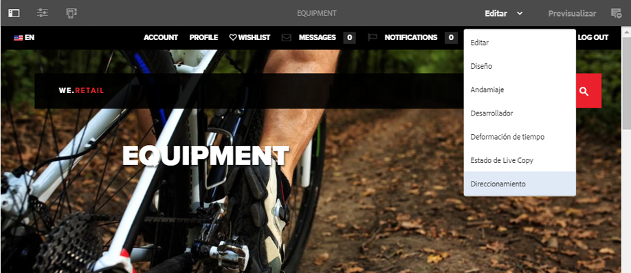

1. Toque o haga clic en **Direccionamiento**. Las opciones de orientación se muestran en la parte superior de la página.

   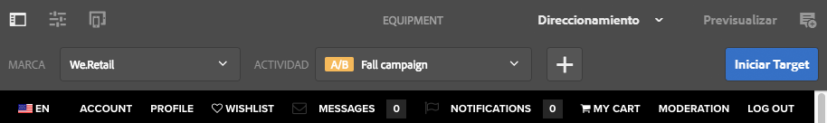

## Adición de una actividad con el modo de Orientación {#adding-an-activity-using-targeting-mode}

Utilice el modo de Orientación para añadir una actividad a una marca. Al añadir una actividad, contiene la experiencia predeterminada. Después de agregar la actividad, se inicia el proceso de segmentación de contenido para la actividad.

También puede crear y administrar actividades de Adobe Target desde AEM con la opción de seleccionar el motor de destino (AEM o Adobe Target) y el tipo de actividad (Segmentación de experiencias o Prueba A/B).

Además, puede administrar objetivos y métricas para todas las actividades de Adobe Target y administrar los públicos de Adobe Target. También se incluyen los informes de actividad de Adobe Target, incluida la conversión de ganadores para las pruebas A/B.

Cuando agrega una actividad, también aparece en el [Consola de actividades](/help/sites-authoring/activitylib.md).

Para añadir una actividad:

1. Utilice la variable **Marca** menú desplegable para seleccionar la marca para la que desea crear la actividad.

   >[!NOTE]
   >
   >Se recomienda [crear marcas a través de la consola actividades](/help/sites-authoring/activitylib.md#creating-a-brand-using-the-activities-console).
   >
   >Si crea una marca de cualquier otra manera, asegúrese de que el nodo `/campaigns/<brand>/master` existe o se producirá un error al intentar crear una actividad.

1. Toque o haga clic en + junto a la **Actividad** menú desplegable.
1. Escriba un nombre para la actividad.

   >[!NOTE]
   >
   >Al crear una actividad nueva y tener una configuración de nube de Adobe Target asociada a la página o a uno de sus elementos raíz, AEM supone automáticamente que Adobe Target es el motor.

1. En el menú desplegable del motor de **Orientación**, seleccione el motor de orientación.

   * Si selecciona **ContextHub AEM**, los campos restantes se atenúan y no están disponibles. Haga clic o pulse **Crear**.
   * Si selecciona **Adobe Target**, puede seleccionar una configuración (de forma predeterminada, es la configuración que proporcionó al [configuró la cuenta](/help/sites-administering/opt-in.md)) y Tipo de actividad.
   * Si utiliza la integración AEM/Adobe Campaign y envía contenido orientado (newsletters), seleccione **Adobe Campaign**. Consulte [Integración con Adobe Campaign](/help/sites-administering/campaign.md) para obtener más información.

1. En el menú Actividad , seleccione **Segmentación de experiencias** o **Prueba A/B**.

   * Segmentación de experiencias: administre actividades de Adobe Target desde AEM.
   * Prueba A/B: cree o administre actividades de prueba A/B en Adobe Target a partir de AEM.

## El proceso de establecimiento de objetivos: Crear, definir objetivos y objetivos y configuración {#the-targeting-process-create-target-and-goals-settings}

El modo de Orientación le permite configurar diversas proporciones de una actividad. Utilice el siguiente proceso de tres pasos para crear contenido segmentado para una actividad de marca:

1. [Crear](#create-authoring-the-experiences): Agregue o elimine experiencias y añada ofertas para cada experiencia.
1. [Orientar](#target-configuring-the-audiences): especifique el público al que se orienta cada experiencia. Puede dirigirse a una audiencia específica y, si utiliza pruebas A/B, decidir qué porcentaje del tráfico se destina a cada experiencia.
1. [Objetivos y configuraciones](#goals-settings-configuring-the-activity-and-setting-goals): programe la actividad y establezca la prioridad. También puede establecer objetivos de métricas de éxito.

Utilice el siguiente procedimiento para iniciar el proceso de segmentación de contenido para una actividad.

>[!NOTE]
>
>Para utilizar el proceso de direccionamiento, debe ser miembro del grupo de usuarios Autores de actividades de Target.

Para añadir una actividad:

1. En el **Marca** menú desplegable, seleccione la marca que contiene la actividad en la que está trabajando.
1. En el **Actividad** menú desplegable, seleccione la actividad para la que está creando contenido de destino.
1. Para mostrar los controles que le guiarán a través del proceso de orientación, toque o haga clic en **Iniciar segmentación**.

   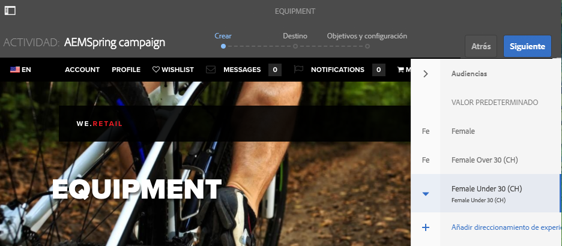

   >[!NOTE]
   >
   >Para cambiar la actividad con la que está trabajando, toque o haga clic en **Atrás**.

## Crear: Creación de experiencias {#create-authoring-the-experiences}

El paso Crear de la orientación del contenido implica la creación de experiencias. Durante este paso, puede crear o eliminar las experiencias de la actividad y añadir ofertas a cada experiencia.

### Visualización de ofertas de experiencia en el modo de Orientación {#seeing-experience-offers-in-targeting-mode}

Después de [iniciar el proceso de orientación](/help/sites-authoring/content-targeting-touch.md#the-targeting-process-create-target-and-goals-settings), seleccione una experiencia para ver las ofertas que se proporcionan para esa experiencia. Al seleccionar una experiencia, los componentes orientados de la página cambian para mostrar la oferta para esa experiencia.

>[!CAUTION]
>
>Tenga cuidado al deshabilitar la segmentación de un componente que ya está segmentado en la instancia de autor. La actividad correspondiente también se eliminará automáticamente de la instancia de publicación.

>[!NOTE]
>
>Una oferta es el contenido de un componente orientado.

Las experiencias se muestran en el panel Audiencies. En el siguiente ejemplo, las experiencias incluyen **Predeterminado**, **Mujer**, **Mujer mayor de 30 años** y **Mujer menor de 30 años**. Este ejemplo muestra la oferta predeterminada de un componente de **imagen** segmentado.

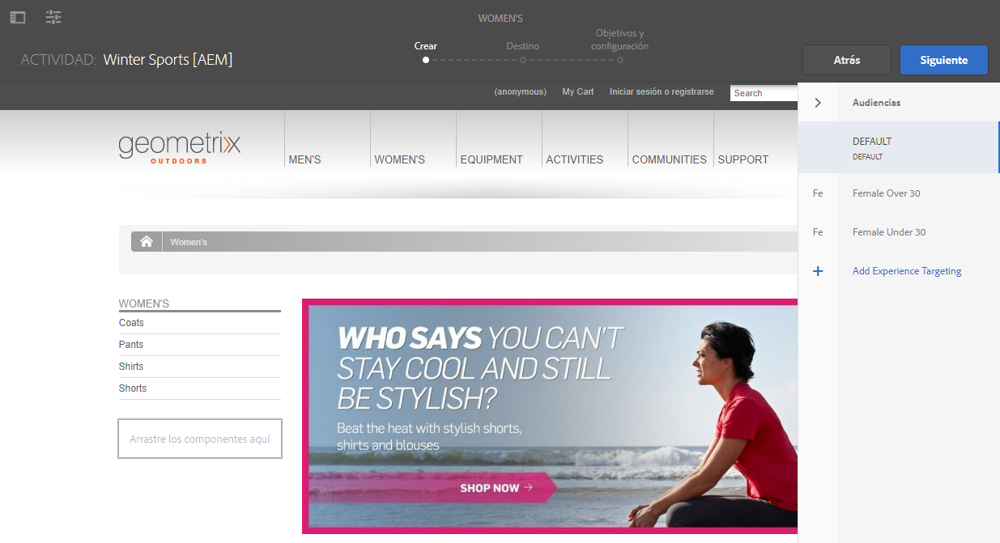

Al seleccionar una experiencia distinta, el componente Imagen muestra la oferta para esa experiencia.

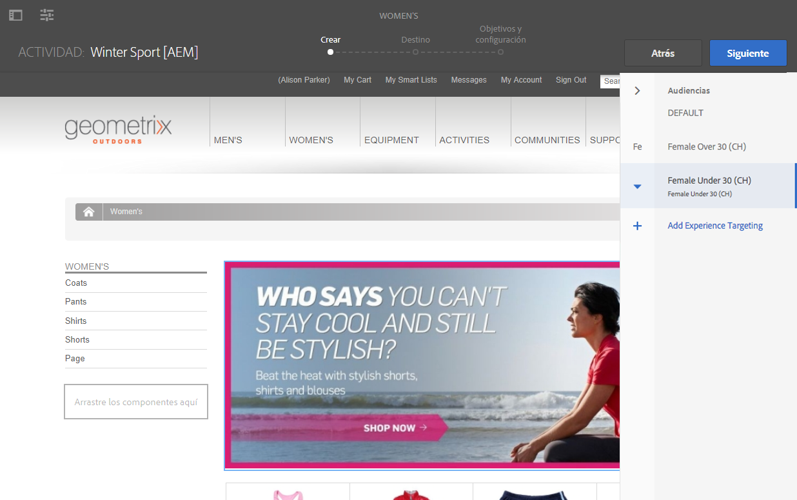

Cuando se selecciona una experiencia y el componente segmentado no incluye una oferta para esa experiencia, el componente muestra la opción **Agregar oferta** superpuesta a la oferta predeterminada semitransparente. Cuando no se ha creado ninguna oferta para una experiencia, se muestra la oferta **predeterminada** para el segmento asignado a la experiencia.

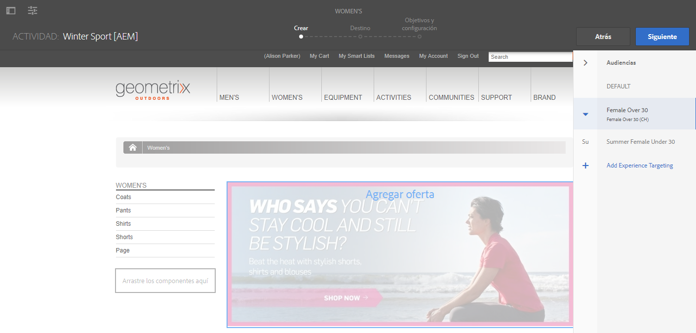

La experiencia predeterminada también se muestra cuando las propiedades del visitante no coinciden con ningún segmento asignado a las experiencias. Consulte [Adición de experiencias con el modo de direccionamiento](#adding-and-removing-experiences-using-targeting-mode).

### Ofertas personalizadas y ofertas de la biblioteca {#custom-offers-and-library-offers}

Las ofertas que [se crean en la página](/help/sites-authoring/content-targeting-touch.md#adding-a-custom-offer) y se utilizan para una experiencia única se denominan ofertas personalizadas. La siguiente imagen está superpuesta al contenido de una oferta personalizada:

Las ofertas que [se añaden desde una biblioteca de ofertas](/help/sites-authoring/content-targeting-touch.md#adding-an-offer-from-an-offer-library) se superponen a la imagen siguiente:

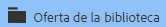

Puede guardar ofertas personalizadas en una biblioteca de ofertas si decide que quiere volver a utilizarlas. También puede convertir una oferta de la biblioteca en una oferta personalizada si desea modificar el contenido de una experiencia. Tras la edición, puede volver a guardar la oferta en la biblioteca.

### Adición y eliminación de experiencias con el modo de Orientación {#adding-and-removing-experiences-using-targeting-mode}

Con el paso Crear del [proceso de orientación](/help/sites-authoring/content-targeting-touch.md#the-targeting-process-create-target-and-goals-settings), puede añadir y quitar experiencias. Además, puede duplicar una experiencia y cambiarle el nombre.

#### Adición de experiencias con el modo de Orientación {#adding-experiences-using-targeting-mode}

Para añadir una experiencia:

1. Para agregar una experiencia, toque o haga clic en **+ Agregar segmentación de experiencias** que aparece debajo de las experiencias existentes en el panel **Audiencias**.
1. Seleccione un público. De forma predeterminada, ese nombre es el nombre de la experiencia. Puede escribir otro nombre, si lo desea. Toque o haga clic en **OK**.

#### Eliminación de experiencias con el modo de Orientación {#removing-experiences-using-targeting-mode}

Para eliminar una experiencia:

1. Toque o haga clic en la flecha situada junto al nombre de la experiencia.

   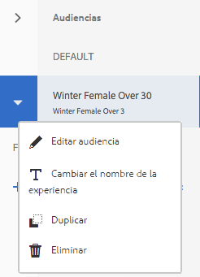

1. Haga clic en **Eliminar**.

#### Cambio del nombre de las experiencias con el modo de Orientación {#renaming-experiences-using-targeting-mode}

Para cambiar el nombre de las experiencias con el modo de Orientación:

1. Toque o haga clic en la flecha situada junto al nombre de la experiencia.
1. Haga clic en **Cambiar nombre de experiencia** y escriba el nombre nuevo.
1. Toque o haga clic en otro lugar de la pantalla para guardar los cambios.

#### Edición de audiencias con el modo de Orientación {#editing-audiences-using-targeting-mode}

Para editar las audiencias con el modo de Orientación:

1. Toque o haga clic en la flecha situada junto al nombre de la experiencia.
1. Haga clic en **Editar audiencia** y seleccione una audiencia nueva.
1. Haga clic en **Aceptar**.

#### Duplicar experiencias con el modo de Orientación {#duplicating-experiences-using-targeting-mode}

Para copiar experiencias con el modo de Orientación:

1. Toque o haga clic en la flecha situada junto al nombre de la experiencia.
1. Haga clic en **Duplicar** y elija el público.
1. Cambie el nombre de la experiencia, si lo desea, y haga clic en **OK**.

### Creación de ofertas con el modo de Orientación {#creating-offers-using-targeting-mode}

Oriente un componente para crear ofertas para las experiencias. Los componentes orientados proporcionan el contenido que se utiliza como ofertas para las experiencias.

* [Oriente un componente existente](/help/sites-authoring/content-targeting-touch.md#creating-a-default-offer-by-targeting-an-existing-component). El contenido se convierte en la oferta de la Experiencia predeterminada.
* [Agregue un componente Target](/help/sites-authoring/content-targeting-touch.md#creating-an-offer-by-adding-a-target-component) y, a continuación, agregue contenido al componente.

Una vez que un componente está orientado, puede añadir ofertas para cada experiencia:

* [Añadir ofertas personalizadas](/help/sites-authoring/content-targeting-touch.md#adding-a-custom-offer).
* [Añadir ofertas de una biblioteca](/help/sites-authoring/content-targeting-touch.md#adding-an-offer-from-an-offer-library).

Las siguientes herramientas están disponibles para trabajar con ofertas:

* [Añadir una oferta personalizada a una biblioteca de ofertas](/help/sites-authoring/content-targeting-touch.md#adding-a-custom-offer-to-a-library).
* [Conversión de una oferta de la biblioteca en una oferta personalizada](/help/sites-authoring/content-targeting-touch.md#converting-a-library-offer-to-a-custom-library).
* [Abra una oferta de la biblioteca y edite el contenido.](/help/sites-authoring/content-targeting-touch.md#editing-a-library-offer).

#### Creación de una oferta predeterminada mediante la segmentación de un componente existente {#creating-a-default-offer-by-targeting-an-existing-component}

Oriente un componente de la página para utilizarlo como la oferta para la experiencia predeterminada de la actividad. Cuando se segmenta un componente, se envuelve en un componente de Target y su contenido se convierte en la oferta para la experiencia predeterminada.

Al orientar un componente, solo ese componente se puede utilizar en la oferta. No se puede eliminar el componente de la oferta ni añadir otros componentes a la oferta.

Realice el siguiente procedimiento después de [inicio del proceso de segmentación](/help/sites-authoring/content-targeting-touch.md#the-targeting-process-create-target-and-goals-settings).

1. Toque o haga clic en el componente que se va a orientar. Aparece la barra de herramientas del componente, similar a la del ejemplo siguiente.

   

1. Toque o haga clic en el icono Target.

   

   El contenido del componente es la oferta para la experiencia predeterminada. Al orientar un componente, el nodo predeterminado se replicará para cada experiencia. Esto es necesario para editar el nodo de contenido adecuado durante la creación específica de la experiencia. Para estas experiencias no predeterminadas, [agregue una oferta personalizada](/help/sites-authoring/content-targeting-touch.md#adding-a-custom-offer) o [agregue una oferta de la biblioteca](/help/sites-authoring/content-targeting-touch.md#adding-an-offer-from-an-offer-library).

#### Creación de una oferta mediante la adición de un componente Target {#creating-an-offer-by-adding-a-target-component}

Añada un componente Target para crear la oferta para la experiencia predeterminada. El componente Target es un contenedor para otros componentes, y los componentes que se encuentran en él se orientan. Al utilizar el componente Target, puede añadir varios componentes para crear una oferta. Asimismo, puede utilizar distintos componentes en cada experiencia para crear diferentes ofertas.

Consulte [Configurar las opciones del componente Target](/help/sites-authoring/content-targeting-touch.md#configuring-target-component-options) para obtener información sobre cómo personalizar este componente.

>[!NOTE]
>
>Las ofertas que crea mediante la [consola Ofertas](/help/sites-authoring/offerlib.md) también pueden contener varios componentes. Estas ofertas pertenecen a una biblioteca de ofertas y se pueden utilizar para varias experiencias.

Como el componente Target es un contenedor, aparece como un área de colocación para otros componentes.

En el modo Target, el componente Target tiene un borde azul y el mensaje de destino indica la naturaleza de destino.

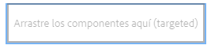

En el modo de Edición, el componente Target tiene un icono de diana.

Los componentes que arrastra al componente Target son componentes orientados.

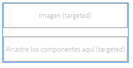

Al añadir un componente al componente Target, proporciona contenido para una experiencia determinada. Para especificar la experiencia, debe seleccionar la experiencia antes de añadir los componentes.

Puede añadir un componente Target a la página en modo de Edición o en modo de Target. Puede añadir componentes al componente Target solo en modo de Target. El componente Target pertenece al grupo de componentes Personalización .

Si edita contenido de destino, debe tocar o hacer clic en **Iniciar orientación **antes de poder hacerlo.

1. Arrastre el componente Target a la página en la que desea que aparezca la oferta.
1. De forma predeterminada, no se establece ningún identificador de ubicación. Toque o haga clic en la rueda de engranaje de configuración para definir la ubicación.

   >[!NOTE]
   >
   >Si la establece el administrador, es posible que deba definir la ubicación de forma explícita.
   >
   >Los administradores pueden decidir si esta configuración es necesaria en **https://&lt;host>:&lt;port>/system/console/configMgr/com.day.cq.personalization.impl.servlets.TargetingConfigurationServlet**
   Para requerir que los usuarios introduzcan una ubicación, active la casilla de verificación **Forzar ubicación**.

1. Seleccione la experiencia para la que desea crear la oferta.
1. Cree la oferta:

   * Para la experiencia predeterminada, arrastre los componentes al área de colocación orientada y edite las propiedades de los componentes como de costumbre para crear el contenido de la oferta.
   * Para experiencias no predeterminadas, puede: [añadir una oferta personalizada](#adding-a-custom-offer) o [añadir una oferta de biblioteca](/help/sites-authoring/content-targeting-touch.md#adding-an-offer-from-an-offer-library).

#### Adición de una oferta personalizada {#adding-a-custom-offer}

Para crear una oferta, cree el contenido de un componente orientado en modo de Orientación. Cuando crea una oferta personalizada, se utiliza como la oferta para una sola experiencia.

Si decide que la oferta se puede utilizar para otras experiencias, puede crear una oferta personalizada y [agregarla a la biblioteca](/help/sites-authoring/content-targeting-touch.md#adding-a-custom-offer-to-a-library). Para obtener información sobre el uso de la consola Ofertas para crear una oferta reutilizable, consulte [Agregar una oferta a una biblioteca de ofertas](/help/sites-authoring/offerlib.md#add-an-offer-to-an-offer-library).

1. Seleccione la experiencia a la que va a añadir la oferta.
1. Para mostrar el menú de componentes, toque o haga clic en el componente orientado al que va a añadir la oferta.

   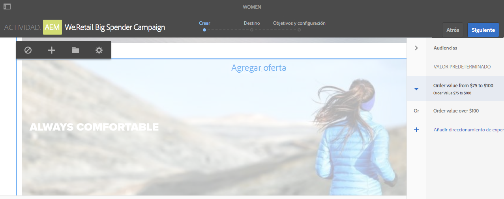

1. Toque o haga clic en el icono + .

   El contenido de la oferta predeterminada se utiliza como la oferta para la experiencia actual.

1. Toque o haga clic en la oferta para mostrar el menú de oferta y, a continuación, toque o haga clic en el icono de edición.

   

1. Edite el contenido del componente.

#### Adición de una oferta desde una biblioteca de ofertas {#adding-an-offer-from-an-offer-library}

Agregue una oferta de la [biblioteca de ofertas](/help/sites-authoring/offerlib.md) a una experiencia. Puede agregar cualquier oferta de la biblioteca de la marca que está actualmente orientando.

No puede agregar ofertas de la biblioteca a la experiencia predeterminada.

1. Seleccione la experiencia a la que va a añadir la oferta.
1. Para mostrar el menú de componentes, toque o haga clic en el componente orientado al que va a añadir la oferta.

   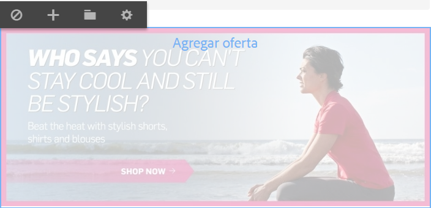

1. Toque o haga clic en el icono Carpeta.

   

1. Seleccione la oferta de la biblioteca y, a continuación, toque o haga clic en el icono de la marca.

   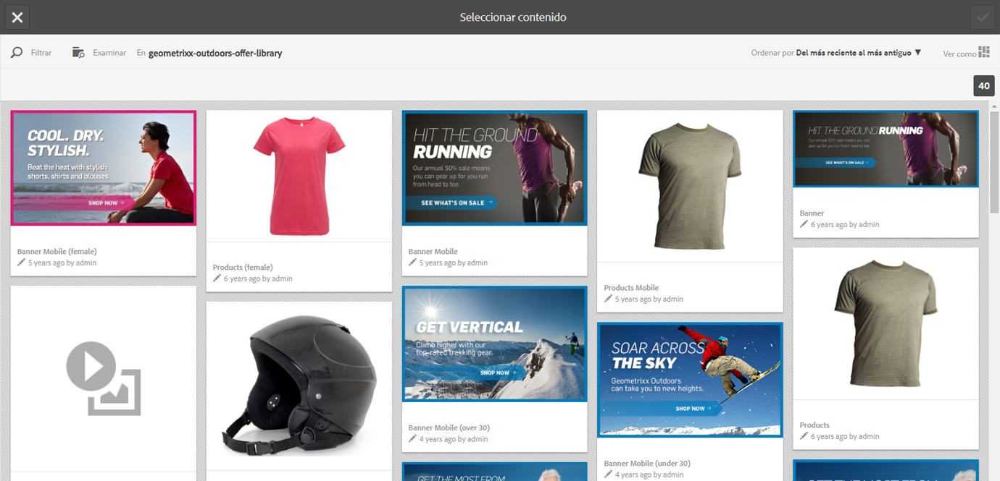

   El selector de ofertas le permite examinar o filtrar las ofertas. Al examinar o filtrar, puede que también desee clasificar las ofertas y cambiar la manera de verlas. El número en la parte superior derecha indica cuántas ofertas están disponibles en la biblioteca actual.

   * Toque o haga clic en **Examinar** para desplazarse a otra carpeta. Se abrirá el panel de navegación; haga clic en la flecha para navegar por las carpetas. Vuelva a tocar o hacer clic en **Examinar** para cerrar el panel de navegación.

   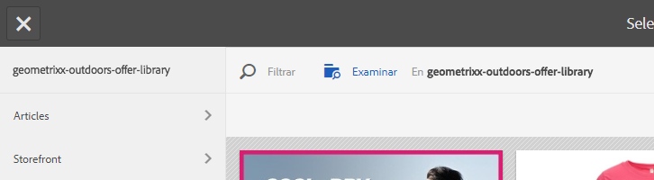

   * Toque o haga clic en **Filtrar** para filtrar las ofertas por palabras clave o etiquetas. Introduzca palabras clave y seleccione etiquetas en el menú desplegable. Toque o haga clic en **Filtro** para cerrar el panel de filtrado.

   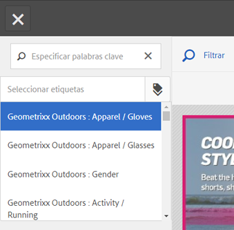

   * Para cambiar la manera de ordenar las ofertas, toque o haga clic en la flecha al lado de **La más reciente a la más antigua**. Las ofertas se pueden ordenar de la más reciente a la más antigua o de la más antigua a la más reciente.

   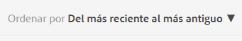

   Toque o haga clic en el icono junto a **Ver como** para ver las ofertas como mosaicos o como una lista.

   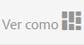

#### Adición de una oferta personalizada a una biblioteca {#adding-a-custom-offer-to-a-library}

Añada una oferta personalizada a la [biblioteca de ofertas](/help/sites-authoring/offerlib.md) cuando desee volver a utilizarla como la oferta para experiencias múltiples. Puede agregar ofertas a la biblioteca de la marca actual que está segmentando.

Para obtener información sobre el uso de la consola Ofertas para crear una oferta reutilizable, consulte [Agregar una oferta a una biblioteca de ofertas](/help/sites-authoring/offerlib.md#add-an-offer-to-an-offer-library).

1. Seleccione la experiencia para mostrar la oferta personalizada.
1. Toque o haga clic en la oferta personalizada para mostrar el menú de oferta y, a continuación, toque o haga clic en el botón **Guardar oferta en la biblioteca de ofertas** icono.

   

1. Escriba un nombre para la oferta, seleccione la biblioteca a la que está agregando la oferta y, a continuación, toque o haga clic en el icono de marca de verificación.

#### Conversión de una oferta de la biblioteca en una biblioteca personalizada {#converting-a-library-offer-to-a-custom-library}

Convierta una oferta de la biblioteca en una oferta personalizada para cambiar la oferta para la experiencia actual sin cambiar la oferta en otras experiencias.

1. Seleccione la experiencia para mostrar la oferta de la biblioteca.
1. Toque o haga clic en la oferta de la biblioteca para mostrar el menú de oferta y, a continuación, toque o haga clic en el icono Convertir a oferta en línea .

   

#### Edición de una oferta de la biblioteca {#editing-a-library-offer}

Abra una oferta de la biblioteca de una experiencia en modo de Orientación para editar la oferta. Los cambios que realice aparecerán en todas las experiencias que utilicen la oferta.

1. Seleccione la experiencia para mostrar la oferta de la biblioteca.
1. Convierta la oferta de la biblioteca en una oferta local o personalizada. Consulte [Conversión de una oferta de la biblioteca en una biblioteca personalizada](#converting-a-library-offer-to-a-custom-library).
1. Edite el contenido de la oferta.

1. Vuelva a guardarlo en la biblioteca. Consulte [Adición de una oferta personalizada a una biblioteca](#adding-a-custom-offer-to-a-library).

## Target: Configuración de las audiencias {#target-configuring-the-audiences}

El paso Target del [proceso de orientación](/help/sites-authoring/content-targeting-touch.md#the-targeting-process-create-target-and-goals-settings) implica la asignación de públicos a las experiencias con que ha trabajado en el paso Crear. En la página Target se muestran los públicos a que se orienta cada experiencia. Puede especificar o cambiar el público para cada experiencia. Si utiliza Adobe Target, también puede crear pruebas A/B que le permitan dirigir el porcentaje de tráfico de una audiencia a una experiencia concreta.

### Si usa el direccionamiento de AEM o Adobe Target (segmentación de experiencias)… ... {#if-you-are-using-aem-targeting-or-adobe-target-experience-targeting}

Los públicos aparecen en el lado izquierdo del diagrama de asignación, y las experiencias en el lado derecho.

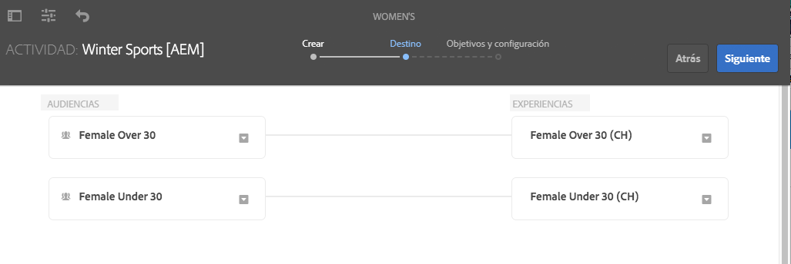

Defina un público con un segmento. La configuración de nube de la página determina los segmentos que están disponibles para usted. Cuando la página no está asociada a una configuración de nube de Adobe Target, los segmentos de AEM están disponibles para definir públicos. Cuando la página está asociada con una configuración de nube de Adobe Target, se utilizan segmentos de Target.

Para obtener información sobre los motores de segmentación, consulte [Motor de segmentación](/help/sites-authoring/personalization.md#targeting-engine).

Una experiencia no debe utilizar más de un público. Aparece un símbolo de advertencia junto a una experiencia cuando se asigna a una audiencia asignada a otra experiencia.

### Asociación de experiencias con audiencias (AEM o Adobe Target) {#associating-experiences-with-audiences-aem-or-adobe-target}

Utilice el siguiente procedimiento para asociar una experiencia a una audiencia al usar AEM segmentación (o segmentación de experiencias de Adobe Target):

1. Toque o haga clic en la flecha desplegable situada junto al cuadro de audiencia asignado a la experiencia.
1. De manera opcional, toque o haga clic en **Editar** y, a continuación, escriba una palabra clave para buscar el segmento que desee.
1. En la lista de públicos, seleccione el público y toque o haga clic en **OK**.

### Si utiliza la prueba A/B (Adobe Target)… ... {#if-you-are-using-a-b-testing-adobe-target}

Si tiene una actividad de prueba A/B, las audiencias están a la izquierda, el porcentaje de visitas a cada experiencia está en el medio y las experiencias están a la derecha.

Puede cambiar los porcentajes, siempre que sumen el cien por ciento. Varias experiencias pueden usar una audiencia en las pruebas A/B.

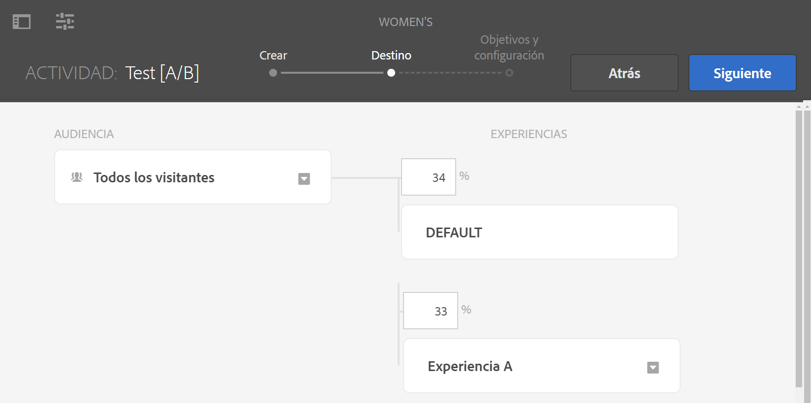

### Asociación de audiencias y porcentajes de tráfico con pruebas A/B {#associating-audiences-and-traffic-percentages-with-a-b-testing}

1. Toque o haga clic en el cuadro desplegable situado junto a la audiencia asignada a la experiencia.
1. (Opcional) Haga clic en **Editar** y luego escriba una palabra clave para buscar el segmento deseado.
1. Toque o haga clic en **OK.**
1. Introduzca porcentajes para configurar la forma en que el tráfico del público se dirige a cada experiencia. El número total debe ser igual a 100.
1. (Opcional) Edite el nombre de la experiencia haciendo clic en el menú desplegable junto al nombre de la experiencia.

## Objetivos y configuración: Configuración de la actividad y configuración de objetivos {#goals-settings-configuring-the-activity-and-setting-goals}

El paso Objetivos y configuración del [proceso de direccionamiento](/help/sites-authoring/content-targeting-touch.md#the-targeting-process-create-target-and-goals-settings) consiste en configurar el comportamiento de la actividad de la marca. Especifique cuándo comienza y finaliza la actividad, así como la prioridad de la actividad. Además, realiza un seguimiento de los objetivos. De forma específica, puede decidir qué desea medir con sus actividades.

Las métricas de objetivo solo están disponibles si usa Adobe Target como motor de orientación. Debe definir al menos una métrica de objetivo. Si tiene Adobe Analytics configurado y una configuración de nube de A4T Analytics, puede seleccionar si desea que la fuente de informes sea Adobe Target o Adobe Analytics.

Las métricas de objetivo solo se miden para la campaña publicada.

Si utiliza AEM como motor de orientación:

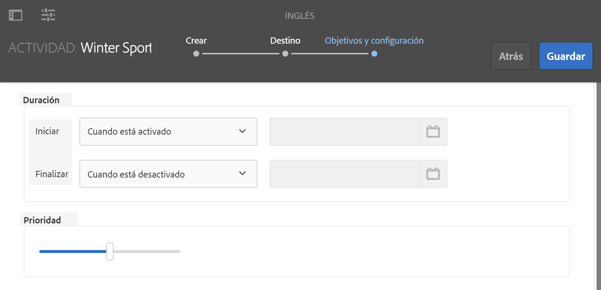

Si utiliza Adobe Target como motor de orientación:

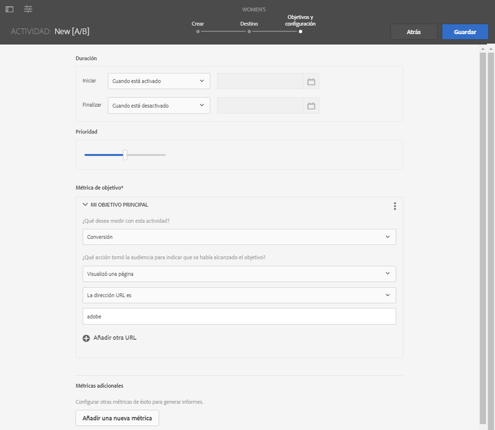

Si utiliza Adobe Target como motor de determinación de objetivos y tiene A4T Analytics configurado en la cuenta, tiene un menú desplegable de **Fuente de informes** adicional:

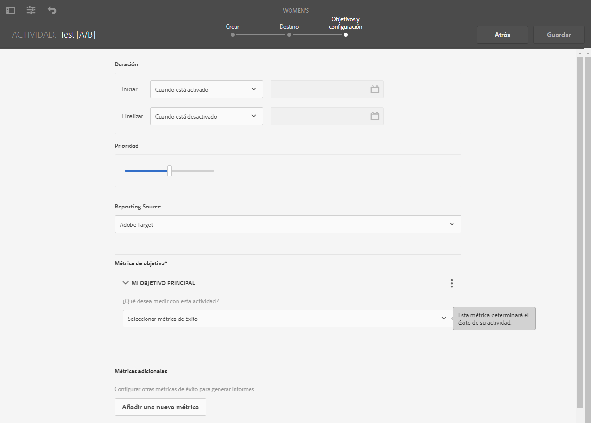

Las métricas de éxito siguientes están disponibles (se utilizan para publicar únicamente):

<table> 
 <tbody> 
  <tr> 
   <td><strong>Conversión</strong></td> 
   <td>
El porcentaje de visitantes que hicieron clic en cualquier parte de la experiencia que se está probando. Las conversiones se pueden contabilizar una vez por visitante o cada vez que un visitante completa una conversión. La métrica de conversión se configura en una de las siguientes:
 
    <ul> 
     <li><strong>Visualizó una página</strong> - Puede definir qué página ha visto la audiencia seleccionando: <strong>La dirección URL es</strong> y, a continuación, definir la dirección URL o varias direcciones URL, o bien seleccionar <strong>La dirección URL contiene</strong> y luego agregar una ruta o palabra clave.</li> 
     <li><strong>Visualizó un mbox</strong> : puede definir qué mbox ha visto la audiencia introduciendo el nombre del mbox. Para introducir varios mboxes, haga clic en <strong>Adición de un mbox</strong>.</li> 
    </ul> </td> 
  </tr> 
  <tr> 
   <td><strong>Ingresos</strong></td> 
   <td>
Ingresos generados por la visita. Puede elegir entre las siguientes métricas de ingresos:
 
    <ul> 
     <li>Ingresos por visitante (RPV)</li> 
     <li>Valor de pedido promedio (AOV)</li> 
     <li>Ventas totales </li> 
     <li>Pedidos</li> 
    </ul> 
Para cualquiera de estas opciones, si se ha visto un mbox indica que se ha alcanzado el objetivo. Puede definir uno o varios mbox.
 </td> 
  </tr> 
  <tr> 
   <td><strong>Compromiso</strong></td> 
   <td>
Puede medir tres tipos de participación:
 
    <ul> 
     <li>Vistas de la página</li> 
     <li>Puntuación personalizada</li> 
     <li>Tiempo pasado en el sitio</li> 
    </ul> </td> 
  </tr> 
 </tbody> 
</table>

Además, hay configuraciones avanzadas que le permiten determinar cómo contar las métricas de éxito. Las opciones incluyen contar la métrica por impresión o una vez por visitante y elegir si mantener al usuario en la actividad o eliminarlo.

Use la configuración avanzada para determinar qué sucede **después** de que un usuario llegue a la métrica de objetivo. En la tabla siguiente se muestran las opciones disponibles.

<table> 
 <tbody> 
  <tr> 
   <td><strong>Cuando un usuario encuentra esta métrica de objetivo...</strong></td> 
   <td><strong>Selecciona lo siguiente para que suceda...</strong></td> 
  </tr> 
  <tr> 
   <td><strong>Aumentar recuento y mantener el usuario en la actividad</strong></td> 
   <td>Especifique cómo se incrementa el recuento: 
    <ul> 
     <li>Una vez por participante</li> 
     <li>En cada impresión, excluyendo las actualizaciones de página</li> 
     <li>En cada impresión</li> 
    </ul> </td> 
  </tr> 
  <tr> 
   <td><strong>Aumentar recuento, liberar usuario y permitir la reentrada</strong></td> 
   <td>Seleccione la experiencia que el visitante ve si vuelve a participar en la actividad: 
    <ul> 
     <li>La misma experiencia</li> 
     <li>Experiencia aleatoria</li> 
     <li>Experiencia no vista</li> 
    </ul> </td> 
  </tr> 
  <tr> 
   <td><strong>Recuento de incrementos, usuario de versiones y reentrada de barras</strong></td> 
   <td>Determine lo que el usuario ve en lugar del contenido de la actividad: 
    <ul> 
     <li>La misma experiencia, sin seguimiento</li> 
     <li>Contenido predeterminado u otro contenido de actividad</li> 
    </ul> </td> 
  </tr> 
 </tbody> 
</table>

Consulte [Documentación de Adobe Target](https://experienceleague.adobe.com/docs/target/using/activities/success-metrics/success-metrics.html?lang=es) para obtener más información sobre las métricas de éxito.

### Configuración (AEM Targeting) {#configuring-settings-aem-targeting}

Para configurar las opciones si se utiliza AEM segmentación:

1. Para especificar cuándo se inicia la actividad, utilice el **Inicio** menú desplegable para seleccionar uno de los siguientes valores:

   * **Cuando se activa**: La actividad se inicia cuando se activa la página que contiene el contenido de destino.
   * **Fecha y hora especificadas**: una hora determinada. Cuando seleccione esta opción, pulse o haga clic en el icono de calendario, seleccione una fecha y especifique la hora a la que desea iniciar la actividad.

1. Para especificar cuándo finaliza la actividad, utilice el **Fin** menú desplegable para seleccionar uno de los siguientes valores:

   * **Cuando está desactivado**: La actividad finaliza cuando la página que contiene el contenido de destino se desactiva.
   * **Fecha y hora especificadas**: una hora determinada. Cuando seleccione esta opción, toque o haga clic en el icono de calendario, seleccione una fecha y especifique la hora a la que desea finalizar la actividad.

1. Para especificar una prioridad para la actividad, utilice el control deslizante para seleccionar **Bajo**, **Normal** o **Alto**.

### Configuración de objetivos y configuración (Adobe Target) {#configuring-goals-settings-adobe-target}

Para configurar objetivos y configuraciones si se usa Adobe Target:

1. Para especificar cuándo se inicia la actividad, utilice el **Inicio** menú desplegable para seleccionar uno de los siguientes valores:

   * **Cuando se activa**: La actividad se inicia cuando se activa la página que contiene el contenido de destino.
   * **Fecha y hora especificadas**: una hora determinada. Cuando seleccione esta opción, pulse o haga clic en el icono de calendario, seleccione una fecha y especifique la hora a la que desea iniciar la actividad.

1. Para especificar cuándo finaliza la actividad, utilice el **Fin** menú desplegable para seleccionar uno de los siguientes valores:

   * **Cuando está desactivado**: La actividad finaliza cuando la página que contiene el contenido de destino se desactiva.
   * **Fecha y hora especificadas**: una hora determinada. Cuando seleccione esta opción, toque o haga clic en el icono de calendario, seleccione una fecha y especifique la hora a la que desea finalizar la actividad.

1. Para especificar una prioridad para la actividad, utilice el control deslizante para seleccionar **Bajo**, **Normal** o **Alto**.
1. Si ha configurado Adobe Analytics con su cuenta de Adobe Target, verá la **Fuente de informes** menú desplegable. Seleccione **Adobe Target** o **Adobe Analytics** como fuente.

   Si selecciona **Adobe Analytics**, seleccione la empresa y el grupo de informes. Si selecciona **Adobe Target**, no se requiere ninguna acción.

   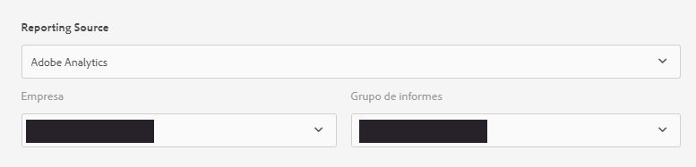

1. En el área **Métrica de objetivo**, en **Mi objetivo principal**, seleccione la métrica de éxito que desee rastrear (conversión, ingresos, participación) y especifique cómo se mide esa métrica (o qué acción toma la audiencia para indicar que se ha alcanzado un objetivo). Consulte la definición de las métricas de objetivo en la tabla anterior y consulte la [documentación de Adobe Target](https://experienceleague.adobe.com/docs/target/using/activities/success-metrics/success-metrics.html?lang=es) sobre las métricas de éxito.

   Para cambiar el nombre del objetivo, haga clic en los tres puntos de la esquina superior derecha y seleccione **Cambiar nombre**.

   Si necesita borrar todos los campos, haga clic en los tres puntos de la esquina superior derecha y seleccione **Borrar todos los campos**.

   Todas las métricas también tienen configuraciones avanzadas que puede definir. Seleccione **Configuraciones avanzadas** para acceder a las mismas. Consulte la definición de cómo se cuentan las métricas de éxito en la tabla anterior y consulte la [documentación de Adobe Target](https://experienceleague.adobe.com/docs/target/using/activities/success-metrics/success-metrics.html?lang=es).

   >[!NOTE]
   Debe tener un objetivo definido como mínimo.

   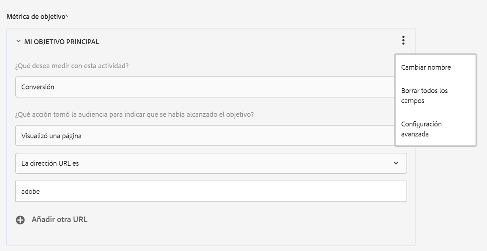

   >[!NOTE]
   Si falta información en la métrica, la rodea con una línea roja.

1. Haga clic en **Agregar nueva métrica** para configurar métricas de éxito adicionales.

   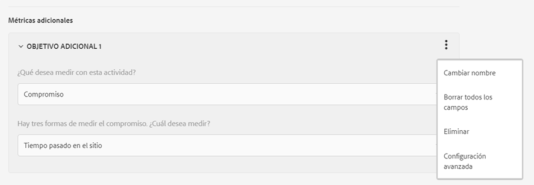

   >[!NOTE]
   Para quitar los objetivos adicionales, toque o haga clic en los tres puntos y en **Eliminar**. AEM requiere que haya definido al menos un objetivo.

1. Si desea tener más control sobre cómo se contabilizan las métricas de éxito, toque o haga clic en **Configuraciones avanzadas** para acceder a las mismas.
1. Haga clic en **Guardar**.

Una vez configuradas, puede [ver el rendimiento de las actividades](/help/sites-authoring/activitylib.md#viewing-performance-and-converting-winning-experiences-a-b-test) que usan Adobe Target (orientación de la experiencia o de la prueba A/B). Además, con la orientación de la prueba A/B, puede [convierta a los ganadores.](/help/sites-authoring/activitylib.md#viewing-performance-and-converting-winning-experiences-a-b-test)

## Simulación de una experiencia {#simulating-an-experience}

Simule la experiencia de un visitante para comprobar que el contenido de la página se muestra como se espera según el diseño del contenido orientado. Al simular, cargue diferentes perfiles de usuario y vea el contenido de destino para ese usuario.

Los siguientes criterios determinan el contenido que aparece al simular la experiencia de un visitante:

* Los datos del almacén de sesiones del usuario (a través de Context Hub).
* La variable [Actividades que están activadas](/help/sites-authoring/activitylib.md).
* La variable [reglas que definen los segmentos](/help/sites-administering/campaign-segmentation.md).
* El contenido de las experiencias en los componentes de Target.
* La variable [configuración del motor de orientación](/help/sites-authoring/activitylib.md).

Si aparece contenido inesperado en la página al cargar un perfil, compruebe la configuración de cada elemento de esta lista.

>[!NOTE]
Si utiliza la prueba A/B, al simular, las experiencias se muestran según el porcentaje de tráfico. Esto se controla mediante Adobe Target, lo que puede dar lugar a resultados inesperados para los autores. (La actividad del autor se sincroniza con las configuraciones específicas que permiten volver a evaluar durante la simulación). Es posible que los autores deban actualizar para ver las demás experiencias en función de su configuración de tráfico.

Para simular la experiencia del visitante, utilice las siguientes herramientas:

* La actividad Simulación en modo de Orientación: en la página se muestran las ofertas para el usuario seleccionado actualmente en ContextHub. Puede editar las ofertas dirigidas al usuario.
* Modo de vista previa: utilice ContextHub para seleccionar a los usuarios y las ubicaciones que cumplen los criterios de los segmentos en que están basadas las experiencias. Cuando cambian las selecciones de ContextHub, el contenido de destino cambia según corresponda.

1. Para cambiar al modo de Previsualización, en la barra de herramientas, toque o haga clic en **Previsualización**.
1. En la barra de herramientas, toque o haga clic en el icono de ContextHub.

   

1. Utilice ContextHub para cambiar las propiedades del contexto. Por ejemplo, toque o haga clic en la propiedad Persona para seleccionar un usuario diferente.

   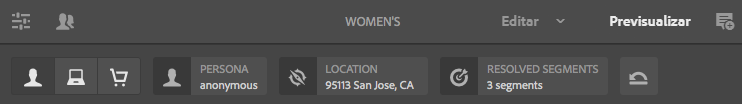

   La página cambia para mostrar el contenido dirigido al contexto actual.

1. Para realizar cambios en las ofertas que se muestran, cambie al modo de Orientación. Con la actividad de simulación seleccionada, edite las ofertas para el contexto configurado en el modo de vista previa.

## Configuración de las opciones de los componentes de Target {#configuring-target-component-options}

Puede personalizar el componente Target accediendo a las opciones del componente de una de las dos formas siguientes:

1. Una vez que haya orientado el componente, en el componente Target, toque o haga clic en el componente y, a continuación, en el icono de configuración (engranaje).

   

   AEM muestra la ventana de opciones del componente Target.

   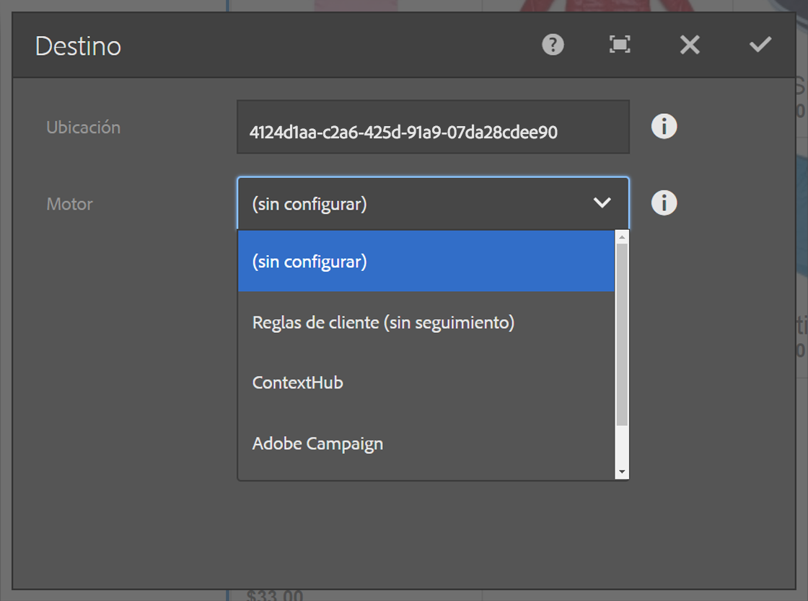

1. Como alternativa, para acceder a estas configuraciones en modo de pantalla completa, en la ventana de opciones del componente Target, toque o haga clic en el icono de pantalla completa.

   

   AEM muestra la ventana de opciones del componente Target a pantalla completa.

   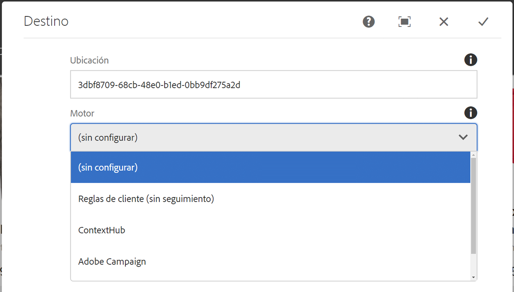

1. Configure el componente Target tal y como se describe en las tablas siguientes.

<table> 
 <tbody> 
  <tr> 
   <td><strong>Opción</strong></td> 
   <td><strong>Descripción</strong></td> 
  </tr> 
  <tr> 
   <td><strong>Lugar de residencia</strong></td> 
   <td>
La ubicación es una cadena que da un nombre a la ubicación del contenido de destino y conecta ofertas con lugares (o ubicaciones o componentes) en la página donde se deben colocar esas ofertas.
 
Este campo es un valor genérico.
 
Si introduce una oferta en un componente, la oferta recuerda el identificador de la ubicación. Al ejecutar la página, el motor evalúa los segmentos del usuario y, de acuerdo con ello, soluciona las experiencias de las campañas activas que deben mostrarse. A continuación, comprueba los ID de ubicación en la página e intenta hacer coincidir las ofertas con esos ID de ubicación.
 </td> 
  </tr> 
  <tr> 
   <td><strong>Motor</strong></td> 
   <td>Seleccionar entre <strong>Reglas del lado del cliente (sin seguimiento), Adobe Target, ContextHub, </strong>y<strong> Adobe Campaign </strong>dependiendo del motor que desee utilizar.</td> 
  </tr> 
 </tbody> 
</table>

Si selecciona Adobe Target como motor:

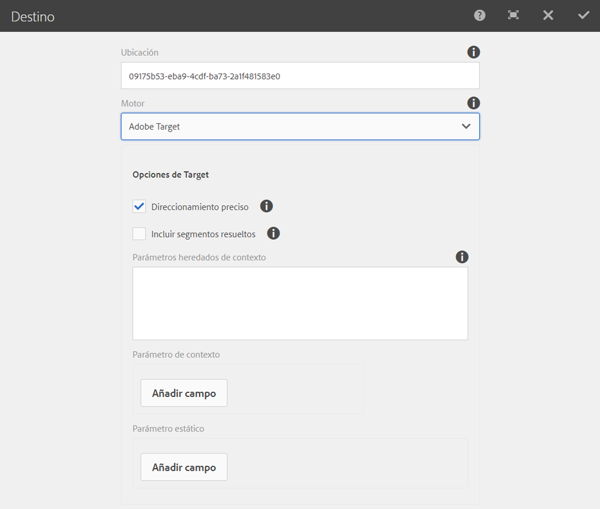

<table> 
 <tbody> 
  <tr> 
   <td><strong>Opción</strong></td> 
   <td><strong>Descripción</strong></td> 
  </tr> 
  <tr> 
   <td><strong>Direccionamiento preciso</strong></td> 
   <td>
Al habilitar el direccionamiento preciso, se indica al componente que espere a que los datos de Client Context o Context Hub estén disponibles antes de enviar la solicitud a Adobe Target. Puede aumentar el tiempo de carga. Para la creación, la orientación precisa siempre está activada.
 
Si selecciona la opción <strong>Segmentación precisa</strong> , el mbox realiza una <code>mboxDefine</code> primero y después de <code>mboxUpdate</code> posteriormente, lo que resulta en una solicitud de Ajax una vez que los datos están disponibles.
 
Si no selecciona el <strong>Segmentación precisa</strong> , el mbox realiza una <code>mboxCreate</code> lo que da como resultado una solicitud sincrónica inmediatamente (en este caso, es posible que no todos los datos de contexto estén disponibles aún).
 
<strong>Nota:</strong> La activación o desactivación de la orientación precisa en un componente específico no afecta a la configuración que haya establecido globalmente. Siempre puede seleccionar Orientación precisa en el componente para anular la configuración global.
 </td> 
  </tr> 
  <tr> 
   <td><strong>Incluir segmentos resueltos</strong></td> 
   <td>
Al seleccionar esta casilla de verificación, se incluyen todos los segmentos resueltos en la llamada de mbox y todos los parámetros configurados en la página y en el marco de trabajo.
 
Esto solo funciona en situaciones con XML API en que sincroniza segmentos de AEM. Si dispone de segmentos en AEM que Adobe Target no controla (como segmentos de script), esta opción le permite resolver el segmento en AEM y enviar información a Adobe Target de que el segmento está activo.
 </td> 
  </tr> 
  <tr> 
   <td><strong>Parámetros heredados de contexto</strong></td> 
   <td>Enumera los parámetros de contexto heredados del marco de trabajo de Adobe Target, si los hay, asociados a la página seleccionada.</td> 
  </tr> 
  <tr> 
   <td><strong>Parámetros de contexto</strong></td> 
   <td>Toque o haga clic en <strong>Añadir campo</strong> para configurar parámetros de contexto adicionales (lo mismo que está disponible en Target framework). Se aplican los parámetros de contexto añadidos al componente <i>only</i> al componente y no a otro componente, como sería el caso si hubiera añadido parámetros de contexto directamente a la infraestructura.</td> 
  </tr> 
  <tr> 
   <td><strong>Parámetros estáticos</strong></td> 
   <td>Toque o haga clic en <strong>Añadir campo</strong> para configurar parámetros estáticos adicionales (lo mismo que está disponible en la infraestructura de Target). Se aplican parámetros estáticos agregados al componente <i>only</i> al componente y no a otro componente, como sería el caso si hubiera añadido parámetros estáticos directamente a la infraestructura. Los parámetros estáticos no proceden del contexto (Client Context o ContextHub).</td> 
  </tr> 
 </tbody> 
</table>

>[!NOTE]
Al seleccionar un componente y hacerlo orientable, AEM también reemplaza el componente e introduce un componente de Adobe Target. (El componente Adobe Target no solo se utiliza cuando se añade manualmente a la página, sino también cuando se dirige a un componente existente).

Si selecciona Client Context (lado del cliente) como motor:

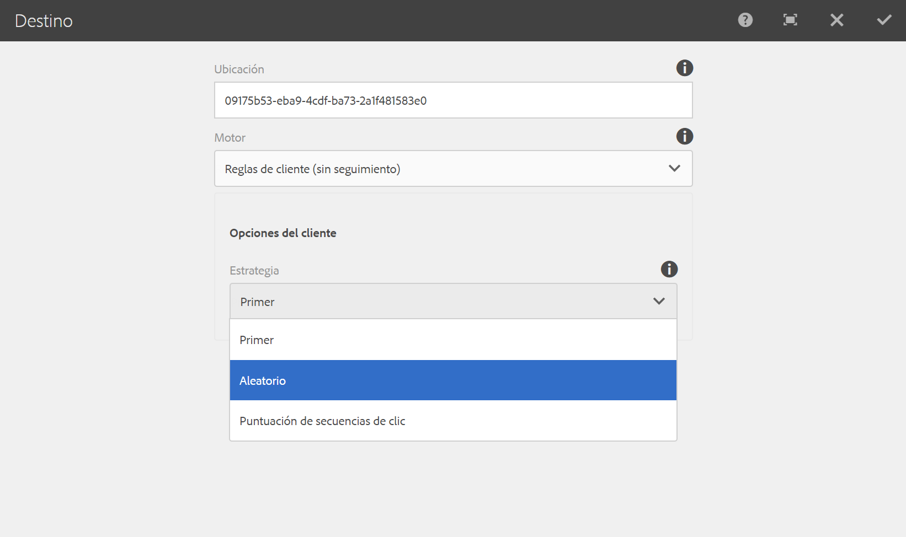

<table> 
 <tbody> 
  <tr> 
   <td><strong>Opción</strong></td> 
   <td><strong>Descripción</strong></td> 
  </tr> 
  <tr> 
   <td><strong>Opciones del lado del cliente: estrategia</strong></td> 
   <td>
Seleccione una de las siguientes opciones:
 
    <ul> 
     <li><strong>First</strong>: La experiencia superior de la lista, según se ha ordenado en la campaña.</li> 
     <li><strong>Aleatorio</strong>: Se utiliza cualquier experiencia.</li> 
     <li><strong>Puntuación del flujo de navegación</strong>: Se utilizan las etiquetas y las visitas de etiquetas relacionadas de las que se realiza un seguimiento en ClientContext. Se comparan las tasas de visitas de las etiquetas definidas en la página de teaser.</li> 
    </ul> </td> 
  </tr> 
 </tbody> 
</table>

Seleccione **Adobe Campaign** como motor si integra AEM con Adobe Campaign. Consulte [Integración de AEM con Adobe Campaign](/help/sites-administering/campaign.md) para obtener más información.

Seleccione **ContextHub** como motor si utiliza ContextHub para orientar. Consulte [Configuración de ContextHub.](/help/sites-administering/contexthub-config.md)
