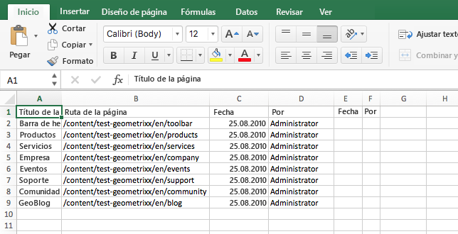
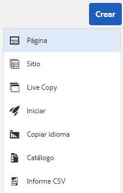
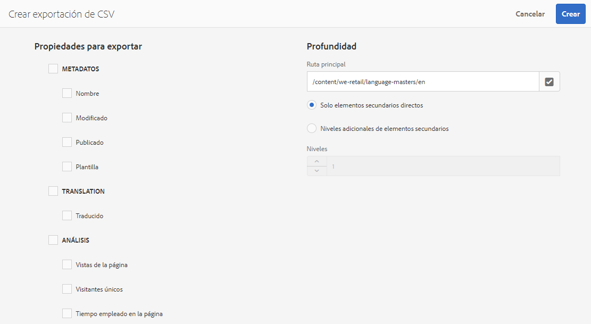

# Exportar a CSV  {#export-to-csv}

**Al crear una exportación de CSV** puede exportar información sobre las páginas a un archivo CSV en el sistema local.

* El archivo descargado se llama `export.csv`.
* El contenido depende de las propiedades que seleccione.
* Puede definir la ruta de la exportación, así como la profundidad.

>[!NOTE]
>
>Se utiliza la función de descarga (y el destino predeterminado) de su navegador.

El asistente para crear exportaciones de CSV permite seleccionar lo siguiente:

* Propiedades para exportar

   * Metadatos

      * Modificado
      * Publicado
   * Análisis

      * Vistas de la página
      * Visitantes únicos
      * Tiempo empleado en la página

* Profundidad

   * Ruta de acceso principal
   * Solo elementos secundarios directos
   * Niveles adicionales de elementos secundarios
   * Niveles

El archivo `export.csv` resultante se puede abrir en Excel o en cualquier otra aplicación compatible.

La opción crear **exportación de CSV** está disponible al explorar la consola **Sitios** (en vista de Lista): es una opción del menú desplegable **Crear**:

Para crear una exportación de CSV: 

1. Abra la consola **Sitios** y vaya hasta la ubicación deseada.
1. En la barra de herramientas, seleccione **Crear** y luego **Exportación de CSV** para abrir el asistente:

   

1. Seleccione las propiedades oportunas para la exportación.
1. Seleccione **Crear**.

