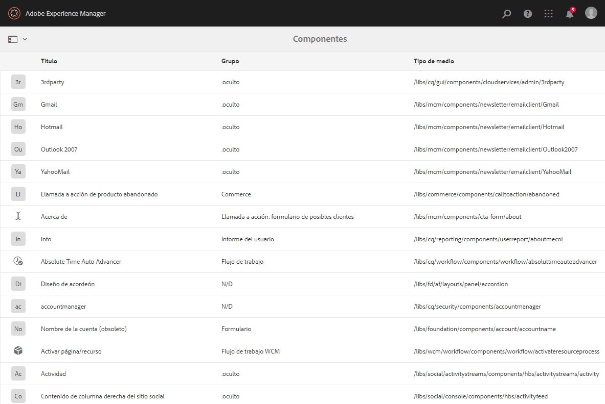
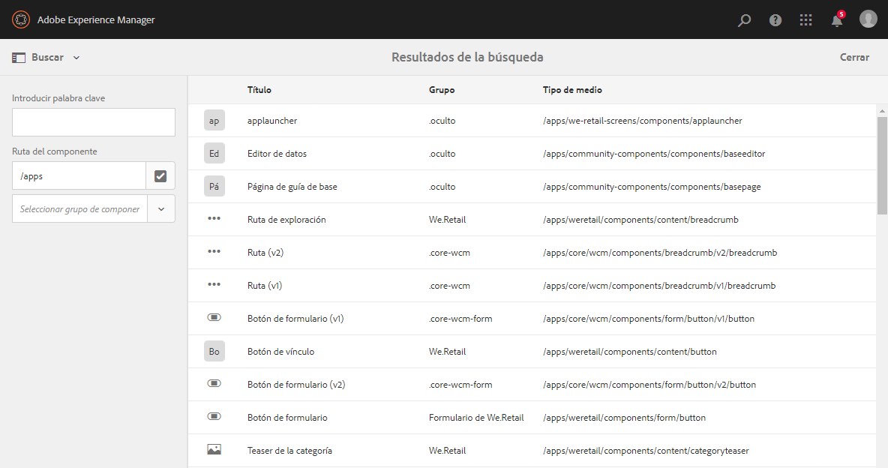
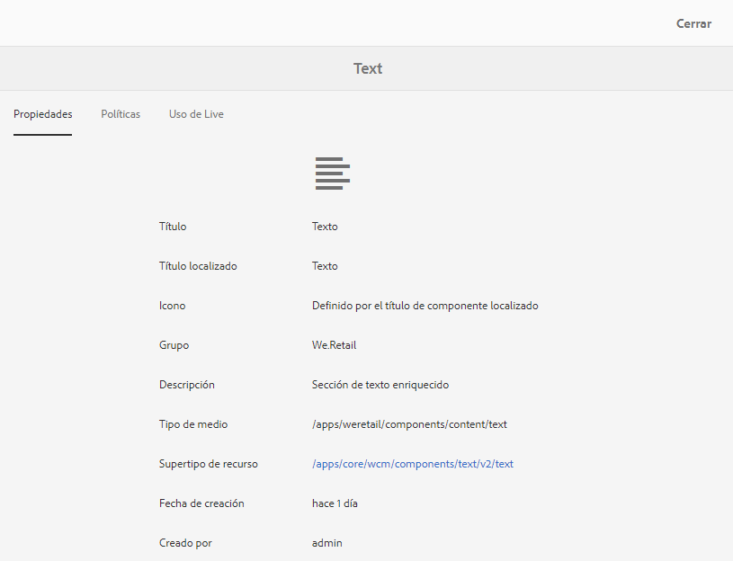
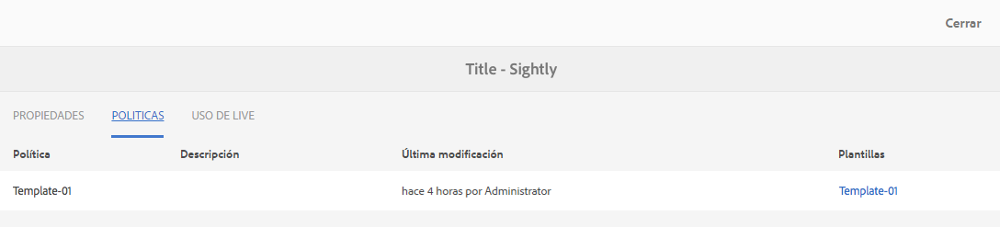
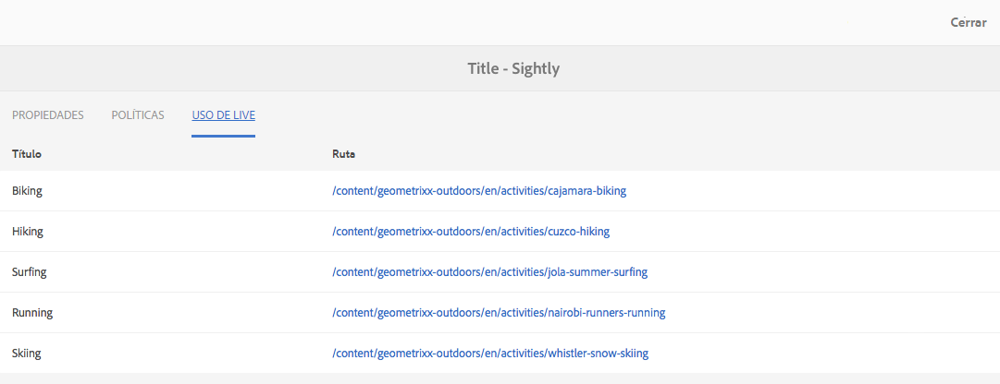
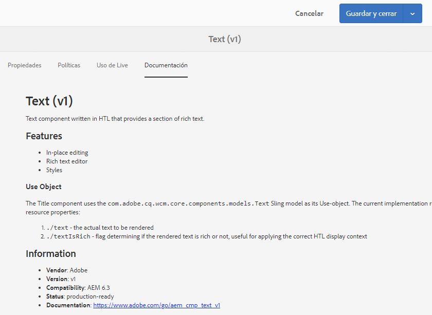

# La consola Componentes{#components-console}

La consola Componentes permite examinar todos los componentes definidos para la instancia y ver información clave de cada componente.

It can be accessed from **Tools** -> **General** -> **Components**. En la consola, están disponibles la vista de tarjeta y la vista de lista. Como no hay una estructura de árbol para los componentes, la vista de columna no está disponible.

>[!NOTE]
>
>La consola Componentes muestra todos los componentes en el sistema. El [navegador de componentes](/help/sites-authoring/author-environment-tools.md#components-browser) muestra los componentes disponibles para los autores y oculta cualquier grupo de componentes que comience con un punto ( `.`).

## Búsqueda {#search-features}

Con el icono **Solo contenido** (parte superior izquierda) podrá abrir el panel **Buscar** para buscar o para filtrar los componentes: 

## Detalles de los componentes {#component-details}

Para ver los detalles de un componente específico, toque o haga clic en el recurso necesario. Encontrará lo siguiente en tres fichas:

* **Propiedades**

   

   En la pestaña Propiedades puede:

   * Consulte las propiedades generales del componente.
   * Ver cómo [se ha definido el icono o la abreviatura](/help/sites-developing/components-basics.md#component-icon-in-touch-ui) para el componente.

      * Si hace clic en el origen del icono, se le dirigirá a dicho componente.
   * Ver el **tipo de recurso** y el **supertipo de recurso** (si está definido) para el componente.

      * Si hace clic en el supertipo de recurso, se le dirigirá a dicho componente.
   >[!NOTE]
   >
   >Debido a que `/apps` no se puede editar en el tiempo de ejecución, la consola Componentes es de solo lectura.

* **Políticas**

   

* **Uso de Live**

   

   >[!CAUTION]
   >
   >Dada la naturaleza de la información recopilada para esta vista, puede tardar un rato en recopilarse o mostrarse. 

* **Documentación**

   Si el desarrollador ha proporcionado [documentación del componente](/help/sites-developing/developing-components.md#documenting-your-component), esta aparecerá en la pestaña **Documentación**. Si no hay documentación disponible, no se mostrará la pestaña **Documentación.**

   

