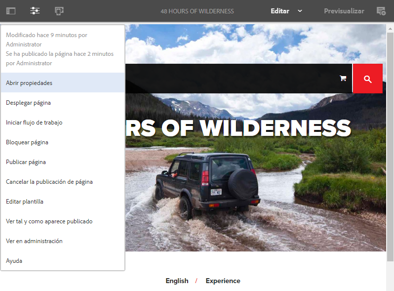
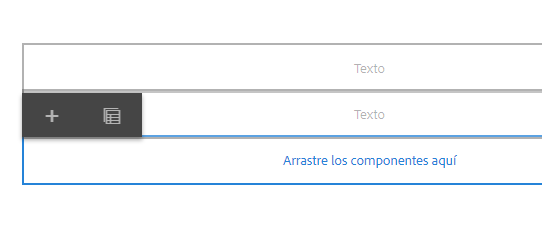
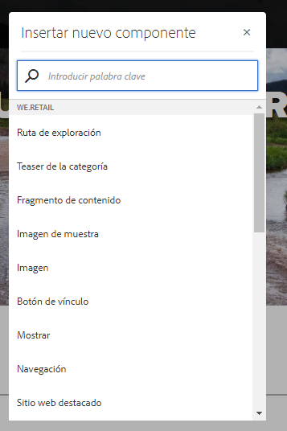
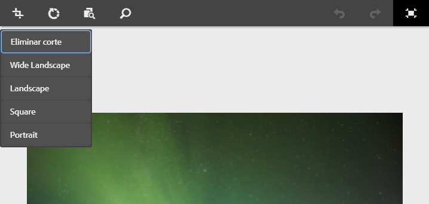
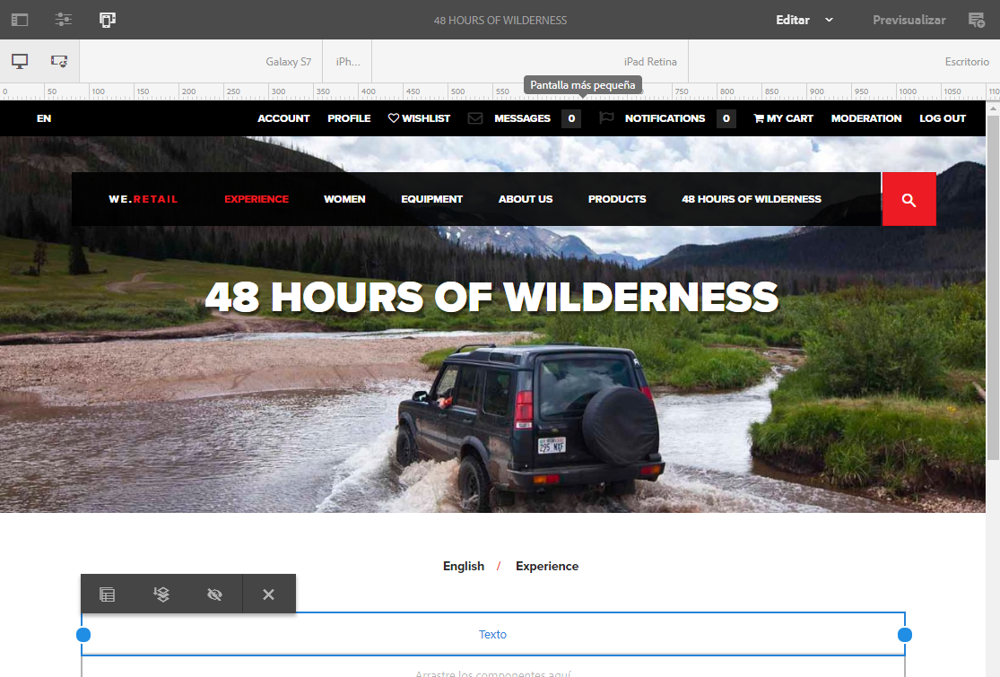
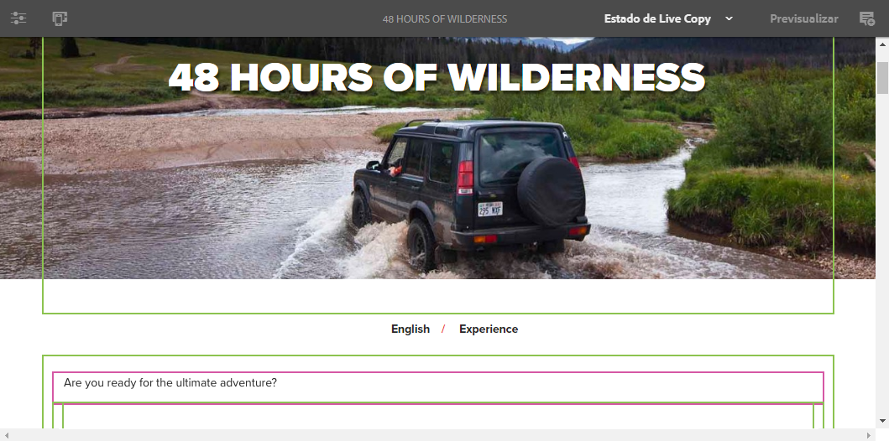

# Editar el contenido de una página{#editing-page-content}

Después de crear una página (nueva o como parte de un lanzamiento o Live Copy), puede editar el contenido para realizar las actualizaciones que requiera.

El contenido se añade mediante los [componentes](/help/sites-authoring/default-components-console.md) (adecuados para el tipo de contenido), que se pueden arrastrar hacia la página. Después estos se pueden editar local, mover o eliminar.

>[!NOTE]
>
>Su cuenta debe disponer de los [privilegios de acceso](/help/sites-administering/security.md) y los [permisos apropiados](/help/sites-administering/security.md#permissions) para editar páginas.
>
>Si se producen problemas, le sugerimos que se ponga en contacto con el administrador del sistema.

>[!NOTE]
>
>Si la página o plantilla se han configurado correctamente, podrá utilizar el [diseño interactivo](/help/sites-authoring/responsive-layout.md) cuando esté editando.

>[!NOTE]
>
>En el modo de **edición** puede ver los vínculos en el contenido, pero no puede **acceder** a ellos. Utilice el [modo de vista previa](#previewing-pages) si desea navegar utilizando los vínculos del contenido.

## Barra de herramientas de página {#page-toolbar}

La barra de herramientas de página ofrece acceso a las funciones correspondientes, en función de la configuración de la página.

La barra de herramientas ofrece acceso a numerosas opciones. En función del contexto y la configuración, puede que algunas opciones no estén disponibles.

* **Alternar panel lateral**

   Esta opción abre o cierra el panel lateral, que contiene el [Navegador de recursos](/help/sites-authoring/author-environment-tools.md#assets-browser), el [Navegador de componentes](/help/sites-authoring/author-environment-tools.md#components-browser) y el [Árbol de contenido](/help/sites-authoring/author-environment-tools.md#content-tree).

   

* **Información de la página**

   Proporciona acceso al menú [Información de página](/help/sites-authoring/author-environment-tools.md#page-information), que permite ver los detalles de la página y las acciones que es posible realizar en ella, como ver y editar su información, ver sus propiedades y publicarla/cancelar su publicación.

   

* **Emulador**

   Activa o desactiva la [barra de herramientas del emulador](/help/sites-authoring/responsive-layout.md#selecting-a-device-to-emulate), que se utiliza para simular el aspecto de la página en otro dispositivo. En el modo de diseño se activa automáticamente.

   

* **ContextHub**

   Abre el [Context Hub](/help/sites-authoring/ch-previewing.md). Solo está disponible en el modo de vista previa.

   

* **Título de página**

   Es meramente informativo.

   

* **Selector de modo** 

   Muestra el [modo](/help/sites-authoring/author-environment-tools.md#page-modes) actual y permite seleccionar otro, como por ejemplo edición, diseño, deformación de tiempo o segmentación.

   

* **Vista previa**

   Activa el [modo de vista previa](/help/sites-authoring/editing-content.md#preview-mode). Aquí se muestra la página tal y como aparecerá cuando se publique.

   

* **Anotar**

   Le permite añadir [anotaciones](/help/sites-authoring/annotations.md) a una página al revisarla. Tras añadir la primera anotación, el icono se convertirá en un número que indica la cantidad de anotaciones que tiene la página.

   

### Notificación de estado {#status-notification}

Si una página es parte de uno o varios [flujos de trabajo](/help/sites-authoring/workflows.md), esta información se muestra en una barra de notificación situada en la parte superior de la pantalla cuando edita la página.

>[!NOTE]
>
>La barra de estado solo es visible para las cuentas de usuario con los privilegios apropiados.

La notificación indica el flujo de trabajo que se está ejecutando con la página. Si el usuario participa en el paso actual del flujo de trabajo, también dispondrá de opciones para [afectar al estado del flujo de trabajo](/help/sites-authoring/workflows-participating.md) y obtener más información sobre el mismo, como por ejemplo:

* **Completar** : abre el cuadro de diálogo  **Completar** elemento de trabajo

* **Delegado** : abre el cuadro de diálogo  **Completar** elemento de trabajo

* **Ver detalles**: abre la ventana **Detalles** del flujo de trabajo.

Completar y delegar los pasos del flujo de trabajo mediante la barra de notificaciones funciona igual que al [participar en flujos de trabajo](/help/sites-authoring/workflows-participating.md) desde la bandeja de entrada de notificaciones.

Si la página está sujeta a varios flujos de trabajo, el número de los mismos se muestra en el extremo derecho de la notificación, junto a dos botones de flecha que permiten desplazarse por los flujos de trabajo.

## Marcador de posición de componente {#component-placeholder}

El marcador de posición de componente es un indicador para mostrar la posición del componente cuando lo coloque (sobre el componente por el que pasa el ratón en ese momento).

* Al añadir un componente nuevo a la página (arrastrándolo desde el navegador de componentes):

   

* Al mover un componente existente:

   

## Insertar un componente {#inserting-a-component}

### Inserción de un componente desde el navegador de componentes {#inserting-a-component-from-the-components-browser}

Puede seleccionar un componente nuevo mediante el [navegador de componentes](/help/sites-authoring/author-environment-tools.md#components-browser). El [marcador de posición de componente](#component-placeholder) le muestra dónde se colocará el componente:

1. Asegúrese de que la página se encuentra en el modo de [**edición**.](/help/sites-authoring/author-environment-tools.md#page-modes)
1. Abra el [navegador de componentes](/help/sites-authoring/author-environment-tools.md#components-browser).
1. Arrastre el componente en cuestión hasta la [posición deseada](#component-placeholder).

1. [Edite](#edit-configure-copy-cut-delete-paste) el componente.

>[!NOTE]
>
>En un dispositivo móvil, el navegador de componentes ocupará toda la pantalla. Cuando comience a arrastrar un componente, el navegador se cerrará para volver a mostrar la página, de modo que pueda colocarlo.

### Inserción de un componente desde el sistema de párrafos {#inserting-a-component-from-the-paragraph-system}

Puede agregar un componente nuevo mediante el cuadro **Arrastrar componentes aquí** del sistema de párrafos:

1. Asegúrese de que la página se encuentra en el modo de [**edición**.](/help/sites-authoring/author-environment-tools.md#page-modes)
1. Existen dos formas de seleccionar y añadir un nuevo componente desde el sistema de párrafo:

   * Seleccione la opción **Insertar componente** (+) en la barra de herramientas de un componente existente o el cuadro **Arrastrar componentes aquí**.

   

   * En un dispositivo de escritorio puede hacer doble clic en el cuadro **Arrastrar componentes aquí**.

   Se abrirá el cuadro de diálogo **Insertar nuevo componente** para que pueda seleccionar el componente requerido: 

   

1. El componente seleccionado se agregará a la parte inferior de la página. [Edite](#edit-content) el componente como sea necesario.

### Inserción de un componente mediante el navegador de recursos   {#inserting-a-component-using-the-assets-browser}

También puede añadir un componente nuevo a la página arrastrando un recurso desde el [navegador de recursos](/help/sites-authoring/author-environment-tools.md#assets-browser). De este modo se crea automáticamente un componente nuevo del tipo correspondiente (que contiene el recurso).

Esta opción es válida para los siguientes tipos de activo (algunos dependen del sistema de páginas o de párrafos):

<table> 
 <tbody>
  <tr>
   <th>Tipo de recurso</th> 
   <th>Tipo de componente resultante</th> 
  </tr>
  <tr>
   <td>Imagen</td> 
   <td>Imagen</td> 
  </tr>
  <tr>
   <td>Documento</td> 
   <td>Descargar</td> 
  </tr>
  <tr>
   <td>Producto</td> 
   <td>Producto</td> 
  </tr>
  <tr>
   <td>Vídeo</td> 
   <td>Flash</td> 
  </tr>
  <tr>
   <td>Fragmento de contenido</td> 
   <td>Fragmento de contenido  </td> 
  </tr>
 </tbody>
</table>

>[!NOTE]
>
>Puede configurar este comportamiento en su instalación. Para obtener más detalles, consulte [Configurar un sistema de párrafos de manera que, al arrastrar un activo, se cree una instancia de componente](/help/sites-developing/developing-components.md#configuring-a-paragraph-system-so-that-dragging-an-asset-creates-a-component-instance).

Para crear un componente arrastrando uno de los tipos de activo anteriores:

1. Asegúrese de que la página se encuentra en el modo de [**edición**.](/help/sites-authoring/author-environment-tools.md#page-modes)
1. Abra el [navegador de recursos](/help/sites-authoring/author-environment-tools.md#assets-browser).
1. Arrastre el recurso hasta la posición necesaria. El [marcador de posición de componente](#component-placeholder) le muestra dónde se colocará este.

   Se creará un componente apropiado para el tipo de activo en la posición requerida: un componente que contendrá el activo seleccionado.

1. Si es necesario, [edite](#edit-content) el componente.

>[!NOTE]
>
>En un dispositivo móvil, el navegador de recursos ocupará toda la pantalla. Cuando comience a arrastrar un recurso, el navegador se cerrará para volver a mostrar la página, de modo que pueda colocarlo.

Si al examinar los recursos descubre que necesita realizar alguna modificación rápida en alguno de ellos, puede iniciar el [editor de recursos](/help/assets/managing-assets-touch-ui.md) directamente desde el navegador haciendo clic en el icono de edición que hay junto al nombre del recurso.

## Editar/Configurar/Copiar/Cortar/Eliminar/Pegar {#edit-configure-copy-cut-delete-paste}

Si se selecciona un componente, se abrirá la barra de herramientas, que proporciona acceso a distintas acciones que se pueden realizar en el componente.

Las acciones disponibles para el usuario se mostrarán según corresponda y es posible que no todas las acciones se describan aquí.

* **Editar**

   [En función del tipo de componente](/help/sites-authoring/default-components.md), esta opción le permite [editar el contenido del componente](#edit-content). Normalmente se mostrará una barra de herramientas.

   

* **Configurar**

   [En función del tipo de componente](/help/sites-authoring/default-components.md), esta opción le permite editar y configurar las propiedades del componente. A menudo, se abrirá un cuadro de diálogo.

   

* **Copiar**

   Esta opción copiará el componente al portapapeles. Tras la acción de pegado, se conservará el componente original.

   

* **Cortar**

   Esta opción copiará el componente al portapapeles. Tras la acción de pegado, se eliminará el componente original.

   

* **Eliminar**

   Esta opción eliminará el componente de la página, previa confirmación.

   

* **Insertar componente**

   Esta opción abre el cuadro de diálogo para [agregar un nuevo componente](/help/sites-authoring/editing-content.md#inserting-a-component-from-the-paragraph-system).

   

* **Pegar**

   El componente del portapapeles se copiará en la página. Dependiendo de si utilizó copiar o cortar, el original se conservará o no.

   * Puede pegar componentes en la misma página o en otra distinta.
   * El elemento se pegará sobre el elemento en el que seleccione la acción de pegar.
   * La acción Pegar se muestra únicamente si hay contenido en el portapapeles.

   

   >[!NOTE]
   >
   >Si pega contenido en otra página que ya estaba abierta antes de la operación de corte y copia, debe actualizar la página para ver el contenido pegado.

* **Agrupar**

   Esta opción le permite seleccionar varios componentes a la vez. En un dispositivo de escritorio puede conseguir lo mismo haciendo **Control + clic** o **Comando + clic**.

   

* **Principal**

   Permite seleccionar el componente principal del componente seleccionado.

   

* **Diseño**

   Permite modificar el [diseño](/help/sites-authoring/editing-content.md#edit-component-layout) del componente seleccionado. Esta opción se aplica únicamente al componente seleccionado y no activa el [modo de diseño](/help/sites-authoring/author-environment-tools.md#page-modes) para toda la página.

   

* **Conversión en una variación de fragmento de experiencia**

   Esto permite crear un nuevo [fragmento de experiencia](/help/sites-authoring/experience-fragments.md) a partir del componente seleccionado o añadirlo a un fragmento de experiencia. 

   

## Editar (contenido) {#edit-content}

Hay dos métodos para añadir y/o editar contenido en los componentes:

* Abra el [cuadro de diálogo del componente para editarlo](#component-edit-dialog).
* [Arrastre y coloque un recurso](#inserting-a-component-using-the-assets-browser) desde el navegador de recursos para agregar contenido directamente.

### Cuadro de diálogo de edición de contenido    {#component-edit-dialog}

Puede abrir un componente para editar su contenido mediante el icono de [edición (lápiz) de la barra de herramientas de componentes](#edit-configure-copy-cut-delete-paste).

Las opciones exactas de edición dependerán del componente. Para algunos componentes, [solo en el modo de pantalla completa estarán disponibles todas las acciones](#edit-content-full-screen-mode). Por ejemplo:

* [Componente de texto](/help/sites-authoring/rich-text-editor.md)

   

* Componente de imagen

   

   >[!NOTE]
   >
   >La edición no funciona con un componente de imagen vacío.
   >
   >
   >Debe [arrastrar o cargar una imagen (mediante Configurar)](/help/sites-authoring/default-components-foundation.md#image) para poder iniciar la edición.

* Componente de imagen: pantalla completa

   [La introducción del modo de pantalla completa](/help/sites-authoring/editing-content.md#edit-content-full-screen-mode) para el componente de imagen permite disponer de más espacio para editar la imagen y mostrar opciones de edición adicionales como **Iniciar mapa** y **Restablecer zoom**. Además, la pantalla completa permite seleccionar ajustes preestablecidos de recorte.

   

* Para los componentes creados a partir de más de un componente básico, como el [componente de base de texto e imágenes](/help/sites-authoring/default-components-foundation.md#text-image), primero se debe confirmar qué conjunto de opciones de edición desea utilizar:

   

### Arrastrar y colocar recursos en un componente {#drag-and-drop-assets-into-component}

Para tipos de componente específicos puede arrastrar y colocar recursos del navegador de recursos directamente en el componente para actualizar el contenido:

| Tipo de recurso | Tipo de componente |
|---|---|
| Imagen | Imagen |
| Documento | Descargar |
| Producto | Producto |
| Vídeo | Flash |
| Fragmento de contenido | Fragmento de contenido |

## Editar (contenido) en modo de pantalla completa  {#edit-content-full-screen-mode}

Se puede acceder y salir del modo de pantalla completa de todos los componentes con la siguiente opción:

Por ejemplo, el componente **Texto**:

>[!NOTE]
>
>Para algunos componentes, el modo de pantalla completa tendrá más opciones disponibles que el editor in-situ básico.

## Mover un componente {#moving-a-component}

Para mover un componente de párrafo:

1. Seleccione el párrafo que desee mover manteniéndolo pulsado o mediante clic y mantener.
1. Arrastre el párrafo a la nueva ubicación. AEM le indicará dónde puede colocarlo. Suéltelo en la ubicación que desee.

   

1. Se mueve el párrafo.

>[!NOTE]
>
>También puede utilizar [Cortar y pegar](/help/sites-authoring/editing-content.md#edit-configure-copy-cut-delete-paste) para mover un componente.

## Editar diseño de componente {#edit-component-layout}

En vez de pasar repetidamente de la edición al [modo de diseño](/help/sites-authoring/responsive-layout.md) para ajustar un componente, puede seleccionar la acción **Diseño** del mismo. Podrá cambiar su diseño sin tener que abandonar el modo de edición, por lo que ahorrará tiempo.

1. En el modo de **edición** de la consola del sitio, si se selecciona un componente, aparece su barra de herramientas.

   

   Pulse o haga clic en la acción **Diseño** para ajustar el diseño del componente.

   

1. Una vez que se ha seleccionado la acción Diseño:

   * Se muestran los controles de cambio de tamaño del componente.
   * La barra de herramientas del emulador aparece en la parte superior de la pantalla.
   * En la barra de herramientas del componente se muestran las acciones de diseño en vez de las acciones de edición normales.

   

   Ahora puede modificar el diseño del componente como haría en el [modo de diseño](/help/sites-authoring/responsive-layout.md#defining-layouts-layout-mode).

1. Después de realizar los cambios necesarios, haga clic en el botón **Cerrar** del menú de acciones del componente para detener la edición del diseño. La barra de herramientas del componente recuperará su estado de edición normal.

   

>[!NOTE]
>
>El ámbito de la acción Diseño se reduce al componente seleccionado. Por ejemplo, si está editando el diseño de un componente y, a continuación, hace clic en otro componente, aparecerá la barra de herramientas de edición estándar (no la barra de herramientas de diseño) para el componente recién seleccionado y desaparecerán los controladores de cambio de tamaño, así como la barra de herramientas del emulador.
>
>Si necesita editar el diseño general de la página y modificar múltiples componentes, cambie al [modo de diseño](/help/sites-authoring/responsive-layout.md).

## Componentes heredados {#inherited-components}

Los componentes heredados pueden ser el producto de distintos escenarios, como por ejemplo:

* [Administración de varios sitios](/help/sites-administering/msm.md)
* [Lanzamientos](/help/sites-authoring/launches.md) (cuando se basan en una Live Copy).
* Componentes específicos, como el sistema de párrafos heredado en Geometrixx.

Puede cancelar (y volver a habilitar) la herencia. En función del componente, esta opción puede estar disponible en:

* **Live Copy**

   La barra de herramientas del componente, siempre que el componente esté en una página que forme parte de una Live Copy o lanzamiento (basado en una Live Copy). Por ejemplo:

   

   La opción Cancelar herencia está disponible:

   

   O vuelva a activar la herencia si ya se ha cancelado:

   

   La acción Despliegue también está disponible en el modelo o en el origen de Live Copy:

   

* **Un sistema de párrafos heredado**

   El cuadro de diálogo de configuración. Por ejemplo, como en el sistema de párrafos heredado:

   

## Edición de las plantilla de página {#editing-the-page-template}

Si la página se basa en una [plantilla editable](/help/sites-authoring/templates.md#editable-and-static-templates), puede cambiar fácilmente al [editor de plantillas](/help/sites-authoring/templates.md#editing-templates-template-authors) seleccionando **Editar plantilla** en el [menú Información de página](/help/sites-authoring/author-environment-tools.md#page-information).

Si la página se basa en una [plantilla estática](/help/sites-authoring/templates.md#editable-and-static-templates), puede cambiar al [modo de diseño](/help/sites-authoring/default-components-designmode.md) mediante el [selector de modo de página](/help/sites-authoring/author-environment-tools.md#page-modes) de la barra de herramientas para habilitar o deshabilitar los componentes que se usarán en la página.

Puede ver fácilmente en qué plantilla se basa la página al seleccionar la página en la vista [Columna](/help/sites-authoring/basic-handling.md#column-view) o en la [vista Lista](/help/sites-authoring/basic-handling.md#list-view).

## Estado de Live Copy    {#live-copy-status}

El [modo de la página de estado de Live Copy](/help/sites-authoring/author-environment-tools.md#page-modes) le permite echar un vistazo al estado de la Live Copy y ver los componentes que se han heredado o no:

* Borde verde: heredado
* Borde rosa: se ha cancelado la herencia

Por ejemplo:

## Agregar anotaciones {#adding-annotations}

[Las anotaciones](/help/sites-authoring/annotations.md) permiten que los revisores y otros autores hagan comentarios sobre el contenido. A menudo se utilizan para revisiones y validaciones.

## Previsualizar páginas    {#previewing-pages}

Existen dos métodos para visualizar la vista previa de una página:

* [Modo de vista previa](#preview-mode): una vista previa rápida y en el sitio

* [Ver tal y como aparece publicado](#view-as-published): una vista previa completa que abre la página en una nueva pestaña.

>[!NOTE]
>
>* Los vínculos del contenido están visibles en el modo de edición, pero no puede accederse a ellos.
>* Utilice cualquiera de las opciones de vista previa si desea navegar mediante sus vínculos.
>* Utilice el [atajo de teclado](/help/sites-authoring/keyboard-shortcuts.md) `Ctrl-Shift-M` para cambiar entre la vista previa y el último modo seleccionado.

>

>[!NOTE]
>
>La cookie del modo WCM está establecida para las dos opciones.

### Modo de vista previa {#preview-mode}

Al editar contenido, puede obtener una vista previa de la página con el [modo de vista previa](/help/sites-authoring/author-environment-tools.md#page-modes). Este modo:

* Oculta los distintos mecanismos de edición para ofrecerle una vista rápida del aspecto que tendrá la página cuando se publique.
* Permite utilizar vínculos para navegar.
* **No** actualiza el contenido de la página.

Al crear proyectos, el modo de vista previa está disponible mediante el icono situado en la parte superior derecha del editor de páginas:

### Ver tal y como aparece publicado {#view-as-published}

La opción **Ver tal y como aparece publicado** se muestra disponible en el menú [Información de página](/help/sites-authoring/author-environment-tools.md#page-information). Esta opción abre la página en una nueva pestaña, actualiza el contenido y muestra la página exactamente como aparecerá en el entorno de publicación.

## Bloquear una página    {#locking-a-page}

AEM le permite bloquear páginas para que nadie más pueda modificar su contenido. Esta función es útil cuando realice muchas ediciones en una página concreta o cuando tenga que congelar una página durante un rato.

Las páginas se pueden bloquear desde:

* consola **Sitios**

   1. Seleccione la página con el [modo de selección](/help/sites-authoring/basic-handling.md#viewing-and-selecting-resources).
   1. Seleccione el icono de bloqueo.

   

* **Editor de página**

   1. Seleccione el icono **Información de página** para abrir el menú.
   1. Seleccione la opción **Bloquear página**.

Una vez bloqueada, se actualiza la información de la vista de la consola y, al editar, se muestra un símbolo de bloqueo en la barra de herramientas.

>[!CAUTION]
>
>El bloqueo de páginas se puede realizar al [suplantar un usuario](/help/sites-administering/security.md#impersonating-another-user). Sin embargo, una página bloqueada de este modo solo la puede desbloquear el usuario que ha suplantado a otro usuario o un usuario con privilegios de administrador.
>
>Las páginas no se pueden bloquear al suplantar al usuario que ha bloqueado la página.

## Desbloquear una página {#unlocking-a-page}

Desbloquear una página es muy similar a [bloquearla](#locking-a-page). Cuando una página está bloqueada, las opciones de bloqueo se sustituyen con las acciones de desbloqueo.

El menú Información de página muestra la opción **Desbloquear** y el icono Bloquear de la consola Sitios se reemplaza con el icono **Desbloquear**.

>[!CAUTION]
>
>El bloqueo de páginas se puede realizar al [suplantar un usuario](/help/sites-administering/security.md#impersonating-another-user). Sin embargo, una página bloqueada de este modo solo la puede desbloquear el usuario que ha suplantado a otro usuario o un usuario con privilegios de administrador.
>
>Las páginas no se pueden bloquear al suplantar al usuario que ha bloqueado la página.

## Deshacer y rehacer modificaciones de páginas {#undoing-and-redoing-page-edits}

Los iconos siguientes le permiten deshacer o rehacer una acción. Se muestran en la barra de herramientas cuando corresponde:

>[!NOTE]
>
>El [método abreviado de teclado](/help/sites-authoring/page-authoring-keyboard-shortcuts.md) `Ctrl-Z` también está disponible para deshacer las acciones de edición de página.
>
>El método abreviado de teclado `Ctrl-Y` también está disponible para rehacer acciones de edición de página.

>[!NOTE]
>
>Consulte [Deshacer y rehacer ediciones de página: la teoría](#undoing-and-redoing-page-edits-the-theory) para ver toda la información sobre las posibilidades de deshacer y rehacer ediciones de página.

## Deshacer y rehacer ediciones de página: la teoría {#undoing-and-redoing-page-edits-the-theory}

>[!NOTE]
>
>El administrador del sistema puede [configurar varios aspectos de las funciones de Deshacer/Rehacer](/help/sites-administering/config-undo.md) según los requisitos de la instancia.

AEM almacena un historial de las acciones que realiza y la secuencia en que las realizó, de modo que puede deshacer varias acciones en el orden en que se realizaron, y también rehacerlas para volver a aplicar una o más acciones.

Si hay un elemento seleccionado en la página de contenido (por ejemplo, un componente de texto), el comando para deshacer o rehacer se aplica a dicho elemento.

El comportamiento de los comandos Deshacer y Rehacer es similar al de otros programas de software. Use los comandos para restaurar el estado reciente de la página web a medida que toma decisiones sobre el contenido. Por ejemplo, si mueve un párrafo de texto a una ubicación diferente en la página, puede usar el comando Deshacer para mover el párrafo a la posición original. Si más tarde decide que la posición anterior era mejor, use el comando rehacer para “deshacer el deshacer”.

>[!NOTE]
>
>Puede hacer lo siguiente:
>
>* Rehacer acciones siempre y cuando no haya realizado ninguna edición en la página desde que usó el comando Deshacer por última vez.
>* Deshacer un máximo de 20 acciones de edición (configuración predeterminada).
>* Utilizar los [métodos abreviados del teclado](/help/sites-authoring/page-authoring-keyboard-shortcuts.md) para deshacer y rehacer.

>

Puede usar los comandos Deshacer y Rehacer para los siguientes tipos de cambios de página:

* Agregar, editar, quitar y mover párrafos
* Editar contenido de párrafos en el lugar
* Copiar, cortar y pegar elementos en una página

Los campos de formulario procesados por los componentes de formulario no deberían tener valores especificados mientras se crean las páginas. Así pues, los comandos deshacer y rehacer no afectarán a los cambios que realice en los valores de estos tipos de componente. Por ejemplo, no se puede deshacer la selección de un valor en una lista desplegable.

>[!NOTE]
>
>Se necesitan permisos especiales para deshacer y rehacer cambios en archivos e imágenes.

>[!NOTE]
>
>El historial de cambios en archivos e imágenes dura un mínimo de diez horas. No obstante, pasado ese tiempo, no se garantiza que se puedan deshacer los cambios. El administrador puede modificar el plazo predeterminado de diez horas.

