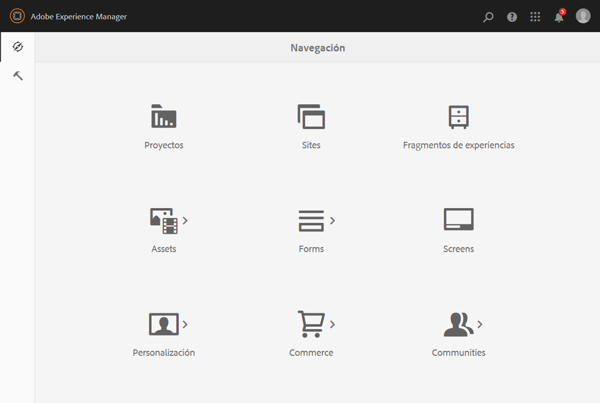
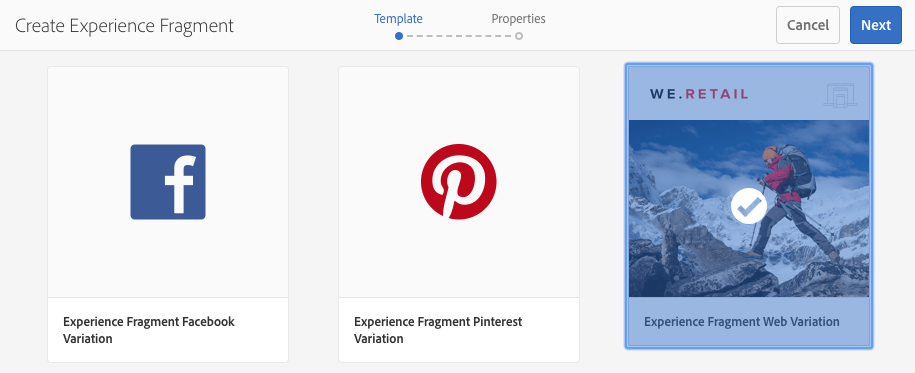
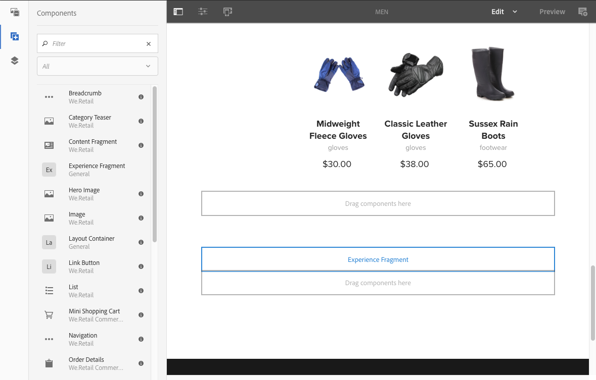

# Fragmentos de experiencias{#experience-fragments}

Un fragmento de experiencias es un grupo de uno o varios componentes que incluye contenido y diseño que se puede consultar dentro de las páginas. Estos pueden contener cualquier componente.

Un fragmento de experiencia:

* Forma parte de una experiencia (página).
* Se puede utilizar en varias páginas.
* Se basa en una plantilla (solo editable) para definir la estructura y los componentes.
* Se compone de uno o varios componentes, con diseño, en un sistema de párrafos.
* Puede contener otros fragmentos de experiencias.
* Se puede combinar con otros componentes (incluidos otros fragmentos de experiencias) para formar una página completa (experiencia).
* Puede tener diferentes variaciones y compartir el contenido o los componentes.
* Se puede desglosar en bloques de construcción que se pueden utilizar en varias variaciones del fragmento.

Puede utilizar los fragmentos de experiencias:

* Si un autor quiere volver a utilizar partes (el fragmento de una experiencia) de una página, debe copiar y pegar ese fragmento. Crear y mantener estas experiencias de copia y pegado es un proceso laborioso y es posible que el usuario cometa errores. Los fragmentos de experiencias eliminan la necesidad de copiar y pegar.
* Para admitir el caso práctico de CMS descentralizado. Los autores quieren utilizar AEM solo para la creación, pero no para la entrega al cliente. Un punto de contacto o sistema de terceros consumiría esa experiencia y luego la entregaría al usuario final.

>[!NOTE]
>
>La escritura de acceso para fragmentos de experiencias requiere que la cuenta de usuario se registre en el grupo:
>
>`experience-fragments-editors`
>
>Si tiene algún problema, póngase en contacto con el administrador del sistema.

## ¿Cuándo se deben utilizar los fragmentos de experiencias?   {#when-should-you-use-experience-fragments}

Los fragmentos de experiencias deben usarse en los siguientes casos:

* Cuando desee reutilizar experiencias.

   * Experiencias que se reutilizarán con un contenido igual o similar

* Cuando se utiliza AEM como plataforma de distribución de contenido de terceros.

   * Cualquier solución que desee utilizar AEM como plataforma de distribución de contenido
   * Incrustación de contenido en puntos de contacto de terceros

* Si tiene una experiencia con diferentes variaciones o representaciones.

   * Variaciones de canal o específicas de contexto
   * Experiencias que tiene sentido agrupar (por ejemplo, una campaña con distintas experiencias en diferentes canales)

* Al utilizar el comercio omnicanal.

   * Uso compartido de contenido relacionado con el comercio en canales de redes sociales a escala
   * Convertir los puntos de contacto en transaccionales

## Organización de los fragmentos de experiencias {#organizing-your-experience-fragments}

Se recomienda:
* usar carpetas para organizar los fragmentos de experiencias,

* [configurar las plantillas permitidas en estas carpetas](#configure-allowed-templates-folder).

La creación de carpetas permite:

* crear una estructura significativa para los fragmentos de experiencias; por ejemplo, según la clasificación.

   >[!NOTE]
   >
   >No es necesario alinear la estructura de los fragmentos de experiencias con la estructura de página del sitio.

* [asignar las plantillas permitidas en el nivel de carpeta](#configure-allowed-templates-folder)

   >[!NOTE]
   >
   >Puede utilizar el [editor de plantillas](/help/sites-authoring/templates.md) para crear su propia plantilla.

En el siguiente ejemplo se muestran los fragmentos de experiencia estructurados según `Contributors`. La estructura utilizada también ilustra cómo se pueden utilizar otras funciones, como la Administración de varios sitios (incluidas las copias de idiomas).

>[!CAUTION]
>
>La siguiente captura de pantalla fue tomada del sitio WKND usando Adobe Experience Manager como Cloud Service.

## Creación y configuración de una carpeta para los fragmentos de experiencias {#creating-and-configuring-a-folder-for-your-experience-fragments}

Para crear y configurar una carpeta para los fragmentos de experiencias, se recomienda:

1. [Crear una carpeta](/help/sites-authoring/managing-pages.md#creating-a-new-folder).

1. [Configurar las plantillas de fragmento de experiencia permitidas para esa carpeta](#configure-allowed-templates-folder).

>[!NOTE]
>
>It is also possible to configure the [Allowed Templates for your instance](#configure-allowed-templates-instance), but this method is **not** recommended as the values may be overwritten upon upgrade.

### Configurar las plantillas permitidas para la carpeta {#configure-allowed-templates-folder}

>[!NOTE]
>
>Este es el método recomendado para especificar las **[!UICONTROL plantillas permitidas]**, ya que los valores no se sobrescriben tras la actualización.

1. Vaya a la carpeta de **[!UICONTROL fragmentos de experiencias]** necesaria.

1. Seleccione la carpeta y, a continuación, vaya a **[!UICONTROL Propiedades]**.

1. Especifique la expresión regular para recuperar las plantillas necesarias en el campo **[!UICONTROL Plantillas permitidas]**.

   Por ejemplo:
   `/conf/(.*)/settings/wcm/templates/experience-fragment(.*)?`

   

1. Seleccione **[!UICONTROL Guardar y cerrar]**.

### Configure las plantillas permitidas para la instancia {#configure-allowed-templates-instance}

>[!CAUTION]
>
>It is not recommended to change the **[!UICONTROL Allowed Templates]** by this method, as the templates specified may be overwritten upon upgrade.
>
>Utilice este cuadro de diálogo únicamente con fines informativos.

1. Vaya a la consola de **[!UICONTROL fragmentos de experiencias]** indicada.

1. Seleccione las **[!UICONTROL opciones de configuración]**:

   

1. Especifique las plantillas necesarias en el cuadro de diálogo **[!UICONTROL Configurar fragmentos de experiencias]**:

   

1. Seleccione **[!UICONTROL Guardar]**.

## Creación de un fragmento de experiencia {#creating-an-experience-fragment}

Para crear un fragmento de experiencia:

1. Seleccione **[!UICONTROL fragmentos de experiencias]** desde la navegación global.

   

1. Vaya a la carpeta indicada y seleccione **[!UICONTROL Crear]**.

1. Seleccione **[!UICONTROL Fragmento de experiencia]** para abrir el asistente **[!UICONTROL Crear fragmento de experiencia]**.

   Seleccione la **[!UICONTROL plantilla]** adecuada y, a continuación, **[!UICONTROL Siguiente]**:

   

1. Introduzca las **[!UICONTROL propiedades]** del fragmento de experiencia.

   Es obligatorio escribir un **[!UICONTROL título]**. Si el **[!UICONTROL nombre]** se deja en blanco, se derivará del **[!UICONTROL título]**.

   

1. Haga clic en **[!UICONTROL Crear]**.

   Se mostrará un mensaje. Seleccione:

   * **[!UICONTROL Listo]** para volver a la consola
   * **[!UICONTROL Abrir]** para abrir el editor de fragmentos

## Edición del fragmento de experiencia {#editing-your-experience-fragment}

El editor de fragmentos de experiencias le ofrece funciones similares al editor de páginas normal. Consulte [Edición del contenido de una página](/help/sites-authoring/editing-content.md) para obtener más información acerca de cómo utilizarlo.

El siguiente procedimiento de ejemplo ilustra cómo crear un teaser para un producto:

1. Drag and drop a **[!UICONTROL Category Teaser]** from the [Components Browser](/help/sites-authoring/author-environment-tools.md#components-browser).

   

1. Seleccione **[!UICONTROL Configurar](/help/sites-authoring/editing-content.md#edit-configure-copy-cut-delete-paste)**en la barra de herramientas del componente.
1. Agregue el **[!UICONTROL recurso]** y defina las **[!UICONTROL propiedades]** según sea necesario.
1. Confirme las definiciones con **[!UICONTROL Listo]** (icono de marca de graduación).
1. Agregue más componentes según sea necesario.

## Creación de una variación de fragmento de experiencia {#creating-an-experience-fragment-variation}

Puede crear varias variaciones para este fragmento de experiencia en función de sus necesidades:

1. Abra la página para su [edición](/help/sites-authoring/experience-fragments.md#editing-your-experience-fragment).
1. Abra la pestaña **[!UICONTROL Variaciones]**.

   

1. La opción **Crear** le permite crear:

   * **[!UICONTROL Variación]**
   * **[!UICONTROL Variación como Live Copy]**.

1. Defina las propiedades requeridas:

   * **[!UICONTROL Plantilla]**
   * **[!UICONTROL Título]**
   * **[!UICONTROL Nombre]**; si se deja en blanco, se deriva del título
   * **[!UICONTROL Descripción]**
   * **[!UICONTROL Etiquetas de variación]**

   

1. Confirme con **[!UICONTROL Listo]** (icono de marca de graduación) y la nueva variación se mostrará en el panel:

   

## Uso de los fragmentos de experiencias {#using-your-experience-fragment}

Ahora puede utilizar el fragmento de experiencia para crear páginas:

1. Abra cualquier página para su edición.

   Por ejemplo: [http://localhost:4502/editor.html/content/we-retail/language-masters/en/products/men.html](http://localhost:4502/editor.html/content/we-retail/language-masters/en/products/men.html)

1. Para crear una instancia del componente Fragmento de experiencias, arrastre el componente del explorador de componentes al sistema de párrafos de la página:

   

1. Agregue el fragmento de experiencia real a la instancia de componente; o bien:

   * Arrastre el fragmento necesario desde el explorador de activos y colóquelo en el componente
   * Seleccione **[!UICONTROL Configurar]** en la barra de herramientas del componente y especifique el fragmento que quiere utilizar; confirme con **Listo** (marca de graduación)

   

   >[!NOTE]
   >
   >La opción Editar, en la barra de herramientas del componente, funciona como un método abreviado para abrir el fragmento en el editor de fragmentos.

## Componentes {#building-blocks}

Puede seleccionar uno o varios componentes para crear un bloque de creación y así reciclarlo en el fragmento:

### Crear un bloque de creación {#creating-a-building-block}

Para crear un nuevo bloque de creación:

1. En el editor de fragmentos de experiencias, seleccione los componentes que quiere reutilizar:

   

1. En la barra de herramientas de componentes, seleccione **[!UICONTROL Convertir en bloque de creación]**:

   

   Por ejemplo:

   

1. Escriba el nombre del **[!UICONTROL bloque de creación]** y confirme con **[!UICONTROL Convertir]**:

   

1. El **bloque de creación** se mostrará en la pestaña y se podrá seleccionar en el sistema de párrafos:

   

### Administración de un bloque de creación {#managing-a-building-block}

El bloque de creación se puede ver en la pestaña **[!UICONTROL Bloques de creación]**. Para cada bloque, están disponibles las siguientes acciones:

* Ir a la variación principal: abrir la variación principal en una nueva pestaña
* Cambiar nombre
* Eliminar

### Uso de un bloque de creación {#using-a-building-block}

Puede arrastrar el bloque de creación al sistema de párrafos de cualquier fragmento, como con cualquier componente.

## Representación HTML sin formato {#the-plain-html-rendition}

Using the `.plain.` selector in the URL, you can access the plain HTML rendition.

Está disponible desde el navegador, pero su principal objetivo es permitir que otras aplicaciones (por ejemplo, aplicaciones web de terceros, implementaciones móviles personalizadas) accedan al contenido del fragmento de experiencias directamente, utilizando solo la URL.

La representación HTML sin formato agrega el protocolo, el host y la ruta de contexto a las rutas que son:

* del tipo: `src`, `href`o `action`

* o finalizar con: `-src`, o `-href`

Por ejemplo:

`.../brooklyn-coat/master.plain.html`

>[!NOTE]
>
>Los vínculos siempre hacen referencia a la instancia de publicación. Están pensados para ser consumidos por terceros, por lo que el vínculo siempre se llamará desde la instancia de publicación, no desde el autor.

## Exportación de fragmentos de experiencias   {#exporting-experience-fragments}

De forma predeterminada, los fragmentos de experiencias se envían en formato HTML. Los canales de AEM y los canales similares de terceros pueden usar esta opción.

Para exportar a Adobe Target, se utiliza HTML. Consulte [Target Integration with Experience Fragments](/help/sites-administering/experience-fragments-target.md) (Integración de objetivos con fragmentos de experiencias) para obtener información completa.

