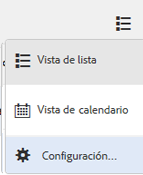
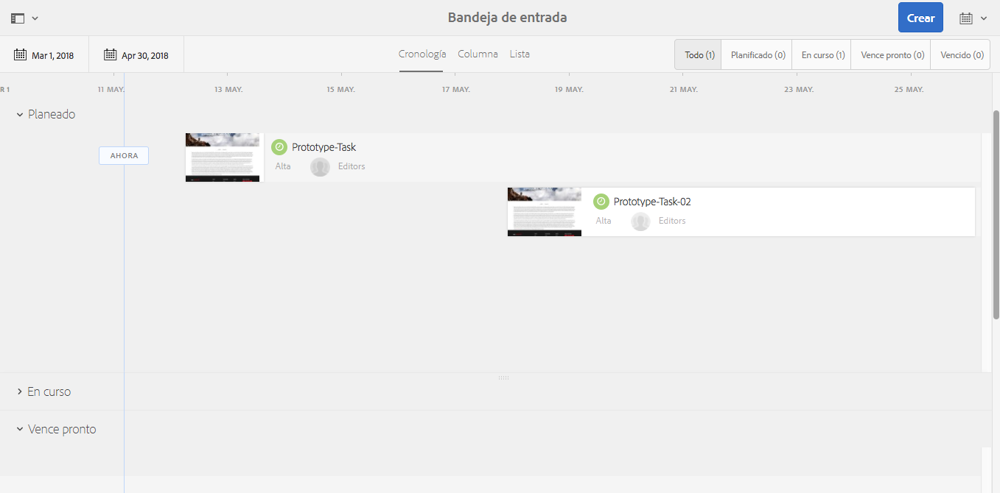
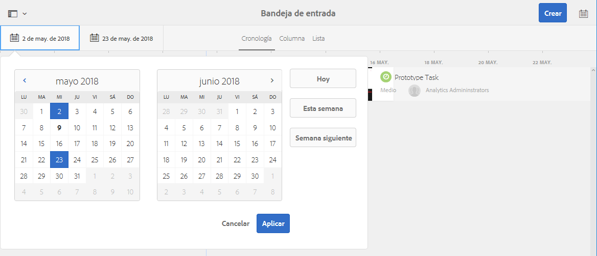
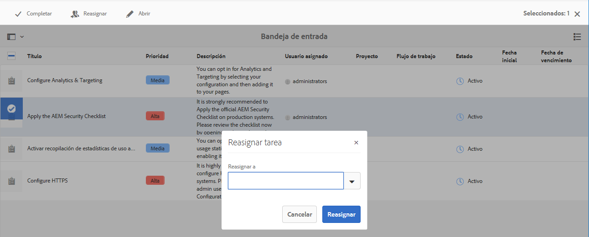
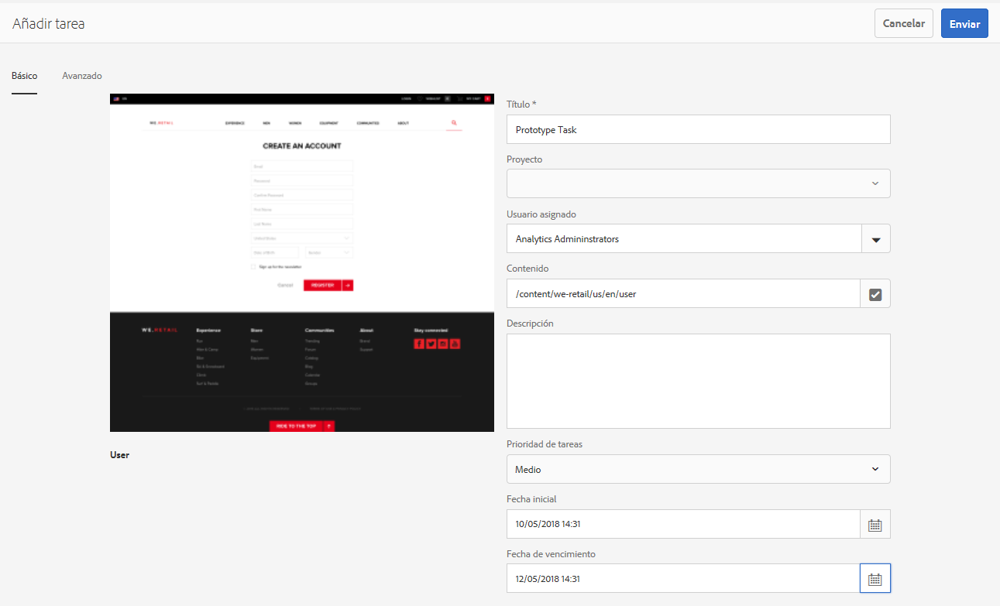
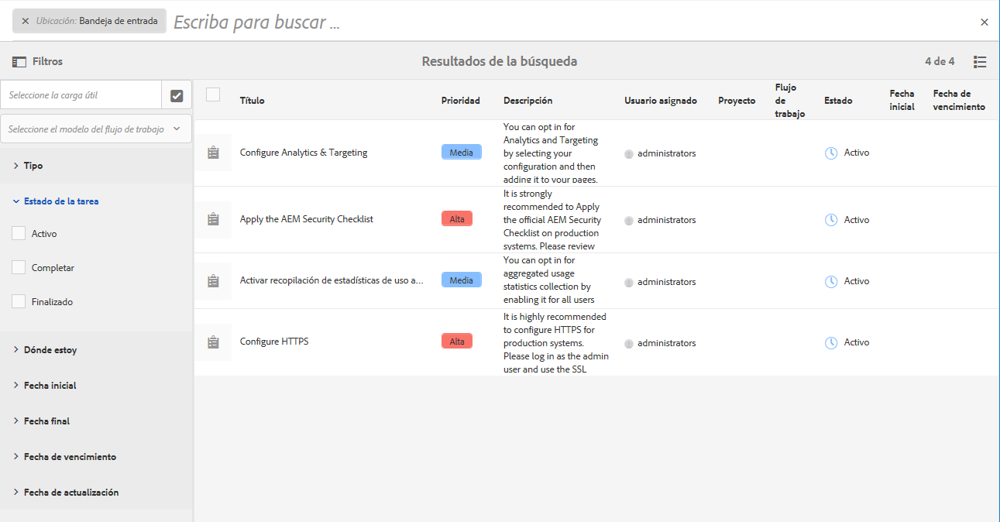

# Su bandeja de entrada   {#your-inbox}

>[!CAUTION]
>
>AEM 6.4 ha llegado al final de la compatibilidad ampliada y esta documentación ya no se actualiza. Para obtener más información, consulte nuestra [períodos de asistencia técnica](https://helpx.adobe.com/es/support/programs/eol-matrix.html). Buscar las versiones compatibles [here](https://experienceleague.adobe.com/docs/).

Puede recibir notificaciones desde varias áreas de AEM, incluidos flujos de trabajo y proyectos; por ejemplo, acerca de:

* Tareas:

   * estas también se pueden crear en varios puntos de la interfaz de usuario de AEM, por ejemplo, en **Proyectos**,
   * pueden ser el producto de un flujo de trabajo **Crear tarea** o **Crear tarea de proyecto** paso a paso.

* Flujos de trabajo:

   * elementos de trabajo que representan acciones que debe realizar en el contenido de la página;

      * son el producto del flujo de trabajo **Participante** pasos
   * elementos de error, para permitir que los administradores vuelvan a intentar realizar el paso que ha fallado.

Estas notificaciones se reciben en su propia bandeja de entrada, donde puede verlas y actuar en consecuencia.

>[!NOTE]
>
>Las AEM integradas vienen precargadas con tareas administrativas asignadas al grupo de usuarios administradores. Consulte [Tareas administrativas integradas](#out-of-the-box-administrative-tasks) para obtener más información.

>[!NOTE]
>
>Para obtener más información sobre los tipos de elementos, consulte también:
>
>* [Proyectos](/help/sites-authoring/touch-ui-managing-projects.md)
>* [Proyectos: trabajo con tareas](/help/sites-authoring/task-content.md)
>* [Flujos de trabajo](/help/sites-authoring/workflows.md)
>* [Forms](/help/forms/home.md)
>

## Bandeja de entrada en el encabezado {#inbox-in-the-header}

Desde cualquiera de las consolas, en el encabezado se muestra el número actual de elementos de la bandeja de entrada. También se puede abrir el indicador para acceder rápidamente a las páginas que requieran acciones o acceder a la bandeja de entrada:

>[!NOTE]
>
>Algunas acciones también se mostrarán en la [vista de tarjeta del recurso adecuado](/help/sites-authoring/basic-handling.md#card-view).

## Tareas administrativas integradas  {#out-of-the-box-administrative-tasks}

La AEM predeterminada viene precargada con cuatro tareas asignadas al grupo de usuarios administradores.

* [Configurar Analytics y Targeting](/help/sites-administering/opt-in.md)
* [Aplicar la lista comprobación de seguridad de AEM](/help/sites-administering/security-checklist.md)
* Activar recopilación de estadísticas de uso agregadas
* [Configurar HTTPS](/help/sites-administering/ssl-by-default.md)

## Apertura de la bandeja de entrada    {#opening-the-inbox}

Para abrir la bandeja de entrada de notificaciones AEM:

1. Toque o haga clic en el indicador de la barra de herramientas.

1. Seleccione **Ver todo**. Se abrirá la **bandeja de entrada AEM.** La bandeja de entrada muestra elementos de flujos de trabajo, proyectos y tareas.
1. La vista predeterminada es [Vista de lista](#inbox-list-view), pero también puede cambiar a [Vista de calendario](#inbox-calendar-view). Esto se realiza con el selector de vistas (barra de herramientas, arriba a la derecha).

   Para ambas vistas también puede definir [Configuración de vista](#inbox-view-settings); las opciones disponibles dependen de la vista actual.

   

>[!NOTE]
>
>La bandeja de entrada actúa como una consola, por lo que se aconseja utilizar [Navegación global](/help/sites-authoring/basic-handling.md#global-navigation) o [Buscar](/help/sites-authoring/search.md) para desplazarse a otra ubicación cuando haya terminado.

### Bandeja de entrada: vista de lista {#inbox-list-view}

Esta vista enumera todos los elementos, junto con la información relevante clave:

### Bandeja de entrada: vista de calendario {#inbox-calendar-view}

Esta vista presenta los elementos según su posición en el calendario y la vista precisa seleccionada:

Puede hacer lo siguiente:

* seleccione una vista específica; **Cronología**, **Columna**, **Lista**

* especifique las tareas que se mostrarán según **Programación**; **Todo**, **Planificado**, **En curso**, **Vence pronto**, **Vencido**

* explorar en profundidad para obtener información más detallada sobre un elemento
* seleccione un intervalo de fechas en el que centrar la vista:

### Bandeja de entrada: configuración de vista {#inbox-view-settings}

Para ambas vistas (Lista y Calendario) puede definir la configuración:

* **Vista de calendario**

   Para **Vista de calendario** puede configurar:

   * **Agrupar por**
   * **Programa** o **Ninguno**
   * **Tamaño de la tarjeta**

   

* **Vista de lista**

   Para **Vista de lista** puede configurar el mecanismo de ordenación:

   * **Ordenar en**
   * **Orden**

   

## Acción en un elemento {#taking-action-on-an-item}

1. Para realizar una acción en un elemento, seleccione la miniatura del elemento correspondiente. Los iconos de las acciones aplicables a ese elemento se mostrarán en la barra de herramientas:

   

   Las acciones son apropiadas para el elemento y entre ellas se incluyen:

   * Acción **Completar**.; por ejemplo, una tarea o un elemento de flujo de trabajo.
   * **Reasignar**/**Delegar** un elemento.
   * **Apertura** un artículo; según el tipo de elemento, esta acción puede:

      * mostrar las propiedades del elemento
      * abra un tablero o asistente apropiado para realizar más acciones.
      * abrir documentación relacionada
   * **Retroceder** a una etapa anterior.
   * Consultar la carga útil de un flujo de trabajo.
   * Crear un proyecto a partir de un elemento.

   >[!NOTE]
   >
   >Para obtener más información, consulte lo siguiente:
   >
   >* Elementos de flujo de trabajo - [Participación en flujos de trabajo](/help/sites-authoring/workflows-participating.md)

1. Dependiendo del elemento seleccionado, se iniciará una acción; por ejemplo:

   * se abrirá un cuadro de diálogo apropiado para la acción.
   * se iniciará un asistente de acciones.
   * se abrirá una página de documentación.

   Por ejemplo, **Reasignar** abrirá un cuadro de diálogo:

   

   En función de si ha abierto un cuadro de diálogo, un asistente o una página de documentación, puede:

   * Confirmar la acción apropiada; Por ejemplo, Reasignar.
   * Cancelar la acción.
   * Flecha hacia atrás; por ejemplo, si se ha abierto un asistente de acciones o una página de documentación, puede volver a la bandeja de entrada.

## Creación de una tarea {#creating-a-task}

Desde la bandeja de entrada puede crear tareas:

1. Select **Crear**, luego **Tarea**.
1. Complete los campos necesarios en la variable **Básico** y **Avanzadas** pestañas; solo la variable **Título** es obligatorio, el resto son opcionales:

   * **Básico**:

      * **Título**
      * **Proyecto**
      * **Usuario asignado**
      * **Contenido**; similar a Carga útil, es una referencia de la tarea a una ubicación del repositorio
      * **Descripción**
      * **Prioridad de tareas**
      * **Fecha inicial**
      * **Fecha de vencimiento**

   

   * **Avanzado**

      * **Nombre**: se utilizará para formar la dirección URL; si está en blanco, se basará en la variable **Título**.

   

1. Seleccione **Enviar**.

## Creación de un proyecto    {#creating-a-project}

Para determinadas tareas, puede crear un [Proyecto](/help/sites-authoring/projects.md) en función de esa tarea:

1. Seleccione la tarea adecuada tocando o haciendo clic en la miniatura.

   >[!NOTE]
   >
   >Para crear un proyecto, solo se pueden utilizar las tareas que se crearon con la opción **Crear** de la **bandeja de entrada**.
   >
   >Los elementos de trabajo (de un flujo de trabajo) no se pueden utilizar para crear un proyecto.

1. Seleccione **Crear proyecto** en la barra de herramientas para abrir el asistente.
1. Seleccione la plantilla adecuada y, a continuación, **Siguiente**.
1. Especifique las propiedades requeridas:

   * **Básico**

      * **Título**
      * **Descripción**
      * **Fecha inicial**
      * **Fecha de vencimiento**
      * **Usuario** y función
   * **Avanzado**

      * **Nombre**
   >[!NOTE]
   >
   >Consulte [Creación de un proyecto](/help/sites-authoring/touch-ui-managing-projects.md#creating-a-project) para obtener más información.

1. Select **Crear** para confirmar la acción.

## Filtrado de elementos en la bandeja de entrada AEM    {#filtering-items-in-the-aem-inbox}

Puede filtrar los elementos enumerados:

1. Abra la **Bandeja de entrada AEM**.

1. Abra el selector de filtros:

   

1. Puede filtrar los elementos enumerados según una serie de criterios, muchos de los cuales se pueden refinar; por ejemplo:

   

   >[!NOTE]
   >
   >Con [Configuración de vista](#inbox-view-settings) también puede configurar el orden cuando se utiliza la [Vista de lista](#inbox-list-view).
