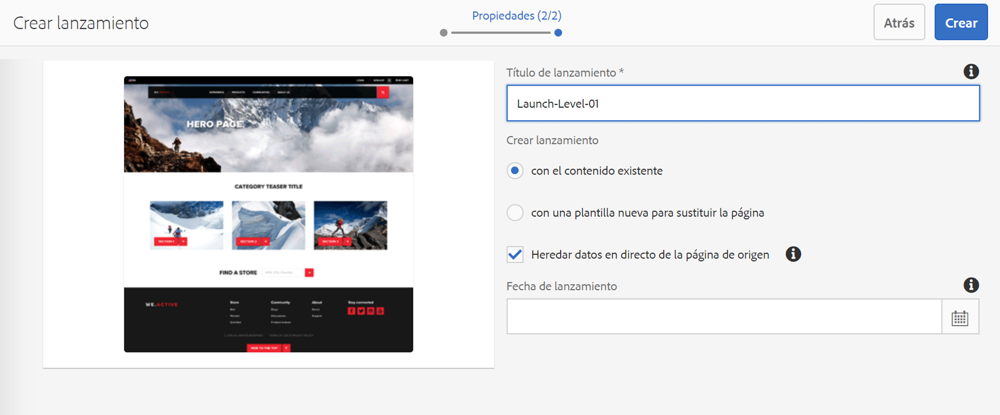
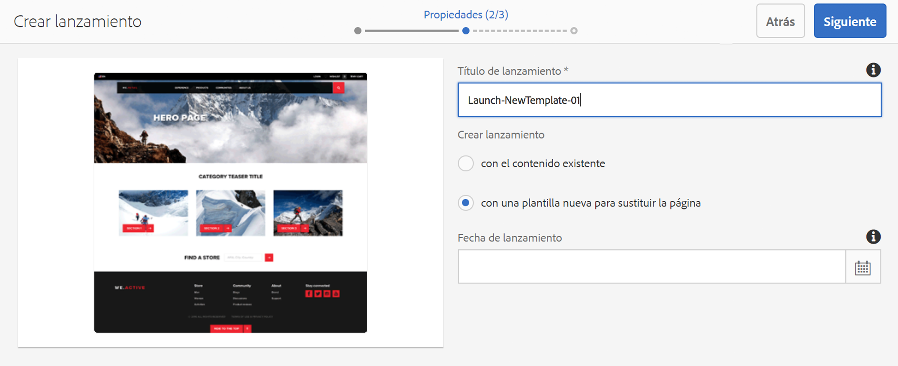

# Creación de lanzamientos{#creating-launches}

>[!CAUTION]
>
>AEM 6.4 ha llegado al final de la compatibilidad ampliada y esta documentación ya no se actualiza. Para obtener más información, consulte nuestra [períodos de asistencia técnica](https://helpx.adobe.com/es/support/programs/eol-matrix.html). Buscar las versiones compatibles [here](https://experienceleague.adobe.com/docs/).

Cree un lanzamiento para permitir la actualización de una nueva versión de páginas web existentes para su activación futura. Al crear un lanzamiento, especificará un título y la página de origen:

* El título aparece en el carril [Referencias](/help/sites-authoring/author-environment-tools.md#references); desde allí, los autores pueden acceder al título y trabajar con él.
* Las páginas secundarias de la página de origen se incluyen en el lanzamiento de forma predeterminada. Si lo desea, puede usar solamente la página de origen.
* De forma predeterminada, [Live Copy](/help/sites-administering/msm.md) actualiza automáticamente las páginas de lanzamiento a medida que cambian las páginas de origen. Puede especificar que se cree una copia estática para evitar cambios automáticos.

De forma opcional, puede especificar la **fecha de lanzamiento** (y hora) para establecer cuándo se promocionarán y activarán las páginas. Sin embargo, la **fecha de lanzamiento** solo funciona en combinación con el indicador **Producción lista** (consulte [Edición de la configuración de un lanzamiento](/help/sites-authoring/launches-editing.md#editing-a-launch-configuration)); para que las acciones se produzcan de forma automática, se deben configurar ambas.

## Creación de un lanzamiento {#creating-a-launch}

Puede crear un lanzamiento desde la consola Sitios o Lanzamientos :

1. Abra cualquiera de las consolas **Sites** o **Lanzamientos**.

   >[!NOTE]
   >
   >Al usar la variable **Sitios** consola es habitual navegar a la ubicación de la página de origen, pero no es obligatorio ya que puede navegar al seleccionar la **Origen de lanzamiento** en el asistente.

1. Según la consola que utilice:

   * **Lanzamientos**:

      1. Select **Crear Launch** en la barra de herramientas para abrir el asistente.
   * **Sites**:

      1. Seleccione **Crear** en la barra de herramientas para abrir el cuadro de selección.
      1. De esta selección **Crear Launch** para abrir el asistente.

   >[!NOTE]
   >
   >En la consola de **Sites** también puede utilizar el [modo de selección](/help/sites-authoring/basic-handling.md#viewing-and-selecting-resources) para seleccionar una página antes de hace clic en **Crear**.
   >
   >La página seleccionada se utilizará como página de origen inicial.

1. En el paso **Seleccionar origen**, debe **Añadir páginas**. Puede seleccionar varias páginas, pero debe especificar la ruta de acceso de cada una de ellas:

   * Vaya a la ubicación requerida.
   * Seleccione las páginas de origen y confirme (marca de verificación).

   Repita el proceso tantas veces como sea necesario.

   

   >[!NOTE]
   >
   >Para agregar páginas o ramas a un lanzamiento, deben estar dentro de un sitio; es decir, debajo de una raíz de nivel superior común.
   >
   >Si un sitio contiene raíces de idioma por debajo del nivel superior, las páginas y ramas de un lanzamiento deben estar por debajo de una raíz de idioma común.

1. Para cada entrada puede especificar si:

   * **Incluir páginas secundarias**:

      * Especifique si desea crear un lanzamiento con o sin las páginas secundarias.  De forma predeterminada, se incluyen estas subpáginas.

   Continúe con **Siguiente**.

   

1. En el paso **Propiedades** del asistente, puede especificar lo siguiente:

   * **Título de lanzamiento**: Nombre del lanzamiento. El nombre debe tener sentido para los autores.
   * **con contenido existente**: el contenido original se utilizará para crear el lanzamiento.
   * **utilice una plantilla nueva para sustituir la página**: consulte [Creación de un lanzamiento con una plantilla nueva](#create-launch-with-new-template) para obtener más información.
   * **Heredar los datos publicados de la página de origen**: seleccione esta opción para actualizar automáticamente el contenido de las páginas de lanzamiento cuando cambien las páginas de origen. Esta opción logra esto convirtiendo el lanzamiento en [live copy](/help/sites-administering/msm.md).

      Está opción está seleccionada de forma predeterminada.

   * **Fecha del lanzamiento**: la fecha y hora en que la copia de lanzamiento se debe activar (depende del indicador **Producción lista**; consulte [Lanzamientos: orden de los eventos](/help/sites-authoring/launches.md#launches-the-order-of-events)).

   

1. Uso **Crear** para completar el proceso y crear el nuevo lanzamiento. El cuadro de diálogo de confirmación le preguntará si desea abrir el lanzamiento inmediatamente.

   Si devuelve la consola (con **Listo**) puede ver el lanzamiento (y acceder a él) desde:

   * el [**Lanzamientos** consola](/help/sites-authoring/launches.md#the-launches-console)
   * el [**Referencias** en el **Sitios** consola](/help/sites-authoring/launches.md#launches-in-references-sites-console)

### Creación de un lanzamiento con una plantilla nueva {#create-launch-with-new-template}

When [creación de un lanzamiento](/help/sites-authoring/launches-creating.md#create-launch-with-new-template) puede seleccionar si desea utilizar una plantilla nueva:

**con una plantilla nueva para sustituir la página**

>[!CAUTION]
>
>Esta opción solo está disponible al crear un lanzamiento desde la consola **Sitios**. No está disponible al crear un lanzamiento desde la consola **Lanzamientos**.

Al seleccionar esto, ocurrirá lo siguiente:

* actualice las demás opciones disponibles,
* incluya un nuevo paso en el que puede seleccionar la plantilla requerida.

>[!CAUTION]
>
>Como se utiliza una plantilla diferente, la nueva página estará vacía. Debido a la estructura de página diferente, no se copiará ningún contenido.
>
>Este mecanismo se puede utilizar para cambiar la plantilla de un [página existente](/help/sites-authoring/managing-pages.md#creating-a-new-page) - aunque se debe tener en cuenta la pérdida de contenido.

### Creación de un lanzamiento anidado {#creating-a-nested-launch}

La creación de un lanzamiento anidado (lanzamiento dentro de un lanzamiento) permite crear un lanzamiento a partir de un lanzamiento existente, de modo que los autores puedan aprovechar los cambios ya realizados, en lugar de tener que realizar los mismos cambios varias veces para cada lanzamiento.

>[!NOTE]
>
>Consulte también [Promoción de un lanzamiento anidado](/help/sites-authoring/launches-promoting.md#promoting-a-nested-launch).

#### Creación de un lanzamiento anidado: consola Lanzamientos {#creating-a-nested-launch-launches-console}

Crear un lanzamiento anidado desde la consola **Lanzamientos** es básicamente lo mismo que crear cualquier otra forma de lanzamiento, con la excepción de que debe desplazarse a la rama de lanzamientos `/content/launches`:

1. En la consola **Lanzamientos**, seleccione **Crear**.
1. Seleccione **Agregar páginas** y, a continuación, vaya a la rama de lanzamientos especificando `/content/launches` en el filtro. Seleccione el lanzamiento necesario y confirme con la opción **Seleccionar**:

   

1. Continúe con **Siguiente** y complete la **Propiedades** como con cualquier otro lanzamiento.

   

#### Creación de un lanzamiento anidado: consola Sites {#creating-a-nested-launch-sites-console}

Para crear un lanzamiento anidado desde la consola **Sites** basado en un lanzamiento existente:

1. Acceda a [Lanzamiento desde las referencias (consola Sites)](/help/sites-authoring/launches.md#launches-in-references-sites-console) para mostrar las acciones disponibles.
1. Seleccione **Crear lanzamiento** para abrir el asistente (como el origen ya se ha seleccionado, se omitirá el paso **Seleccionar origen**).

1. Introduzca el **título del lanzamiento** y cualquier otra información necesaria (como con un lanzamiento normal).

1. Uso **Crear** para completar el proceso y crear el nuevo lanzamiento. El cuadro de diálogo de confirmación le preguntará si desea abrir el lanzamiento inmediatamente.

   Si selecciona **Listo**, volverá al carril **Referencias** de la **consola de Sites**, si selecciona la página adecuada en la que se muestra el nuevo lanzamiento.

### Eliminación de un lanzamiento {#deleting-a-launch}

Puede eliminar un lanzamiento del [inicia la consola](/help/sites-authoring/launches.md#the-launches-console):

* Para seleccionar el lanzamiento, toque o haga clic en la miniatura.
* Aparecerá la barra de herramientas: seleccione Eliminar.
* Confirme la acción.

>[!CAUTION]
>
>Al eliminar un lanzamiento, se quitarán el lanzamiento en sí y todos los lanzamientos anidados descendentes.
