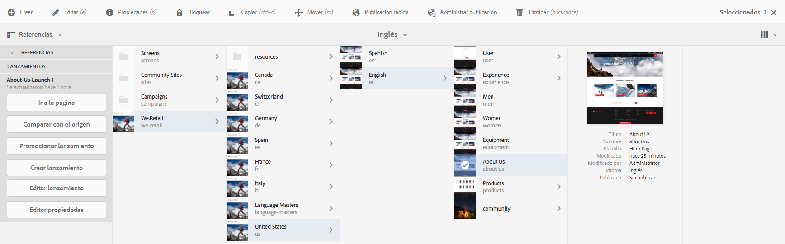
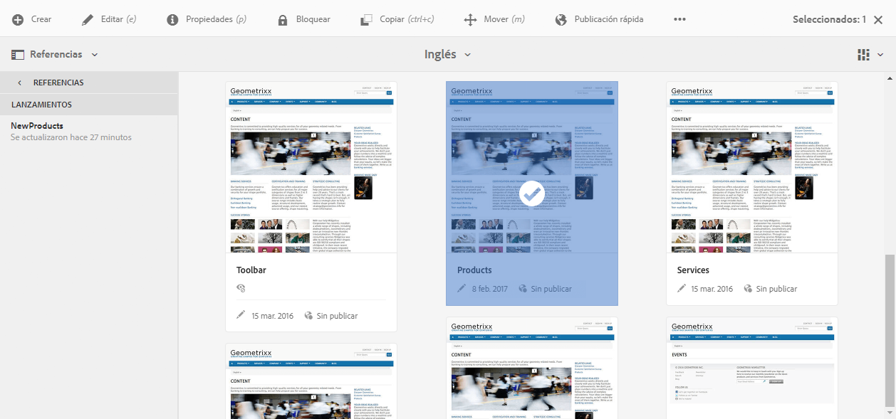

# Edición de lanzamientos{#editing-launches}

>[!CAUTION]
>
>AEM 6.4 ha llegado al final de la compatibilidad ampliada y esta documentación ya no se actualiza. Para obtener más información, consulte nuestra [períodos de asistencia técnica](https://helpx.adobe.com/es/support/programs/eol-matrix.html). Buscar las versiones compatibles [here](https://experienceleague.adobe.com/docs/).

## Edición de páginas de lanzamiento {#editing-launch-pages}

Cuando se ha creado un lanzamiento para una página (o conjunto de páginas), puede editar el contenido en la copia de lanzamiento de las páginas.

1. Acceda a [Lanzamiento desde las referencias (consola Sites)](/help/sites-authoring/launches.md#launches-in-references-sites-console) para mostrar las acciones disponibles.
1. Select **Vaya a la página** para abrir la página para editarla.

### Editar páginas de lanzamiento sujetas a Live Copy {#editing-launch-pages-subject-to-a-live-copy}

Si el lanzamiento se basa en un [live copy](/help/sites-administering/msm.md) entonces:

* consulte símbolos de bloqueo (pequeños candados) al editar un componente (contenido y/o propiedades).
* consulte la **Live Copy** en **Propiedades de página**

Se utiliza una Live Copy para sincronizar contenido *desde* la rama de origen *a* la rama de lanzamiento (para mantener el lanzamiento actualizado con los cambios realizados en la fuente).

Puede realizar cambios del mismo modo que puede editar una Live Copy estándar; por ejemplo:

* Al hacer clic en un candado cerrado se romperá esta sincronización y podrá realizar nuevas actualizaciones del contenido en el lanzamiento. Una vez desbloqueado (candado abierto), los cambios no se sobrescribirán con ningún cambio realizado en la misma ubicación dentro de la rama de origen.
* **Suspender** (y **reanudar**) la herencia de una página específica.

Consulte [Cambio del contenido de Live Copy](/help/sites-administering/msm-livecopy.md#changing-live-copy-content) para obtener más información.

## Comparación de una página de lanzamiento con su página de origen {#comparing-a-launch-page-to-its-source-page}

Para rastrear los cambios realizados, puede ver el lanzamiento en **Referencias** y comparar la página de lanzamiento con la página de origen:

1. En el **Sitios** consola, [vaya a la página de origen del lanzamiento y selecciónela](/help/sites-authoring/basic-handling.md#viewing-and-selecting-resources).
1. Abra el **[Referencias](/help/sites-authoring/basic-handling.md#references)** panel y seleccione **Lanzamientos**.
1. Seleccione el lanzamiento específico y luego **Comparar con el origen**:

   

1. Las dos páginas (inicio y origen) se abrirán en paralelo.

   Para obtener información completa sobre el uso de esta función, consulte [Diferencias de página](/help/sites-authoring/page-diff.md).

## Cambio de las páginas de origen utilizadas {#changing-the-source-pages-used}

Puede añadir en cualquier momento las páginas en el rango de páginas de origen para el lanzamiento, o eliminarlas: 

1. Acceda y seleccione el lanzamiento de:

   * el [Consola Lanzamientos](/help/sites-authoring/launches.md#the-launches-console):

      * Seleccione **Editar**.
   * [Referencias (consola Sitios)](/help/sites-authoring/launches.md#launches-in-references-sites-console) para mostrar las acciones disponibles:

      * Seleccione **Editar lanzamiento**. 

   Se mostrarán las páginas de origen.

1. Realice los cambios necesarios y confirme haciendo clic en **Guardar**.

   >[!NOTE]
   >
   >Para añadir páginas a un lanzamiento, deben estar debajo de una raíz de idioma común; es decir, dentro de un solo sitio.

## Edición de una configuración de Launch {#editing-a-launch-configuration}

Las propiedades del lanzamiento se pueden editar en cualquier momento:

1. Acceda y seleccione el lanzamiento de:

   * el [Consola Lanzamientos](/help/sites-authoring/launches.md#the-launches-console):

      * Select **Propiedades**.
   * [Referencias (consola Sitios)](/help/sites-authoring/launches.md#launches-in-references-sites-console) para mostrar las acciones disponibles:

      * Seleccione **Editar propiedades**. 

   Se mostrarán los detalles.

1. Realice los cambios necesarios y confirme haciendo clic en **Guardar**.

   Consulte [Lanzamientos: el orden de los eventos](/help/sites-authoring/launches.md#launches-the-order-of-events) para obtener información sobre el propósito y la interacción de los campos **Fecha de lanzamiento** y **Listo para producción**.

## Descubrimiento del estado de inicio de una página {#discovering-the-launch-status-of-a-page}

El estado se muestra al seleccionar un lanzamiento específico en la ficha referencias (consulte [Lanzamientos en referencias (consola Sitios)](/help/sites-authoring/launches.md#launches-in-references-sites-console)).

