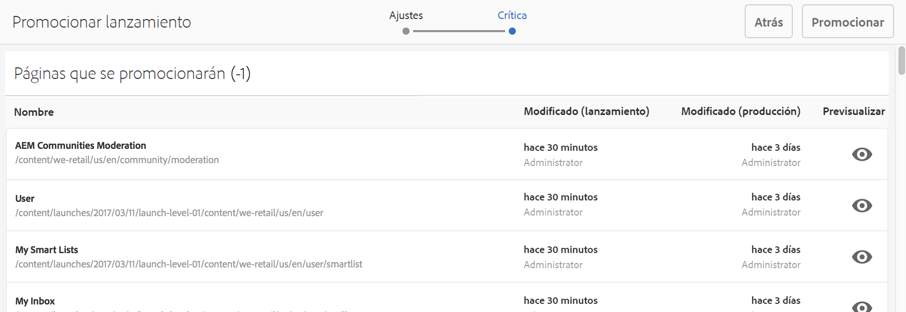

# Promoción de lanzamientos{#promoting-launches}

>[!CAUTION]
>
>AEM 6.4 ha llegado al final de la compatibilidad ampliada y esta documentación ya no se actualiza. Para obtener más información, consulte nuestra [períodos de asistencia técnica](https://helpx.adobe.com/es/support/programs/eol-matrix.html). Buscar las versiones compatibles [here](https://experienceleague.adobe.com/docs/).

Debe promocionar páginas de lanzamiento para volver a mover el contenido al origen (producción) antes de publicarlo. Cuando se promociona una página de lanzamiento, la página correspondiente de las páginas de origen se reemplaza con el contenido de la página promocionada. Las siguientes opciones están disponibles al promocionar una página de lanzamiento:

* Promocionar solo la página actual o todo el lanzamiento.
* Promocionar las páginas secundarias de la página actual.
* Promocionar el lanzamiento completo o solo las páginas que han cambiado.

>[!NOTE]
>
>Tras promocionar las páginas de lanzamiento al destino (**producción**), puede activar las páginas de **producción** como entidad (para que el proceso sea más rápido). Agregue las páginas a un paquete de flujo de trabajo y utilícelo como carga útil para un flujo de trabajo que active un paquete de páginas. Debe crear el paquete de flujo de trabajo antes de promocionar el lanzamiento. Consulte [Procesamiento de páginas promocionadas mediante AEM flujo de trabajo](#processing-promoted-pages-using-aem-workflow).

>[!CAUTION]
>
>Un solo lanzamiento no se puede promocionar de forma simultánea. Esto significa que dos acciones promocionales en el mismo lanzamiento al mismo tiempo pueden dar lugar a un error: `Launch could not be promoted` (así como errores de conflictos en el registro).

>[!CAUTION]
>
>Al promocionar lanzamientos para *modificado* páginas, se tienen en cuenta las modificaciones tanto en las ramas de origen como en las de lanzamiento.

## Promocionar páginas de lanzamiento {#promoting-launch-pages}

>[!NOTE]
>
>Esta sección trata sobre la operación manual de promocionar las páginas de lanzamiento cuando solo hay un nivel de lanzamiento. Consulte:
>
>* [Promoción de un lanzamiento anidado](#promoting-a-nested-launch) cuando haya más de un lanzamiento en la estructura.
>* [Lanzamientos: el orden de los eventos](/help/sites-authoring/launches.md#launches-the-order-of-events) para obtener más información sobre la promoción y publicación automáticas.
>

Puede promocionar los lanzamientos desde **Sitios** o **Lanzamientos** consola:

1. Abra:

   * el **Sitios** consola:

      1. Abra el [carril de referencias](/help/sites-authoring/author-environment-tools.md#references) y seleccione la página de origen necesaria con el [modo de selección](/help/sites-authoring/basic-handling.md) (o seleccione y abra el carril de referencias, el orden no importa). Todas las referencias se mostrarán.

      1. Select **Lanzamientos** (por ejemplo, Lanzamientos (1)) para mostrar una lista de los lanzamientos específicos.
      1. Seleccione el lanzamiento específico para mostrar las acciones disponibles.
      1. Seleccione **Promocionar lanzamiento** para abrir el asistente.
   * el **Lanzamientos** consola:

      1. Seleccione el lanzamiento (toque o haga clic en la miniatura).
      1. Select **Promocionar**.

1. En el primer paso puede especificar:

   * **Promocionar lanzamiento completo**
   * **Promocionar las páginas modificadas**
   * **Promocionar página actual**
   * **Promocionar la página actual y sus páginas secundarias**

   Por ejemplo, al seleccionar para promocionar solo las páginas modificadas:

   

   >[!NOTE]
   >
   >Esto abarca un solo lanzamiento, si ha anidado lanzamientos, consulte [Promoción de un lanzamiento anidado](#promoting-a-nested-launch).

1. Select **Siguiente** para continuar.
1. Puede revisar las páginas que se promocionarán, que dependerán del rango de páginas que haya elegido:

   

1. Select **Promocionar**.

## Promocionar páginas de lanzamiento al editar {#promoting-launch-pages-when-editing}

Cuando está editando una página de lanzamiento, la acción **Promocionar lanzamiento** también está disponible en **Información de la página**. Esta acción abrirá el asistente para recopilar la información necesaria.

>[!NOTE]
>
>Esta opción está disponible para los [lanzamientos anidados](#promoting-a-nested-launch).

## Promoción de un lanzamiento anidado {#promoting-a-nested-launch}

Después de crear un lanzamiento anidado, puede promocionarlo a cualquiera de los orígenes, incluido el origen raíz (producción).

1. Como con [Creación de un lanzamiento anidado](/help/sites-authoring/launches-creating.md#creating-a-nested-launch), vaya al lanzamiento requerido y selecciónelo en la sección **Lanzamientos** o **Referencias** carril.
1. Seleccione **Promocionar lanzamiento** para abrir el asistente.

1. Introduzca la información necesaria:

   * **Destino del cambio**

      Puede promocionar a cualquiera de las fuentes.

   * **Ámbito**
Aquí puede seleccionar si desea promocionar todo el lanzamiento o solo las páginas que realmente se han editado. En este último caso, puede seleccionar incluir/excluir páginas secundarias. La configuración predeterminada es promocionar solo los cambios de página para la página actual:

      * **Promocionar lanzamiento completo**
      * **Promocionar las páginas modificadas**
      * **Promocionar página actual**
      * **Promocionar la página actual y sus páginas secundarias**

   

1. Seleccione **Siguiente**.
1. Revise los detalles de la promoción antes de seleccionar **Promocionar**:

   

   >[!NOTE]
   >
   >Las páginas enumeradas dependerán de la variable **Ámbito** definidas y posiblemente las páginas que realmente se han editado.

1. Los cambios se promocionarán y reflejarán en la variable **Lanzamientos** consola:

   

## Procesamiento de páginas promocionadas mediante el flujo de trabajo de AEM {#processing-promoted-pages-using-aem-workflow}

Utilice modelos de flujo de trabajo para realizar un procesamiento masivo de páginas de lanzamiento promocionadas:

1. Cree un paquete de flujo de trabajo.
1. Cuando los autores promocionan páginas de Launch, las almacenan en el paquete de flujo de trabajo.
1. Inicie un modelo de flujo de trabajo utilizando el paquete como carga útil.

Para iniciar un flujo de trabajo automáticamente cuando se promocionan páginas, [configuración de un lanzador de flujo de trabajo](/help/sites-administering/workflows-starting.md#workflows-launchers) para el nodo del paquete.

Por ejemplo, puede generar automáticamente solicitudes de activación de página cuando los autores promocionan páginas de lanzamiento. Configure un iniciador de flujo de trabajo para iniciar el flujo de trabajo de activación de solicitud cuando se modifique el nodo del paquete.

