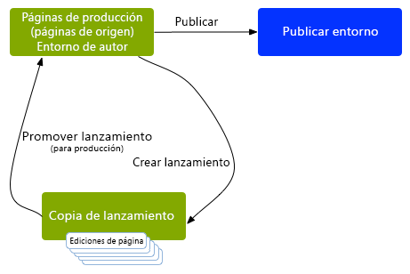
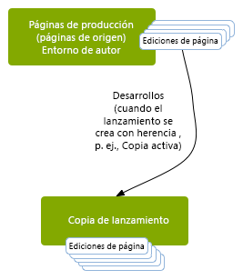
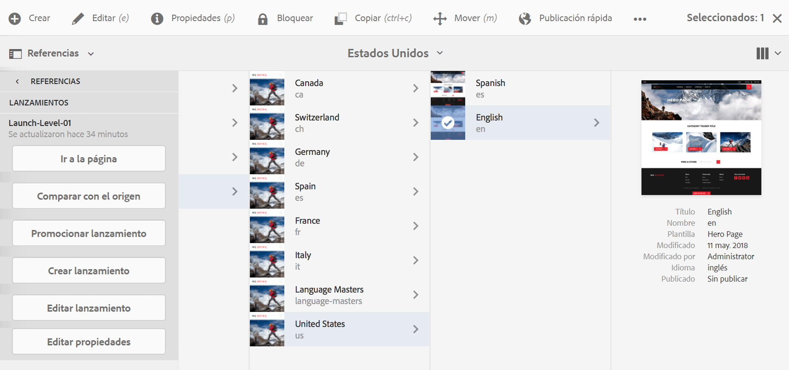

# Información general sobre lanzamientos{#launches}

>[!CAUTION]
>
>AEM 6.4 ha llegado al final de la compatibilidad ampliada y esta documentación ya no se actualiza. Para obtener más información, consulte nuestra [períodos de asistencia técnica](https://helpx.adobe.com/es/support/programs/eol-matrix.html). Buscar las versiones compatibles [here](https://experienceleague.adobe.com/docs/).

Los lanzamientos le permiten desarrollar contenido de forma eficaz para una versión futura.

Un lanzamiento se crea para permitir que se realicen cambios preparados para una publicación futura (a la vez que se mantienen las páginas actuales). Después de editar y actualizar las páginas de lanzamiento, estas se vuelven a promocionar al origen y luego se activan las páginas de origen (nivel superior). La promoción duplica el contenido del lanzamiento de nuevo a las páginas de origen y se puede hacer de forma manual o automática (según los campos establecidos al crear y editar el lanzamiento).

Por ejemplo, las páginas de productos de temporada de su tienda en línea se actualizan trimestralmente para que los productos mostrados se ajusten a la temporada actual. Para prepararse para la próxima actualización trimestral, puede crear un lanzamiento de las páginas web correspondientes. Durante el trimestre, se acumulan los siguientes cambios en la copia de lanzamiento:

* Cambios en las páginas de origen que se producen como resultado de tareas de mantenimiento normales. Estos cambios se duplican automáticamente en las páginas de lanzamiento.
* Ediciones que se realizan directamente en las páginas de lanzamiento como preparación para el trimestre siguiente.

Cuando llegue el trimestre siguiente, las páginas de lanzamiento se promocionan de forma que se puedan publicar las páginas de origen (que contienen el contenido actualizado). Puede promocionar todas las páginas o solamente aquellas que se han modificado. 

Los lanzamientos también pueden ser:

* Creado para varias ramas raíz. Aunque puede crear el lanzamiento para todo el sitio (y realizar los cambios allí), esto puede ser poco práctico ya que es necesario copiar todo el sitio. Cuando se trata de cientos o incluso miles de páginas, los requisitos y el rendimiento del sistema se ven afectados tanto por la acción de copia como posteriormente por las comparaciones necesarias para las tareas de promoción.
* Anidado (un lanzamiento dentro de un lanzamiento) para que pueda crear un lanzamiento a partir de un lanzamiento existente de modo que los autores puedan aprovechar los cambios ya realizados, en lugar de tener que realizar los mismos cambios varias veces para cada lanzamiento.

Esta sección describe cómo crear, editar y promocionar (y si es necesario) [delete](/help/sites-authoring/launches-creating.md#deleting-a-launch)) inicie páginas desde la consola Sitios o [la consola Lanzamientos](#the-launches-console):

* [Creación de lanzamientos](/help/sites-authoring/launches-creating.md)
* [Edición de lanzamientos](/help/sites-authoring/launches-editing.md)
* [Promoción de lanzamientos](/help/sites-authoring/launches-promoting.md)

## Lanzamientos: el orden de los eventos {#launches-the-order-of-events}

Los lanzamientos permiten desarrollar contenido de forma eficaz para una versión futura de una o varias páginas web activadas.

Los lanzamientos le permiten:

* Cree una copia de las páginas de origen:

   * La copia es su lanzamiento.
   * Las páginas de origen de nivel superior se denominan **Producción**.

      * Las páginas de origen se pueden tomar de varias ramas (separadas).
   >[!CAUTION]
   >
   >En la IU clásica no es posible utilizar varias ramas de origen para un lanzamiento.

   

* Edite la configuración de lanzamiento:

   * Agregue o elimine páginas o ramas al lanzamiento o desde él.
   * Editar propiedades de lanzamiento; como **Título**, **Fecha de lanzamiento** e indicador **Listo para la producción**.

* Puede promocionar y publicar el contenido de forma manual o automática:

   * Manualmente:

      * Promocione de nuevo el contenido del lanzamiento en la variable **Target** (páginas de origen) cuando esté listo para publicarse.
      * Publique el contenido desde las páginas de origen (después de volver a promocionarlo).
      * Promocione todas las páginas o solo las páginas modificadas.
   * Automáticamente. Esto implica lo siguiente:

      * El campo **Fecha**(**Live**) **de lanzamiento**: esto se puede establecer al crear o editar un lanzamiento. 
      * La variable **Listo para la producción** indicador: esto solo se puede establecer al editar un lanzamiento.
      * Si la variable **Listo para la producción** se establece, el lanzamiento se promocionará automáticamente a las páginas de producción en el **Launch**(**Activo**) **date**. Después de la promoción, las páginas de producción se publican automáticamente.

         Si no se ha establecido ninguna fecha, el indicador no tiene ningún efecto.

* Actualice las páginas de origen y de lanzamiento en paralelo:

   * Los cambios que se realicen en las páginas de origen se implementan automáticamente en la copia de lanzamiento (si está configurada con herencia; es decir, como Live Copy). 
   * Los cambios en la copia de lanzamiento se pueden realizar sin interrumpir las actualizaciones automáticas o las páginas de origen. 

   

* [Creación de un lanzamiento anidado](/help/sites-authoring/launches-creating.md#creating-a-nested-launch) - un lanzamiento dentro de un lanzamiento:

   * El origen es un lanzamiento existente.
   * Puede [promocionar un lanzamiento anidado](/help/sites-authoring/launches-promoting.md#promoting-a-nested-launch) a cualquier destinatario; puede ser un lanzamiento principal o las páginas de origen de nivel superior (producción).

   

   >[!CAUTION]
   >
   >Al eliminar un lanzamiento, se quitarán el lanzamiento en sí y todos los lanzamientos anidados descendentes.

>[!NOTE]
>
>La creación y edición de lanzamientos requieren derechos de acceso a `/content/launches`, como con el grupo predeterminado `content-authors`.
>
>Si experimenta algún problema, póngase en contacto con el administrador del sistema. 

### La consola Lanzamientos {#the-launches-console}

La consola Lanzamientos proporciona información general sobre los lanzamientos y le permite realizar acciones en los que se enumeran. Se puede acceder a la consola desde: 

* La consola **Herramientas**: **Herramientas**, **Sitios** **Lanzamientos**.

* O directamente con [http://localhost:4502/libs/launches/content/launches.html](http://localhost:4502/libs/launches/content/launches.html)

## Lanzamientos en referencias (consola Sitios) {#launches-in-references-sites-console}

1. En el **Sitios** , vaya al origen de los lanzamientos.
1. Abra el **Referencias** y seleccione la página de origen.
1. Select **Lanzamientos**, se enumerarán los lanzamientos existentes:

   

1. Pulse o haga clic en el lanzamiento adecuado. Se mostrará una lista de acciones posibles:

   
