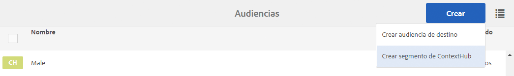
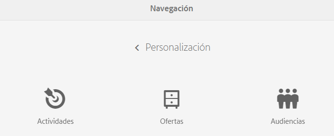
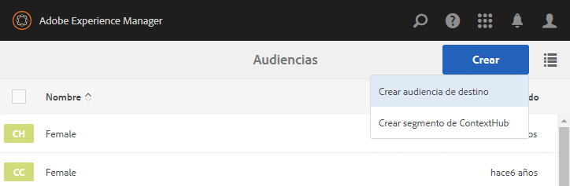

# Administrar audiencias{#managing-audiences}

>[!CAUTION]
>
>AEM 6.4 ha llegado al final de la compatibilidad ampliada y esta documentación ya no se actualiza. Para obtener más información, consulte nuestra [períodos de asistencia técnica](https://helpx.adobe.com/es/support/programs/eol-matrix.html). Buscar las versiones compatibles [here](https://experienceleague.adobe.com/docs/).

La consola de audiencias permite crear, organizar y administrar audiencias para la cuenta de Adobe Target o administrar segmentos para ContextHub o Client Context:

* Agregar audiencias: audiencias de Adobe Target o segmentos de ContextHub.
* Administre audiencias.

Una audiencia, denominada *segmento* en ContextHub y Client Context, es una clase de visitantes definida por criterios específicos que luego determinan quién ve una actividad segmentada. Cuando segmenta una actividad, puede seleccionar audiencias directamente en el proceso de segmentación o crear otras nuevas en la consola de audiencias.

En la consola de audiencias, las audiencias se organizan por marca.

Las audiencias están disponibles en el modo Segmentación del [contenido de destino de creación](/help/sites-authoring/content-targeting-touch.md), donde también puede crear audiencias (debe crear las audiencias de Adobe Target en la consola Audiencias). Las audiencias que crea en el modo Segmentación aparecen en la consola de audiencias.

Las audiencias se muestran con una etiqueta que describe qué tipo de audiencia se define:

* CH: segmento de ContextHub
* CC: segmento de Client Context
* AT: audiencia de Adobe Target

## Creación de un segmento de ContextHub en la consola de audiencias {#creating-a-contexthub-segment-in-the-audiences-console}

Puede crear un segmento de ContextHub en la consola de audiencias o durante el proceso de segmentación.

Para crear un segmento de ContextHub en la consola de audiencias:

1. En la consola de navegación, haga clic o pulse **Personalización**. Haga clic o pulse en **Audiencias**.
1. Haga clic o pulse **Crear segmento de ContextHub**.

   

1. En cuadro de diálogo **Nuevo segmento de ContextHub**, introduzca un título, ajuste el aumento y haga clic en **Crear**. El nuevo segmento de ContextHub aparece en la lista de audiencias.

   >[!NOTE]
   >
   >Puede ordenar la lista modificada pulsando o haciendo clic en **Modificado** para clasificar en orden descendente y ver las audiencias recién creadas.

Para obtener más información sobre la creación de segmentos con ContextHub, consulte la [Configuración de la segmentación con ContextHub](/help/sites-administering/segmentation.md) documentación.

## Creación de una audiencia de Adobe Target mediante la consola de audiencias {#creating-an-adobe-target-audience-using-the-audience-console}

Puede crear audiencias de Adobe Target directamente en AEM mediante la consola de audiencias.

Las audiencias están definidas por reglas que determinan quién se incluye en una actividad de Target. Una definición de audiencia puede incluir varias reglas y cada regla puede incluir varios parámetros.

Al utilizar más de una regla, estas reglas se combinan según el operador boolean AND, lo que significa que cualquier posible miembro de la audiencia debe cumplir todas las condiciones que se detallaron para ser incluido en la actividad. Por ejemplo, si define una regla de sistema operativo AND una regla de explorador, solo se incluyen en la actividad los visitantes que usan el sistema operativo definido y el explorador definido.

>[!NOTE]
>
>Si no ve **Crear audiencia de Target** en el menú **Crear**, no tiene los permisos necesarios para crear una audiencia. Necesita permisos de escritura en **/etc/segmentation** para poder crear audiencias. Los autores de contenido del grupo tienen permisos de escritura de forma predeterminada.

Para crear una audiencia de Adobe Target:

1. En la consola de navegación, haga clic o pulse **Personalización**. Haga clic o pulse en **Audiencias**.

   

1. En la consola de audiencias, haga clic o pulse **Crear** y, a continuación, **Crear audiencia de destino**.

   

1. En el **Configuración de Adobe Target** , seleccione la configuración de destino y pulse o haga clic en **OK**.
1. En el área Regla n.º 1, pulse o haga clic en el tipo de atributo e introduzca la información de atributo en los campos disponibles. Cuando termine, seleccione la marca de verificación a la derecha del atributo para guardarlo. Consulte [Atributos y sus opciones](#attributes-and-their-options) para obtener información sobre todos los atributos.
1. Haga clic en **Agregar regla** para añadir otra regla. Escriba tantas reglas como sea necesario. Las reglas se combinan con el operador boolean AND, lo que significa que la audiencia debe cumplir todos los requisitos de cada regla para poder optar a una actividad.
1. Haga clic o pulse **Siguiente**.
1. Escriba un nombre para la audiencia y toque o haga clic en **Guardar**.
1. Haga clic o pulse en **Guardar**. La audiencia se muestra en la lista de audiencias.

### Atributos y sus opciones {#attributes-and-their-options}

Puede crear reglas de segmentación para cada uno de los atributos siguientes:

| **Atributo** | **Descripción** | **Para obtener más información** |
|---|---|---|
| **Móvil** | Dirija la segmentación a dispositivos móviles en función de parámetros como dispositivo móvil, tipo de dispositivo, proveedor de dispositivo, dimensiones de pantalla (en píxeles) y más. | Consulte [Documentación móvil](https://experienceleague.adobe.com/docs/target/using/audiences/create-audiences/categories-audiences/mobile.html?lang=es) en Adobe Target. |
| **Personalizado** | Los parámetros personalizados son parámetros de mbox. Si pasa algún parámetro mbox a mboxes, o usa la función targetPageParams, ese parámetro aparece aquí para su uso en audiencias. | Consulte [Documentación de parámetros personalizados](https://experienceleague.adobe.com/docs/target/using/audiences/create-audiences/categories-audiences/custom-parameters.html?lang=es) en Adobe Target. |
| **SO** | Puede segmentar visitantes que usen un sistema operativo determinado. | Usuarios de Target que usen Linux, Macintosh o Windows. |
| **Páginas del sitio** | Segmente a los visitantes que estén en una página específica o que tengan un parámetro de mbox específico. | Consulte [Documentación de páginas del sitio](https://experienceleague.adobe.com/docs/target/using/audiences/create-audiences/categories-audiences/site-pages.html?lang=es) en Adobe Target. |
| **Explorador** | Puede segmentar usuarios que usen un explorador específico u opciones específicas del explorador cuando visiten la página. | Consulte la [documentación sobre las opciones del explorador](https://experienceleague.adobe.com/docs/target/using/audiences/create-audiences/categories-audiences/browser.html?lang=es) en Adobe Target. |
| **Perfil del visitante** | Segmente a los visitantes que cumplan parámetros de perfil específicos. | Consulte [Documentación del perfil del visitante](https://experienceleague.adobe.com/docs/target/using/audiences/visitor-profiles/visitor-profile.html?lang=es) en Adobe Target. |
| **Fuentes de tráfico** | Segmente a los visitantes en función del motor de búsqueda o de la página de aterrizaje que les lleve a su sitio. | Consulte [Documentación de fuentes de tráfico](https://experienceleague.adobe.com/docs/target/using/audiences/create-audiences/categories-audiences/traffic-sources.html?lang=es) en Adobe Target. |

## Modificación de una audiencia en la consola de audiencias {#modifying-an-audience-in-the-audiences-console}

>[!NOTE]
>
>Solo puede editar las audiencias de Adobe Target que se crearon en la misma instancia de AEM en la que está editando. Las audiencias de destino creadas en entornos de AEM diferentes no se pueden editar.

Puede editar cualquier audiencia de ContextHub o Client Context desde la consola de audiencias. También puede editar las audiencias de Adobe Target, pero solo las que se crearon en AEM:

1. En la consola de navegación, haga clic o pulse **Personalización**. Haga clic o pulse en **Audiencias**.
1. Toque o haga clic en el icono situado junto al segmento de ContextHub o Client Context que desee editar y haga clic o pulse **Editar**.
1. Haga los cambios necesarios en el editor de segmentos. Consulte [ClientContext](/help/sites-administering/campaign-segmentation.md) o [ContextHub](/help/sites-administering/contexthub-config.md) documentación.
