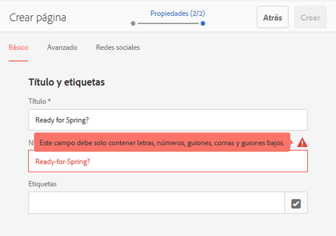

# Crear y organizar páginas{#creating-and-organizing-pages}

>[!CAUTION]
>
>AEM 6.4 ha llegado al final de la compatibilidad ampliada y esta documentación ya no se actualiza. Para obtener más información, consulte nuestra [períodos de asistencia técnica](https://helpx.adobe.com/es/support/programs/eol-matrix.html). Buscar las versiones compatibles [here](https://experienceleague.adobe.com/docs/).

En esta sección se describe cómo crear y administrar páginas con Adobe Experience Manager (AEM) para que luego pueda [crear contenido](/help/sites-authoring/editing-content.md) en esas páginas.

>[!NOTE]
>
>Su cuenta necesita el [derechos de acceso adecuados](/help/sites-administering/security.md) y [permissions](/help/sites-administering/security.md#permissions) para realizar acciones en páginas como crear, copiar, mover, editar y eliminar.
>
>Si se producen problemas, le sugerimos que se ponga en contacto con el administrador del sistema.

>[!NOTE]
>
>Existen varios [métodos abreviados del teclado](/help/sites-authoring/keyboard-shortcuts.md) que puede utilizar desde la consola de sitios web, y que le permitirán organizar las páginas de forma más eficaz.

## Organizar el sitio web {#organizing-your-website}

Como creador, deberá organizar el sitio web dentro de AEM. Esto implica crear y dar nombre a las páginas de contenido para que:

* Pueda encontrarlas con facilidad en el entorno de creación
* Los usuarios que visiten el sitio web puedan explorarlas fácilmente en el entorno de publicación

También puede usar [carpetas](#creating-a-new-folder) para organizar el contenido.

La estructura de un sitio web se puede considerar como una estructura de árbol que alberga las páginas de contenido. Los nombres de estas páginas de contenido se usan para formar las direcciones URL, mientras que el título se muestra cuando se visualiza el contenido de la página.

A continuación se muestra un ejemplo del sitio de We.Retail, en el que una página de pantalones de senderismo ( `desert-sky-shorts`):

* Entorno de creación: `http://localhost:4502/editor.html/content/we-retail/us/en/products/equipment/hiking/desert-sky-shorts.html`

* Entorno de publicación: `http://localhost:4503/content/we-retail/us/en/products/equipment/hiking/desert-sky-shorts.html`

Según la configuración de su instancia, use `/content` puede ser opcional en el entorno de publicación.

```xml
 /content
 /we-retail
  /us
   /en
    /products
     /equipment
      /hiking
       /desert-sky-shorts
       /hiking-poles
       /... 
      /running...
      /surfing...
      /...
     /seasonal...
     /...
    /about-us
    /experience
    /...
   /es...
  /de...
  /fr...
  /...
 /...
```

Esta estructura puede verse desde la consola **Sitios**, donde puede [desplazarse por las páginas de su sitio web](/help/sites-authoring/basic-handling.md#product-navigation) y llevar a cabo acciones en las páginas. También puede crear sitios nuevos y [páginas nuevas](#creating-a-new-page).

Desde cualquier punto, podrá ver la rama hacia arriba desde las rutas en la barra de encabezado:


### Convenciones de nomenclatura de páginas {#page-naming-conventions}

Al crear una página nueva, hay dos campos clave:

* **[Título](#title)**:

   * Se muestra al usuario en la consola, en la parte superior del contenido de la página al editar. 
   * Este campo es obligatorio.

* **[Nombre](#name)**:

   * Se usa para generar la URI.
   * La entrada del usuario en este campo es opcional. Si no se especifica, el nombre se deriva del título. Consulte la siguiente sección [Restricciones de nombres de páginas y Prácticas recomendadas](/help/sites-authoring/managing-pages.md#page-name-restrictions-and-best-practices) para obtener más detalles.

#### Restricciones de nombres de páginas y prácticas recomendadas {#page-name-restrictions-and-best-practices}

El **título** y el **nombre** de la página se pueden crear por separado, pero están relacionados:

* Al crear una página, solo la variable **Título** es obligatorio. Si no **Nombre** se proporciona al crear la página, AEM genera un nombre a partir de los 64 primeros caracteres del título (observe el conjunto de validación a continuación). Solo se utilizan los 64 primeros caracteres para ofrecer compatibilidad con la práctica recomendada de nombres de página cortos.

* Si el autor especifica manualmente un nombre de página, el límite de 64 caracteres no se aplica. Sin embargo, es posible que se produzcan otras limitaciones técnicas en la longitud del nombre de la página.

>[!NOTE]
>
>Al definir un nombre de página, se recomienda que sea lo más corto y expresivo posible para que el lector pueda entenderlo con facilidad. Para obtener más información, consulte la [guía de estilo W3C](https://www.w3.org/Provider/Style/TITLE.html) para el elemento de `title`.
>
>Además, recuerde que algunos exploradores (por ejemplo, las versiones anteriores de IE) solo aceptan URL con una longitud determinada, por lo que también existen motivos técnicos para mantener los nombres de las páginas cortos.

Al crear una página nueva, AEM [valida su nombre según las convenciones](/help/sites-developing/naming-conventions.md) que establecen tanto AEM como JCR.

El mínimo permitido de caracteres es:

* De &quot;a&quot; a &quot;z&quot;
* De la &quot;A&quot; a la &quot;Z&quot;
* De &quot;0&quot; a &quot;9&quot;
* _ (guion bajo)
* `-` (guion/signo menos)

Para obtener toda la información sobre los caracteres permitidos, consulte las [convenciones de nomenclatura](/help/sites-developing/naming-conventions.md).

>[!NOTE]
>
>Si AEM se está ejecutando en un [Implementación del administrador de persistencia de MongoMK](/help/sites-deploying/recommended-deploys.md), los nombres de página están limitados a 150 caracteres.

#### Título {#title}

Si proporciona solo un **título** de página al crear una nueva página, AEM derivará el **nombre** de página de esta cadena y lo [validará según las convenciones](/help/sites-developing/naming-conventions.md) impuestas por AEM y JCR. Se acepta un campo de **Título** con caracteres no válidos, pero los caracteres no válidos se sustituirán en el nombre derivado. Por ejemplo:

| Título | Nombre derivado |
|---|---|
| Schön | schoen.html |
| SC%&amp;&amp;ast;ç+ | sc---c-.html |

#### Nombre {#name}

Al indicar un valor **Nombre** cuando se crea una página, AEM [validará el nombre según las convenciones](/help/sites-developing/naming-conventions.md) impuestas por AEM y JCR. No se pueden enviar caracteres no válidos desde el campo **Nombre**. Cuando AEM detecta caracteres no válidos, el campo se resalta con un mensaje explicativo.



>[!NOTE]
>
>Evite utilizar un código de dos letras como nombre de página, tal como se indica en la norma ISO-639-1, a menos que sea la raíz de un idioma.
>
>Consulte [Preparación del contenido para su traducción](/help/sites-administering/tc-prep.md) para obtener más información.

### Plantillas {#templates}

En AEM, una plantilla especifica un tipo especializado de página. Se utilizará una plantilla como base para cualquier página nueva que se esté creando.

La plantilla define la estructura de una página, que incluye una imagen en miniatura y otras propiedades. Por ejemplo, puede tener plantillas separadas para páginas de productos, mapas del sitio e información de contacto. Las plantillas están compuestas de [componentes](#components).

AEM incluye varias plantillas listas para usar. Las plantillas disponibles dependen del sitio web individual. Los campos principales son:

* **Título** El título se muestra en la página web resultante.

* **Nombre** Se utiliza al dar nombre a la página.

* **Plantilla** Una lista de plantillas disponibles para usar durante la generación de la nueva página.

>[!NOTE]
>
>Si así se ha configurado en la instancia, los [autores de plantillas podrán crear plantillas con el editor de plantillas](/help/sites-authoring/templates.md).  

### Componentes {#components}

Componentes son los elementos ofrecidos por AEM para que pueda añadir tipos de contenido específicos. AEM incluye una amplia gama de [componentes integrados](/help/sites-authoring/default-components-console.md) que proporcionan una amplia funcionalidad. Estos incluyen:

* Texto
* Imagen
* Presentación de diapositivas
* Vídeo
* Y muchos más

Una vez que haya creado y abierto una página, puede [añadir contenido mediante los componentes](/help/sites-authoring/editing-content.md#inserting-a-component), que están disponibles en el [navegador de componentes](/help/sites-authoring/author-environment-tools.md#components-browser).

>[!NOTE]
>
>La [consola Componentes](/help/sites-authoring/default-components-console.md) aporta una visión general de los componentes de la instancia.

## Administrar páginas {#managing-pages}

### Creación de una nueva página {#creating-a-new-page}

A menos que se hayan creado todas las páginas por adelantado, antes de poder empezar a crear contenido, debe crear una página:

1. Abra la consola Sitios (por ejemplo, [http://localhost:4502/sites.html/content](http://localhost:4502/sites.html/content)).
1. Desplácese hasta la ubicación en la que desee crear la nueva página.
1. Abra el selector desplegable seleccionando **Crear** en la barra de herramientas y, a continuación, seleccione **Página** en la lista:

   

1. En el primer paso del asistente puede realizar una de las acciones siguientes:

   * Seleccione la plantilla que desea utilizar para crear la nueva página y, a continuación, toque o haga clic en **Siguiente** para continuar.
   * **Haga clic en Cancelar** para anular el proceso.

   

1. En el último paso del asistente puede realizar una de las acciones siguientes:

   * Utilice las tres pestañas para especificar las [propiedades de página](/help/sites-authoring/editing-page-properties.md) que desee asignar a la nueva página; a continuación, pulse o haga clic en **Crear** para crear la página.
   * Uso **Atrás** para volver a la selección de plantillas.

   Los campos clave son:

   * **Título**:

      * Se muestra al usuario y es obligatorio.
   * **Nombre**:

      * Se usa para generar la URI. Si no se especifica, el nombre se deriva del título.
      * Si proporciona una página **Nombre** al crear una página nueva, AEM [valide el nombre según las convenciones](/help/sites-developing/naming-conventions.md) impuesta por AEM y JCR.
      * You **no se pueden enviar caracteres no válidos** en el **Nombre** campo . Cuando AEM detecte caracteres no válidos, se resaltará el campo y se mostrará un mensaje explicativo para indicar los caracteres que deben eliminarse o reemplazarse.

   >[!NOTE]
   >
   >Consulte [Convenciones de nomenclatura de páginas](#page-naming-conventions).

   La información mínima necesaria para crear una página nueva es la **Título**.

   

1. Utilice **Crear** para completar el proceso y crear la nueva página. El cuadro de diálogo de confirmación le preguntará si desea **abrir** la página inmediatamente o volver a la consola (**Listo**): 

   

   >[!NOTE]
   >
   >Si crea una página con un nombre que ya existe en la ubicación, el sistema generará automáticamente una variación del nombre añadiéndole un número. Por ejemplo, si `winter` ya existe, la página nueva pasará a llamarse `winter0`.

1. Al volver a la consola, podrá ver la nueva página:

   

>[!CAUTION]
>
>Una vez creada la página, su plantilla no se puede cambiar, a menos que [crear un lanzamiento con una plantilla nueva](/help/sites-authoring/launches-creating.md#create-launch-with-new-template), aunque esto perderá cualquier contenido que ya exista.

### Abrir una página para su edición {#opening-a-page-for-editing}

Después de crear una página o desplazarse a una página existente (en la consola), puede abrirla para editarla:

1. Abra la consola **Sitios**.
1. Desplácese hasta que encuentre la página que desee editar.
1. Seleccione la página mediante:

   * [Acciones rápidas](/help/sites-authoring/basic-handling.md#quick-actions)
   * [El modo de selección](/help/sites-authoring/basic-handling.md#product-navigation) y la barra de herramientas

   A continuación, seleccione el icono **Editar**:

   

1. Se abrirá la página, y podrá [editarla](/help/sites-authoring/editing-content.md) si es necesario.

>[!NOTE]
>
>Solo se puede navegar a otras páginas desde el editor de páginas en el modo de previsualización, ya que los vínculos no están activos en el modo Editar.

### Copiar y pegar una página    {#copying-and-pasting-a-page}

Puede copiar una página y todas sus subpáginas en una nueva ubicación:

1. En la consola **Sitios**, desplácese hasta que encuentre la página que desea copiar.
1. Seleccione la página mediante:

   * [Acciones rápidas](/help/sites-authoring/basic-handling.md#quick-actions)
   * [El modo de selección](/help/sites-authoring/basic-handling.md#product-navigation) y la barra de herramientas

   Y luego el **Copiar** icono de página:

   

   >[!NOTE]
   >
   >Si se encuentra en el modo de selección, se cerrará automáticamente en cuanto se copie la página.

1. Desplácese hasta la ubicación de la copia nueva de la página.
1. Utilice la variable **Pegar** icono de página:

   

   Se creará una copia de la página original y de las subpáginas en esta ubicación.

   >[!NOTE]
   >
   >Si copia la página en una ubicación en la que ya existe una página con el mismo nombre que el original, el sistema generará automáticamente una variación del nombre adjuntándole un número. Por ejemplo, si `winter` ya existe, `winter` pasa a llamarse `winter1`.

### Mover una página o cambiarle el nombre {#moving-or-renaming-a-page}

>[!NOTE]
>
>El cambio de nombre de una página también está sujeto a las [Convenciones de nomenclatura de páginas](#page-naming-conventions) al especificar el nuevo nombre de página.

>[!NOTE]
>
>Una página solo se puede mover a una ubicación en la que la plantilla en la que se basa la página esté permitida. Consulte [Disponibilidad de plantillas](/help/sites-developing/templates.md#template-availability) para obtener más información.

El procedimiento para mover o cambiar el nombre de una página es básicamente el mismo y se controla mediante el mismo asistente. Con este asistente puede:

* Cambiar el nombre de una página sin moverla.
* Mover la página sin cambiar su nombre.
* Moverla y cambiarle el nombre al mismo tiempo.

AEM le ofrece la funcionalidad de actualizar cualquier vínculo interno que haga referencia a la página que está moviendo o cuyo nombre está cambiando. Esto se puede hacer página por página para proporcionar flexibilidad total.

1. Desplácese hasta que encuentre la página que desee mover.
1. Seleccione la página mediante:

   * [Acciones rápidas](/help/sites-authoring/basic-handling.md#quick-actions)
   * [El modo de selección](/help/sites-authoring/basic-handling.md#product-navigation) y la barra de herramientas

   A continuación, seleccione la **Mover** icono de página:

   

   Se abrirá el asistente para mover página.

1. En el **Cambiar nombre** del asistente puede:

   * Especifique el nombre que desea que tenga la página cuando se haya desplazado y, a continuación, toque o haga clic en **Siguiente** para continuar.
   * **Haga clic en Cancelar** para anular el proceso.

   

   El nombre de la página puede seguir siendo el mismo si solo está moviendo la página.

   >[!NOTE]
   >
   >Si mueve una página a una ubicación en la que ya existe una página con el mismo nombre, el sistema generará automáticamente una variación del nombre adjuntándole un número. Por ejemplo, si `winter` ya existe, `winter` pasa a llamarse `winter1`.

1. En el **Seleccionar destino** del asistente puede:

   * Utilice la variable [vista de columna](/help/sites-authoring/basic-handling.md#column-view) para desplazarse a la nueva ubicación de la página:

      * Seleccione el destino haciendo clic en la miniatura de destino.
      * Haga clic en **Siguiente** para continuar.
   * Uso **Atrás** para volver a la especificación de nombre de página.

   

   >[!NOTE]
   >
   >Si mueve una página a una ubicación en la que ya existe una página con el mismo nombre, el sistema generará automáticamente una variación del nombre adjuntándole un número. Por ejemplo, si `winter` ya existe, `winter` pasa a llamarse `winter1`.

1. Si la página está vinculada o se hace referencia a ella, estas referencias se enumerarán en la variable **Ajustar/volver a publicar** paso a paso. Puede indicar cuál debería ajustarse y volverse a publicar, según corresponda.

   

1. Selección **Mover** completará el proceso y moverá o cambiará el nombre de la página según corresponda.

>[!NOTE]
>
>Si la página ya se ha publicado, al mover la página se cancelará la publicación automáticamente. De forma predeterminada, se volverá a publicar cuando se complete el movimiento, pero esto puede cambiar si se desmarca la casilla **Volver a publicar** en el campo **Ajustar/volver a publicar** paso a paso.

>[!NOTE]
>
>Si no se hace referencia a la página, se omitirá el paso **Ajustar/volver a publicar**.

### Eliminar una página {#deleting-a-page}

1. Desplácese hasta que vea la página que desee eliminar.
1. Uso [modo de selección](/help/sites-authoring/basic-handling.md#viewing-and-selecting-resources) para seleccionar la página requerida, use **Eliminar** en la barra de herramientas:

   

   >[!NOTE]
   >
   >Como medida de seguridad, el icono **Eliminar** página no está disponible como acción rápida.

1. Aparecerá un cuadro de diálogo que le pedirá que confirme la acción.

   * **¿Quiere archivar las páginas antes de la eliminación?** - Si se selecciona, las versiones de las páginas seleccionadas para su eliminación se crearán al eliminarlas.
      * [Las versiones se pueden restaurar más adelante.](/help/sites-authoring/working-with-page-versions.md)
      * Las páginas eliminadas sin versiones anteriores no se pueden restaurar.
      * Esta opción solo está disponible desde AEM versión 6.4.7.0.
   * **Cancelar** para cancelar la acción
   * **Eliminar** para confirmar la acción:

      * Si la página no tiene referencias, la página se eliminará.
      * Si la página dispone de referencias, un cuadro de mensaje le informa de que **Se hace referencia a una o varias páginas.** Puede seleccionar **Forzar eliminación** o **Cancelar**.

>[!NOTE]
>
>Si una página ya se ha publicado, se cancelará su publicación automáticamente antes de eliminarse.

### Bloquear una página   {#locking-a-page}

Puede [bloquear/desbloquear una página](/help/sites-authoring/editing-content.md#locking-a-page) desde una consola o al editar una página individual. La información sobre si una página está bloqueada también se muestra en ambas ubicaciones.

 

### Crear una nueva carpeta {#creating-a-new-folder}

Puede crear carpetas para organizar archivos y páginas.

>[!NOTE]
>
>Las carpetas también están sujetas al [Convenciones de nomenclatura de páginas](#page-naming-conventions) al especificar el nuevo nombre de carpeta.

>[!CAUTION]
>
>* Las carpetas solo se pueden crear directamente en **Sitios** o en otras carpetas. No se pueden crear en una página.
>* Las acciones estándar mover, copiar, pegar, eliminar, publicar, cancelar publicación y las propiedades de ver/editar se pueden ejecutar en una carpeta.
>* Las carpetas no están disponibles para la selección en una Live Copy.
>


1. Abra la consola **Sitios** y vaya hasta la ubicación deseada.
1. Para abrir la lista de opciones, seleccione **Crear** desde la barra de herramientas
1. Select **Carpeta** para abrir el cuadro de diálogo. Aquí puede indicar el **Nombre** y el **Título**:

   

1. Seleccione **Crear** para crear la carpeta.
