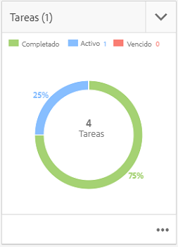

# Integración de proyectos y PIM creativos{#creative-project-and-pim-integration}

>[!CAUTION]
>
>AEM 6.4 ha llegado al final de la compatibilidad ampliada y esta documentación ya no se actualiza. Para obtener más información, consulte nuestra [períodos de asistencia técnica](https://helpx.adobe.com/es/support/programs/eol-matrix.html). Buscar las versiones compatibles [here](https://experienceleague.adobe.com/docs/).

Si es un especialista en marketing o un profesional creativo, puede utilizar las herramientas de Proyecto creativo de Adobe Experience Manager (AEM) para administrar la fotografía de producto relacionada con el comercio electrónico y los procesos creativos asociados dentro de su organización.

En concreto, puede utilizar Creative Project para optimizar las siguientes tareas en el flujo de trabajo de la sesión fotográfica:

* Generación de una solicitud de sesión fotográfica
* Carga de una sesión fotográfica
* Colaboración en una sesión fotográfica
* Empaquetado de recursos aprobados

>[!NOTE]
>
>Consulte [Funciones de usuario del proyecto para obtener información](/help/sites-authoring/projects.md#user-roles-in-a-project) sobre la asignación de funciones de usuario y flujos de trabajo a determinados tipos de usuarios.

## Exploración de los flujos de trabajo de la sesión fotográfica del producto  {#exploring-product-photo-shoot-workflows}

Creative Project ofrece varias plantillas de proyecto para satisfacer los distintos requisitos del proyecto. La plantilla **Proyecto de sesión fotográfica del producto **está disponible de forma predeterminada. Esta plantilla incluye flujos de trabajo de sesión fotográfica que le permiten iniciar y administrar solicitudes de sesión fotográfica del producto. También incluye una serie de tareas que le permiten obtener imágenes digitales para productos a través de procesos de revisión y aprobación adecuados.

La plantilla incluye los siguientes flujos de trabajo:

* **Flujo de trabajo de la sesión fotográfica del producto (integración del comercio)**: Este flujo de trabajo aprovecha la integración del comercio con el sistema de administración de la información del producto (PIM) para generar automáticamente una lista de tomas para los productos seleccionados (jerarquía). Puede ver los datos del producto como parte de los metadatos del recurso una vez completado el flujo de trabajo.
* **Flujo de trabajo de la sesión fotográfica del producto**: Este flujo de trabajo permite proporcionar una lista de tomas en lugar de depender de la integración del comercio. Asigna las imágenes cargadas a un archivo CSV en la carpeta de recursos del proyecto.

>[!NOTE]
>
>El archivo CSV que se carga en la tarea Cargar lista de tomas del flujo de trabajo de la sesión fotográfica del producto debe tener el nombre de archivo shotlist.csv.

## Crear un proyecto de sesión fotográfica del producto {#create-a-product-photo-shoot-project}

1. En el **Proyectos** consola, tocar/hacer clic **Crear** y, a continuación, elija **Crear proyecto** de la lista.

   

1. En el **Crear proyecto** página, seleccione la plantilla de proyecto de sesión fotográfica y toque o haga clic en **Siguiente**.

   

1. Introduzca los detalles del proyecto, como el título, la descripción y la fecha de vencimiento. Agregue usuarios y asígneles diversas funciones. También puede agregar una miniatura para el proyecto.

   

1. Toque o haga clic en **Crear**. Un mensaje de confirmación notifica que se ha creado el proyecto.
1. Toque o haga clic **Listo** para volver a la **Proyectos** consola. Alternativamente, toque o haga clic **Apertura** para ver los recursos del proyecto de sesión fotográfica.

## Inicio del trabajo en un proyecto de sesión fotográfica del producto {#starting-work-in-a-product-photo-shoot-project}

Para iniciar una solicitud de sesión fotográfica, toque o haga clic en un proyecto y, a continuación, toque o haga clic **Agregar trabajo** en la página de detalles del proyecto para iniciar un flujo de trabajo.


Un proyecto de sesión fotográfica del producto incluye los siguientes flujos de trabajo listos para usar:

* Flujo de trabajo de la sesión fotográfica del producto (integración del comercio)
* Flujo de trabajo de la sesión fotográfica del producto

Utilice el flujo de trabajo de la sesión fotográfica del producto (integración del comercio) para asignar recursos de imagen a los productos de AEM. Este flujo de trabajo aprovecha la integración de comercio para vincular las imágenes aprobadas a los datos de productos existentes en la ubicación */etc/commerce*.

El flujo de trabajo de la sesión fotográfica del producto (integración del comercio) incluye las siguientes tareas:

* Crear lista de tomas
* Cargar sesión fotográfica
* Retocar la sesión fotográfica
* Revisar y aprobar
* Mover a la tarea de producción

Si la información del producto no está disponible en AEM, utilice el flujo de trabajo de la sesión fotográfica del producto para asignar los recursos de imagen a los productos en función de los detalles que cargue en un archivo CSV. El archivo CSV debe contener información básica del producto, como ID del producto, categoría y descripción. El flujo de trabajo recupera los recursos aprobados para los productos.

Este flujo de trabajo incluye las siguientes tareas:

* Cargar lista de tomas
* Cargar sesión fotográfica
* Retocar la sesión fotográfica
* Revisar y aprobar
* Mover a la tarea de producción

Puede personalizar este flujo de trabajo mediante la opción de configuración de flujo de trabajo.

Ambos flujos de trabajo incluyen pasos para vincular productos con los recursos aprobados. Cada flujo de trabajo incluye los siguientes pasos:

* Configuración del flujo de trabajo: Describe las opciones para personalizar el flujo de trabajo
* Inicio de un flujo de trabajo de proyecto: Explica cómo iniciar una sesión fotográfica del producto
* Detalles de las tareas del flujo de trabajo: Proporciona detalles de tareas disponibles en el flujo de trabajo

## Seguimiento del progreso del proyecto {#tracking-project-progress}

Puede realizar un seguimiento del progreso de un proyecto monitorizando las tareas activas/completadas de un proyecto.

Utilice lo siguiente para monitorizar el progreso de un proyecto:

* **Tarjeta de tarea**

* **Lista de tareas**

La tarjeta de la tarea muestra el progreso general del proyecto. Aparece en la página Detalles del proyecto solo si el proyecto tiene alguna tarea relacionada. La tarjeta de la tarea muestra el estado actual de finalización del proyecto en función del número de tareas completadas. No incluye tareas futuras.

La tarjeta de la tarea proporciona los siguientes detalles:

* Porcentaje de tareas activas
* Porcentaje de tareas completadas



La lista de tareas proporciona información detallada sobre la tarea de flujo de trabajo activa para el proyecto. Para mostrar la lista, toque o haga clic en la tarjeta Tarea . La lista Tarea también muestra metadatos como la fecha de inicio, la fecha de vencimiento, el usuario asignado, la prioridad y el estado de la tarea.


## Configuración del flujo de trabajo {#workflow-configuration}

Esta tarea implica asignar pasos de flujo de trabajo a los usuarios según sus funciones.

Para configurar la variable **Sesión fotográfica del producto** flujo de trabajo:

1. Vaya a **Herramientas** > **Flujos de trabajo** y, a continuación, pulse el botón **Modelos** para abrir el **Modelos de flujo de trabajo** página.
1. Seleccione el **Sesión fotográfica del producto** flujo de trabajo y toque el **Editar** de la barra de herramientas para abrirlo en modo de edición.

   

1. En el **Flujo de trabajo de la sesión fotográfica del producto** , abra una tarea de proyecto. Por ejemplo, abra el **Cargar lista de tomas** tarea.

   

1. Haga clic en el **Tarea** para configurar lo siguiente:

   * Nombre de la tarea
   * Usuario predeterminado (función) que recibe la tarea
   * Prioridad predeterminada de la tarea, que se muestra en la lista de tareas del usuario
   * Descripción de la tarea que se mostrará cuando el usuario asignado abra la tarea
   * Fecha de vencimiento de una tarea, que se calcula en función del momento en que se inició la tarea

1. Haga clic en **OK** para guardar los ajustes de configuración.

   Del mismo modo, puede configurar las siguientes tareas para la variable **Sesión fotográfica del producto** flujo de trabajo:

   * Cargar sesión fotográfica
   * Retocar sesión fotográfica del producto
   * Crítica de la sesión fotográfica
   * Mover a producción

   Realice un procedimiento similar para configurar las tareas en la **Flujo de trabajo de la sesión fotográfica del producto (integración del comercio)**.

En esta sección se describe cómo integrar la administración de la información del producto con su proyecto creativo.

## Inicio de un flujo de trabajo de proyecto {#starting-a-project-workflow}

1. Vaya a un proyecto de sesión fotográfica del producto y toque o haga clic en el botón **Agregar trabajo** en el **Flujos de trabajo** tarjeta.
1. Seleccione el **Sesión fotográfica del producto (integración del comercio)** tarjeta de flujo de trabajo para iniciar el flujo de trabajo de la sesión fotográfica del producto (integración del comercio). Si la información del producto no está disponible en /etc/commerce, seleccione el **Sesión fotográfica del producto** flujo de trabajo e inicie el flujo de trabajo de la sesión fotográfica del producto.

   

1. Toque o haga clic **Siguiente** para iniciar el flujo de trabajo en el proyecto.
1. Introduzca los detalles del flujo de trabajo en la página siguiente.

   

   Haga clic en **Submit** para iniciar el flujo de trabajo de la sesión fotográfica. Se muestra la página de detalles del proyecto para el proyecto de sesión fotográfica.

   

### Detalles de las tareas del flujo de trabajo {#workflow-tasks-details}

El flujo de trabajo de la sesión fotográfica incluye varias tareas. Cada tarea se asigna a un grupo de usuarios en función de la configuración definida para la tarea.

#### Crear tarea de lista de tomas {#create-shot-list-task}

La variable **Crear lista de tomas** permite al propietario del proyecto seleccionar productos para los que se requieren imágenes. Según la opción seleccionada por el usuario, se genera un archivo CSV que contiene información básica del producto.

1. En la carpeta del proyecto, toque o haga clic en los puntos suspensivos de la [Tarjeta de tareas](#tracking-project-progress) para ver el elemento de la tarea en el flujo de trabajo.

   

1. Seleccione el **Crear lista de tomas** y, a continuación, toque o haga clic en la **Apertura** de la barra de herramientas.

   

1. Revise los detalles de la tarea y, a continuación, toque o haga clic en el botón **Crear lista de tomas** botón.

   

1. Seleccione los productos para los que existen datos del producto sin imágenes asociadas.

   

1. Toque o haga clic en el botón **Agregar a la lista de tomas** para crear un archivo CSV que contenga una lista de todos estos productos. Un mensaje confirma que la lista de tomas se crea para los productos seleccionados. Haga clic en **Cerrar** para completar el flujo de trabajo.
1. Después de crear una lista de tomas, la variable **Ver lista de tomas** aparece. Para agregar más productos a la lista de tomas, toque o haga clic **Agregar a la lista de tomas**. En este caso, los datos se añaden a la lista de tomas creada inicialmente.

   

1. Toque o haga clic **Ver lista de tomas** para ver la nueva lista de tomas.

   

   Para editar los datos existentes o agregar nuevos datos, toque o haga clic en **Editar** en la barra de herramientas. Solo el **producto **y **Descripción** los campos son editables.

   

   Después de actualizar el archivo, toque o haga clic en **Guardar** en la barra de herramientas para guardar el archivo.

1. Después de agregar los productos, toque o haga clic en el botón **Completar** en la página de detalles de la tarea **Crear lista de tomas **para marcar la tarea como completada. Puede añadir un comentario opcional.

   La finalización de la tarea introduce los siguientes cambios dentro del proyecto:

   * Los recursos correspondientes a la jerarquía del producto se crean en una carpeta con el mismo nombre que el título del flujo de trabajo.
   * Los metadatos de los recursos se pueden editar mediante la consola Recursos, incluso antes de que el fotógrafo proporcione las imágenes.
   * Se crea una carpeta de sesión fotográfica que almacena las imágenes que proporciona el fotógrafo. La carpeta Sesión fotográfica contiene subcarpetas para cada entrada de producto en la Lista de tomas.

   Para el flujo de trabajo de la sesión fotográfica del producto (sin integración del comercio), Cargar lista de tomas es la primera tarea. Toque o haga clic **Cargar lista de tomas** para cargar un **shotlist.csv** archivo. El archivo CSV debe contener el ID del producto. Los demás campos son opcionales. Puede utilizarlos para asignar recursos a productos.

### Cargar tarea de lista de tomas {#upload-shot-list-task}

Esta tarea forma parte del flujo de trabajo de la sesión fotográfica del producto . Esta tarea se realiza si la información del producto no está disponible en AEM. En este caso, se carga una lista de productos en un archivo CSV para el que se requieren recursos de imagen. En función de los detalles del archivo CSV, se asignan recursos de imagen a los productos.

Utilice la variable **Ver lista de tomas** vínculo en la tarjeta del proyecto del procedimiento anterior para descargar un archivo CSV de ejemplo. Revise el archivo de muestra para conocer el contenido habitual de un archivo CSV.

La lista de productos o el archivo CSV pueden contener campos, como **Categoría, Producto, Id., Descripción** y **Ruta**. La variable **Id** es obligatorio y contiene el ID del producto. Los demás campos son opcionales.

Un producto puede pertenecer a una categoría concreta. La categoría del producto puede aparecer en el CSV debajo del **Categoría** para abrir el Navegador. La variable **Product** contiene el nombre del producto. En el **Descripción** , introduzca la descripción del producto o las instrucciones para el fotógrafo.

>[!NOTE]
>
>El nombre de las imágenes que se van a cargar debe comenzar por &quot;**&lt;productid>_&quot;** donde se hace referencia al ID de producto desde la variable **Id** en el campo *shotlist.csv* archivo. Por ejemplo, para un producto de la lista de tomas con **Id. 397122**, puede cargar archivos con nombres **397122_highcontrast.jpg**, **397122_lowlight.png**, etc.

1. En la carpeta del proyecto, toque o haga clic en los puntos suspensivos de la [Tarjeta de tareas](#tracking-project-progress) para ver la lista de tareas en el flujo de trabajo.
1. Seleccione el **Cargar lista de tomas** y, a continuación, toque o haga clic en la **Apertura** de la barra de herramientas.

   

1. Revise los detalles de la tarea y, a continuación, toque o haga clic en el botón **Cargar lista de tomas** botón.

   

1. Toque o haga clic en el botón **Cargar lista de tomas** para cargar el archivo CSV con el nombre de archivo shotlist.csv. El flujo de trabajo reconoce este archivo como fuente que se utilizará para extraer datos del producto para la siguiente tarea.
1. Cargue un archivo CSV que contenga la información del producto en el formato adecuado. El vínculo **Ver recursos cargados **aparece en la tarjeta una vez cargado el archivo CSV.

   

   Haga clic en el **Completar** para completar la tarea.

1. Toque o haga clic en el botón **Completar** para completar la tarea.

### Tarea Cargar sesión fotográfica {#upload-photo-shoot-task}

Si es un editor, puede cargar tomas para los productos que se enumeran en la **shotlist.csv** que se crea o carga en la tarea anterior.

El nombre de las imágenes que se van a cargar debe comenzar por **&quot;&lt;productid>_&quot;** donde se hace referencia al ID de producto desde la variable **Id** en el campo **shotlist.csv** archivo. Por ejemplo, para un producto con **ID 397122** en la lista de tomas, puede cargar archivos con nombres **397122_highcontrast.jpg**, **397122_lowlight.png**, etc.

Puede cargar las imágenes directamente o cargar un archivo ZIP que contenga las imágenes. En función de sus nombres, las imágenes se colocan dentro de las carpetas de productos correspondientes dentro de la variable **Sesión fotográfica** carpeta.

1. En la carpeta del proyecto, toque o haga clic en los puntos suspensivos de la [Tarjeta de tarea](#tracking-project-progress) para ver el elemento de la tarea en el flujo de trabajo.
1. Seleccione el **Cargar sesión fotográfica** y, a continuación, toque o haga clic en la **Apertura** de la barra de herramientas.

   

1. Toque o haga clic en **Cargar sesión fotográfica **y cargue las imágenes de la sesión fotográfica.
1. Toque o haga clic en el botón **Completar** para completar la tarea.

### Tarea Retocar sesión fotográfica {#retouch-photo-shoot-task}

Si tiene derechos de edición, realice la tarea Retocar sesión fotográfica para editar las imágenes cargadas en la carpeta de la sesión fotográfica.

1. En la carpeta del proyecto, toque o haga clic en los puntos suspensivos de la [Tarjeta de tarea](#tracking-project-progress) para ver el elemento de la tarea en el flujo de trabajo.
1. Seleccione el **Retocar sesión fotográfica** y, a continuación, toque o haga clic en la **Apertura** de la barra de herramientas.

   

1. Toque o haga clic en el botón **Ver recursos cargados** en el **Retocar sesión fotográfica** para examinar las imágenes cargadas.

   

   Si es necesario, edite las imágenes mediante una aplicación de Adobe Creative Cloud.

   

1. Toque o haga clic en el botón **Completar** para completar la tarea.

### Revisar y aprobar tarea {#review-and-approve-task}

En esta tarea, se revisan las imágenes de la sesión fotográfica subidas por un fotógrafo y se marcan las imágenes como aprobadas para su uso.

1. En la carpeta del proyecto, toque o haga clic en los puntos suspensivos de la [Tarjeta de tarea](#tracking-project-progress) para ver el elemento de la tarea en el flujo de trabajo.
1. Seleccione el **Revisar y aprobar** y, a continuación, toque o haga clic en la **Apertura** de la barra de herramientas.

   

1. En el **Revisar y aprobar** , asigne la tarea de revisión a la función, por ejemplo, Revisores, y luego toque o haga clic en **Revisar **para comenzar a revisar las imágenes del producto cargadas.

   

1. Seleccione una imagen de producto y toque o haga clic en el icono Aprobar de la barra de herramientas para marcarla como aprobada.

   

   Una vez aprobada la imagen, aparece un banner aprobado encima.

   >[!NOTE]
   Puede excluir algunos productos sin ninguna imagen. Posteriormente, puede volver a visitar la tarea y marcarla como completada una vez completada.

1. Toque o haga clic **Completar**. Las imágenes aprobadas están vinculadas a los recursos vacíos que se crearon.

Puede navegar a los recursos del proyecto mediante la interfaz de usuario de Assets y comprobar las imágenes aprobadas.

Toque o haga clic en el siguiente nivel para ver los productos según la jerarquía de datos del producto.

Creative Project asocia los recursos aprobados con el producto al que se hace referencia. Los metadatos de los recursos se actualizan con la referencia del producto y la información básica en la pestaña **Datos del producto **en las propiedades de los recursos que aparecen en la sección Metadatos de los recursos de AEM.

>[!NOTE]
En el flujo de trabajo de la sesión fotográfica del producto (sin integración del comercio), las imágenes aprobadas no están asociadas con los productos.

### Mover a la tarea de producción {#move-to-production-task}

Esta tarea mueve los recursos aprobados a la carpeta lista para la producción para que estén disponibles para su uso.

1. En la carpeta del proyecto, toque o haga clic en los puntos suspensivos de la [Tarjeta de tarea](#tracking-project-progress) para ver el elemento de la tarea en el flujo de trabajo.
1. Seleccione el **Mover a producción** y, a continuación, toque o haga clic en la **Apertura** de la barra de herramientas.

   

1. Para ver los recursos aprobados para la sesión fotográfica antes de moverlos a la carpeta lista para la producción, haga clic en el botón **Ver recursos aprobados** vínculo debajo de la miniatura del proyecto en el **Mover a producción** página de tareas.

   

1. Introduzca la ruta de la carpeta lista para la producción en la **Mover a** campo .

   

   Toque o haga clic **Mover a producción**. Cierre el mensaje de confirmación. Los recursos se mueven a la ruta mencionada y se crea automáticamente un conjunto de giros para los recursos aprobados para cada producto en función de la jerarquía de carpetas.

1. Toque o haga clic en el botón **Completar** de la barra de herramientas. El flujo de trabajo se completa cuando se marca el último paso como completado.

## Visualización de metadatos de recursos DAM {#viewing-dam-asset-metadata}

Después de la aprobación, los recursos se vinculan a los productos correspondientes. La variable [Página Propiedades](/help/assets/managing-assets-touch-ui.md#editing-properties) de los recursos aprobados ahora tiene un **Datos del producto** (información del producto vinculada). Esta pestaña muestra los detalles del producto, el número de SKU y otros detalles relacionados con el producto que vinculan el recurso. Toque o haga clic en el botón **Editar** para actualizar una propiedad de recurso. La información relacionada con el producto sigue siendo de solo lectura.

Toque o haga clic en el vínculo que aparece para desplazarse a la página de detalles del producto correspondiente en la consola de producto con la que está asociado el recurso.

## Personalización de los flujos de trabajo de la sesión fotográfica del proyecto {#customizing-the-project-photo-shoot-workflows}

Puede personalizar los flujos de trabajo de la sesión fotográfica del proyecto en función de los requisitos. Se trata de una tarea opcional basada en funciones que se realiza para establecer el valor de una variable dentro del proyecto. Posteriormente, puede utilizar el valor configurado para llegar a una decisión.

1. Toque o haga clic en el logotipo de AEM y, a continuación, vaya a **Herramientas** > **Flujo de trabajo** > **Modelos** para abrir la página Modelos de flujo de trabajo .
1. Seleccione el **Sesión fotográfica del producto (integración del comercio)** o **Sesión fotográfica del producto** flujo de trabajo y toque o clic **Editar** en la barra de herramientas para abrir el flujo de trabajo en modo de edición.
1. Abra el **Proyectos** tareas en la barra de tareas y arrastre el **Crear tarea de proyecto basada en roles** paso al flujo de trabajo.

   

1. Abra el **Tarea basada en roles** paso a paso.
1. En el **Tarea** , proporcione un nombre para la tarea que se mostrará en la pestaña **Tarea** Lista. También puede asignar la tarea a una función, establecer la prioridad predeterminada, proporcionar una descripción y especificar el momento en el que debe realizarse la tarea.

   

1. En el **Enrutamiento** , especifique las acciones para la tarea. Para agregar varias acciones, toque o haga clic en el vínculo **Agregar elemento **.

   

1. Después de añadir las opciones, haga clic en **OK** para añadir los cambios al paso .

   >[!NOTE]
   Tocar/hacer clic **OK** no guarda los cambios en el flujo de trabajo. Para guardar los cambios en el flujo de trabajo, toque o haga clic en **Guardar**.

1. Abra el **Flujo de trabajo** tareas de la barra de tareas y añadir una **Ir** tarea.
1. Abra el **Ir** y toque o haga clic en la función **Proceso** pestaña .
1. Especifique el siguiente código en la variable **Secuencia de comandos** cuadro:

```
   function check() {

   if (workflowData.getMetaDataMap().get("lastTaskAction","") == "Reject All") {

   return true

   }

   // set copywriter user in metadata

   var previousId = workflowData.getMetaDataMap().get("lastTaskCompletedBy", "");

   workflowData.getMetaDataMap().put("copywriter", previousId);

   return false;

   }
```

>[!NOTE]
Para obtener más información sobre secuencias de comandos en los pasos del flujo de trabajo, consulte [Definición de una regla para una división OR](/help/sites-developing/workflows-models.md).


1. Toque o haga clic **OK**.

1. Toque o haga clic **Guardar** para guardar el flujo de trabajo.

   

1. Ahora aparece una nueva tarea de aceptación del propietario del proyecto después de la [Tarea Mover a producción](#move-to-production-task) se completa y se asigna al propietario.

   El usuario con la función Propietario puede completar la tarea y seleccionar una acción (de la lista de acciones agregadas en las configuraciones de paso del flujo de trabajo) en la lista de la ventana emergente de comentarios.

   

   Seleccione la opción adecuada y haga clic en **Completar** para ejecutar el **Ir al paso** en el flujo de trabajo.

>[!NOTE]
Cuando se inicia un servidor, el servlet de la lista de tareas del proyecto almacena en caché las asignaciones entre los tipos de tareas y las direcciones URL definidas en `/libs/cq/core/content/projects/tasktypes`. A continuación, puede realizar la superposición habitual y agregar tipos de tareas personalizados colocándolos debajo de `/apps/cq/core/content/projects/tasktypes`.
