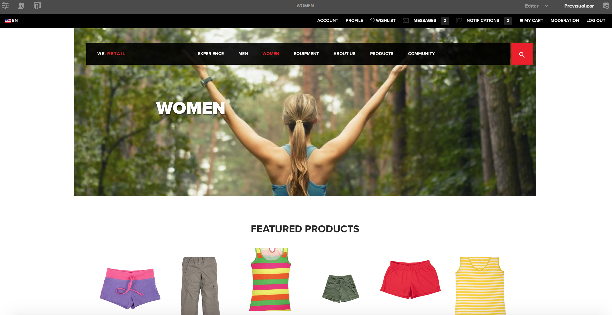

# Crear una página para dispositivos móviles {#authoring-a-page-for-mobile-devices}

>[!CAUTION]
>
>AEM 6.4 ha llegado al final de la compatibilidad ampliada y esta documentación ya no se actualiza. Para obtener más información, consulte nuestra [períodos de asistencia técnica](https://helpx.adobe.com/es/support/programs/eol-matrix.html). Buscar las versiones compatibles [here](https://experienceleague.adobe.com/docs/).

Al crear una página móvil, esta se muestra de forma que emula al dispositivo móvil. Al crear la página, puede cambiar entre varios emuladores para ver qué ve el usuario final al acceder a la página.

Los dispositivos se agrupan en las categorías característica, inteligente y táctil, según las capacidades de los dispositivos para procesar una página. Cuando el usuario final accede a una página móvil, AEM detecta el dispositivo y envía la representación que corresponde a su grupo de dispositivos.

>[!NOTE]
>
>Para crear un sitio móvil basado en un sitio estándar existente, cree una Live Copy del sitio estándar. (Consulte [Creación de una Live Copy para diferentes canales](/help/sites-administering/msm-livecopy.md).)
>
>Los desarrolladores de AEM pueden crear nuevos grupos de dispositivos. (Consulte [Creación de filtros de grupo de dispositivos](/help/sites-developing/groupfilters.md).)

Utilice el siguiente procedimiento para crear una página para móvil:

1. En la navegación global, abra la consola **Sitios**.
1. Abra la página . **We.Retail** -> **Estados Unidos** -> **Inglés**.

1. Cambie a **Vista previa** en el menú contextual.
1. Cambie al emulador que quiera usar haciendo clic en el icono del dispositivo en la parte superior de la página.
1. Arrastre y suelte los componentes desde el navegador de componentes a la página.

La página tiene un aspecto similar al siguiente:

>[!NOTE]
>
>Los emuladores se desactivan cuando se solicita una página de la instancia del autor desde un dispositivo móvil.
