# Uso del contenido de destino de varios sitios{#working-with-targeted-content-in-multisites}

>[!CAUTION]
>
>AEM 6.4 ha llegado al final de la compatibilidad ampliada y esta documentación ya no se actualiza. Para obtener más información, consulte nuestra [períodos de asistencia técnica](https://helpx.adobe.com/es/support/programs/eol-matrix.html). Buscar las versiones compatibles [here](https://experienceleague.adobe.com/docs/).

Si necesita administrar el contenido de destino, como actividades, experiencias y ofertas entre sus sitios, puede aprovechar AEM compatibilidad multisitio integrada con el contenido de destino.

>[!NOTE]
>
>Trabajar con compatibilidad multisitio para contenido de destino es una función avanzada. Para utilizar esta característica, debe estar familiarizado con el [Administrador de varios sitios](/help/sites-administering/msm.md) y la [integración de Adobe Target](/help/sites-administering/target.md) con AEM.

Este documento describe lo siguiente:

* Proporciona una breve descripción general de AEM compatibilidad multisitio con el contenido de destino.
* Describe algunas situaciones de uso posibles sobre cómo se pueden vincular sitios (en una marca).
* Proporciona una guía detallada de ejemplo sobre cómo los especialistas en marketing pueden usar esta característica.
* Instrucciones detalladas sobre cómo implementar la compatibilidad multisitio para el contenido de destino.

Para configurar el modo en que sus sitios comparten contenido personalizado, debe realizar los siguientes pasos:

1. [Crear una nueva área](#creating-new-areas) o [crear una nueva área como Live Copy](#creating-new-areas). Un área incluye todas las actividades disponibles para un *area* de la página; es decir, la ubicación en la página donde se dirige el componente. La creación de una nueva área crea un área vacía, mientras que la creación de una nueva área como Live Copy permite heredar contenido entre las estructuras del sitio.

1. [Vincular un sitio o página](#linking-sites-to-an-area) a un área.

Puede suspender o restaurar la herencia en cualquier momento. Además, si no desea suspender la herencia, también puede crear experiencias locales. De forma predeterminada, todas las páginas utilizan el área principal a menos que especifique lo contrario.

## Introducción a la compatibilidad multisitio del contenido de destino {#introduction-to-multisite-support-for-targeted-content}

La compatibilidad multisitio para contenido de destino está disponible de forma predeterminada y le permite insertar contenido de destino desde la página de formato que administra mediante MSM en una Live Copy local, o bien administrar las modificaciones globales y locales de dicho contenido.

Esto se administra en un **Área**. Las áreas separan el contenido de destino (actividades, experiencias y ofertas) que se usa en diferentes sitios y proporcionan un mecanismo basado en MSM para crear y administrar la herencia del contenido de destino junto a la herencia del sitio. Esto evita que tenga que volver a crear contenido de destino en sitios heredados, tal como se requería en AEM antes de la versión 6.2.

En un área, solo las actividades vinculadas a esa área se insertan en Live Copies. De forma predeterminada, el área principal está seleccionada. Después de crear áreas adicionales, puede vincularlas a sus sitios o páginas para indicar qué contenido de destino se inserta.

Un sitio o Live Copy vincula a un área que contiene las actividades que deben estar disponibles en ese sitio o Live Copy. De forma predeterminada, el sitio o Live Copy se vincula al área principal, pero también puede vincular otras áreas además de las áreas principales.

>[!NOTE]
>
>Debe tener en cuenta lo siguiente al utilizar la compatibilidad multisitio para el contenido de destino:
>
>* Cuando se utilizan lanzamientos o Live Copies, se requiere una licencia MSM.
>* Cuando se utiliza la sincronización con Adobe Target, se requiere una licencia de Adobe Target.
>

## Casos de uso {#use-cases}

Puede configurar la compatibilidad multisitio para el contenido de destino de varias formas, según su caso de uso. En esta sección se describe cómo funcionaría esto teóricamente con una marca. Además, en [Ejemplo: Segmentación del contenido según la ubicación geográfica](#example-targeting-content-based-on-geography), puede ver una aplicación real de contenido de destino en varios sitios.

El contenido dirigido se envuelve en las llamadas áreas, que definen el ámbito de los sitios o páginas. Estas áreas se definen en el nivel de marca. Una marca puede contener varias áreas. Las áreas pueden ser diferentes entre marcas. Aunque una marca puede contener el área principal y, por lo tanto, se comparte entre todas las marcas, otra marca puede contener varias marcas (por ejemplo, por región). Por lo tanto, las marcas no necesitan reflejar el conjunto de áreas entre ellas.

Con la compatibilidad multisitio del contenido de destino, puede, por ejemplo, tener dos o más sitios con **one** que tengan una de las siguientes características:

* Un conjunto de contenido de destino totalmente *distinto*: si edita el contenido de destino en uno no afectará al otro. Los sitios vinculados a áreas diferentes leen y escriben en su propia área configurada. Por ejemplo:

   * El sitio A está vinculado al área X
   * El sitio B está vinculado al área Y

* Un conjunto *compartido* de contenido de destino: editar en uno tiene un impacto directo en ambos sitios; puede configurar esto teniendo dos sitios que se refieren a la misma área. Los sitios vinculados a la misma área comparten el contenido dirigido del área. Por ejemplo:

   * El sitio A está vinculado al área X
   * El sitio B está vinculado al área X

* Un conjunto distinto de contenido de destino *heredado* de otro sitio mediante MSM: el contenido se puede trasladar unidireccionalmente desde una copia maestra a una Live Copy. Por ejemplo:

   * El sitio A está vinculado al área X
   * El sitio B está vinculado al área Y (que es una Live Copy del área X)

También puede tener **múltiple** marcas que se utilizan en un sitio, lo que podría ser más complejo que este ejemplo.

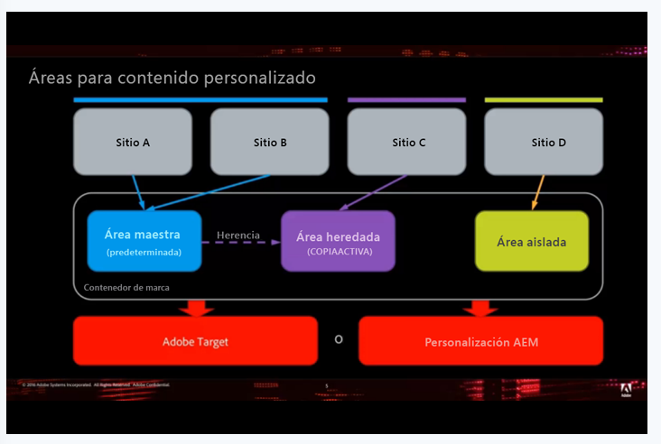

>[!NOTE]
>
>Para obtener información más técnica sobre esta característica, consulte [Cómo se estructura el sistema de administración de varios sitios para el contenido de destino](/help/sites-authoring/technical-multisite-targeted.md).

## Ejemplo: Segmentación del contenido según la ubicación geográfica {#example-targeting-content-based-on-geography}

El uso de varios sitios para el contenido de destino permite compartir, desplegar o aislar contenido de personalización. Para ilustrar mejor cómo se utiliza esta función, considere un escenario en el que desee controlar cómo se despliega el contenido de destino en función de la ubicación geográfica, como en el siguiente escenario:

Existen cuatro versiones del mismo sitio basadas en la ubicación geográfica:

* La variable **Estados Unidos** el sitio se encuentra en la esquina superior izquierda y es el sitio principal. En este ejemplo, está abierto en el modo Segmentación.
* Las otras tres versiones de este sitio son **Canadá**, **Buena Gran Bretaña** y **Australia**, que son todas Live Copies. Estos sitios están abiertos en el modo de vista previa.

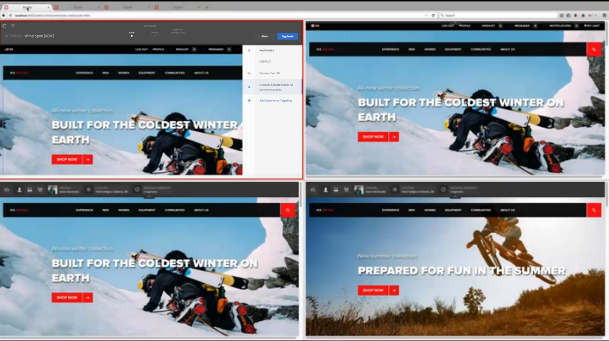

Cada sitio comparte contenido personalizado en regiones geográficas:

* Canadá comparte el área principal con los Estados Unidos.
* Buena Gran Bretaña está vinculada al área europea y hereda de la zona principal.
* Australia, porque se encuentra en el hemisferio sur y los productos de temporada no se aplicarían; además, tiene su propio contenido personalizado.

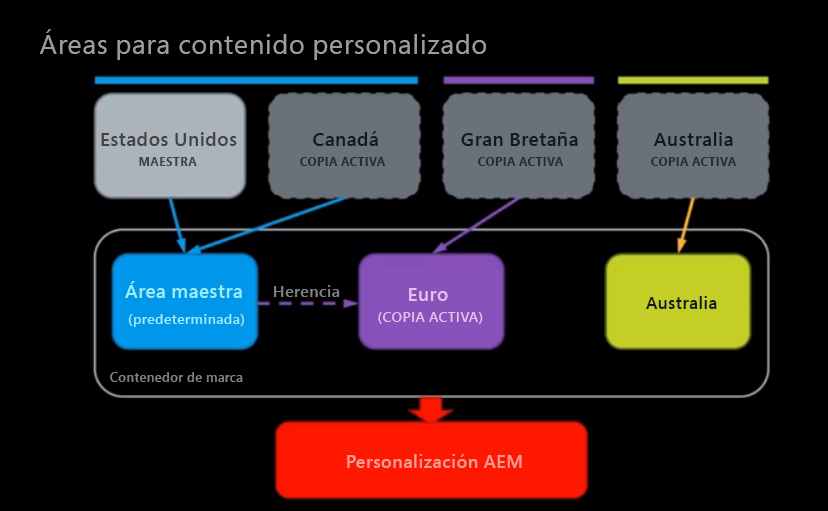

Para el hemisferio norte, contamos con una actividad de invierno que se creó para una audiencia masculina, pero al vendedor de Norteamérica le gustaría tener una imagen de invierno diferente, por lo que la cambia en el sitio de los Estados Unidos.

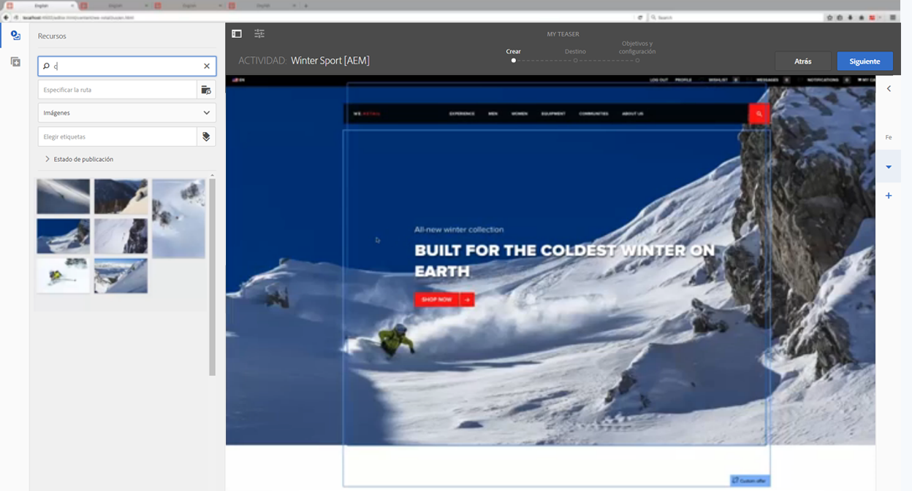

Después de actualizar la pestaña, el sitio canadiense cambia a la nueva imagen sin ninguna acción por nuestra parte. Lo hace porque comparte el área principal con los Estados Unidos. En los sitios Buenos de Gran Bretaña y Australia, la imagen no cambia.

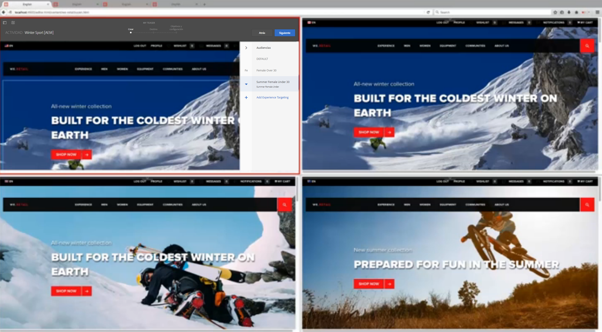

El experto en marketing desea llevar a cabo estos cambios en la región europea y [despliega la Live Copy](/help/sites-administering/msm-livecopy.md) tocando o haciendo clic en **Desplegar página**. Después de actualizar la pestaña , el sitio de Buena Gran Bretaña tiene la nueva imagen, ya que el área de Europa se hereda del área principal (después del despliegue).

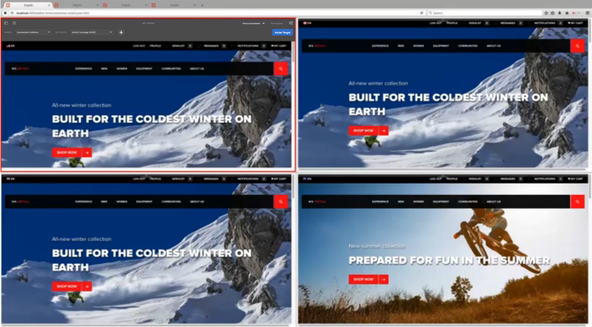

La imagen en el sitio de Australia permanece sin cambios, que es el comportamiento deseado, ya que es verano en Australia y el especialista en marketing no desea cambiar ese contenido. El sitio de Australia no cambia porque no comparte un área con ninguna otra región ni es una Live Copy de otra región. El experto en marketing nunca tiene que preocuparse de que el contenido de destino del sitio australiano se sobrescriba.

Además, para Buena Gran Bretaña, cuyo área es una Live Copy del área principal, puede ver el estado de herencia según el indicador verde junto al nombre de la actividad. Si se hereda una actividad, no puede modificarla a menos que suspenda o desasocie la Live Copy.

En cualquier momento, puede suspender la herencia o desasociarla completamente. También puede añadir experiencias locales que solo estén disponibles para esa experiencia sin suspender la herencia.

>[!NOTE]
>
>Para obtener información más técnica sobre esta característica, consulte [Cómo se estructura el sistema de administración de varios sitios para el contenido de destino](/help/sites-authoring/technical-multisite-targeted.md).

### Creación de una nueva área frente a la creación de una nueva área como Live Copy {#creating-a-new-area-versus-creating-a-new-area-as-livecopy}

En AEM, tiene la opción de crear un área nueva o crear áreas nuevas como Live Copy. Crear una nueva área de actividades de grupos y cualquier cosa que pertenezca a esas actividades, como ofertas, experiencias, etc. Cuando quiera crear un conjunto de contenido de destino completamente distinto o desee compartir un conjunto de contenido de destino, cree un área nueva.

Sin embargo, si tiene configurada la herencia a través de MSM entre los dos sitios, puede que desee heredar las actividades. En este caso, se crea una nueva área como Live Copy, donde Y es una Live Copy de X y, por lo tanto, hereda todas las actividades también.

>[!NOTE]
>
>La opción predeterminada de despliegue activa las opciones de despliegue siguientes que estén relacionadas con el contenido de destino, siempre que una página sea una Live Copy vinculada a un área que también sea una Live Copy del área vinculada al modelo Páginas.

Por ejemplo, en el siguiente diagrama, hay cuatro sitios donde dos de ellos comparten el área principal (y todas las actividades que forman parte de esa área), uno que tiene un área que es una Live Copy, por lo que comparte las actividades durante el despliegue, y un sitio que es completamente independiente (y que, por lo tanto, requiere un área para sus actividades).

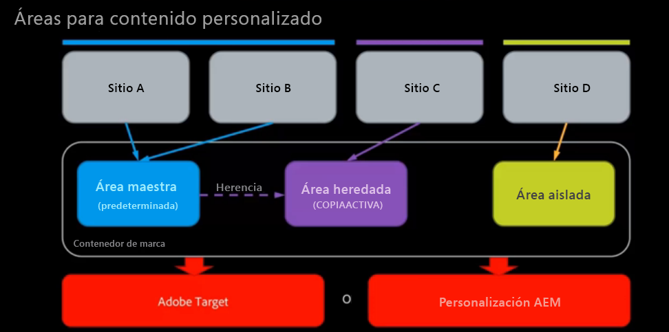

Para conseguirlo en AEM, debe hacer lo siguiente:

* El sitio A está vinculado al área principal; no es necesario crear ningún área. El área principal está seleccionada de forma predeterminada en AEM. El sitio A y B comparten actividades, etc.
* El sitio B está vinculado al área principal; no es necesario crear ningún área. El área principal está seleccionada de forma predeterminada en AEM. El sitio A y B comparten actividades, etc.
* El sitio C está vinculado al área heredada, que es una Live Copy del área principal - Crear área como Live Copy donde se crea una Live Copy basada en el área principal. El área heredada hereda las actividades del área principal tras el despliegue.
* El sitio D está vinculado a su propio área aislada: cree un área donde cree un área completamente nueva sin actividades definidas. El área aislada no compartirá actividades con ningún otro sitio.

## Creación de nuevas áreas {#creating-new-areas}

Las áreas pueden abarcar actividades y ofertas. Después de crear un área en cualquiera de ellas (por ejemplo, actividades), también tiene el área disponible en la otra (por ejemplo, ofertas).

>[!NOTE]
>
>El área predeterminada denominada Área maestra se contrae de forma predeterminada al pulsar o hacer clic en el nombre de una marca **hasta** crear otra área. A continuación, cuando selecciona una marca en la consola **Actividad** u **Ofertas**, llegará a la consola **Área**.

Para crear una nueva área:

1. Vaya a **Personalización** > **Actividades** u **Ofertas** y, a continuación, a su marca.
1. Haga clic o pulse **Crear área**.

   

1. Haga clic en el **Área** y haga clic en **Siguiente**.
1. En el **Título** , escriba un nombre para la nueva área. Si lo desea, seleccione etiquetas.
1. Haga clic o pulse en **Crear**.

   AEM redirige a la ventana de marca, donde enumera las áreas creadas. Si hay otra área además del área principal, puede crear áreas directamente en la consola de marca.

   

## Creación de áreas como Live Copies {#creating-areas-as-live-copies}

Puede crear un área como Live Copy para heredar el contenido de destino en todas las estructuras del sitio.

Para crear un área como Live Copy:

1. Vaya a **Personalización** > **Actividades** u **Ofertas** y, a continuación, a su marca.
1. Haga clic o pulse **Crear área como Live Copy**.

   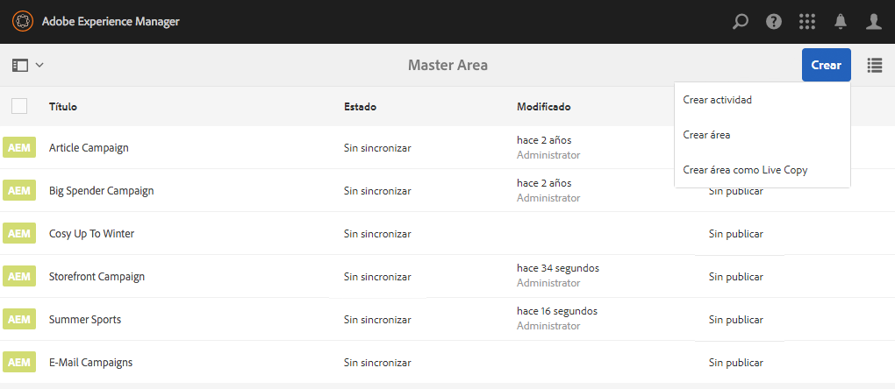

1. Seleccione el área de la que desea realizar una Live Copy y haga clic en **Siguiente**.

   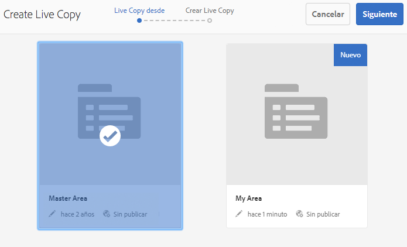

1. En el campo **Nombre**, introduzca un nombre para la Live Copy. De forma predeterminada, se incluyen las páginas secundarias; para excluirlas, seleccione la casilla de verificación **Excluir páginas secundarias**.

   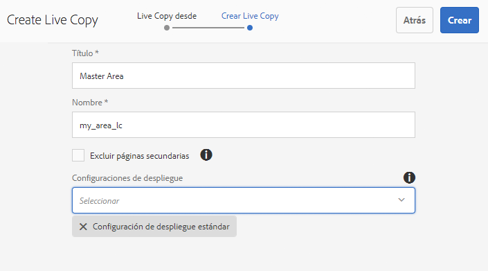

1. En el **Configuración de lanzamiento** menú desplegable, seleccione la configuración adecuada.

   Consulte [Configuraciones de lanzamiento instaladas](/help/sites-administering/msm-sync.md#installed-rollout-configurations) para obtener descripciones de cada opción.

   Consulte [Creación y sincronización de Live Copies](/help/sites-administering/msm-livecopy.md) para obtener más información sobre Live Copies.

   >[!NOTE]
   >
   >Cuando una página se transforma en una Live Copy y el área configurada de la página modelo resulta ser también el modelo del área configurada para las Live Copy de las páginas, el valor de LiveAction **personalizationContentRollout** activa un elemento subRollout sincrónico, que forma parte de la **configuración de despliegue estándar**.

1. Haga clic o pulse en **Crear**.

   AEM redirige a la ventana de marca, donde enumera las áreas creadas. Si hay otra área además del área principal, puede crear áreas directamente desde la ventana de marca.

   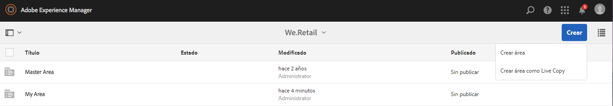

## Vinculación de sitios a un área {#linking-sites-to-an-area}

Puede vincular áreas a páginas o a un sitio. Las áreas las heredan todas las subpáginas a menos que dichas páginas se superpongan con una asignación en una subpágina. Sin embargo, normalmente se establece el vínculo en el nivel del sitio.

Cuando se vincula, solo están disponibles las actividades, experiencias y ofertas del área seleccionada. Esto evita la mezcla accidental de contenido administrado de forma independiente. Si no se configura ninguna otra área, se utilizará el área principal de cada marca.

>[!NOTE]
>
>Las páginas o los sitios que hacen referencia a la misma área utilizan el *mismo* conjunto compartido de actividades, experiencias y ofertas. Si edita una actividad, experiencia u oferta que compartan varios sitios, esto afectará a todos los sitios.

Para vincular un sitio a un área:

1. Desplácese al sitio (o página) que desee vincular a un área.
1. Seleccione el sitio o la página y toque o haga clic en **Ver propiedades**.
1. Haga clic o pulse la pestaña **Personalización.**
1. En el **Marca** seleccione la marca a la que desea vincular el área. Después de seleccionar la marca, las áreas disponibles estarán disponibles en la **Referencia de área** para abrir el Navegador.

   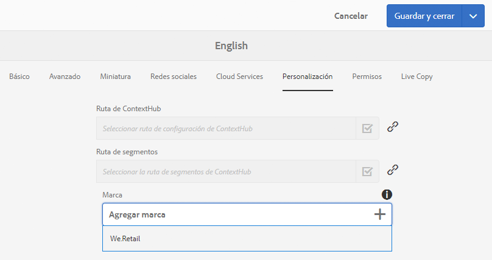

1. Seleccione el área del menú desplegable **Referencia de área** y haga clic o pulse **Guardar**.

   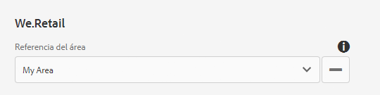

## Desasociar Live Copy o suspender la herencia del contenido de destino {#detaching-live-copy-or-suspending-inheritance-of-targeted-content}

Puede suspender o desasociar la herencia del contenido de destino. Suspender o desasociar la Live Copy se realiza por actividad. Por ejemplo, es posible que desee modificar las experiencias en su actividad, pero si dicha actividad sigue vinculada a una copia heredada, no podrá modificar la experiencia ni ninguna de las propiedades de la actividad.

Al suspender la Live Copy, se rompe temporalmente la herencia, pero en el futuro puede restaurarla. Al desasociar Live Copy de forma permanente, se rompe la herencia.

Suspenda o desasocie la herencia del contenido de destino; para ello, restáurelo en una actividad. Si una página o sitio vincula un área de tipo Live Copy, puede ver el estado de herencia de una actividad.

Una actividad que hereda de otro sitio se marca en verde junto al nombre de la actividad. Una herencia suspendida se marca en rojo y una actividad creada localmente no tiene icono.

>[!NOTE]
>
>* Solo puede suspender o desasociar Live Copies en una actividad.
>* No es necesario suspender o desasociar Live Copies para ampliar una actividad heredada. Siempre puede crear **new** experiencias y ofertas locales para esa actividad. Si desea modificar una actividad existente, debe suspender la herencia.
>

### Suspender herencia {#suspending-inheritance}

Para suspender o desasociar la herencia del contenido de destino en una actividad:

1. Vaya a la página donde desee separar o suspender la herencia y toque o haga clic en **Segmentación** en el menú desplegable de modo .
1. Si la página está vinculada a un área que es una Live Copy, verá el estado de herencia. Haga clic o pulse **Iniciar segmentación**.
1. Para suspender una actividad, realice una de las siguientes acciones:

   1. Seleccione un elemento de la actividad, como la audiencia. AEM muestra automáticamente un cuadro de confirmación Suspender Live Copy . (Puede suspender Live Copy tocando o haciendo clic en cualquier elemento durante el proceso de Orientación).
   1. Select **Suspender Live Copy** en el menú desplegable de la barra de herramientas.

   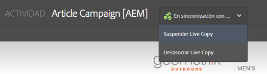

1. Haga clic o pulse **Suspender** para suspender la actividad. Las actividades suspendidas están marcadas en rojo.

   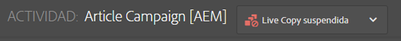

### Herencia de interrupción {#breaking-inheritance}

Para romper la herencia del contenido de destino en una actividad:

1. Desplácese a la página donde desee separar la Live Copy de la copia principal y toque o haga clic en **Segmentación** en el menú desplegable de modo .
1. Si la página está vinculada a un área que es una Live Copy, verá el estado de herencia. Haga clic o pulse **Iniciar segmentación**.
1. Seleccione **Separar Live Copy** en el menú desplegable de la barra de herramientas. AEM confirma que desea separar la Live Copy.
1. Toque o haga clic **Desasociar** para separar la Live Copy de la actividad. Una vez desconectado, ya no aparece el menú desplegable relativo a la herencia. La actividad es ahora una actividad local.

   

## Restauración de la herencia del contenido de destino {#restoring-inheritance-of-targeted-content}

Si ha suspendido la herencia del contenido de destino en una actividad, puede restaurarla en cualquier momento. Sin embargo, si ha desasociado la Live Copy, no puede restaurar la herencia.

Para restaurar la herencia del contenido de destino en una actividad:

1. Desplácese a la página donde desea restaurar la herencia y haga clic o pulse el modo **Segmentación** en el menú desplegable.
1. Haga clic o pulse **Iniciar segmentación**.
1. Seleccione **Reanudar Live Copy** en el menú desplegable de la barra de herramientas.

   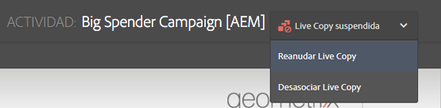

1. Toque o haga clic **Reanudar** para confirmar que desea reanudar la herencia de Live Copy. Las modificaciones realizadas en la actividad actual se pierden si se reanuda la herencia.

## Eliminación de áreas {#deleting-areas}

Al eliminar un área, se eliminan todas las actividades de dicha área. AEM le advierte antes de poder eliminar un área. Si se elimina un área que tenga un sitio vinculado, la asignación de esta marca se reasignará automáticamente al área principal.

Para eliminar un área:

1. Desplácese a **Personalización** > **Actividades** o **Ofertas** y luego a su marca.
1. Toque o haga clic en el icono situado junto al área que desee eliminar.
1. Toque o haga clic **Eliminar** y confirme que desea eliminar el área.
