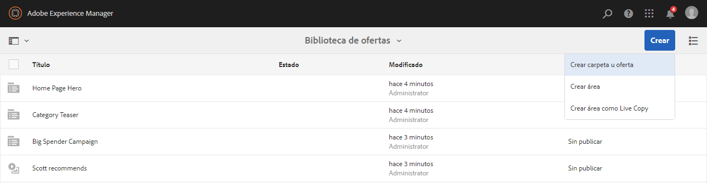
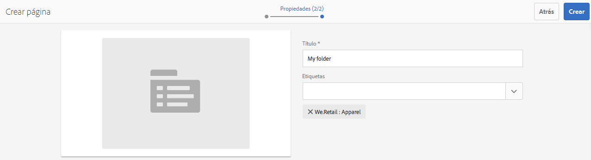
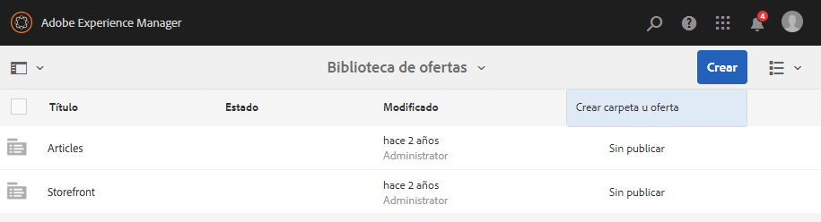
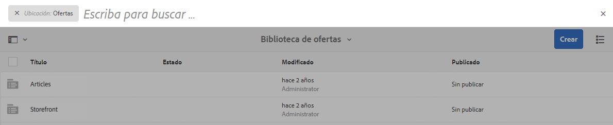

# Creación y administración de ofertas{#creating-and-managing-offers}

>[!CAUTION]
>
>AEM 6.4 ha llegado al final de la compatibilidad ampliada y esta documentación ya no se actualiza. Para obtener más información, consulte nuestra [períodos de asistencia técnica](https://helpx.adobe.com/es/support/programs/eol-matrix.html). Buscar las versiones compatibles [here](https://experienceleague.adobe.com/docs/).

Utilice la consola Ofertas para crear ofertas que pueda [uso en experiencias de actividad](/help/sites-authoring/content-targeting-touch.md). La creación de ofertas en la consola Ofertas ahorra tiempo cuando varias experiencias requieren la misma oferta:

* Cree la oferta una vez en la biblioteca y utilícela en varias experiencias de las actividades de marca.
* Cambie la oferta en la biblioteca y el cambio afectará a todas las experiencias que la utilicen.

La consola Ofertas organiza las ofertas por marca. Cada marca contiene una biblioteca de ofertas que se pueden utilizar en las experiencias de una marca. Utilice carpetas para definir una estructura jerárquica para organizar ofertas en cada biblioteca. Una estructura de carpetas lógica permite a los autores encontrar fácilmente ofertas mediante la exploración. Las herramientas de etiquetado y búsqueda también permiten a los autores encontrar ofertas.

## Agregar una marca mediante la consola de ofertas {#add-a-brand-using-the-offers-console}

Cree una marca con la que sus ofertas estén asociadas. Abra una marca en la consola de ofertas para acceder a la biblioteca de ofertas, donde podrá crear carpetas y ofertas.

Cuando crea una marca mediante la consola de ofertas, también aparece en la [Consola de actividades](/help/sites-authoring/activitylib.md) donde puede agregar y administrar actividades para la marca.

1. En la consola de navegación, pulse o haga clic en **Personalización** > **Ofertas**.

   

1. Haga clic o pulse en **Crear** y luego en **Crear marca**.
1. Seleccione la plantilla de marca y toque o haga clic en **Siguiente**.
1. Escriba un título para la marca tal como desea que aparezca en las consolas de ofertas y actividades. De forma opcional, escriba o seleccione una o varias etiquetas para asociarlas a la marca.
1. Haga clic o pulse **Crear**.

## Añadir una carpeta a una biblioteca de ofertas {#add-a-folder-to-an-offer-library}

Agregue una carpeta a la biblioteca de ofertas de una marca para organizar y almacenar ofertas. Puede crear una carpeta debajo de la marca o debajo de otras carpetas.

1. En la consola de ofertas, abra la ubicación en la que desea crear la carpeta. Por ejemplo, abra la marca para crear una carpeta de nivel superior o abra otra carpeta de la biblioteca.
1. Toque o haga clic en **Crear** > **Crear carpeta u oferta**.

   

1. Seleccione **Carpeta** y haga clic en **Siguiente**.
1. Escriba un título para la carpeta tal y como desea que aparezca en la biblioteca de ofertas y escriba o seleccione las etiquetas.

   

1. Haga clic o pulse **Crear**.

## Adición de una oferta a una biblioteca de ofertas {#add-an-offer-to-an-offer-library}

Agregue una oferta a la biblioteca de ofertas de una marca para que se pueda añadir a las experiencias de la marca. Al añadir una oferta, se proporciona un título. También puede asociar la oferta con una o más etiquetas para mejorar la capacidad de búsqueda.

Después de crear la oferta, puede abrirla para crear el contenido.

1. En la consola de ofertas, abra la ubicación en la que desea crear la oferta. Por ejemplo, abra la marca para crear una oferta de nivel superior o abra una carpeta en la biblioteca.
1. Toque o haga clic en **Crear** > **Crear carpeta u oferta**.

   

1. Seleccione el **Página de oferta** plantilla y, a continuación, toque o haga clic en **Siguiente**.
1. Escriba un título para la oferta y, opcionalmente, seleccione o escriba una o más etiquetas para asociarlas a la oferta y, a continuación, toque o haga clic en **Crear**.
1. En el cuadro de diálogo de confirmación, para abrir la oferta y editarla, haga clic o pulse **Abrir página**.

## Edición de una oferta {#editing-an-offer}

Abra una oferta y edite el contenido tal como desea que aparezca en las experiencias que lo utilizan. Cuando edita una oferta que se utiliza en cualquier experiencia, los cambios aparecen en las experiencias.

Puede abrir una oferta desde una carpeta de una biblioteca de ofertas o desde los resultados de búsqueda. También puede abrir una oferta desde una experiencia que use la oferta.

1. En la consola de ofertas, pulse o haga clic en el icono junto a la oferta y haga clic o pulse **Editar**.
1. Añada componentes a la oferta y edite el contenido del componente como de costumbre.

## Eliminación de una oferta {#deleting-an-offer}

Elimine una oferta cuando ya no la necesite. Cuando intente eliminar una oferta que se utilice en una experiencia, se le pedirá que confirme la eliminación. Al confirmar, se elimina la oferta y de las experiencias.

Puede eliminar una oferta al ver el contenido de una carpeta en una biblioteca de ofertas o buscar resultados.

1. En la consola de ofertas, pulse o haga clic en el icono junto a la oferta y haga clic o pulse **Eliminar**.

   Seleccione la oferta y pulse o haga clic en **Eliminar**.

1. En el cuadro de diálogo que aparece, toque o haga clic en **Eliminar** para confirmar la eliminación.
1. Si la oferta se utiliza en una o más experiencias, aparece un cuadro de diálogo para indicar que se hace referencia a la oferta:

   * Para eliminar la oferta y eliminarla de las experiencias, toque o haga clic en **Forzar eliminación**.
   * Para mantener la oferta, toque o haga clic en **Cancelar**.

## Búsqueda de ofertas {#searching-for-offers}

Busque ofertas de cualquier marca utilizando palabras clave que coincidan con el título.

Los criterios de búsqueda actuales aparecen junto a los resultados de la búsqueda. También puede ordenar los resultados por columna en orden ascendente o descendente. Puede realizar una búsqueda desde cualquier carpeta de cualquier biblioteca de ofertas. Los resultados de la búsqueda son los mismos independientemente de la carpeta actual.

Para buscar ofertas:

1. En la parte superior de la consola de ofertas, pulse o haga clic en el icono de la lupa. De forma predeterminada, la búsqueda se limita a las ofertas.
1. Escriba la palabra clave para buscar ofertas. Seleccione entre los resultados.
