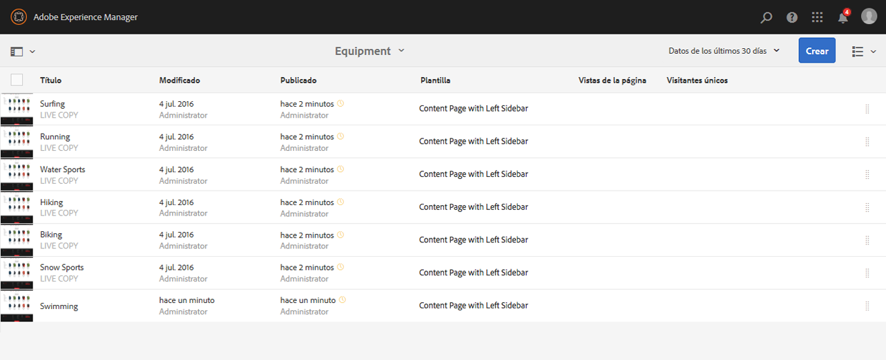
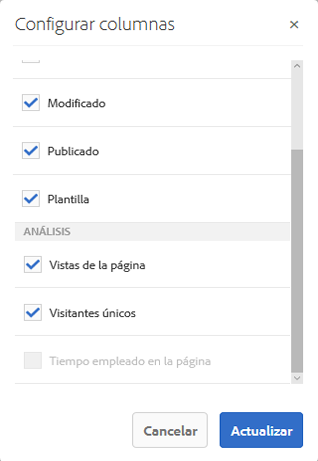
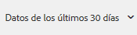

# Visualización de datos de análisis de la página{#seeing-page-analytics-data}

Utilice los datos de análisis de la página para medir la eficacia del contenido de la página.

## Análisis visible desde la consola {#analytics-visible-from-the-console}

Los datos de análisis de la página se muestran en [Vista de lista](/help/sites-authoring/basic-handling.md#list-view) de la consola Sitios. Cuando las páginas se muestran en forma de lista, las columnas siguientes están disponibles de forma predeterminada:

* Vistas de la página
* Visitantes únicos
* Tiempo empleado en la página

Cada columna muestra un valor para el período de notificación actual, y también indica si el valor ha aumentado o disminuido desde el período de notificación anterior. Los datos que ve se actualizan cada 12 horas.

>[!NOTE]
>
>Para cambiar el período de actualización, [configure el intervalo de importación](/help/sites-administering/adobeanalytics-connect.md#configuring-the-import-interval).

1. Abra la consola **Sitios**; por ejemplo, [http://localhost:4502/sites.html/content](http://localhost:4502/sites.html/content)
1. En el extremo derecho de la barra de herramientas (esquina superior derecha), pulse o haga clic en el icono para seleccionar **Vista de lista** (el icono mostrado dependerá de la [vista actual](/help/sites-authoring/basic-handling.md#viewing-and-selecting-resources)). 

1. Una vez más, en el extremo derecho de la barra de herramientas (esquina superior derecha), haga clic o pulse el icono y seleccione **Ver configuración**. Se abrirá el diálogo **Configurar columnas**. Realice los cambios necesarios y confírmelos con **Actualizar**.

   

### Seleccionar el período de notificación {#selecting-the-reporting-period}

Seleccione el período de notificación para el cual los datos de análisis aparecen en la consola Sitios:

* Datos de los últimos 30 días
* Datos de los últimos 90 días
* Datos de este año

El período de notificación actual aparece en la barra de herramientas de la consola Sitios (en la parte derecha de la barra de herramientas superior). Utilice el menú desplegable para seleccionar el período de notificación requerido.\

### Configuración de las columnas de datos disponibles {#configuring-available-data-columns}

Los miembros del grupo de usuarios de administradores analíticos pueden configurar la consola de Sitios para permitir que los autores vean las columnas de Analytics adicionales.

>[!NOTE]
>
>Cuando un árbol de páginas contiene elementos secundarios asociados a distintas configuraciones de la nube de Adobe Analytics, no puede configurar las columnas de datos disponibles para las páginas.

1. En la vista de lista, utilice los selectores de vista (a la derecha de la barra de herramientas), seleccione **Ver configuración** y, a continuación, **Agregar datos de Analytics personalizados**.

   

1. Seleccione las métricas que quiera exponer a los autores en la consola de Sitios y haga clic en **Agregar**.

   Las columnas que aparecen se recuperan de Adobe Analytics.

   

### Abrir la información del contenido desde Sitios {#opening-content-insights-from-sites}

Open [Content Insight](/help/sites-authoring/content-insights.md) from the Sites console to further investigate page effectiveness.

1. En la consola de Sitios, seleccione la página en la cual quiera ver la información del contenido.
1. En la barra de herramientas, haga clic en el icono de análisis y recomendaciones.

   

## Análisis visible desde el editor de páginas (mapa de actividad) {#analytics-visible-from-the-page-editor-activity-map}

>[!CAUTION]
>
>Debido a los cambios de seguridad de la API de Adobe Analytics, ya no es posible utilizar la versión de Activity Map incluida en AEM.
>
>The [ActivityMap plugin provided by Adobe Analytics](https://docs.adobe.com/content/help/es-ES/analytics/analyze/activity-map/getting-started/get-started-users/activitymap-install.translate.html) should now be used.
