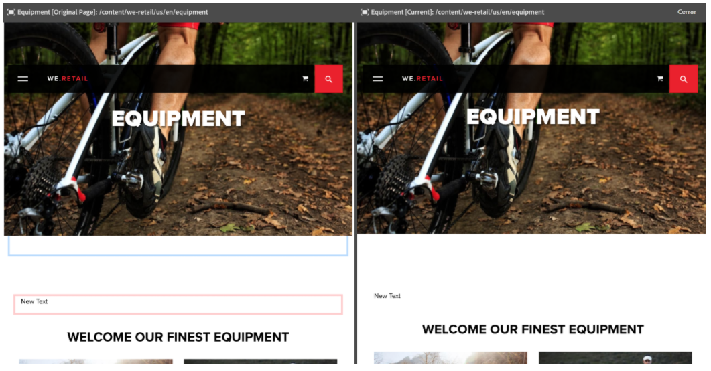
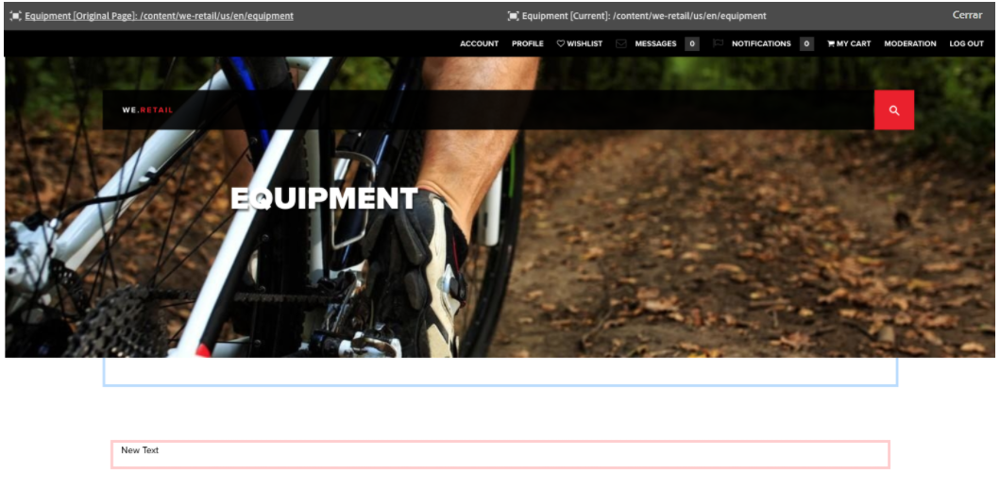

# Diferencias de página  {#page-diff}

>[!CAUTION]
>
>AEM 6.4 ha llegado al final de la compatibilidad ampliada y esta documentación ya no se actualiza. Para obtener más información, consulte nuestra [períodos de asistencia técnica](https://helpx.adobe.com/es/support/programs/eol-matrix.html). Buscar las versiones compatibles [here](https://experienceleague.adobe.com/docs/).

## Introducción {#introduction}

La creación de contenido es un proceso iterativo. La creación con eficacia requiere poder ver qué ha cambiado de una iteración a otra. Ver una versión de la página y luego la otra es ineficiente y propenso a errores. Un autor quiere poder comparar fácilmente la página actual en paralelo con otra versión.

La función de diferencia de página permite una cómoda comparación en paralelo de dos páginas con sus diferencias resaltadas.

>[!CAUTION]
>
>Si está ejecutando una versión anterior a la AEM 6.4.3, el usuario debe tener la variable **Modificar/Crear/Eliminar** permiso en el nodo `/content/versionhistory` para utilizar la función .
>
>Consulte [Desarrollo y diferencia de página](/help/sites-developing/pagediff.md#operation-details) para obtener más información técnica sobre esta función.

## Uso de {#use}

La comparación de diferencias en paralelo permite comparar lo siguiente:

* [Versiones](/help/sites-authoring/working-with-page-versions.md#comparing-a-version-with-current-page): versión anterior de una página con el estado actual.
* [Live Copies](/help/sites-administering/msm-livecopy.md#comparing-a-live-copy-page-with-a-blueprint-page): Live Copy con su modelo.
* [Lanzamientos](/help/sites-authoring/launches-editing.md#comparing-a-launch-page-to-its-source-page): lanzamiento con su origen.
* [Copias de idioma](/help/sites-administering/tc-manage.md#comparing-language-copies): una página antes y después de la traducción.

Consulte los temas respectivos sobre cómo iniciar la diferencia dentro de esos contextos.

### Presentación de diferencias   {#presentation-of-differences}

Independientemente del contenido que se esté comparando, la presentación de la diferencia sigue siendo la misma.

* El contenido seleccionado al iniciar la comparación de diferencias se muestra a la izquierda (el punto de entrada de la comparación de diferencias).
* El contenido comparado se muestra a la derecha (con qué se compara el contenido seleccionado).

Por ejemplo, si se comparan versiones, la versión actual se muestra a la izquierda y la versión anterior se muestra a la derecha.

El origen de ambas páginas se muestra claramente en la barra de encabezado de la parte superior de la ventana del explorador.

La comparación de diferencias detecta los cambios en el nivel de componente y HTML. Los elementos que se han cambiado se resaltan con colores diferentes.

**Cambios en los componentes**

* Verde claro: componente añadido
* Rosa: componente eliminado
* Azul: componente cambiado
* Azul: componente movido

Tenga en cuenta que los colores Modificado y Movido son los mismos.

**Cambios en el HTML**

* Verde oscuro: HTML añadido
* Rojo: HTML eliminado

>[!NOTE]
>
>Al comparar copias de idiomas, el resaltado está desactivado, ya que en una traducción todo cambia y el resaltado no tendría ningún beneficio.

### Pantalla completa y salida   {#fullscreen-and-exiting}

Para centrarse en un contenido específico, puede hacer clic en el icono de pantalla completa para que cualquier &quot;lado&quot; de la comparación de diferencias en paralelo se amplíe en la ventana completa del navegador.

El lado seleccionado llenará toda la ventana, pero la barra permanecerá en la parte superior para que pueda cambiar entre las dos páginas.

También puede cerrar la vista de pantalla completa haciendo clic en el icono para salir del modo de pantalla completa.

Puede salir de la comparación de diferencias en paralelo en cualquier momento haciendo clic en el botón Cerrar del encabezado.

## Restricciones   {#limitations}

Hay algunas situaciones en las que la diferencia de página puede no detectar una diferencia según lo esperado.

* Al diferenciar versiones y lanzamientos, la comparación de diferencias no tiene en cuenta componentes dinámicos como rutas de exploración, menús, listas de productos o logotipos (componentes que dependen de la estructura del sitio para representar su contenido).
* En las versiones, la comparación de diferencias no vuelve a crear la directiva de control de acceso ni las relaciones de Live Copy.
* Si se realizan cambios en una imagen, como la modificación de los atributos alt, title o src, estos se resaltan en azul como modificados. Sin embargo, en algunos casos, la imagen tiene una representación Base64 del atributo src y ambas imágenes tienen el mismo aspecto. La comparación diferencia una de otra debido a los atributos src dispares.
* La comparación de diferencias no puede detectar la rotación de la imagen.
* Si se mueve una página, ya no se puede realizar una diferencia con ninguna versión realizada antes del movimiento.

   * Si tiene problemas con una comparación de diferencias, consulte la [Cronología](/help/sites-authoring/basic-handling.md#timeline) para que la página vea si se ha movido.

>[!NOTE]
>
>Las versiones no se pueden comparar entre sí. Solo la versión actual se puede comparar con otras versiones de la página. La versión actual siempre es la versión que se resalta con los cambios.

>[!NOTE]
>
>Para obtener más información sobre el funcionamiento del mecanismo de diferencia de página, así como las limitaciones que pueden afectar a dicho mecanismo, consulte la [documentación para desarrolladores](/help/sites-developing/pagediff.md) de esta función.
