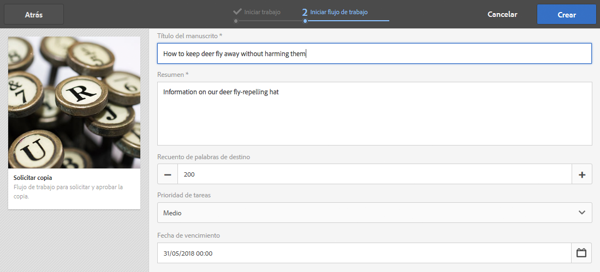
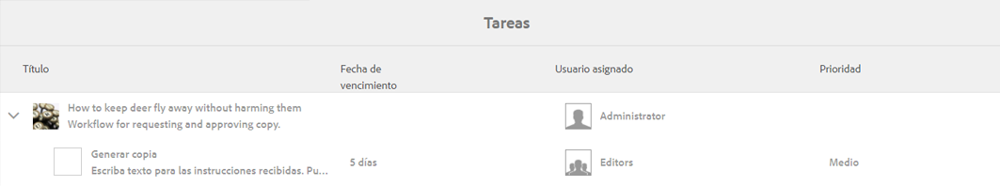
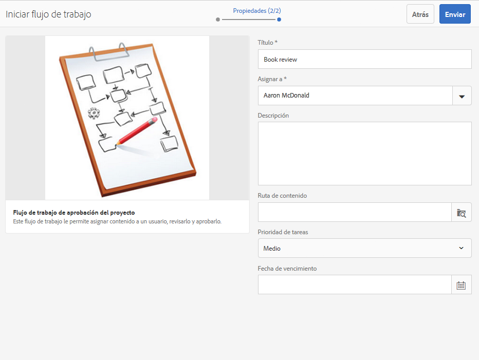
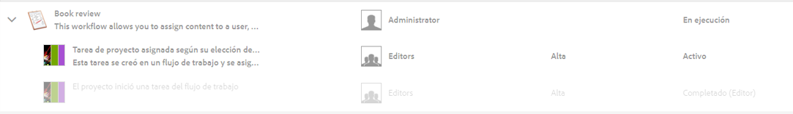
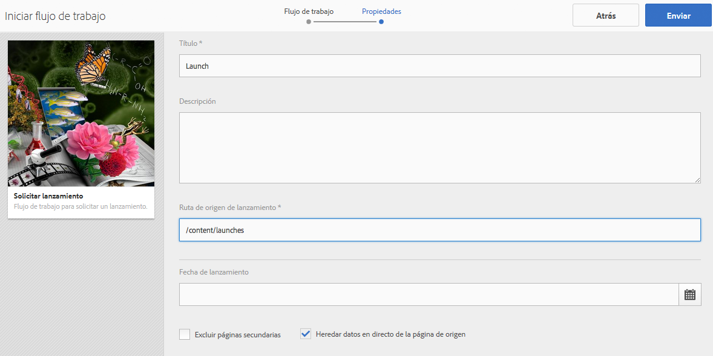
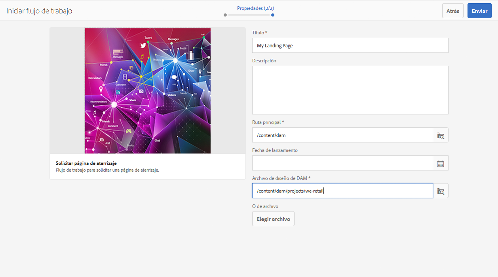
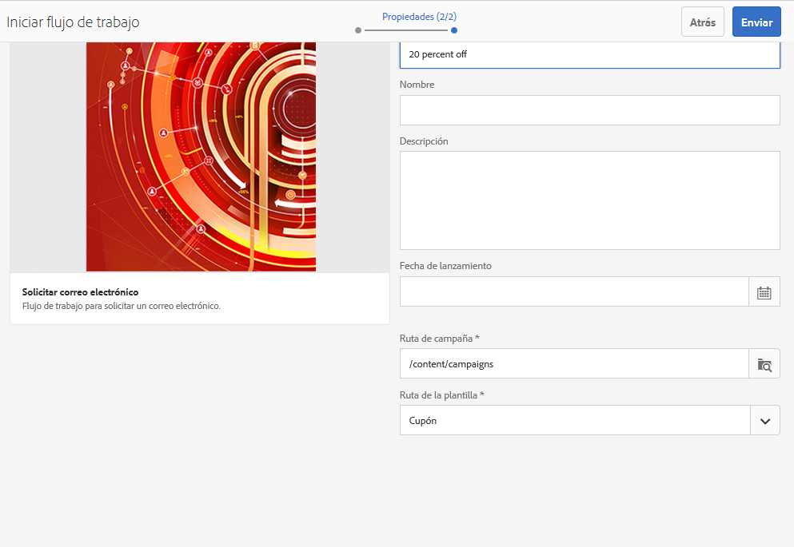
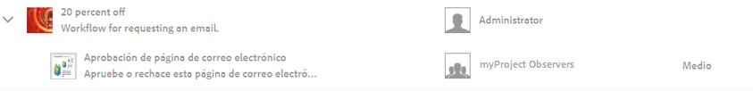

# Uso de flujos de trabajo de proyecto{#working-with-project-workflows}

>[!CAUTION]
>
>AEM 6.4 ha llegado al final de la compatibilidad ampliada y esta documentación ya no se actualiza. Para obtener más información, consulte nuestra [períodos de asistencia técnica](https://helpx.adobe.com/es/support/programs/eol-matrix.html). Buscar las versiones compatibles [here](https://experienceleague.adobe.com/docs/).

Los flujos de trabajo de proyecto disponibles de fábrica incluyen lo siguiente:

* **Flujo de trabajo de aprobación del proyecto**: este flujo de trabajo permite asignar contenido a un usuario, revisarlo y aprobarlo.
* **Solicitar lanzamiento**: un flujo de trabajo solicita un lanzamiento.
* **Solicitar página de aterrizaje**: este flujo de trabajo solicita una página de aterrizaje.
* **Solicitar correo electrónico**: flujo de trabajo para solicitar un correo electrónico.
* **Sesión fotográfica del producto y sesión fotográfica del producto (comercio)** - Asigna activos a productos
* **Crear y traducir copia DAM y crear copia de idioma DAM** : crea binarios, metadatos y etiquetas traducidos para recursos y carpetas.

Según la plantilla de proyecto que seleccione, tiene ciertos flujos de trabajo disponibles:

|  | **Proyecto simple** | **Proyecto de medios** | **Proyecto de sesión fotográfica del producto** | **Proyecto de traducción** |
|---|:-:|:-:|:-:|:-:|
| Solicitar copia |  | x |  |  |
| Sesión fotográfica del producto |  | x | x |  |
| Sesión fotográfica del producto (comercio) |  |  | x |  |
| Aprobación del proyecto | x |  |  |  |
| Solicitar lanzamiento | x |  |  |  |
| Solicitar página de aterrizaje | x |  |  |  |
| Solicitar correo electrónico | x |  |  |  |
| Creación de copia de idioma de DAM&amp;ast; |  |  |  | x |
| Creación y traducción de copia de idioma de DAM&amp;ast; |  |  |  | x |

>[!NOTE]
>
>&amp;ast; Estos flujos de trabajo no se inician desde el mosaico **Flujo de trabajo** en Proyectos. Consulte [Creación de copias de idioma para recursos.](/help/sites-administering/tc-manage.md)

Los pasos para iniciar y completar flujos de trabajo son los mismos independientemente del flujo de trabajo que elija. Solo cambian los pasos.

Puede iniciar un flujo de trabajo directamente en Proyectos (excepto Crear copia de idioma DAM o Crear y traducir copia de idioma DAM). La información sobre las tareas pendientes de un proyecto se enumera en la **Tareas** mosaico. Las notificaciones para las tareas que deben completarse aparecen junto al icono de usuario.

Para obtener más información sobre el trabajo con flujos de trabajo en AEM, consulte lo siguiente:

* [Participación en flujos de trabajo](/help/sites-authoring/workflows-participating.md)
* [Aplicación de flujos de trabajo a páginas](/help/sites-authoring/workflows-applying.md)
* [Configuración de flujos de trabajo ](/help/sites-administering/workflows.md)

En esta sección se describen los flujos de trabajo disponibles para Proyectos.

## Flujo de trabajo Solicitar copia {#request-copy-workflow}

Este flujo de trabajo permite solicitar un manuscrito a un usuario y luego aprobarlo. Para iniciar el flujo de trabajo de copia de solicitud:

1. En el proyecto de medios, seleccione el signo **+** en el mosaico **Flujos de trabajo** y seleccione **Solicitar copia del flujo de trabajo**.
1. Introduzca un título de manuscrito y un breve resumen de lo que está solicitando. Si corresponde, introduzca un recuento de palabras de destino, una prioridad de tareas y una fecha de vencimiento.

   

1. Haga clic en **Crear**. Se inicia el flujo de trabajo. La tarea aparece en el **Tareas** mosaico.

   

## Flujo de trabajo de la sesión fotográfica del producto {#product-photo-shoot-workflow}

Los flujos de trabajo de la sesión fotográfica del producto (comercio y sin comercio) se tratan detalladamente en [Proyecto creativo](/help/sites-authoring/managing-product-information.md).

## Flujo de trabajo Aprobación del proyecto {#project-approval-workflow}

En el flujo de trabajo Aprobación del proyecto, se asigna contenido a un usuario, se revisa y, a continuación, se aprueba el contenido.

1. En el proyecto simple, seleccione ****+** iniciar sesión en **Flujos de trabajo** mosaico y seleccione **Flujo de trabajo de aprobación del proyecto**.
1. Introduzca un título y seleccione a quién asignarlo en la lista Equipo. Si corresponde, introduzca una descripción, ruta de contenido, prioridad de tarea y fecha de vencimiento.

   

1. Haga clic en **Crear**. Se inicia el flujo de trabajo. La tarea aparece en el **Tareas** mosaico.

   

## Flujo de trabajo Solicitar lanzamiento {#request-launch-workflow}

Este flujo de trabajo permite solicitar un lanzamiento.

1. En el proyecto simple, seleccione el signo **+** en el mosaico **Flujos de trabajo** y seleccione **Solicitar flujo de trabajo de lanzamiento**.
1. Introduzca un título para el lanzamiento y proporcione la ruta de origen del lanzamiento. También puede añadir una descripción y una fecha de lanzamiento, si procede. Seleccione Heredar datos en directo de la página de origen o excluir las páginas secundarias según cómo desee que se comporte el lanzamiento.

   

1. Haga clic en **Crear**. Se inicia el flujo de trabajo. El flujo de trabajo aparece en la lista **Flujos de trabajo** (haga clic en los puntos suspensivos **...** del mosaico **Flujos de trabajo** para acceder a esta lista).

## Flujo de trabajo Solicitar página de aterrizaje {#request-landing-page-workflow}

Este flujo de trabajo permite solicitar una página de aterrizaje.

1. En el proyecto simple, seleccione la opción **+** iniciar sesión en **Flujos de trabajo** y seleccione Solicitar flujo de trabajo de página de aterrizaje .
1. Introduzca un título para la página de aterrizaje y la ruta principal. Si corresponde, introduzca una fecha de lanzamiento o elija un archivo para la página de aterrizaje.

   

1. Haga clic en **Crear**. Se inicia el flujo de trabajo. La tarea aparece en el **Tareas** mosaico.

## Flujo de trabajo Solicitar correo electrónico {#request-email-workflow}

Este flujo de trabajo permite solicitar un correo electrónico. Es el mismo flujo de trabajo que aparece en la variable **Correos electrónicos** mosaico.

1. En el proyecto simple o de medios, seleccione la opción **+** iniciar sesión en **Flujos de trabajo** mosaico y seleccione **Flujo de trabajo de solicitud de correo electrónico**.
1. Introduzca un título de correo electrónico, así como las rutas de campaña y de plantilla. Además, puede proporcionar un nombre, una descripción y una fecha de lanzamiento.

   

1. Haga clic en **Crear**. Se inicia el flujo de trabajo. La tarea aparece en el **Tareas** mosaico.

   

## Crear (y traducir) el flujo de trabajo de copia de idioma de los activos {#create-and-translate-language-copy-workflow-for-assets}

La variable **Crear copia de idioma** y **Crear y traducir copia de idioma** los flujos de trabajo se tratan detalladamente en [Creación de copias de idioma para recursos.](/help/assets/translation-projects.md)
