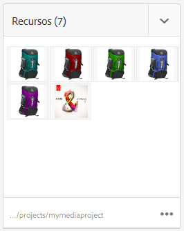
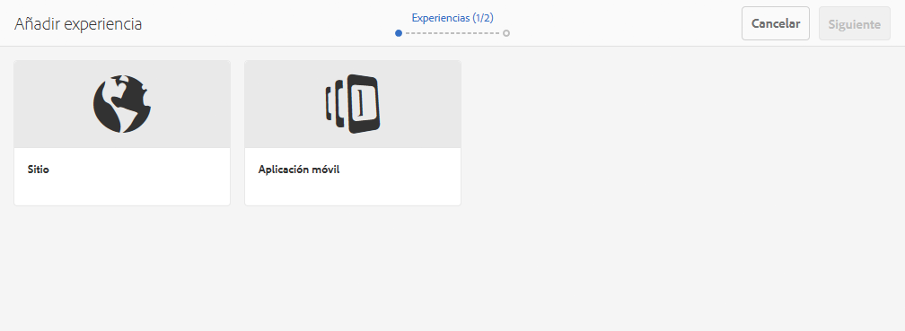

# Proyectos{#projects}

>[!CAUTION]
>
>AEM 6.4 ha llegado al final de la compatibilidad ampliada y esta documentación ya no se actualiza. Para obtener más información, consulte nuestra [períodos de asistencia técnica](https://helpx.adobe.com/es/support/programs/eol-matrix.html). Buscar las versiones compatibles [here](https://experienceleague.adobe.com/docs/).

Los proyectos permiten agrupar recursos en una entidad. Un entorno común y compartido facilita la administración de sus proyectos. Los tipos de recursos que puede asociar con un proyecto se denominan Mosaicos en AEM. Los mosaicos pueden incluir información sobre el proyecto y el equipo, los recursos, los flujos de trabajo y otro tipo de información, tal como se describe detalladamente en [Mosaicos del proyecto.](#project-tiles)

>[!CAUTION]
>
>Para que los usuarios de los proyectos puedan ver otros usuarios/grupos mientras utilizan la funcionalidad Proyectos , como crear proyectos, crear tareas/flujos de trabajo, ver y administrar el equipo, dichos usuarios deben tener acceso de lectura en **/home/users** y **/home/groups**. La forma más sencilla de implementar esto es dar a la variable **usuarios de proyectos** acceso de lectura de grupo a **/home/users** y **/home/groups**.

Como usuario, puede hacer lo siguiente:

* Crear proyectos
* Asociar carpetas de contenido y recursos a un proyecto
* Eliminar proyectos
* Eliminar vínculos de contenido del proyecto

Consulte los siguientes temas adicionales:

* [Administración de proyectos](/help/sites-authoring/touch-ui-managing-projects.md)
* [Uso de tareas](/help/sites-authoring/task-content.md)
* [Uso de flujos de trabajo de proyecto](/help/sites-authoring/projects-with-workflows.md)
* [Integración de proyectos y PIM creativos](/help/sites-authoring/managing-product-information.md)

## Consola Proyectos {#projects-console}

La consola de proyectos es donde puede acceder y administrar sus proyectos en AEM.

* Select **Cronología** y luego un proyecto para ver su cronología.
* Toque o haga clic **Select** para entrar en el modo de selección.
* Haga clic en **Crear** para agregar proyectos.
* **Alternar proyectos activos** permite cambiar entre todos los proyectos y solo los que están activos.
* **Mostrar vista de estadísticas** permite ver estadísticas del proyecto relacionadas con las finalizaciones de tareas.

## Mosaicos del proyecto {#project-tiles}

Con Proyectos, se asocian distintos tipos de información a los proyectos. Estos se llaman **Mosaicos**. En esta sección se describe cada uno de los mosaicos y qué tipo de información contienen.

Puede tener los siguientes mosaicos asociados al proyecto. Cada uno de ellos se describe en las secciones siguientes:

* Recursos y colecciones de recursos
* Experiencias
* Vínculos
* Información del proyecto
* Equipo
* Páginas de destino
* Correos electrónicos
* Flujos de trabajo
* Lanzamientos
* Tareas

### Assets {#assets}

En el **Recursos** , puede recopilar todos los recursos que utilice para un proyecto determinado.

Los recursos se cargan directamente en el mosaico. Además, puede crear conjuntos de imágenes, conjuntos de giros o conjuntos de medios mixtos si tiene el complemento Dynamic Media.

### Colecciones de recursos {#asset-collections}

De forma similar a los recursos, puede agregar [colecciones de recursos](/help/assets/managing-collections-touch-ui.md) directamente al proyecto. Las colecciones se definen en Assets.

Agregue una colección haciendo clic en **Agregar colección** y seleccionando la colección adecuada en la lista.

### Experiencias {#experiences}

La variable **Experiencias** el mosaico le permite añadir una aplicación móvil, un sitio web o una publicación al proyecto.

Los iconos indican qué tipo de experiencia se representa: sitio web, aplicación móvil o publicación. Para agregar experiencias, haga clic en el signo + o en **Agregar experiencia** y seleccione el tipo de experiencia.

Seleccione la ruta para las miniaturas y, si fuera necesario, cambie la miniatura de la experiencia. Las experiencias se agrupan en el mosaico **Experiencias.**

### Vínculos {#links}

El mosaico Vínculos permite asociar vínculos externos al proyecto.

Puede asignar al vínculo un nombre fácil de reconocer, así como cambiar la miniatura.

### Información del proyecto {#project-info}

El mosaico Información del proyecto proporciona información general sobre el proyecto, incluida una descripción, el estado del proyecto (inactivo o activo), una fecha de vencimiento y los miembros. Además, puede agregar una miniatura de proyecto, que se muestra en la página principal Proyectos .

Desde este mosaico, así como el mosaico Equipo, se pueden asignar o eliminar miembros, así como cambiar la función de estos.

### Trabajo de traducción {#translation-job}

El mosaico Trabajo de traducción es donde se inicia una traducción y también se ve el estado de las traducciones. Para configurar la traducción, consulte [Creación de proyectos de traducción](/help/assets/translation-projects.md).

Haga clic en los puntos suspensivos situados en la parte inferior de la tarjeta **Trabajo de traducción** para ver los recursos en el flujo de trabajo de traducción. En la lista de trabajos de traducción también se muestran las entradas para los metadatos y las etiquetas de los recursos. Estas entradas indican que los metadatos y las etiquetas de los recursos también se traducen.

### Equipo {#team}

En este mosaico, puede especificar los miembros del equipo del proyecto. Al editar, puede introducir el nombre del miembro del equipo y asignar la función de usuario.

Puede añadir y eliminar miembros en el equipo. Además, puede editar la [función de usuario](#user-roles-in-a-project) asignada al miembro del equipo.

### Páginas de destino {#landing-pages}

La variable **Aterrizaje** El mosaico Páginas permite solicitar una nueva página de aterrizaje.

Este flujo de trabajo se describe en [Creación de un flujo de trabajo de página de aterrizaje](/help/sites-authoring/projects-with-workflows.md#request-landing-page-workflow).

### Correos electrónicos {#emails}

La variable **Correos electrónicos** mosaico le ayuda a administrar las solicitudes de correo electrónico. Inicia el flujo de trabajo Solicitud de correo electrónico .

Para obtener más información, consulte [Flujo de trabajo Solicitar correo electrónico .](/help/sites-authoring/projects-with-workflows.md#request-email-workflow)

### Flujos de trabajo {#workflows}

Puede asignar el proyecto para que siga determinados flujos de trabajo. Si se está ejecutando algún flujo de trabajo, su estado se muestra en la sección **Flujos de trabajo** en Proyectos.

Puede asignar el proyecto para que siga determinados flujos de trabajo. Según el proyecto que elija, tendrá diferentes flujos de trabajo disponibles.

Estos se describen en [Uso de flujos de trabajo de proyecto.](/help/sites-authoring/projects-with-workflows.md)

### Lanzamientos {#launches}

El mosaico Lanzamientos muestra los lanzamientos que se han solicitado con un [Flujo de trabajo Solicitar lanzamiento .](/help/sites-authoring/projects-with-workflows.md)

### Tareas {#tasks}

Las tareas permiten supervisar el estado de cualquier tarea relacionada con el proyecto, incluidos los flujos de trabajo. Las tareas se describen detalladamente en [Uso de tareas](/help/sites-authoring/task-content.md).

## Plantillas de proyecto {#project-templates}

En AEM se incluyen tres plantillas predefinidas de fábrica:

* Un proyecto sencillo: una muestra de referencia para los proyectos que no se ajustan a otras categorías (una plantilla global). Incluye tres funciones básicas (propietarios, editores y observadores) y cuatro flujos de trabajo (Aprobación del borrador, Solicitud de lanzamiento, Solicitud de página de aterrizaje y Solicitud de correo electrónico).
* Un proyecto de medios: un proyecto de muestra de referencia para las actividades relacionadas con medios. Incluye varias funciones relacionadas con contenido multimedia del proyecto (fotógrafos, editores, redactores, diseñadores, propietarios y observadores). También incluye dos flujos de trabajo relacionados con el contenido multimedia: Solicitar copia (para solicitar y revisar texto) y Sesión fotográfica del producto (para administrar la fotografía relacionada con el producto)
* [Proyecto de sesión fotográfica del producto](/help/sites-authoring/managing-product-information.md) - Una muestra de referencia para administrar la fotografía de producto relacionada con el comercio electrónico. Incluye funciones para fotógrafos, editores, retocadores de fotos, propietarios, directores creativos, especialistas en marketing de medios sociales, administradores de marketing, revisores y observadores.
* [Un proyecto de traducción](/help/sites-administering/translation.md): una muestra de referencia para administrar las actividades relacionadas con la traducción. Incluye tres funciones básicas (propietarios, editores y observadores). Incluye dos flujos de trabajo a los que se accede en la interfaz de usuario Flujos de trabajo.

En función de la plantilla seleccionada, tiene diferentes opciones disponibles, especialmente en relación con las funciones de usuario y los flujos de trabajo.

## Funciones de usuario en un proyecto {#user-roles-in-a-project}

Las diferentes funciones de usuario se establecen en una plantilla de proyecto y se utilizan por dos motivos principales:

1. Permisos. Las funciones de usuario se dividen en una de las tres categorías enumeradas: Observador, Editor, Propietario. Por ejemplo, puede que un fotógrafo o redactor tenga los mismos derechos que un editor. Los permisos determinan lo que un usuario puede hacer con el contenido de un proyecto.
1. Flujos de trabajo. Los flujos de trabajo determinan a quién se asignan tareas en un proyecto. Las tareas se pueden asociar a una función del proyecto. Por ejemplo, se puede asignar una tarea a los fotógrafos, de modo que todos los integrantes del equipo que tengan la función de fotógrafo obtengan la tarea.

Todos los proyectos admiten las siguientes funciones predeterminadas para que pueda administrar los permisos de seguridad y control:

<table> 
 <tbody> 
  <tr> 
   <td>
<strong>Función</strong>
 </td> 
   <td>
<strong>Descripción</strong>
 </td> 
   <td>
<strong>Permisos</strong>
 </td> 
   <td>
<strong>Miembros del grupo</strong>
 </td> 
  </tr> 
  <tr> 
   <td>
Observador
 </td> 
   <td>
Un usuario con esta función puede ver los detalles del proyecto, incluido el estado del proyecto.
 </td> 
   <td>
Permisos de solo lectura en un proyecto
 </td> 
   <td>
grupo de usuarios de flujo de trabajo
 </td> 
  </tr> 
  <tr> 
   <td>
Editor
 </td> 
   <td>
Un usuario con esta función puede cargar y editar el contenido de un proyecto.
 
 
 </td> 
   <td> 
    <ul> 
     <li>Acceso de lectura y escritura en un proyecto, metadatos asociados y recursos relacionados.</li> 
     <li>Privilegios para cargar una lista de tomas, sesión fotográfica y revisar y aprobar recursos</li> 
     <li>Permiso de escritura en /etc/commerce</li> 
     <li>Tener permiso de modificación en un proyecto específico</li> 
    </ul> </td> 
   <td>
grupo de usuarios de flujo de trabajo
 </td> 
  </tr> 
  <tr> 
   <td>
Propietario
 </td> 
   <td>
Un usuario con esta función puede iniciar un proyecto. Un propietario puede crear un proyecto, iniciar el trabajo en un proyecto y también mover los recursos aprobados a la carpeta Producción. El propietario también puede realizar y visualizar todas las demás tareas del proyecto.
 </td> 
   <td> 
    <ul> 
     <li>Permiso de escritura en /etc/commerce</li> 
    </ul> </td> 
   <td> 
    <ul> 
     <li>Grupo de usuarios DAM (para poder crear un proyecto)</li> 
     <li>grupo de administradores de proyectos (para poder mover recursos)</li> 
    </ul> </td> 
  </tr> 
 </tbody> 
</table>

Para los proyectos creativos, también se proporcionan funciones adicionales, por ejemplo, fotógrafos. Puede utilizar estas funciones para derivar funciones personalizadas para un proyecto específico.

>[!NOTE]
>
>Al crear el proyecto y agregar usuarios a las distintas funciones, los grupos asociados con el proyecto se crean automáticamente para administrar los permisos asociados. Por ejemplo, un proyecto llamado Myproject tendría tres grupos: **Propietarios de Myproject**, **Editores de Myproject**, **Observadores de Myproject**. Sin embargo, si se elimina el proyecto, esos grupos no se eliminarán automáticamente. Un administrador debe eliminar manualmente los grupos en **Herramientas** > **Seguridad** > **Grupos**.
