# Publicar páginas{#publishing-pages}

Cuando haya creado y revisado el contenido en el entorno de creación, el objetivo consiste en que [esté disponible en su sitio web público](/help/sites-authoring/author.md#concept-of-authoring-and-publishing) (su entorno de publicación).

Esta acción se conoce como publicar una página. Si desea quitar una página del entorno de publicación, la acción es la de cancelar la publicación. Tanto al publicar como al cancelar la publicación, la página permanece disponible en el entorno de creación para realizar cualquier cambio, hasta que decida eliminarla.

También puede publicar una página (o cancelar su publicación) inmediatamente o en un momento posterior predefinido.

>[!NOTE]
>
>Algunos términos relacionados con la publicación pueden llevar a confusión:
>
>* **Publicar o cancelar la publicación**
   >  Estos son los términos principales de las acciones que harán que el contenido esté disponible o no para los visitantes en su entorno de publicación.
   >
   >
* **Activar o desactivar**
   >  Estos términos son sinónimos de publicar y cancelar la publicación.
   >
   >
* **Replicar o replicación**
   >  Son los términos técnicos que describen el movimiento de datos (p. ej. contenido de página, archivos, código, comentarios del usuario) de un entorno a otro, como al publicar o replicar a la inversa los comentarios del usuario.
>

>[!NOTE]
>
>Si no dispone de los privilegios necesarios para publicar en una página concreta:
>
>* Se activará un flujo de trabajo para notificar a la persona adecuada la solicitud de publicación.
>* Este [flujo de trabajo puede haber sido personalizado](/help/sites-developing/workflows-models.md) por el equipo de desarrollo.
>* Se mostrará brevemente un mensaje para notificarle que el flujo de trabajo se ha activado.

>

## Publicar páginas {#publishing-pages-2}

En función de su ubicación, puede publicar:

* [Desde el editor de páginas](/help/sites-authoring/publishing-pages.md#publishing-from-the-editor)
* [Desde la consola Sitios](/help/sites-authoring/publishing-pages.md#publishing-from-the-console)

### Publicar desde el editor {#publishing-from-the-editor}

Si está editando una página, puede publicarla directamente desde el editor.

1. Seleccione el icono **Información de página** para abrir el menú y, a continuación, elija la opción **Publicar página**.

   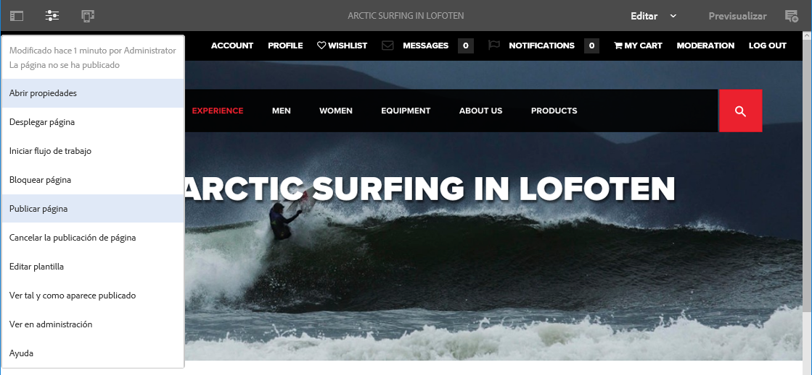

1. En función de si la página tiene referencias que es necesario publicar:

   * La página se publicará directamente si no hay ninguna referencia por publicar.
   * Si la página tiene referencias que es necesario publicar, estas se enumerarán en el asistente **Publicar**, donde puede:

      * Especificar qué recurso/etiqueta/etc. desea publicar junto con la página y, a continuación, utilizar **Publicar** para completar el proceso.
      * Utilizar **Cancelar** para anular la acción.

   

1. Si selecciona **Publicar**, se replicará la página en el entorno de publicación. En el editor de páginas se mostrará un mensaje que confirma la acción de publicación.

   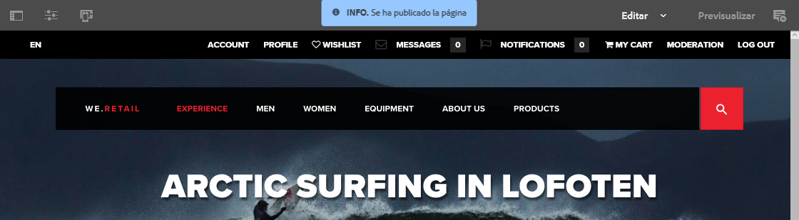

   Al ver la misma página en la consola, se muestra el estado actualizado de publicación.

   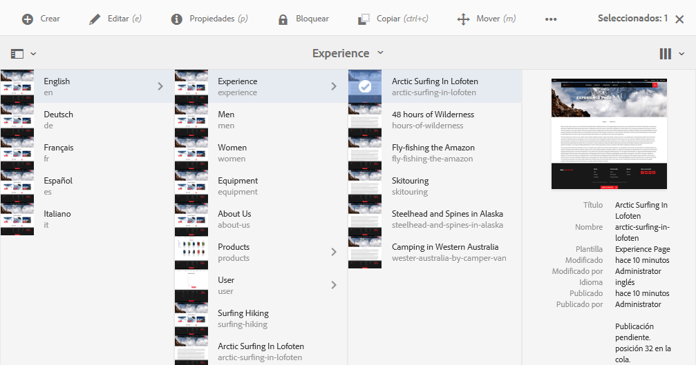

>[!NOTE]
>
>La publicación desde el editor no es profunda; es decir, solo se publica la página o páginas seleccionadas, y no las páginas secundarias.

### Publicar desde la consola {#publishing-from-the-console}

En la consola Sitios hay dos opciones para la publicación:

* [Publicación rápida](/help/sites-authoring/publishing-pages.md#quick-publish)
* [Administrar publicación](/help/sites-authoring/publishing-pages.md#manage-publication)

#### Publicación rápida  {#quick-publish}

**Publicación rápida** es para casos sencillos y publica las páginas seleccionadas inmediatamente, sin más interacción. Por este motivo, cualquier referencia no publicada se publica también automáticamente.

Para publicar una página con Publicación rápida:

1. Seleccione la página o páginas en la consola Sitios y haga clic en el botón **Publicación rápida**.

   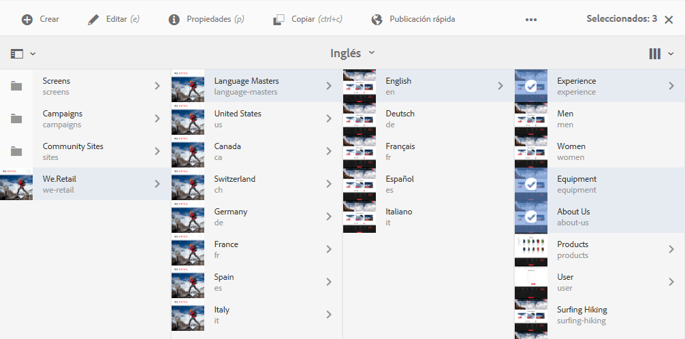

1. In the Quick Publish dialogue, confirm the publication by clicking on **Publish** or cancel by clicking on **Cancel**. Recuerde que cualquier referencia sin publicar se publicará también automáticamente.

   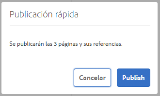

1. Cuando la página esté publicada, se mostrará un aviso de confirmación.

>[!NOTE]
>
>La Publicación rápida no es profunda; es decir, solo se publica la página o páginas seleccionadas, y no las páginas secundarias.

#### Administrar publicación     {#manage-publication}

**Administrar publicación** ofrece más opciones que Publicación rápida, pues permite incluir páginas secundarias, personalizar las referencias e iniciar cualquier flujo de trabajo aplicable, además de poder publicar en un momento posterior.

Para publicar o cancelar la publicación de una página con Administrar publicación:

1. Seleccione la página o páginas en la consola Sitios y haga clic en el botón **Administrar publicación**.

   

1. Se inicia el asistente **Administrar publicación**. El primer paso, **Opciones**, le permite:

   * Elija si publica o cancela la publicación de las páginas seleccionadas.
   * Elija si la acción se realizará ahora o en una fecha posterior.

   Posponer la publicación inicia un flujo de trabajo que publicará la página o páginas seleccionadas en el momento especificado. Por su parte, cancelar la publicación inicia un flujo de trabajo para anular la publicación de la página o páginas seleccionadas en un momento especificado.

   Si desea cancelar una acción de publicación/cancelación de la publicación posteriormente, vaya a la [consola Flujo de trabajo](/help/sites-administering/workflows.md) para finalizar el flujo de trabajo correspondiente.

   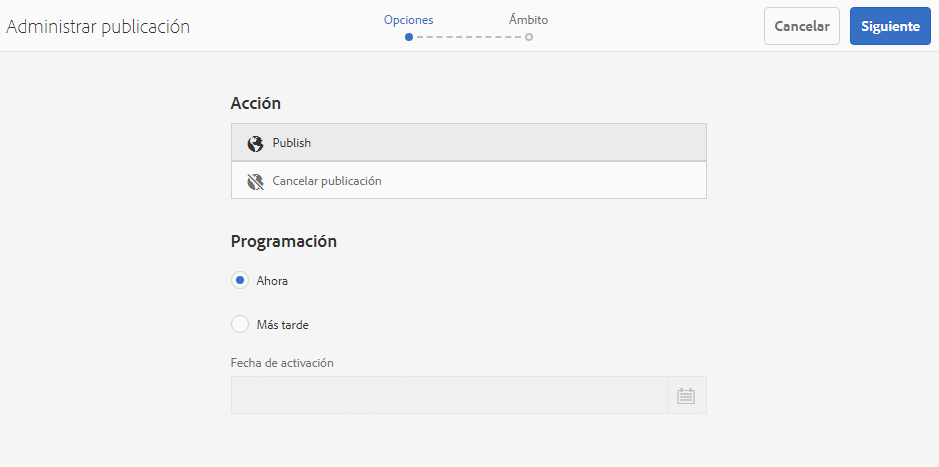

   Haga clic en **Siguiente** para continuar.

1. In the next step of the Manage Publication wizard, **Scope**, you can define the scope of the publication/unpublication such as including to include child pages and/or including references.

   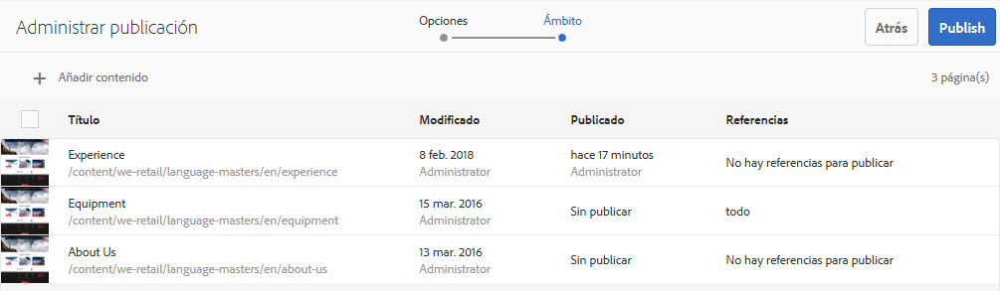

   Puede utilizar el botón **Añadir contenido** para añadir páginas adicionales a la lista de páginas que se publicarán, en caso de que olvidara seleccionar alguna antes de iniciar el asistente de Administrar publicación.

   Al hacer clic en el botón Añadir contenido se inicia el [navegador de rutas](/help/sites-authoring/author-environment-tools.md#path-browser) para que pueda seleccionar contenido.

   Seleccione las páginas necesarias y, a continuación, haga clic en **Seleccionar** para añadir el contenido al asistente, o Cancelar para cancelar la selección y volver al asistente.

   De nuevo en el asistente, puede seleccionar un elemento de la lista para configurar las demás opciones, por ejemplo:

   * Incluir sus elementos secundarios.
   * Eliminarlo de la selección.
   * Gestionar sus referencias publicadas.

   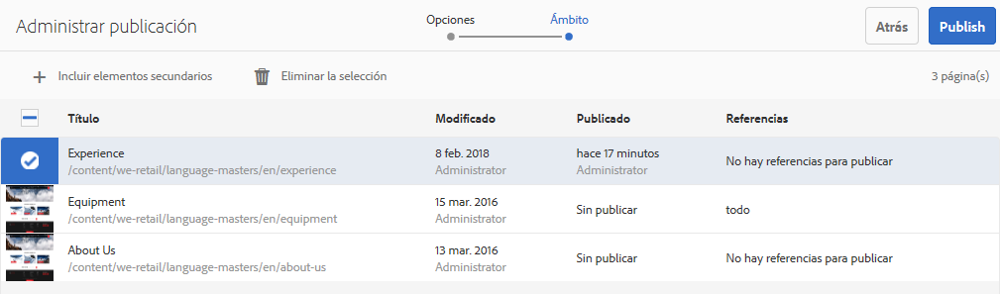

   Al hacer clic en **Incluir elementos secundarios** se abre un cuadro de diálogo que le permite lo siguiente:

   * Incluir solo los elementos secundarios inmediatos.
   * Incluir solo las páginas modificadas.
   * Incluir solo las páginas ya publicadas.

   Haga clic en **Añadir** para añadir las páginas secundarias que se van a publicar o dejar de publicar, en función de las opciones de selección. Haga clic en **Cancelar** para cancelar la selección y volver al asistente.

   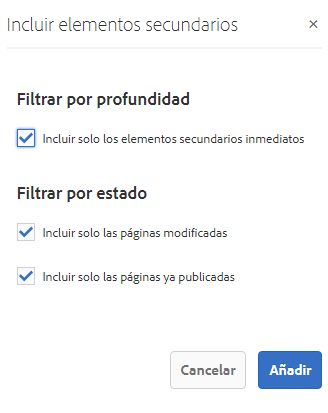

   Al volver al asistente verá las páginas añadidas en función de su elección de opciones en el cuadro de diálogo Incluir elementos secundarios.

   Puede ver y modificar las referencias que se van a publicar o dejar de publicar para una página: haga clic en la página y, a continuación, haga clic en el botón **Referencias publicadas**.

   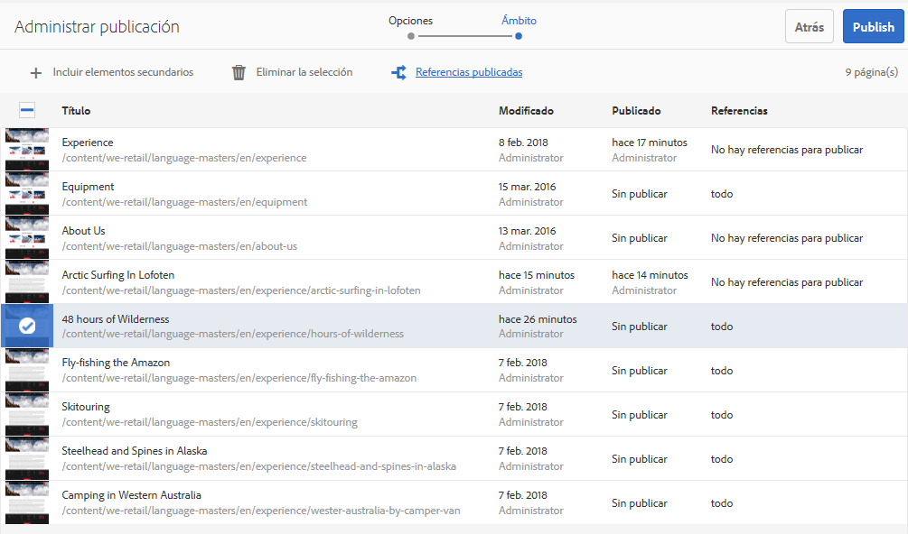

   The **Published References** dialogue displayes the references for the selected content. De forma predeterminada, todas se seleccionan y se publican/dejan de publicar, pero puede anular la marca de selección de las que no desee, de modo que no se incluyan en la acción.

   Click **Done** to save your changes or **Cancel** to cancel the selction and return to the wizard.

   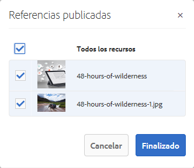

   En el asistente, la columna **Referencias** se actualizará para reflejar su selección de referencias a publicar o dejar de publicar.

   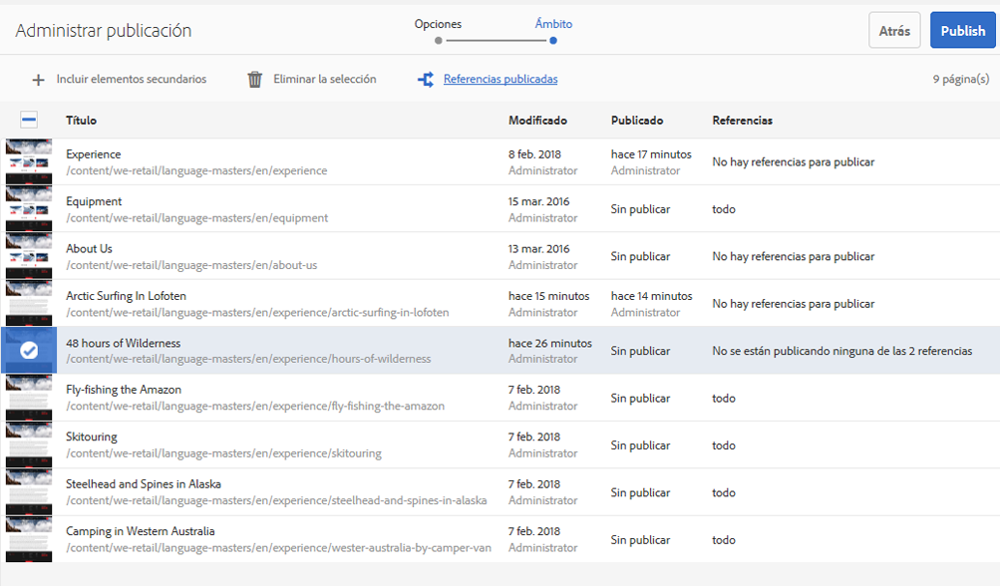

1. Haga clic en **Publicar** para completar la acción.

   En la consola Sitios, un mensaje de notificación confirmará la publicación.

   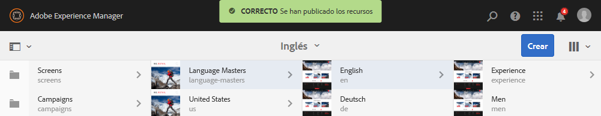

1. Si las páginas publicadas están asociadas a flujos de trabajo, estos se pueden mostrar en un último paso, **Flujos de trabajo**, del asistente de publicación.

   >[!NOTE]
   >
   >El paso **Flujos de trabajo** se muestra o no en función de los derechos del usuario. See the [previous note on this page](/help/sites-authoring/publishing-pages.md) regarding publishing privileges as well as [Managing Access to Workflows](/help/sites-administering/workflows-managing.md) and [Applying Workflows to Pages](/help/sites-authoring/workflows-applying.md) for details.

   Los recursos se agrupan por los flujos de trabajo activados y cada uno ofrece opciones para:

   * Definir el título del flujo de trabajo.
   * Mantener el paquete del flujo de trabajo, siempre que este [sea compatible con varios recursos](/help/sites-developing/workflows-models.md#configuring-a-workflow-for-multi-resource-support).
   * Definir un título para el paquete de flujos de trabajo si se eligió la opción para mantener dicho paquete.

   Click **Publish** or **Publish Later **to complete the publication.

   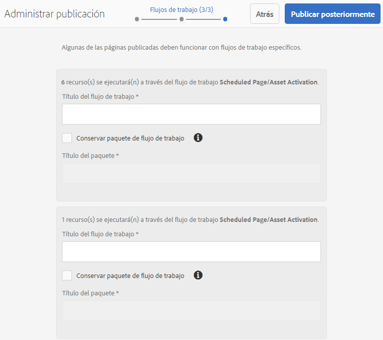

## Cancelar la publicación de páginas {#unpublishing-pages}

Si se cancela la publicación de una página, se eliminará del entorno de publicación y ya no estará disponible para los lectores.

De forma [similar a la publicación](/help/sites-authoring/publishing-pages.md#publishing-pages), se puede cancelar la publicación de una o varias páginas:

* [Desde el editor de páginas](/help/sites-authoring/publishing-pages.md#unpublishing-from-the-editor)
* [Desde la consola Sitios](/help/sites-authoring/publishing-pages.md#unpublishing-from-the-console)

### Cancelación de la publicación desde el editor     {#unpublishing-from-the-editor}

Si desea cancelar la publicación de una página que está editando, seleccione **Cancelar publicación de página** en el menú **Información de página**, de un modo similar a como haría para [publicar la página](/help/sites-authoring/publishing-pages.md#publishing-from-the-editor).

### Cancelación de la publicación desde la consola     {#unpublishing-from-the-console}

Al igual que [utiliza la opción Administrar publicación para publicar](/help/sites-authoring/publishing-pages.md#manage-publication), puede usarla para cancelar la publicación.

1. Seleccione la página o páginas en la consola Sitios y haga clic en el botón **Administrar publicación**.
1. Se inicia el asistente **Administrar publicación**. En el primer paso, **Opciones**, seleccione **Cancelar publicación** en lugar de la opción predeterminada **Publicar**.

   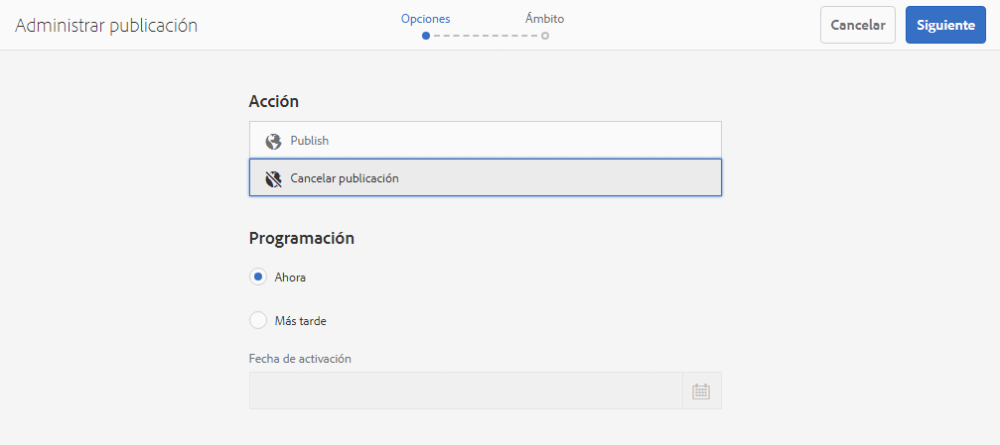

   Igual que posponer la publicación inicia un flujo de trabajo para publicar esta versión de la página en el momento especificado, desactivar más tarde inicia un flujo de trabajo para cancelar la publicación de la página o páginas seleccionadas en un momento concreto.

   Si desea cancelar una acción de publicación/cancelación de la publicación posteriormente, vaya a la [consola Flujo de trabajo](/help/sites-administering/workflows.md) para finalizar el flujo de trabajo correspondiente.

1. Para completar la cancelación de la publicación, complete el asistente como haría para [publicar la página](/help/sites-authoring/publishing-pages.md#manage-publication).

## Publicar y cancelar la publicación de un árbol {#publishing-and-unpublishing-a-tree}

Cuando haya introducido o actualizado una cantidad considerable de páginas de contenido (todas ellas residentes dentro de la misma página raíz), puede ser más fácil publicar el árbol entero con una sola acción.

Para hacerlo, puede utilizar la opción [Administrar publicación](/help/sites-authoring/publishing-pages.md#manage-publication) de la consola Sitios.

1. En la consola Sitios, seleccione la página raíz de árbol que desea publicar o dejar de publicar y seleccione **Administrar publicación**.
1. Se inicia el asistente **Administrar publicación**. Elija si desea publicar o cancelar la publicación, y cuándo debe producirse la acción, y seleccione **Siguiente** para continuar.
1. En el paso **Ámbito**, elija la página raíz y seleccione **Incluir elementos secundarios**.

   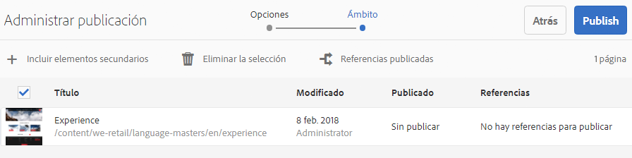

1. En el cuadro de diálogo **Incluir elementos secundarios**, desmarque las siguientes opciones:

   * Incluir solo los elementos secundarios inmediatos
   * Incluir solo las páginas ya publicadas

   Estas opciones están seleccionadas de forma predeterminada, por lo que debe acordarse de anular su selección. Haga clic en **Añadir** para confirmar y añadir el contenido a la publicación/cancelación de publicación.

   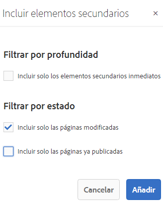

1. El asistente **Administrar publicación** enumera el contenido del árbol para su revisión. Puede personalizar aún más la selección añadiendo páginas adicionales o eliminando las seleccionadas.

   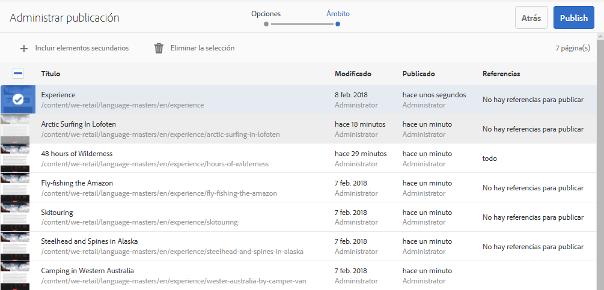

   Recuerde que también puede revisar las referencias que se publican mediante la opción **Referencias publicadas**.

1. [Continúe con el asistente Administrar publicación de forma normal](#manage-publication) para completar la publicación o cancelación de publicación del árbol.

## Determinar el estado de publicación {#determining-publication-status}

Puede determinar el estado de la publicación de una página:

* En la [información general de recursos de la consola Sitios](/help/sites-authoring/basic-handling.md#viewing-and-selecting-resources)

   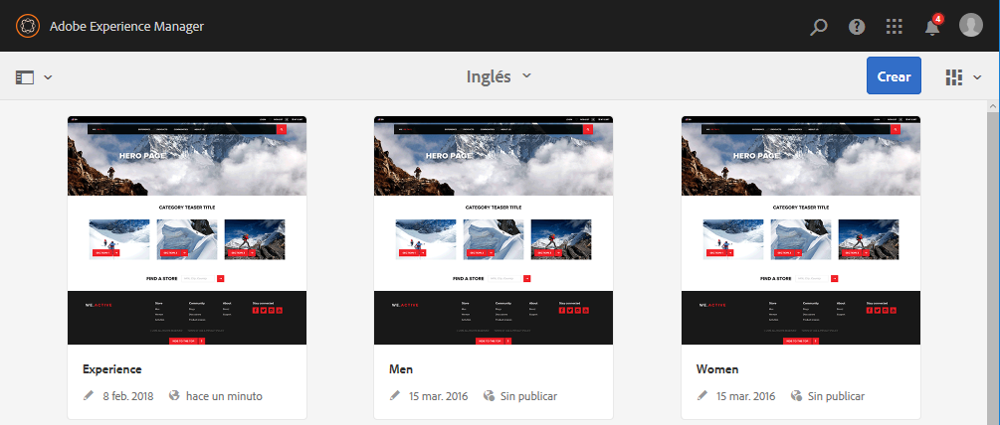

   El estado de publicación se indica en las vistas de [tarjeta](/help/sites-authoring/basic-handling.md#card-view), [columna](/help/sites-authoring/basic-handling.md#column-view) y [lista](/help/sites-authoring/basic-handling.md#list-view) de la consola Sitios.

* En la [cronología](/help/sites-authoring/basic-handling.md#timeline)

   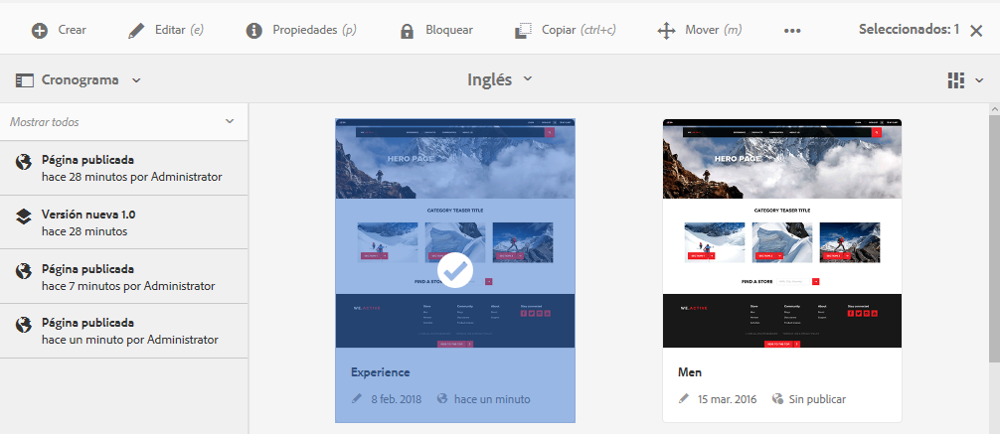

* En el [menú Información de página](/help/sites-authoring/author-environment-tools.md#page-information) cuando se edita una página.

   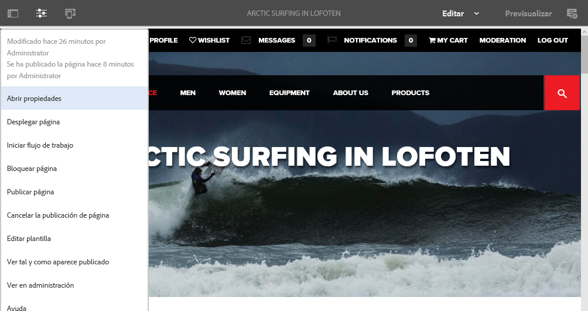

