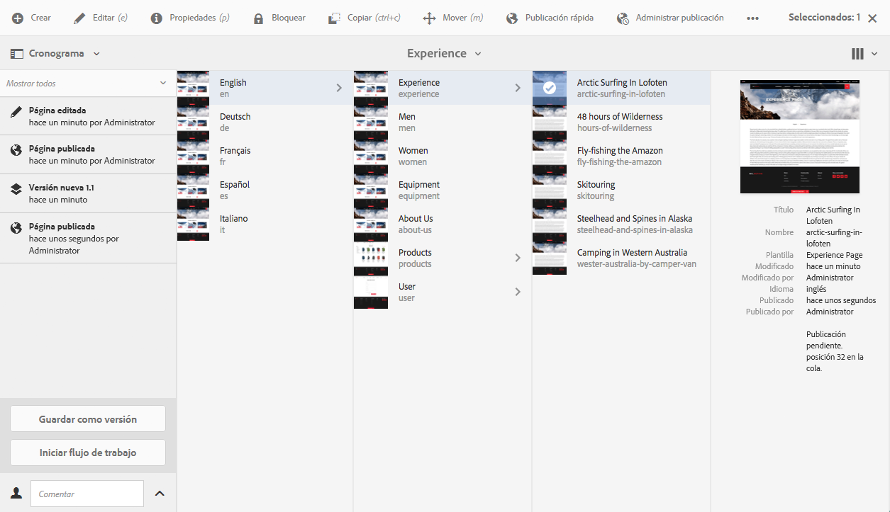

# Guía rápida para la creación de páginas{#quick-guide-to-authoring-pages}

>[!CAUTION]
>
>AEM 6.4 ha llegado al final de la compatibilidad ampliada y esta documentación ya no se actualiza. Para obtener más información, consulte nuestra [períodos de asistencia técnica](https://helpx.adobe.com/es/support/programs/eol-matrix.html). Buscar las versiones compatibles [here](https://experienceleague.adobe.com/docs/).

Estos procedimientos están pensados como una guía rápida (de alto nivel) sobre las acciones clave para crear contenido de páginas en AEM.

Estos procedimientos:

* No tienen una cobertura completa.
* Proporcione vínculos a la documentación detallada.

Para obtener más información sobre la creación con AEM, consulte:

* [Primeros pasos de creación](/help/sites-authoring/first-steps.md)
* [Uso del entorno de creación](/help/sites-authoring/author-environment-tools.md)

## Algunas sugerencias rápidas {#a-few-quick-hints}

Antes de dar información general sobre aspectos específicos, aquí hay una pequeña colección de sugerencias generales que vale la pena tener en cuenta, especialmente si está acostumbrado a la función [entorno de creación de IU clásica](/help/sites-classic-ui-authoring/classicui.md).

### Consola Sitios {#sites-console}

* **Crear**

   * Este botón está disponible en muchas consolas. Las opciones presentadas son sensibles al contexto, por lo que pueden variar en función del escenario.

* Reorganización de páginas en una carpeta

   * Esto se puede hacer en la [vista de lista](/help/sites-authoring/basic-handling.md#list-view). Los cambios se aplican y quedan visibles en otras vistas.

* Cambio de la IU

   * Esto se puede hacer desde varias ubicaciones. Consulte [Selección de la IU](/help/sites-authoring/select-ui.md).

### Creación de páginas {#page-authoring}

* Vínculos de navegación 

   * ***Los vínculos no están disponibles para la navegación*** cuando esté en **Editar** en el menú contextual. Para navegar con vínculos debe [vista previa de la página](/help/sites-authoring/editing-content.md#previewing-pages) mediante:

      * [Modo de vista previa](/help/sites-authoring/editing-content.md#preview-mode)
      * [Ver como aparece publicado](/help/sites-authoring/editing-content.md#view-as-published)

* Los flujos de trabajo y las versiones ya no se inician ni se crean desde el editor de páginas; esto ahora se realiza a partir de [Cronología](/help/sites-authoring/basic-handling.md#timeline) (accesible desde la consola).

>[!NOTE]
>
>Existen varios métodos abreviados del teclado que pueden facilitar la experiencia de creación.
>
>* [Métodos abreviados de teclado al editar páginas](/help/sites-authoring/page-authoring-keyboard-shortcuts.md)
>* [Métodos abreviados del teclado para las consolas](/help/sites-authoring/keyboard-shortcuts.md)

## Encontrar su página {#finding-your-page}

1. Abra la consola **Sitios** (con la opción **Sitios** de [Navegación global](/help/sites-authoring/basic-handling.md#global-navigation): esto se activa (menú desplegable) al seleccionar el vínculo de Adobe Experience Manager (parte superior izquierda).

1. Desplácese por el árbol y toque o haga clic en la página adecuada. La manera en la que se presentan los recursos de la página depende de la vista que utilice: [Tarjeta, Lista o Columnas](/help/sites-authoring/basic-handling.md#viewing-and-selecting-resources):

   

1. Desplácese hacia arriba en el árbol mediante [la ruta de exploración del encabezado](/help/sites-authoring/basic-handling.md#the-header); esto permite volver a la ubicación seleccionada:

   

### Creación de una nueva página {#creating-a-new-page}

1. [Desplácese hasta la ubicación en la que desee crear la nueva página.](#finding-your-page)
1. Utilice la variable **Crear** y, a continuación, seleccione **Página** de la lista:

   

1. Se abrirá el asistente que le guiará para recopilar la información necesaria cuando [crear la nueva página](/help/sites-authoring/managing-pages.md#creating-a-new-page). Siga las instrucciones que aparecen en la pantalla.

## Seleccionar su página para ejecutar acciones adicionales   {#selecting-your-page-for-further-action}

Puede seleccionar una página para realizar acciones en ella. Si se selecciona una página, se actualizará automáticamente la barra de herramientas para que se muestren las acciones relevantes para ese recurso.

Cómo seleccionar una página depende de la vista que utilice en la consola:

1. Vista de tarjeta:

   * Introducir el modo de selección [seleccionar el recurso requerido](/help/sites-authoring/basic-handling.md#viewing-and-selecting-resources) con:

      * Dispositivo móvil: pulsar y mantener presionado
      * Escritorio: el [acción rápida](/help/sites-authoring/basic-handling.md#quick-actions) - icono de visto:

         

      * En la tarjeta se superpondrá una marca de verificación que indica que se ha seleccionado la página.
   >[!NOTE]
   >
   >Una vez en el modo de selección, la variable **Select** (una marca de verificación) cambiará a la variable **Anular selección** (cruz).

1. Vista en lista:

   * Haga clic o toque en la miniatura del recurso en cuestión: la vista en miniatura mostrará una marca de verificación para indicar que se ha seleccionado.

1. Vista de columna:

   * Haga clic o toque en la miniatura del recurso en cuestión: la vista en miniatura mostrará una marca de verificación para indicar que se ha seleccionado.

## Acciones rápidas (solo vista de tarjeta y escritorio) {#quick-actions-card-view-desktop-only}

1. [Desplácese hasta la página](#finding-your-page) sobre la que quiera llevar a cabo una acción.
1. Pase el puntero del ratón sobre la tarjeta que representa el recurso necesario; se mostrarán las acciones rápidas:

   

## Edición del contenido de la página {#editing-your-page-content}

1. [Desplácese hasta la página](#finding-your-page) que quiera editar.
1. [Abra la página que quiera editar](/help/sites-authoring/managing-pages.md#opening-a-page-for-editing) con el icono Editar (lápiz):

   

   Puede acceder desde:

   * [Acciones rápidas (solo vista de tarjeta y escritorio)](#quick-actions-card-view-desktop-only) para el recurso adecuado.
   * La barra de herramientas cuando [su página se haya seleccionado](#selecting-your-page-for-further-action).

1. Cuando se abre el editor, puede:

   * [Agregue un componente nuevo a su página](/help/sites-authoring/editing-content.md#inserting-a-component) por:

      * apertura del panel lateral
      * seleccionando la pestaña componentes (la pestaña [navegador de componentes](/help/sites-authoring/author-environment-tools.md#components-browser))
      * arrastrando el componente requerido a su página.

      El panel lateral se puede abrir (y cerrar) con:

      

   * [Editar el contenido de un componente existente](/help/sites-authoring/editing-content.md#edit-configure-copy-cut-delete-paste) en la página:

      * Abra la barra de herramientas de componentes haciendo clic sobre ella. Utilice la variable **Editar** (lápiz) para abrir el cuadro de diálogo.
      * Abra el editor in situ del componente haciendo clic y aguantando el puntero o haciendo doble clic. Se mostrarán las acciones disponibles (para algunos componentes, esta será una selección limitada).
      * Para ver todas las acciones disponibles, acceda al modo de pantalla completa utilizando:

      

   * [Configurar las propiedades de un componente existente](/help/sites-authoring/editing-content.md#component-edit-dialog)

      * Abra la barra de herramientas de componentes haciendo clic sobre ella. Utilice la variable **Configurar** (llave inglesa) para abrir el cuadro de diálogo.
   * [Mover un componente](/help/sites-authoring/editing-content.md#moving-a-component) o bien:

      * Arrastre el componente requerido a su nueva ubicación.
      * Abra la barra de herramientas de componentes haciendo clic sobre ella. Utilice los iconos **Cortar** y **Pegar** donde sea necesario.
   * [Copiar (y pegar)](/help/sites-authoring/editing-content.md#edit-configure-copy-cut-delete-paste) un componente:

      * Abra la barra de herramientas de componentes haciendo clic sobre ella. Utilice los iconos **Copiar** y **Pegar** cuando sea necesario.
      >[!NOTE]
      >
      >Puede **pegar** componentes en la misma página o en otra página. Si pega el componente en una página diferente que ya estaba abierta antes de la operación de cortar o copiar, tendrá que actualizase la página. 

   * [Eliminar](/help/sites-authoring/editing-content.md#edit-configure-copy-cut-delete-paste) un componente:

      * Abra la barra de herramientas de componentes haciendo clic sobre ella y utilice el icono **Eliminar.**
   * [Añadir anotaciones](/help/sites-authoring/annotations.md#annotations) a la página:

      * Seleccione el **Anotar** (icono de bocadillo). Añadir anotaciones utilizando la variable **Agregar anotación** (signo más). Salga del modo Anotar utilizando la X en la parte superior derecha.

      

   * [Vista previa de una página](/help/sites-authoring/editing-content.md#preview-mode) (para ver cómo aparecerá en el entorno de publicación)

      * Select **Vista previa** en la barra de herramientas.
   * Vuelva al modo de edición (o seleccione otro modo) utilizando la variable **Editar** selector desplegable.

   >[!NOTE]
   >
   >Para navegar mediante vínculos en el contenido debe utilizar [Modo de vista previa](/help/sites-authoring/editing-content.md#preview-mode).

## Editar las Propiedades de la página   {#editing-the-page-properties}

Existen dos métodos (principales) de [edición de propiedades de página](/help/sites-authoring/editing-page-properties.md):

* Desde la consola **Sitios**:

   1. [Vaya a la página](#finding-your-page) desea publicar.
   1. Seleccione el **Propiedades** de:

      * [Acciones rápidas (solo vista de tarjeta y escritorio)](#quick-actions-card-view-desktop-only) para el recurso adecuado.
      * La barra de herramientas cuando [su página se haya seleccionado](#selecting-your-page-for-further-action).

   

* Se mostrarán las propiedades de la página. Puede aplicar actualizaciones según sea necesario y, a continuación, seleccionar Guardar para preservarlas.

   * When [editar la página](#editing-your-page-content):

      1. Abra el **Información de la página** para abrir el Navegador.
      1. Select **Abrir propiedades** para abrir el cuadro de diálogo y editar las propiedades.

         

## Publicar su página (o eliminar la publicación) {#publishing-your-page-or-unpublishing}

Existen dos métodos principales de [publicar su página](/help/sites-authoring/publishing-pages.md) (y también de cancelación de la publicación):

* Desde la consola **Sitios**:

   1. [Vaya a la página](#finding-your-page) desea publicar.
   1. Seleccione el icono **Publicación rápida** desde:

      * [Acciones rápidas (solo vista de tarjeta y escritorio)](#quick-actions-card-view-desktop-only) para el recurso adecuado.
      * La barra de herramientas cuando su [página se haya seleccionado](#selecting-your-page-for-further-action) (también permite el acceso a [Publicar posteriormente](/help/sites-authoring/publishing-pages.md#manage-publication)).

   

* When [editar la página](#editing-your-page-content):

   1. Abra el **Información de la página** para abrir el Navegador.
   1. Select **Publicar página**.

   

* La cancelación de la publicación de una página desde la consola solo se puede realizar mediante la opción **Administrar publicación**, que solo está disponible en la barra de herramientas (no a través de las acciones rápidas).

   La variable **Cancelar publicación de página** sigue estando disponible a través de la opción **Información de la página** en el editor.

   

   Consulte [Publicación de páginas](/help/sites-authoring/publishing-pages.md#unpublishing-pages) para obtener más información.

## Mover, copiar y pegar o eliminar su página   {#move-copy-and-paste-or-delete-your-page}

1. [Vaya a la página](#finding-your-page) desea mover, copiar, pegar o eliminar.
1. Seleccione el icono de copiar (y luego pegar), mover o eliminar según sea necesario mediante:

   * [Acciones rápidas (solo vista de tarjeta y escritorio)](#quick-actions-card-view-desktop-only) para el recurso requerido.
   * La barra de herramientas cuando su [página se haya seleccionado](#selecting-your-page-for-further-action).

   * Copiar:

      * Desplácese hasta la nueva ubicación y péguelo allí.
   * Mover:

      * Se abrirá el asistente para recoger la información necesaria para mover la página. Siga las instrucciones que aparecen en la pantalla.
   * Eliminar:

      * Se le solicitará que confirme la acción.
   >[!NOTE]
   >
   >La opción Eliminar no se encuentra disponible como Acción rápida.

## Bloquear y desbloquear su página  {#locking-your-page-then-unlocking}

[Bloquear una página](/help/sites-authoring/editing-content.md#locking-a-page) impide que otros autores trabajen en ella al mismo tiempo que usted. El icono/botón Bloquear (y Desbloquear) se encuentra en:

* La barra de herramientas cuando su [página se haya seleccionado](#selecting-your-page-for-further-action).
* Menú desplegable [Información de la página](#editing-the-page-properties) cuando edita la página.
* Barra de herramientas de la página cuando edita la página (cuando está bloqueada).

Por ejemplo, el icono de bloqueo presenta el siguiente aspecto:

## Acceder a las referencias de la página {#accessing-page-references}

[El acceso rápido a las referencias](/help/sites-authoring/author-environment-tools.md#references) hasta/desde una página está disponible en la Barra de referencias.

1. Seleccione **Referencias** mediante el icono de la barra de herramientas (antes o después de [seleccionar su página](#selecting-your-page-for-further-action)): 

   

   Se muestra una lista de tipos de referencias:

   

1. Toque o haga clic en el tipo de referencia requerido para mostrar más detalles y (cuando corresponda) realizar más acciones.

## Crear una versión de su página   {#creating-a-version-of-your-page}

1. Para abrir el raíl de cronología, seleccione **[Cronología](/help/sites-authoring/basic-handling.md#timeline)** con el icono de la barra de herramientas (antes o después de [seleccionar su página](#selecting-your-page-for-further-action)): 

   

1. Toque o haga clic en la flecha hacia arriba situada en la parte inferior derecha de la columna Línea de tiempo para mostrar botones adicionales, como **Guardar como versión**.

   

1. Seleccione **Guardar como versión**, y después seleccione **Crear**.

## Restablecer o comparar una versión de su página {#restoring-comparing-a-version-of-your-page}

Se utiliza el mismo mecanismo básico cuando se restablecen y/o se comparan versiones de su página:

1. Seleccione **[Línea de tiempo](/help/sites-authoring/basic-handling.md#timeline)** mediante el icono de la barra de herramientas (antes o después de [seleccionar su página](#selecting-your-page-for-further-action)): 

   

   Si ya se ha guardado una versión de su página, se indicará en la línea de tiempo. 

1. Toque o haga clic en la versión que desee restaurar. De este modo aparecerán botones de acción adicionales:

   * **Volver a esta versión**

      * Se restablecerá la versión.
   * **Mostrar diferencias**

      * La página se abrirá con las diferencias (entre las dos versiones) resaltadas.
