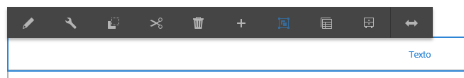
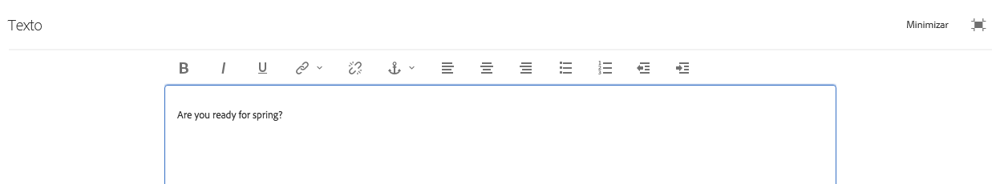

# Using the Rich Text Editor to author content {#using-the-rich-text-editor-to-author-content}

El Editor de texto enriquecido (RTE) es un bloque de creación básico para la creación de texto en páginas AEM. Muchos componentes como Texto, Texto e Imagen y Tabla se basan en RTE.

>[!NOTE]
>
>La copia de listas anidadas en el RTE no funciona según lo previsto. Al copiar listas anidadas de Microsoft Word, deberá borrar manualmente las listas después de pegar el texto en el RTE.

## Edición in-situ {#in-place-editing}

Al seleccionar un componente basado en texto con un solo toque o clic, se muestra la barra de herramientas [del](../sites-authoring/editing-content.md#edit-configure-copy-cut-delete-paste)componente.

Al tocar o hacer clic de nuevo o seleccionar inicialmente el componente con un toque o clic lento en el doble, se abre la edición in-situ, que tiene su propia barra de herramientas. Aquí puede editar el contenido y realizar cambios básicos de formato.

Esta barra de herramientas ofrece las opciones siguientes:

* **Formato**: Defina el formato negrita, cursiva y subrayado.

* **Listas**: Cree listas con viñetas o numeradas o defina la sangría.

* **Hipervínculo**

* **Desvincular**

* **Pantalla completa**

* **Cerrar**

* **Guardar**

## Edición a pantalla completa {#full-screen-editing}

Para los componentes basados en texto, si se selecciona el modo de pantalla completa en la barra de herramientas, se abrirá el editor de texto enriquecido y se ocultará el resto del contenido de la página.

El modo de pantalla completa muestra todas las opciones del editor de texto enriquecido que el administrador ha configurado. Pueden variar según AEM instancias [según la configuración](../sites-administering/rich-text-editor.md) proporcionada por los administradores o los desarrolladores AEM. Si encuentra que falta una opción, pida al administrador que la ponga a disposición.

Entre las opciones adicionales del editor de texto enriquecido están:

* **Anclaje**: crea en el texto un anclaje al que posteriormente puede hacer referencia o emplear como vínculo.
* **Alinear texto a la izquierda**
* **Centrar texto**
* **Alinear texto a la derecha**

Para cerrar el modo de pantalla completa, haga clic en el icono de minimizar.

