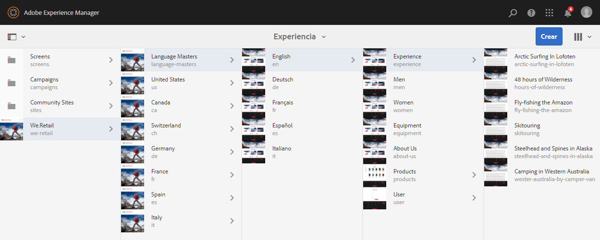
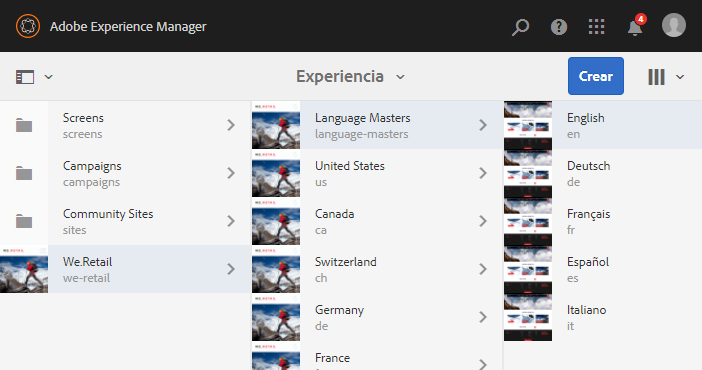
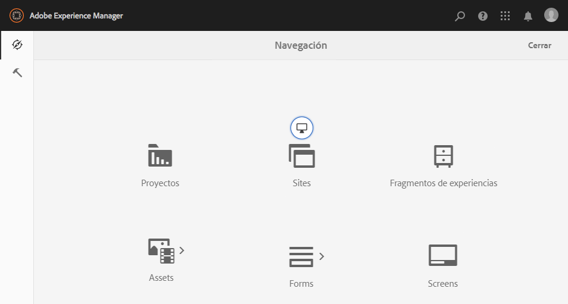
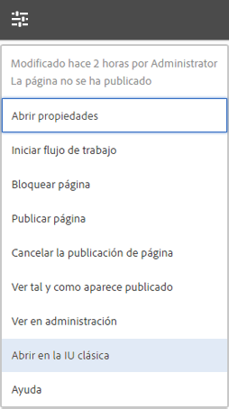

# Seleccionar la IU{#selecting-your-ui}

## Explicación de las IU

El entorno de creación permite:

* [La creación](/help/sites-authoring/author.md) (incluida la [creación de páginas](/help/sites-authoring/author-environment-tools.md), [la administración de recursos](/help/assets/home.md) y las [comunidades](/help/communities/author-communities.md))

* [Tareas de administración](/help/sites-administering/home.md) necesarias para generar y mantener el contenido de su sitio web

Para conseguirlo, se ofrecen dos interfaces gráficas de usuario, accesibles desde cualquier explorador moderno.

1. IU táctil

   * Esta es la IU AEM moderna y predeterminada.
   * Es, principalmente, de color gris, con una interfaz sencilla y clara.
   * Diseñada para utilizarse en dispositivos táctiles y de escritorio, el aspecto es el mismo en todos los dispositivos, aunque la [visualización y la selección de los recursos](/help/sites-authoring/basic-handling.md#viewing-and-selecting-resources) varía ligeramente (toques frente a clics).

      * Escritorio:

   

   * Dispositivos de tableta (o de escritorio con menos de 1024 píxeles de ancho):

   

1. IU clásica

   * Esta es la IU anterior, que ha estado disponible en AEM durante muchos años.
   * Es, principalmente, de color verde.
   * Está diseñada para utilizarse en dispositivos de escritorio.
   * La siguiente documentación se centra en la interfaz de usuario moderna. Para obtener información sobre la creación en la IU clásica, consulte la [Documentación sobre la creación para la IU clásica](/help/sites-classic-ui-authoring/classicui.md).

   

## Cambio de IU

Although the touch-enabled UI is now the standard UI and [feature parity](../release-notes/touch-ui-features-status.md) has been nearly reached with the administration and editing of sites, there may be times when the user wishes to switch to the [classic UI](/help/sites-classic-ui-authoring/classicui.md). Hay varias opciones para hacerlo.

>[!NOTE]
>
>Para obtener más información sobre el estado de la paridad de funciones con la interfaz clásica, consulte el documento [Paridad de funciones de la IU táctil](../release-notes/touch-ui-features-status.md).

Hay varias ubicaciones en las que puede definir la IU que se utilizará:

* [Configuración de la IU predeterminada para su instancia](#configuring-the-default-ui-for-your-instance) : Esta opción establecerá la IU predeterminada que se mostrará al iniciar sesión el usuario, aunque el usuario podrá omitir esta acción y seleccionar otra IU para su cuenta o para la sesión actual.

* [Configuración de la creación de IU clásica para su cuenta](/help/sites-authoring/select-ui.md#setting-classic-ui-authoring-for-your-account) : Esta opción establecerá la IU que se utilizará de forma predeterminada al editar páginas, aunque el usuario puede omitir esta acción y seleccionar otra IU para su cuenta o para la sesión actual.

* [Cambio a la IU clásica para la sesión](#switching-to-classic-ui-for-the-current-session) actual: esta opción cambia a la IU clásica para la sesión actual.

* En el caso de la [creación de páginas, el sistema anula ciertas opciones de la IU](#ui-overrides-for-the-editor).

>[!CAUTION]
>
>Varias opciones para cambiar a la interfaz de usuario clásica no están disponibles de forma inmediata, ya que deben configurarse específicamente para la instancia.
>
>See [Enabling Access to Classic UI](/help/sites-administering/enable-classic-ui.md) for more information.

>[!NOTE]
>
>Las instancias actualizadas de una versión anterior conservarán la IU clásica para la creación de páginas.
>
>After upgrade, page authoring will not be automatically switched to the touch-enabled UI, but you can configure this using the [OSGi configuration](/help/sites-deploying/configuring-osgi.md) of the **WCM Authoring UI Mode Service** ( `AuthoringUIMode` service). Consulte [Omisiones de IU del editor](#ui-overrides-for-the-editor).

## Configurar la IU predeterminada para su instancia {#configuring-the-default-ui-for-your-instance}

Los administradores del sistema pueden configurar la IU que se ve al principio y en el inicio de sesión utilizando la [asignación raíz](/help/sites-deploying/osgi-configuration-settings.md).

Las opciones predeterminadas del usuario o la configuración de la sesión pueden anular estos ajustes.

## Definición de la creación en la IU clásica para su cuenta {#setting-classic-ui-authoring-for-your-account}

Cada usuario puede tener acceso a sus [preferencias de usuario](/help/sites-authoring/user-properties.md) para definir si desea utilizar la IU clásica para la creación de páginas (en lugar de la IU predeterminada).

La configuración de la sesión puede anular estos ajustes.

## Cambio a la IU clásica para la sesión actual {#switching-to-classic-ui-for-the-current-session}

Al utilizar la IU táctil, puede ser que los usuarios de escritorio deseen cambiar a la IU clásica (solo para escritorio). Hay varios métodos para cambiar a la IU clásica para la sesión actual:

* **Vínculos de navegación** 

   >[!CAUTION]
   >
   >Esta opción para cambiar a la interfaz de usuario clásica no está disponible de forma inmediata, ya que debe configurarse específicamente para la instancia.
   >
   >
   >See [Enabling Access to Classic UI](/help/sites-administering/enable-classic-ui.md) for more information.

   Si esta opción está activada, cuando pasa el cursor sobre una consola aplicable aparece un icono (el símbolo de un monitor) que, al tocar o hacer clic en él, abre la ubicación apropiada en la IU clásica.

   Por ejemplo, los vínculos de **Sitio** a **siteadmin**: 

   

* **URL**

   The classic UI can be accessed using the URL for the welcome screen at `welcome.html`. For example:

   `http://localhost:4502/welcome.html`

   >[!NOTE]
   >
   >Se puede acceder a la IU táctil a través de `sites.html`. Por ejemplo:
   >
   >
   >`http://localhost:4502/sites.html`

### Cambio a la IU clásica al editar una página {#switching-to-classic-ui-when-editing-a-page}

>[!CAUTION]
>
>Esta opción para cambiar a la interfaz de usuario clásica no está disponible de forma inmediata, ya que debe configurarse específicamente para la instancia.
>
>See [Enabling Access to Classic UI](/help/sites-administering/enable-classic-ui.md) for more information.

Si ese acceso está activado, la opción **Abrir la interfaz de usuario clásica** está disponible en el cuadro de diálogo **Información de la página**:

### Omisiones de IU del editor {#ui-overrides-for-the-editor}

El sistema puede anular la configuración definida por un usuario o administrador del sistema durante la creación de una página.

* Al crear páginas:

   * Use of the classic editor is forced when accessing the page using `cf#` in the URL. Por ejemplo:

      `http://localhost:4502/cf#/content/geometrixx/en/products/triangle.html`

   * Use of the touch-enabled editor is forced when using `/editor.html` in the URL or when using a touch device. Por ejemplo:

      `http://localhost:4502/editor.html/content/geometrixx/en/products/triangle.html`

* Los forzados son temporales y solo son válidos para esa sesión del navegador

   * A cookie set will be set dependent on whether touch-enabled ( `editor.html`) or classic ( `cf#`) is used.

* Al abrir páginas mediante `siteadmin`, se buscará:

   * La cookie
   * Una preferencia de usuario
   * Si no existe ninguna de estas opciones, se pasará de forma predeterminada a las definiciones establecidas en la [configuración OSGi](/help/sites-deploying/configuring-osgi.md) del **servicio de modo de IU de creación WCM** (servicio `AuthoringUIMode`).

>[!NOTE]
>
>Si [un usuario ya ha definido una preferencia para la creación de páginas](#setting-classic-ui-authoring-for-your-account), no se anulará al cambiar la propiedad OSGi.

>[!CAUTION]
>
>Como ya se ha descrito, debido al uso de las cookies no se recomienda:
>
>* Editar la URL de forma manual: una URL no estándar podría provocar una situación desconocida y una falta de funcionalidad.
>* Tener ambos editores abiertos al mismo tiempo: por ejemplo, en ventanas independientes.

>

