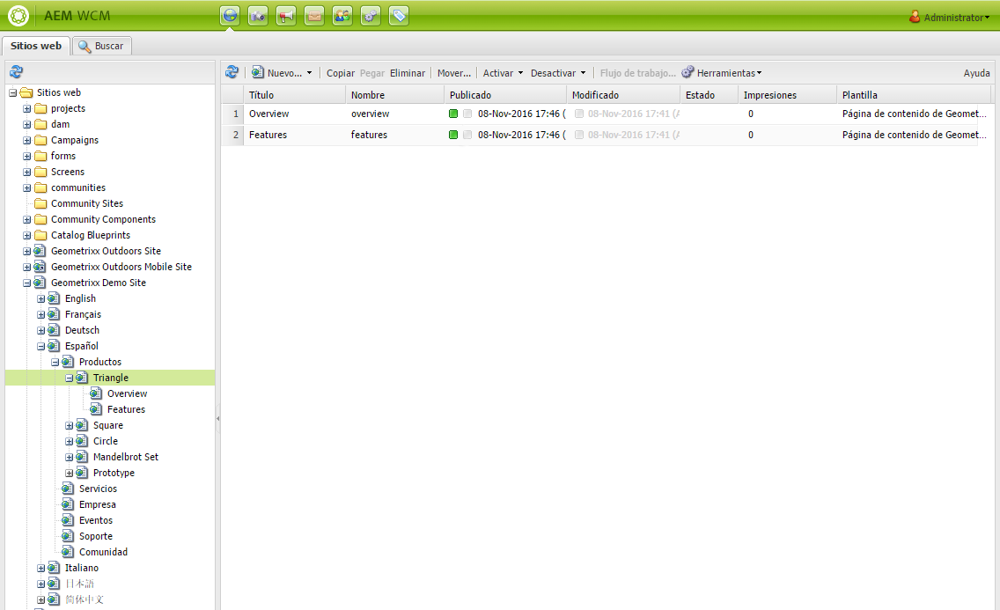

# Selección de la IU{#selecting-your-ui}

>[!CAUTION]
>
>AEM 6.4 ha llegado al final de la compatibilidad ampliada y esta documentación ya no se actualiza. Para obtener más información, consulte nuestra [períodos de asistencia técnica](https://helpx.adobe.com/es/support/programs/eol-matrix.html). Buscar las versiones compatibles [here](https://experienceleague.adobe.com/docs/).

## Explicación de las IU

El entorno de creación permite:

* [Creación](/help/sites-authoring/author.md) (incluido [creación de páginas](/help/sites-authoring/author-environment-tools.md), [administración de recursos](/help/assets/home.md), [comunidades](/help/communities/author-communities.md))

* [Administración](/help/sites-administering/home.md) tareas que necesita para generar y mantener el contenido del sitio web

Para conseguirlo, se proporcionan dos interfaces gráficas de usuario. Se puede acceder a ellas desde cualquier navegador moderno.

1. IU táctil

   * Esta es la IU AEM moderna y predeterminada.
   * Es principalmente gris, con una interfaz limpia y plana.
   * Diseñado para utilizarse tanto en dispositivos táctiles como de escritorio, el aspecto es el mismo en todos los dispositivos, aunque [visualización y selección de los recursos](/help/sites-authoring/basic-handling.md#viewing-and-selecting-resources) difiere ligeramente (toques frente a clics).

      * Escritorio:

   

   * Dispositivos de tableta (o de escritorio con menos de 1024 píxeles de ancho):

   

1. IU clásica

   * Esta es la IU heredada y ha estado disponible en AEM durante muchos años.
   * Es principalmente verde.
   * Se ha diseñado para utilizarse en dispositivos de escritorio.
   * La siguiente documentación se centra en la IU moderna. Para obtener información sobre la creación en la IU clásica, consulte la [Documentación de creación para la IU clásica](/help/sites-classic-ui-authoring/classicui.md).

   

## Cambiar IU

Aunque la IU táctil es ahora la IU estándar y [paridad de características](../release-notes/touch-ui-features-status.md) casi se ha alcanzado con la administración y edición de sitios, puede haber ocasiones en que el usuario desee cambiar a la función [IU clásica](/help/sites-classic-ui-authoring/classicui.md). Hay varias opciones para hacerlo.

>[!NOTE]
>
>Para obtener más información sobre el estado de la paridad de características con la IU clásica, consulte la [Paridad de características en la interfaz de usuario táctil](../release-notes/touch-ui-features-status.md) documento.

Hay varias ubicaciones en las que puede definir qué IU se utilizará:

* [Configuración de la IU predeterminada para su instancia](#configuring-the-default-ui-for-your-instance) : esto establecerá la IU predeterminada para que se muestre al iniciar sesión el usuario, aunque este puede anular esta acción y seleccionar otra IU para su cuenta o para la sesión actual.

* [Configuración de la creación de IU clásica para su cuenta](/help/sites-authoring/select-ui.md#setting-classic-ui-authoring-for-your-account) : esta opción establecerá la IU que se utilizará de forma predeterminada al editar páginas, aunque el usuario puede omitir esta acción y seleccionar otra IU para su cuenta o para la sesión actual.

* [Cambio a la IU clásica para la sesión actual](#switching-to-classic-ui-for-the-current-session) : Esto cambia a la IU clásica para la sesión actual.

* Para el caso de [creación de páginas el sistema anula ciertas opciones en relación con la IU](#ui-overrides-for-the-editor).

>[!CAUTION]
>
>Varias opciones para cambiar a la IU clásica no están disponibles de forma inmediata, ya que deben configurarse específicamente para su instancia.
>
>Consulte [Habilitar el acceso a la IU clásica](/help/sites-administering/enable-classic-ui.md) para obtener más información.

>[!NOTE]
>
>Las instancias actualizadas desde una versión anterior conservarán la IU clásica para la creación de páginas.
>
>Después de la actualización, la creación de páginas no cambiará automáticamente a la IU táctil, pero puede configurarla con el [Configuración de OSGi](/help/sites-deploying/configuring-osgi.md) del **Servicio de modo de IU de creación WCM** ( `AuthoringUIMode` ). Consulte [Omisiones de IU del editor](#ui-overrides-for-the-editor).

## Configuración de la IU predeterminada para su instancia {#configuring-the-default-ui-for-your-instance}

Un administrador del sistema puede configurar la IU que se ve al inicio y al iniciar sesión mediante [Asignación de raíz](/help/sites-deploying/osgi-configuration-settings.md).

Esto puede anularse por los valores predeterminados del usuario o por la configuración de la sesión.

## Configuración de la creación en la IU clásica para su cuenta {#setting-classic-ui-authoring-for-your-account}

Cada usuario puede acceder a su [preferencias de usuario](/help/sites-authoring/user-properties.md) para definir si desea utilizar la IU clásica para la creación de páginas (en lugar de la IU predeterminada).

La configuración de la sesión puede anularla.

## Cambio a la IU clásica para la sesión actual {#switching-to-classic-ui-for-the-current-session}

Al utilizar la IU táctil, es posible que los usuarios de escritorio deseen volver a la IU clásica (solo para escritorio). Hay varios métodos para cambiar a la IU clásica para la sesión actual:

* **Vínculos de navegación**

   >[!CAUTION]
   >
   >Esta opción para cambiar a la IU clásica no está disponible de forma inmediata, debe configurarse específicamente para su instancia.
   >
   >
   >Consulte [Habilitar el acceso a la IU clásica](/help/sites-administering/enable-classic-ui.md) para obtener más información.

   Si esta opción está activada, al pasar el ratón por encima de una consola aplicable, aparece un icono (símbolo de un monitor) que, al tocar o hacer clic en él, abrirá la ubicación apropiada en la IU clásica.

   Por ejemplo, los vínculos de **Sitios** a **siteadmin**:

   

* **URL**

   Se puede acceder a la IU clásica mediante la URL de la pantalla de bienvenida en `welcome.html`. Por ejemplo:

   `http://localhost:4502/welcome.html`

   >[!NOTE]
   >
   >Se puede acceder a la IU táctil a través de `sites.html`. Por ejemplo:
   >
   >
   >`http://localhost:4502/sites.html`

### Cambio a la IU clásica al editar una página {#switching-to-classic-ui-when-editing-a-page}

>[!CAUTION]
>
>Esta opción para cambiar a la IU clásica no está disponible de forma inmediata, debe configurarse específicamente para su instancia.
>
>Consulte [Habilitar el acceso a la IU clásica](/help/sites-administering/enable-classic-ui.md) para obtener más información.

Si está habilitado, **Abra la IU clásica** está disponible en el **Información de la página** diálogo:

### Omisiones de IU del editor {#ui-overrides-for-the-editor}

El sistema puede anular la configuración definida por un usuario o administrador del sistema en el caso de la creación de páginas.

* Al crear páginas:

   * Se fuerza el uso del editor clásico al acceder a la página mediante `cf#` en la dirección URL. Por ejemplo:

      `http://localhost:4502/cf#/content/geometrixx/en/products/triangle.html`

   * Se fuerza el uso del editor táctil al utilizar `/editor.html` en la URL o cuando se utiliza un dispositivo táctil. Por ejemplo:

      `http://localhost:4502/editor.html/content/geometrixx/en/products/triangle.html`

* Cualquier fuerza es temporal y solo es válida para la sesión del explorador

   * Se definirá una cookie en función de si se puede pulsar ( `editor.html`) o clásica ( `cf#`).

* Al abrir páginas `siteadmin`, se comprobará la existencia de:

   * La cookie
   * Una preferencia de usuario
   * Si no existe ninguna de estas opciones, se pasará de forma predeterminada a las definiciones establecidas en la variable [Configuración de OSGi](/help/sites-deploying/configuring-osgi.md) del **Servicio de modo de IU de creación WCM** ( `AuthoringUIMode` ).

>[!NOTE]
>
>If [un usuario ya ha definido una preferencia para la creación de páginas](#setting-classic-ui-authoring-for-your-account), que no se anulará cambiando la propiedad OSGi.

>[!CAUTION]
>
>Debido al uso de cookies, como ya se ha descrito, no se recomienda:
>
>* Editar la URL manualmente : una URL no estándar podría provocar una situación desconocida y una falta de funcionalidad.
>* Tener ambos editores abiertos al mismo tiempo; por ejemplo, en ventanas independientes.
>

