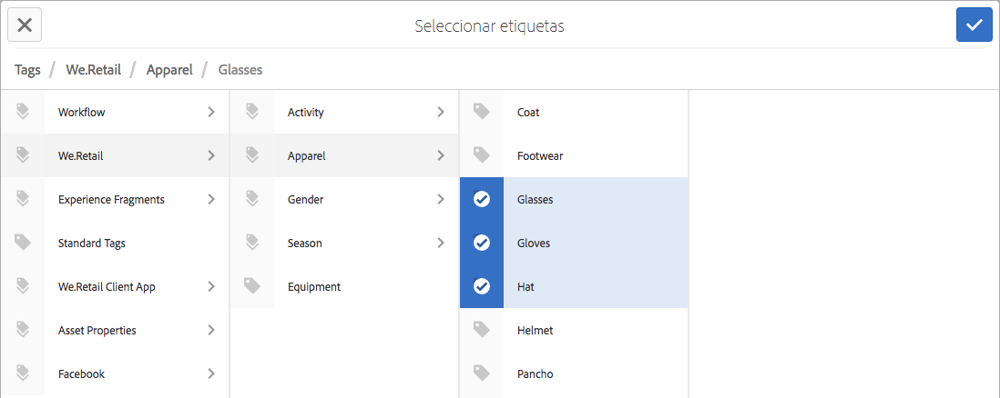
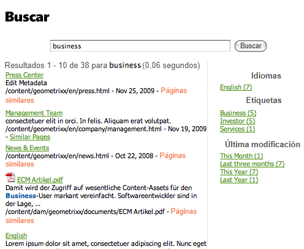

# Uso de etiquetas   {#using-tags}

>[!CAUTION]
>
>AEM 6.4 ha llegado al final de la compatibilidad ampliada y esta documentación ya no se actualiza. Para obtener más información, consulte nuestra [períodos de asistencia técnica](https://helpx.adobe.com/es/support/programs/eol-matrix.html). Buscar las versiones compatibles [here](https://experienceleague.adobe.com/docs/).

Las etiquetas son un método rápido y fácil de clasificar contenido dentro de un sitio web. Las etiquetas se pueden considerar como palabras clave o etiquetas que se pueden adjuntar a una página, un recurso u otro contenido para permitir que las búsquedas encuentren ese contenido y el contenido relacionado.

* Consulte [Administración de etiquetas](/help/sites-administering/tags.md) para obtener información sobre la creación y administración de etiquetas, así como sobre las etiquetas de contenido que se han aplicado.
* Consulte [Etiquetado para desarrolladores](/help/sites-developing/tags.md) para obtener información sobre el marco de etiquetado, así como la forma de incluir y ampliar las etiquetas en aplicaciones personalizadas.

## Diez motivos para utilizar etiquetas {#ten-reasons-to-use-tagging}

1. Organización del contenido : el etiquetado facilita las cosas a los autores, ya que pueden organizar rápidamente el contenido con muy poco esfuerzo.

1. Organización de etiquetas : mientras que las etiquetas organizan el contenido, las taxonomías jerárquicas o los espacios de nombres organizan las etiquetas.

1. Etiquetas sumamente organizadas : con la capacidad de crear etiquetas y subetiquetas, es posible expresar sistemas taxonómicos completos, cubriendo términos, subtérminos y sus relaciones. Esto permite crear una segunda (o tercera) jerarquía de contenido en paralelo a la oficial.

1. Etiquetado controlado : el etiquetado se puede controlar aplicando permisos a las etiquetas o los espacios de nombres para controlar la creación y la aplicación de etiquetas.

1. Etiquetado flexible : Las etiquetas tienen muchos nombres y rostros: etiquetas, términos de taxonomía, categorías, etiquetas y muchos más. Son flexibles en el modelo de contenido y en la manera de usarlas. Por ejemplo, al trazar información demográfica de destino, categorizar y calificar contenido o para crear una jerarquía de contenido secundario.

1. Búsqueda mejorada : el componente de búsqueda predeterminado de AEM incluye, en términos generales, las etiquetas creadas y las etiquetas aplicadas a los filtros que se pueden aplicar para obtener únicamente los resultados relevantes.

1. Habilitación de SEO : las etiquetas aplicadas como propiedades de página se mostrarán automáticamente en las metaetiquetas de la página, por lo que serán visibles para los motores de búsqueda.

1. Sofisticación simple : las etiquetas se pueden crear simplemente a partir de una palabra y pulsar un botón. Después, se pueden añadir un título, una descripción y marcas ilimitadas para proporcionar más semántica a la etiqueta.

1. Coherencia principal : el sistema de etiquetado es un componente central de AEM y todas las funcionalidades de AEM lo utilizan para categorizar contenido. Además, la API de etiquetado está disponible para los desarrolladores para que creen aplicaciones compatibles con el etiquetado con acceso a las mismas taxonomías.

1. Combina estructura y flexibilidad : AEM es ideal para trabajar con información estructurada, ya que anida páginas y rutas. Es igualmente útil cuando se trabaja con información no estructurada, debido a la búsqueda de texto completo incorporada. El etiquetado combina las ventajas de la estructura y la flexibilidad.

Al diseñar la estructura de contenido para un sitio y el esquema de metadatos para los recursos, tenga en cuenta el enfoque ligero y accesible que proporciona el etiquetado.

## Aplicación de etiquetas   {#applying-tags}

En el entorno de creación, los creadores pueden aplicar etiquetas si acceden a las propiedades de página e introducen una o varias etiquetas en el campo **Etiquetas y palabras clave**.

Para aplicar [etiquetas predefinidas](/help/sites-administering/tags.md), en el **Propiedades de página** utilice el **Etiquetas** y **Seleccionar etiquetas** ventana. La pestaña **Etiquetas estándar** es el espacio de nombres predeterminado, lo que indica que no hay un valor `namespace-string:` prefijado a la taxonomía.

### Publicación de etiquetas {#publishing-tags}

Al igual que con las páginas, puede realizar lo siguiente en etiquetas y áreas de nombres:

**Activar**

* Activar etiquetas individuales.

   Al igual que con las páginas, las nuevas etiquetas que se creen deberán activarse antes de que estén disponibles en el entorno de publicación.

>[!NOTE]
>
>Al activar una página, se abre automáticamente un cuadro de diálogo que le permite activar las etiquetas desactivadas que pertenecen a la página.

**Desactivar**

* Desactivar las etiquetas seleccionadas.

## Nubes de etiquetas {#tag-clouds}

Las nubes de etiquetas muestran una nube de etiquetas, ya sea para la página actual, el sitio web completo o a las que se obtuvo acceso con más frecuencia. Las nubes de etiquetas son un medio para resaltar los problemas que son (han sido) de interés para el usuario. El tamaño del texto utilizado para mostrar la etiqueta varía en relación con su uso.

La variable [Nube de etiquetas](/help/sites-authoring/default-components-foundation.md#tag-cloud) componente (grupo de componentes general) se utiliza para añadir una nube de etiquetas a una página.

## Búsqueda en etiquetas {#searching-on-tags}

Puede buscar etiquetas en los entornos de autor y publicación.

### Uso del componente de búsqueda {#using-search-component}

Adición de un [Componente de búsqueda](/help/sites-authoring/default-components-foundation.md#search) a una página proporciona una capacidad de búsqueda que incluye etiquetas y que puede utilizarse en los entornos de autor y publicación.

